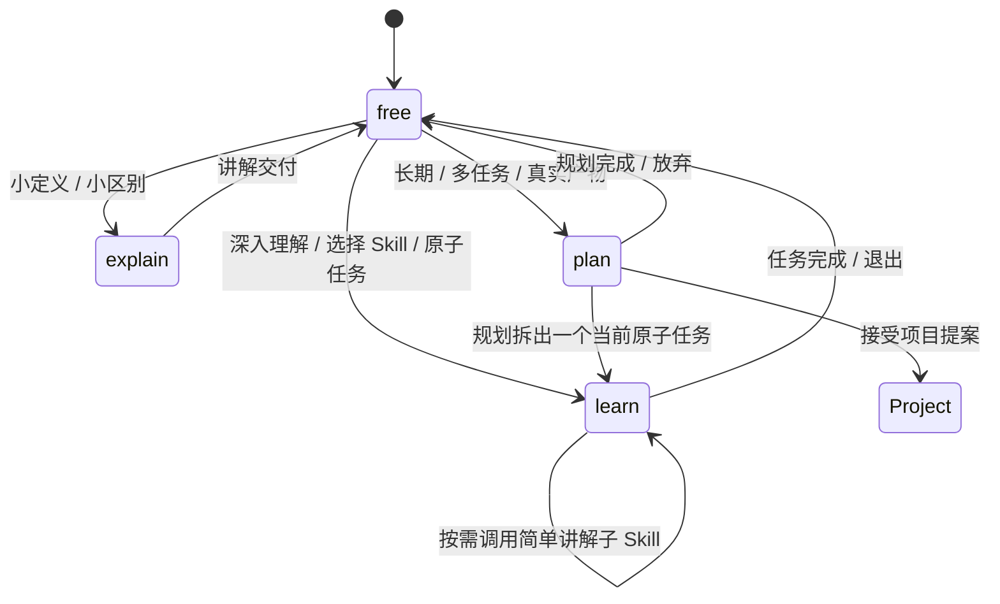
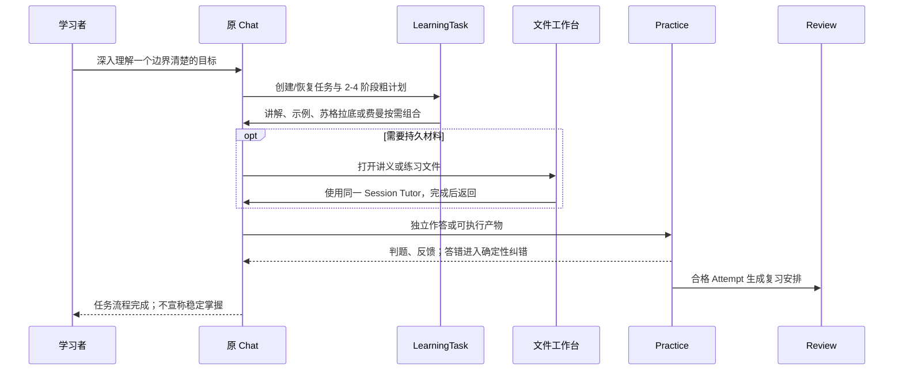
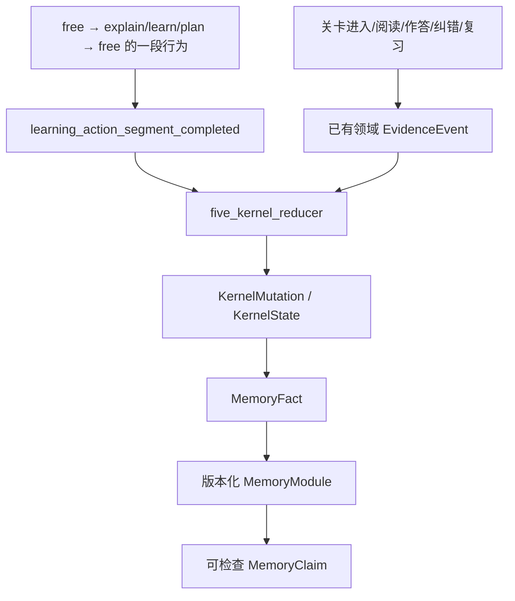

# LearnFlow Claw 产品形态：Chat Mode、原子任务与项目关卡

> 版本：2026-08-25 · 对应 Registry `2026-08-24.7`

## 一句话定义

LearnFlow 是一个以 Chat 为主入口、以 LearningTask 为原子执行单元、以项目关卡承载长期真实
产物、以正式作答和复习形成学习证据的计算机学习 Claw。用户始终只面对 Tutor；学习设计与
Practice 是 Tutor 背后的能力接口。

## 1. 四种 Chat 模式

四种模式已经足够。继续增加“答题态、资源态、复习态”等会把页面和状态切碎；这些应当是
`learn` 或 `plan` 调用的 Skill、工具和工作台。

| 模式 | 何时进入 | 主要 Skill | 完成后 |
|---|---|---|---|
| `free` 自由探索 | 闲聊、模糊问题、尚未收敛的学习诉求 | `intent_and_handoff` | 检测到明确意图时塌陷 |
| `explain` 简单讲解 | “什么是 X”“简单解释 X” | `guided_explanation` | 本段交付后回到 `free`，不自动建任务 |
| `learn` 学习任务引导 | 深入理解、显式选择学习 Skill、已有任务、项目关卡 | `atomic_learning_loop` + 按需教学 Skill | 任务结束、退出或转向后回到 `free` |
| `plan` 学习规划 | 目标需要多个任务、来源、阶段或真实产物 | `learning_path_planning` | 提案接受、放弃或转向后回到 `free` |



模式由服务端确定性规则裁决并持久化；LLM 只负责在模式边界内生成教学表达，不拥有模式、
评分、掌握或记忆的决定权。

## 2. 产品空间

```mermaid
flowchart LR
    Chat[Chat + 轻量工作台] -->|原子目标| Task[LearningTask]
    Chat -->|长期目标| Project[项目工作台]
    Task -->|讲解/追问/Skill| Chat
    Task -->|生成文件| File[讲义/练习文件工作台]
    File -->|同一 Session Tutor| Chat
    Project --> Sources[来源管理]
    Project --> Graph[动态关卡图]
    Project --> PT[Project Tutor]
    Graph --> CP[关卡 = 已规划 LearningTask]
    CP --> CPChat[关卡 Chat]
    CP --> CPFiles[讲义/练习/项目文件]
    CPFiles --> CPChat
    Task --> Queue[/tasks 任务队列]
    Task --> Evidence[正式作答/纠错证据]
    Evidence --> Review[/review 复习工作台]
    Evidence --> Growth[/growth 学习者情况与记忆]
```

### Chat 轻量工作台

- 显示当前模式、目标、模式原因和领域引用。
- 在原对话内显示当前任务的粗计划、阶段、证据数量和文件入口。
- 选中聊天文字后，可直接“解释选中内容”或“围绕它深入学习”；前者进入 `explain`，后者进入
  `learn` 并可形成任务。
- Skill 选择器只是改变当前任务的教学方法，不创造新的 Agent 或第二条流程。

### 项目工作台与关卡

- 项目是一段以真实产物为目标的学徒旅程，负责来源、整体目标、路线、关卡图和项目运营。
- 关卡是规划中的 LearningTask，不是细碎的页面类型；一个关卡围绕一个知识主题和可验证产物。
- 每个关卡有固定 checkpoint Session。讲义、练习和项目文件是关卡文件，打开后仍使用同一
  关卡 Tutor，选中内容可直接追问。

### 两个队列

- `/tasks` 只做任务排序、暂停、恢复、移除和返回来源，不在队列页教学或生成材料。
- `/review` 由正式评估证据和确定性间隔策略调度，不降级为普通待办。

## 3. 原子学习任务闭环



任务计划允许中途做直接讲解，因此 `explain` 与 `learn` 有意重叠：区别不是“能不能讲”，而是
是否存在一个要持续完成、练习和验证的 LearningTask。

讲义文件在进入复述和验证前还有内容质量门：模型增强内容、受审核离线主题模板或有明确来源的
材料抽取可以继续；无模型、无来源、无受审核模板的通用占位内容会被阻断，只允许重试生成、
检查设置或返回原 Chat，不会进入学习证据链。

## 4. 五核如何以学习动作为原子单位



`learning_action_segment_completed` 保存目标、进入/退出消息、Chat 模式、使用的 Skill、任务或
项目提案引用。它只补足跨消息的“学习动作段”语义：

- Structure：上一次学习动作和返回锚点。
- Knowledge：讲解/学习只记录 exposure，固定 `mastery_unchanged`。
- Value：仅明确的 learn/plan 目标形成短期优先级。
- Human 与 Practice：仍由明确偏好、求助行为、Attempt、纠错和复习等更具体事件更新。

因此内容大于结构：模式只负责把真实行为划成可恢复的段，真正记忆内容仍来自消息、来源、
材料、作答、纠错和复习证据。

## 5. 三条典型用户路径

### 小问题

“什么是朴素贝叶斯？” → `explain` → 直接讲清定义、假设和最小例子 → 标记本段接触 → `free`。
不会因此生成任务或宣称掌握。

### 深入学习

“带我弄懂朴素贝叶斯并练习验证” → `learn` → 原 Chat 出现 LearningTask 和粗计划 → 按需要
清晰讲解/示例/追问 → 打开讲义或验证文件 → 返回原 Chat → 纠错与复习转交。

### 长期目标

“从零系统学习机器学习，并做出一个分类项目” → `plan` → 澄清产物、基础、时间和来源 → 项目
提案 → 项目工作台管理来源和路线 → 每个关卡在自己的 `learn` Session 中完成。

## 6. 实现与兼容性

| 领域 | 权威实现 |
|---|---|
| Chat 模式契约 | `backend/app/services/architecture_registry.py` |
| 模式判定、持久化与学习动作分段 | `backend/app/services/chat_modes.py` |
| Tutor 回合与模式约束 | `backend/app/services/tutor_service.py` |
| 任务计划、队列与导航 | `backend/app/services/learning_tasks.py` |
| 五核归约与动作投影 | `backend/app/services/learning_runtime.py` |
| Chat 模式条、选中追问、任务内嵌 | `frontend/src/components/tutor/TutorPanel.tsx` |
| 纯管理任务队列 | `frontend/src/pages/LearningTasksPage.tsx` |
| 文件工作台与同 Session Tutor | `frontend/src/pages/LearningRunPage.tsx` |

本次变更不新增数据库列：模式保存在已有 `AgentSession.context_summary`。旧 Session 缺少该字段时，
存在进行中任务或 SkillRun 的对话恢复为 `learn`，checkpoint Session 固定恢复为 `learn`，其余恢复
为 `free`。旧 `/tasks?task=` 和 `/learn/:runId` 链接继续可用；变化只在于前者收缩为管理，后者
收敛为文件附件，任务主导航优先回原 Chat/关卡。

### Contract impact

- Registry 从 `2026-08-24.6` 提升到 `2026-08-24.7`，增加四个 `ChatModeContract`、
  `chat_mode_runtime`、`coordinate_chat_mode` 和两个事件契约。
- `learning_action_segment_completed` 只能经 reducer 写 Structure/Knowledge/Value；没有新增 Kernel
  writer，也没有改变正式评分、纠错、通关或长期掌握门槛。
- LearningTask API 保留所有旧导航字段，`navigation` 对已有来源 Session 的任务改为稳定指向
  原 Chat/关卡；`/learn` 路径仍通过 `artifact_refs` 与 `runtime.next_action` 暴露。
