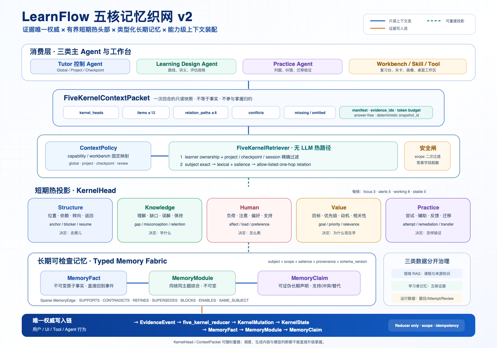

# LearnFlow 五核记忆织网 v2



## 1. 目标与不变量

五核 v2 解决的是“怎样在长期学习历史不断增长时，仍给 Agent 装配小而准、可追溯、
不串 scope 的上下文”，不是重新定义五核，也不是增加新的掌握模型。

必须同时成立：

- 五核仍是 `structure / knowledge / human / value / practice`。
- 唯一事实权威仍是 `EvidenceEvent`；唯一 KernelState 写入者仍是确定性 reducer。
- `MemoryFact -> MemoryModule(Vn) -> MemoryClaim` 的历史可检查、可纠正、不覆盖。
- `KernelHead` 与 `ContextPacket` 都可重建，不能成为第二套画像权威。
- 领域知识 RAG、学习者记忆 RAG、题目/调度等运行数据分别治理，不能混成一个向量池。
- Agent、Skill、Tool 和 Workbench 只读有 scope 的包；评分、掌握和纠错策略仍由确定性规则裁决。

## 2. 总体结构

```text
写入事实面
用户 / UI / Tool / Agent 行为
  -> EvidenceEvent
  -> five_kernel_reducer
  -> KernelMutation + KernelState
  -> MemoryFact -> MemoryModule(Vn) -> MemoryClaim
                       \-> sparse MemoryEdge

读取上下文面
KernelState + Memory Graph
  -> KernelHead projector
  -> capability ContextPolicy
  -> FiveKernelRetriever
       1. ownership + exact scope
       2. subject + lexical + salience
       3. allow-listed one-hop relation
  -> FiveKernelContextPacket
  -> Tutor / Learning Design / Practice / Workbench
```

写入面和读取面只在投影处相交。检索结果不会反向写入五核；真正的新学习行为必须重新
形成 `EvidenceEvent`。

## 3. 五个 KernelHead

每个学习者、每个核维护一条有界热头部：

```json
{
  "summary": "当前最重要的可读摘要",
  "focus_refs": [101, 102, 103],
  "alert_refs": [104],
  "working_refs": [105, 106],
  "stable_refs": [201],
  "facets": {
    "subjects": ["concept:attention"],
    "states": {"active_memory_kinds": ["gap", "attempt"]},
    "confidence": 0.82
  },
  "source_kernel_version": 18,
  "version": 7
}
```

硬限制：

| 分区 | 上限 | 用途 |
|---|---:|---|
| focus | 3 | 本轮最可能需要的主题 |
| alerts | 5 | 阻塞、缺口、纠错、负荷等风险 |
| working | 8 | 近期原子事实 |
| stable | 5 | 活跃长期声明 |

热头部不是短期事实本身，而是指向事实的窗口。窗口淘汰只删除引用，不删除 MemoryNode。
读取时还会再次过滤 project/checkpoint/session；因此 learner 级热头部不会把其他项目内容
带入关卡，也不会把一个 session 的瞬时情绪带入另一个 session。

## 4. 类型化记忆项目

所有 MemoryNode 保留原有 Fact/Module/Claim 层级，同时使用统一 envelope：

| 字段 | 语义 |
|---|---|
| `kernel_name` | 所属五核，决定边界与巩固门槛 |
| `node_type` | `fact / module / claim` |
| `memory_kind` | 核内语义类型，如 gap、goal、attempt、preference |
| `subject_key` | 稳定主题键，如 `concept:qkv`、`checkpoint:3` |
| `subject_type/id` | 可查询的主题拆分 |
| `project/checkpoint/session_id` | 服务端确定的 scope |
| `confidence` | 证据置信度，不等于掌握概率 |
| `salience` | 确定性检索优先级 |
| `status/valid_from/valid_to` | 活跃、瞬时、过期、被替代等时间语义 |
| `schema_version` | 当前为 `memory-item.v2` |
| provenance | Fact 回到 mutation/event；Claim 回到 module/facts |

五核的 `memory_kind` 目录：

- Structure：anchor、dependency、transition、blocker、resume。
- Knowledge：understanding、gap、misconception、question、retention。
- Human：affect、load、attention、preference、support_need。
- Value：goal、priority、motivation、interest、relevance。
- Practice：attempt、assistance、artifact、feedback、remediation、transfer。

Module 统一标记为 `topic_summary`，Claim 统一标记为 `semantic_claim`；更细语义仍由
predicate、subject 和 provenance 表达。Module 还携带 `version`、父版本、证据闭包、
增量 Fact、修订类型和策略版本；同一主题只有最新有效版本进入 Head，历史版本通过
`REFINES` 或 `SUPERSEDES` 保持可检查。

## 5. ContextPolicy

ContextPolicy 是 capability 级读取契约，不是模型自己决定的路由：

| Policy | 深读核 | Scope | 默认预算 |
|---|---|---|---|
| `global_tutor` | Structure/Human/Value | portfolio reference | 10 items / 4 paths / 1700 tokens |
| `project_tutor` | 五核 | 当前项目 | 12 / 6 / 2100 |
| `checkpoint_tutor` | 五核 | 当前项目与关卡 | 12 / 6 / 2200 |
| `review_tutor` | Knowledge/Practice | 当前原题 subject | 12 / 6 / 2100 |
| `learning_design` | Structure/Knowledge/Human/Value | 项目或关卡 | 10 / 4 / 1900 |
| `practice_validation` | Knowledge/Practice | 当前关卡 | 10 / 5 / 1800 |

例如 `evaluate_review_attempt` 固定映射 `review_tutor`，LLM 无权改成全局深搜；
`generate_lecture` 映射 `learning_design`，只获得适配内容所需的学习者投影。

## 6. 检索流程

检索不调用 LLM，顺序固定：

1. 校验 learner ownership。
2. 过滤 project/checkpoint/session、有效时间和当前状态；排除 superseded 当前项。
3. 使用 review item、concept、checkpoint、project 等 subject key 精确召回。
4. 使用本地词项重合、salience、scope 精确度、节点类型和新近度排序。
5. 在选中节点周围展开一跳白名单关系。
6. 组装预算内项目；答案、solution、expected、test cases 等字段在进入包前过滤。

一跳关系只允许：SAME_SUBJECT、SUPPORTS、CONTRADICTS、REFINES、SUPERSEDES、
MOTIVATES、ADDRESSES、BLOCKS、ENABLES、CONSOLIDATED_INTO。被替代声明不会作为当前
item 返回，但可以在 SUPERSEDES/CONTRADICTS 路径中作为历史冲突出现。

## 7. ContextPacket

```json
{
  "snapshot_id": "确定性摘要",
  "scope": {"learner_id": 1, "project_id": 3, "checkpoint_id": 8},
  "kernel_heads": {},
  "items": [],
  "relation_paths": [],
  "missing_facets": [],
  "conflicts": [],
  "omitted": {
    "candidate_count": 42,
    "selected_count": 12,
    "scope_filtered": 18,
    "sensitive_filtered": 2,
    "budget_or_rank_filtered": 10
  },
  "manifest": {
    "policy": {},
    "evidence_ids": [],
    "token_estimate": 1980,
    "answer_free": true,
    "authority": "read_only_projection_from_evidence_and_memory_graph"
  }
}
```

同一数据库快照、scope、query 和 policy 会得到相同 `snapshot_id`，便于日志和回归测试。
`missing_facets` 允许 Agent 明确知道“没有证据”，而不是用模型常识补齐学习者状态。

## 8. 与 RAG、复习和 Agent 的关系

- 领域 RAG：检索课程、仓库和来源内容，回答“知识是什么”。
- 五核记忆检索：检索学习者证据，回答“这个人目前处于什么状态”。
- 运行数据：题面、答案、Attempt、RemediationCase、ReviewSchedule，由领域服务读取。

复习台把服务端 answer-free 题目快照作为 `active_surface_context`，同时以 `subject_key`
调用 `review_tutor` policy。这样 Tutor 能看见相关 Knowledge/Practice 事实、错题链和调度
解释，但看不到答案，也不能通过聊天改变分数、间隔或掌握。

三类主 Agent 不变：Tutor 负责上下文与协调，Learning Design 只消费适配所需投影，
Practice 负责确定性判题/纠错。`FiveKernelRetriever` 是 Tutor 所有的读取工具，不是第四类 Agent。

## 9. 迁移与兼容

启动迁移 `v11-five-kernel-memory-fabric` 会：

1. 为现有 SQLite 数据库创建一致性备份；
2. 为 MemoryNode 增加类型、scope、salience 和 schema 字段；
3. 从 MemoryFact 与既有 payload 回填 scope；
4. 为每位学习者重建五条 KernelHead；
5. 记录 SchemaMigration，重复执行不重复建事实或事件。

后续 `v12-memory-module-versioning` 在一致性备份后，为旧 Module 回填版本号、父版本、
证据闭包和历史状态，并建立每个 learner/kernel/subject 只有一个 active Module 的数据库
约束。Memory API 保留原字段并增量返回版本信息。旧的 `KernelState`、Memory
Fact/Module/Claim、EvidenceEvent 和掌握规则保持向后兼容。关卡上下文仍保留
`five_kernel_projection` 兼容字段，但其内容来自有界热头部；新调用方应优先使用
`five_kernel_context`。

## 10. 验收边界

- 每核 head 数量上限和确定性重建。
- learner/project/checkpoint/session 隔离。
- Human transient 不跨 session。
- answer/solution/expected/test cases 不进入 ContextPacket。
- superseded 不作为当前 item，冲突历史仍可见。
- 同一 learner/kernel/subject 只有一个 active Module，V2+ 具有直接父版本。
- 继承 Fact 只在同核同主题版本链内复用，delta reservation 可失败恢复。
- 默认 items 不超过 12、paths 不超过 6。
- 注册表仍只有 `five_kernel_reducer` 可写 KernelState。
- 无 LLM、无网络时可以完成投影、检索和 seeded demo。
