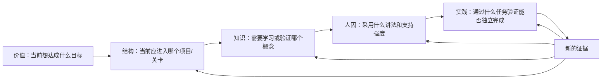

# LearnFlow 五核结构总览

> 面向对象：第一次了解 LearnFlow 的产品、设计、工程、研究和合作伙伴
>
> 一句话理解：五核不是五个 Agent，而是 LearnFlow 用来描述“学习者当前状态”的五个互补维度。它们共同帮助系统决定：学习者该走哪儿、学什么、怎么教、为什么现在学，以及如何验证是否真的会做。

> 当前实现已升级为“五核记忆织网 v2”：每核使用有界 `KernelHead` 维护短期热上下文，
> 长期事实保留在类型化 Memory Graph 中，并由 capability 级 `ContextPolicy` 装配
> answer-free `ContextPacket`。完整工程契约与架构图见
> [FIVE_KERNEL_MEMORY_FABRIC_V2.md](FIVE_KERNEL_MEMORY_FABRIC_V2.md)。

## 1. 为什么需要五核

普通聊天记录很难稳定回答这些问题：

- 学习者现在处于学习路径的哪里？离开后如何回来？
- 学习者究竟是不懂、没做过、答错了，还是只是需要另一种解释？
- 当前应该调整内容、节奏、表达方式，还是练习难度？
- 这个学习目标是临时兴趣、当前优先级，还是学习者已经确认的长期方向？
- 学习者是在提示下完成，还是能够独立完成并迁移到新问题？

五核把这些问题拆成五种有边界的状态。这样做不是为了给学习者贴更多标签，而是为了让教学动作有明确依据，让状态可以追溯、纠正和重建。

## 2. 五核一览

| 核 | 英文 ID | 它回答的问题 | 主要状态对象 | 典型用途 |
|---|---|---|---|---|
| 结构核 | `structure` | 学习者现在在哪里，下一步如何走，离开后怎样回来？ | 项目、检查点、路径、依赖、阻塞、返回锚点 | 导航、恢复上下文、调整学习路径 |
| 知识核 | `knowledge` | 学习者对哪个概念理解到什么程度，证据是什么？ | 概念、知识缺口、问题、错误推理、理解状态 | 选择讲什么、检查什么、是否需要纠错 |
| 人因核 | `human` | 在当前情境下，怎样教和怎样交互更合适？ | 负荷、注意、情绪反应、节奏、交互偏好 | 调整讲法、粒度、支持强度和交互长度 |
| 价值核 | `value` | 为什么学，当前什么目标和投入更值得优先？ | 目标、优先级、动机、兴趣、相关性 | 决定学习方向、项目优先级和投入取舍 |
| 实践核 | `practice` | 能否在给定约束下独立做出来，并迁移到新情境？ | 尝试、辅助、产物、反馈、重做、变式与迁移 | 判定实践能力、设计练习和纠错闭环 |

可以用一句话记忆：

```text
value    决定为什么现在学
structure 决定接下来走哪儿
knowledge 决定要学什么、哪里没懂
human     决定怎样教更合适
practice  决定怎样验证是否真的会做
```

这不是强制的执行顺序，而是五核的决策分工。不同场景可以从不同的核开始。

## 3. 每一核详细说明

### 3.1 结构核：学习路径中的位置

结构核描述学习者在学习系统中的位置和路径关系，而不是学习能力本身。

它关注：

- 当前项目、路线、检查点和任务；
- 前置依赖、阶段顺序和学习转向；
- 当前阻塞以及阻塞发生在哪个路径节点；
- 暂停后应该从哪里继续；
- 从项目、关卡或诊断流程离开后，如何恢复上下文。

结构核可以回答：“我现在学到哪里了？”“刚才为什么转去补基础？”“补完基础后回哪里？”

它不能回答：学习者是否掌握了某个概念、为什么想学、是否焦虑，或是否具备独立实践能力。

### 3.2 知识核：概念理解与知识证据

知识核描述学习者对具体知识对象的理解状态。知识对象可以是概念、规则、方法、问题或前置知识。

它关注：

- 已确认的理解；
- 尚未验证的基础；
- 待解问题和知识缺口；
- 近期错误及其具体原因；
- 可定位的误解；
- 由评估和迁移任务支持的掌握证据。

知识核严格区分不同证据：

| 观察 | 可以说明什么 | 不能说明什么 |
|---|---|---|
| 看过讲义 | 接触过内容 | 已经理解或掌握 |
| 用户说“懂了” | 主观确认或低权重反馈 | 稳定掌握 |
| 一次答对 | 一次正确表现 | 稳定掌握或可迁移 |
| 一次答错 | 需要进一步检查 | 稳定误解、人格或情绪问题 |
| 明确说出错误规则 | 可能形成可定位误解证据 | 其他概念也存在同样误解 |
| 多次独立评估正确 | 较强掌握证据 | 所有新情境都能迁移 |

### 3.3 人因核：当前怎样教更合适

人因核用于表达教学交互的当前适配条件，不是心理诊断，也不是固定人格画像。

它关注：

- 当前学习负荷、注意和挫败等短期状态；
- 学习者明确表达的节奏、形式和支持偏好；
- 某种讲法是否有效或无效；
- 跨 session 重复出现并得到确认的交互偏好。

情绪、负荷和注意默认是短期状态，可能随任务、时间和上下文变化。系统不能仅凭分数、答题速度或一次普通错误推断焦虑、人格、医学状态或固定学习风格。

例如，学习者明确说“这个例子比定义更容易理解”，可以形成讲法偏好证据；但一次任务失败不能自动说明学习者注意力不足。

### 3.4 价值核：为什么学、优先级是什么

价值核描述学习者愿意投入什么、为什么投入，以及当前应该优先投入什么。

它关注：

- 当前学习目标和目标候选；
- 目标背后的动机与相关性理由；
- 项目、技能或产物的优先级；
- 时间预算、投入取舍和目标变化；
- 学习者明确确认的长期方向。

价值核不是能力核。一个人非常重视某个目标，不代表已经掌握相关知识或具备实践能力；一个人暂时没有表达目标，也不代表没有学习价值。

模型可以提出目标候选或澄清问题，但不能用猜测替代学习者确认，也不能把项目提案直接当作长期目标事实。

### 3.5 实践核：独立完成与迁移

实践核描述学习者是否能把知识用于任务、产物或新情境，并保留完成过程中的辅助信息。

它关注：

- 当前尝试和 `LearningAttempt`；
- 是否使用提示、步骤、示例或完整解答；
- 代码、练习、作品等产物状态；
- 测试、判题和反馈结果；
- 原题重做结果；
- 新题、新场景或变式任务中的迁移表现。

实践核必须区分：

```text
有辅助完成 ≠ 独立完成
原题重做通过 ≠ 变式迁移
产物生成成功 ≠ 学习者掌握
讲解看起来正确 ≠ 学习者能够应用
```

独立实践与变式迁移是更强的能力证据。辅助完成仍然有价值，但它主要说明学习者需要什么支持，以及纠错过程走到了哪一步。

## 4. 五核之间如何协作

五核不是五个互相隔离的抽屉，也不是一个核变化后把结论复制到其他核。它们通过同一学习事件和明确的证据关系协作。

一个典型学习回合可能是：



这是协作关系，不是自动推理规则。每个核的写入都必须有自己的理由。

### 示例：实践任务答错

学习者在一个代码任务中答错：

1. `practice` 记录失败尝试、提交结果和辅助等级。
2. 如果错误答案或解释足以定位概念问题，`knowledge` 记录相应缺口或误解证据。
3. 如果这次错误导致学习路径需要转去补前置知识，`structure` 记录路径转向或阻塞。
4. 如果学习者明确说“太难了”或明确要求换一种讲法，`human` 记录当前负荷或讲法偏好。
5. 如果学习者明确重新确认了学习优先级，`value` 才记录目标或优先级变化。

一次答错不会自动写入全部五核。

### 示例：学习者说“我想学这个，用于找工作”

- `value`：记录目标、相关性和动机；
- `structure`：如果用户确认开始项目，再记录项目和路径位置；
- `knowledge`：仍然需要通过评估确认基础和缺口；
- `human`：没有明确反馈时不推断学习偏好；
- `practice`：只有真实尝试或产物提交后才记录实践证据。

## 5. 状态的两个时间层级

每个核都包含短期状态和长期状态，但两者含义不同。

### 短期状态

短期状态服务于当前教学回合，例如当前关卡、近期问题、当前负荷、最近一次尝试或当前目标。它可以快速更新，也可能过期或被新证据修正。

### 长期状态

长期状态是经过证据门槛后形成的稳定记忆或可检查声明。它不能只是把短期字段复制过去。

| 核 | 长期巩固原则 |
|---|---|
| `structure` | 稳定路径模式或已确认项目结构 |
| `knowledge` | 评分证据支持的掌握，或具体、可纠正的误解 |
| `human` | 学习者确认或跨 session 一致证据；情绪和负荷通常不长期化 |
| `value` | 学习者明确确认的长期目标或价值排序 |
| `practice` | 独立完成和变式迁移证据优先 |

## 6. 唯一证据写入链

五核不是由 Agent 或 LLM 直接写入。所有会改变学习状态的行为，都必须经过统一的事件链：

```text
用户 / UI / Tool / Agent 行为
  -> EvidenceEvent        只追加的事实事件
  -> five_kernel_reducer  确定性归约
  -> KernelMutation       记录本次状态补丁与版本
  -> KernelState           当前学习状态投影
  -> MemoryFact            原子事实
  -> MemoryModule          同核、同主题的事实模块
  -> MemoryClaim           可单独检查的长期声明
```

### 各层的职责

- `EvidenceEvent`：记录发生了什么、何时发生、由谁产生、属于哪个学习者和上下文。
- `five_kernel_reducer`：根据确定性规则决定事件是否影响哪个核以及影响哪些字段。
- `KernelMutation`：保存归约结果、原因、前后版本和可重放信息。
- `KernelState`：提供低延迟的当前状态投影，可从证据重建。
- `MemoryFact`：把一次状态变化拆成可检查的原子事实。
- `MemoryModule`：聚合同一学习者、同一核、同一主题的事实；模块本身不可变。
- `MemoryClaim`：提出有证据支持的长期声明；声明必须能回到事实。

LLM 可以生成问题、讲解、候选路线和表达方式，但不能自行决定评分、掌握状态、纠错策略、长期记忆或五核写入。

## 7. 什么算证据，什么不算证据

### 不是掌握证据

- 生成或阅读讲义；
- 生成题目或路线；
- Tutor 给出解释；
- 学习者说“懂了”“明白了”；
- 在大量提示、步骤或完整解答下完成任务；
- 本地文件保存成功、代码运行成功但没有正式评估；
- 模型生成的学习者画像或总结。

### 可以形成能力证据

- 独立提交概念答案，并经过确定性或受约束评估判定正确；
- 独立提交代码或实践产物，并通过测试；
- 在新情境中完成高置信度迁移任务；
- 学习者明确表达可定位的错误理解，并经诊断形成误解证据；
- 具有 provenance、scope、评估版本和幂等键的正式事件。

证据强弱必须保留在事件和记忆中，不能只保存一个脱离来源的“掌握”标签。

## 8. 设计和实现边界

任何新功能如果读取五核，应：

1. 只读取有 scope 的投影；
2. 明确读取哪些核，以及读取它们是为了什么决策；
3. 不维护第二套长期画像权威；
4. 不把生成内容、自述或单次结果直接升级为长期状态；
5. 需要改变状态时，提出已登记的 `EvidenceEvent`，由统一 reducer 处理；
6. 校验 `learner_id`、`project_id`、`checkpoint_id` 和 `session_id` 的 ownership；
7. 使用稳定幂等键，避免重复计分、重复 Attempt 或重复证据；
8. 为关键判断保留 provenance、策略版本和可重放依据。

五核不是新的 Agent 层。LearnFlow 的主责任接口仍然只有：

- `tutor_agent`：意图、对话、Action、工作台协调和 handoff；
- `learning_design_agent`：路线、内容、问题、评估规格和视觉产物；
- `practice_agent`：提交、测试、判题、反馈、诊断追问和纠错呈现。

这些 Agent 只能读取五核投影，并通过事件链参与状态变化，不能直接写 `KernelState`。

## 9. 代码与文档入口

| 主题 | 权威入口 |
|---|---|
| 机器可读的五核、短期键、事件目标与写权限 | `backend/app/services/architecture_registry.py` |
| 事件记录、确定性归约和五核投影 | `backend/app/services/learning_runtime.py` |
| 原子事实、记忆模块、声明和图谱边 | `backend/app/services/memory_graph.py` |
| 架构权威与维护边界 | `docs/ARCHITECTURE_AUTHORITY.md` |
| Agent 角色、上下文和证据规则 | `docs/AGENT_ARCHITECTURE_GUIDE.md` |
| Tutor 与五核运行流程 | `docs/FIVE_KERNEL_TUTOR.md` |
| 记忆图谱数据分层与评测 | `docs/FIVE_KERNEL_MEMORY_GRAPH.md` |
| 学习信息快速获取模块边界 | `docs/LEARNER_STATE_DISCOVERY_AGENT_BRIEF.md` |

## 10. 最后用三句话记住

1. 五核是五种互补的学习状态，不是五个 Agent，也不是五份互相覆盖的画像。
2. 每个核有自己的决策问题、证据边界和长期巩固门槛；一个核的变化不能自动推导其他核。
3. 所有状态变化都必须走 `EvidenceEvent -> reducer -> KernelMutation -> KernelState -> Memory Graph`，生成模型只能提供候选内容和表达。
