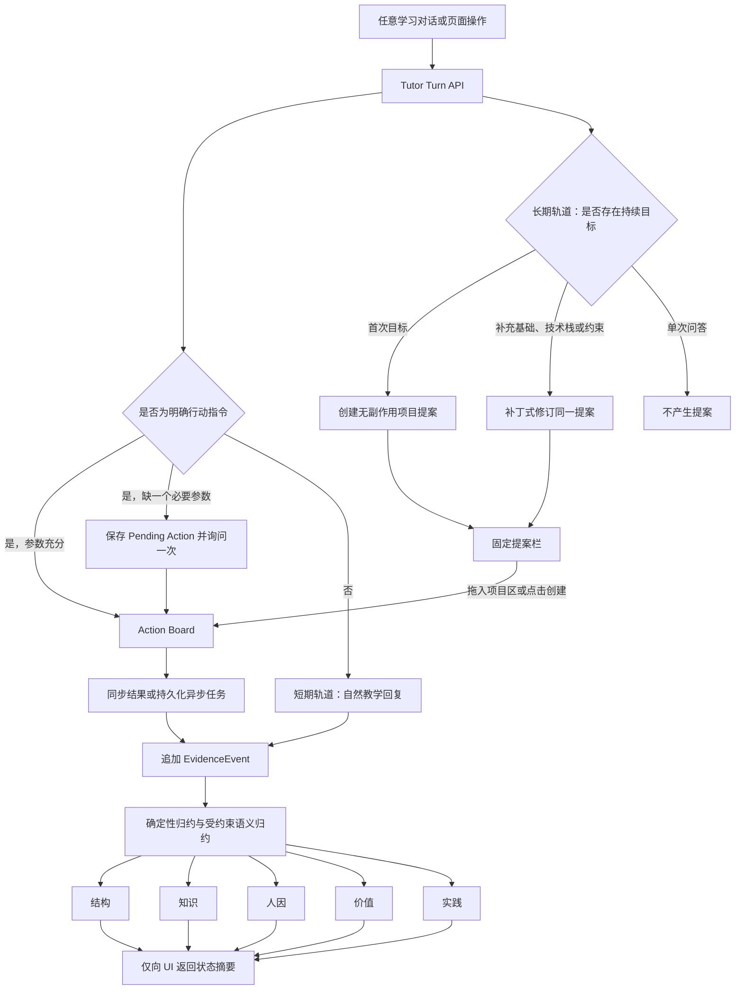
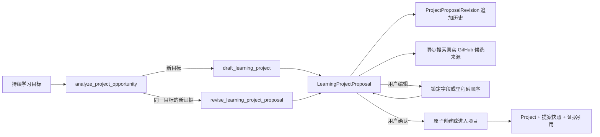
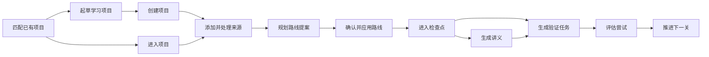
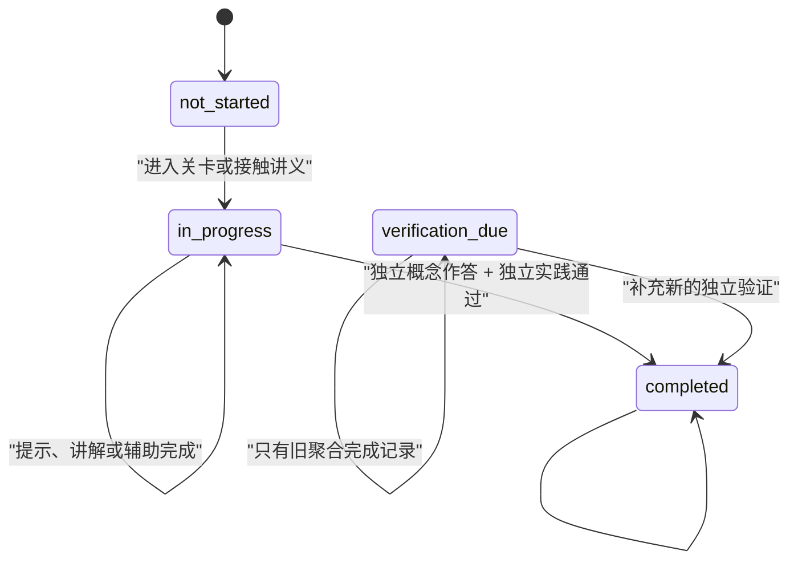
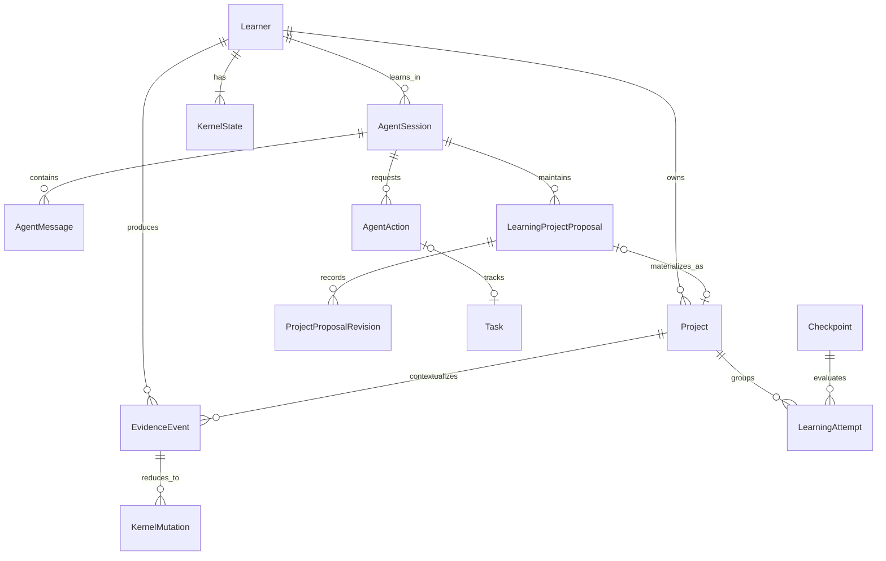

# LearnFlow 常驻 Tutor 与五核运行图谱

状态：v2 已落地\
核心实现：`backend/app/services/tutor_service.py`、`backend/app/services/learning_runtime.py`

## 总体运行图



五个维度只参与内部判断。用户可见响应只有教学消息、当前项目提案、一个可选行动卡、真实执行状态和简化状态摘要，不包含 Kernel 名称、权重、置信度或内部处理器名称。

## 五核结构定义

五核不是五个聊天 Agent，而是五种互补的学习者状态。每一核只回答自己的决策问题：

| 核 | 决策问题 | 记录什么 | 不把什么算进来 |
|---|---|---|---|
| `structure` 结构 | 学习者现在在哪里，怎样继续、离开和返回？ | 项目/检查点、依赖、路径转向、阻塞、返回锚点 | 掌握、目标、情绪和能力结论 |
| `knowledge` 知识 | 对哪个概念理解到什么程度，证据是什么？ | 缺口、待解问题、近期错误、可定位误解、评分与迁移证据 | 看过讲义、听过解释、自述“懂了” |
| `human` 人因 | 当前怎样教和怎样交互更合适？ | 负荷、注意、情绪反应、节奏、形式和讲法有效性 | 从分数推断人格、医学状态或固定风格 |
| `value` 价值 | 为什么学，当前什么目标更值得投入？ | 目标候选、优先级、动机、兴趣和相关性理由 | 模型猜测的长期目标、掌握或能力 |
| `practice` 实践 | 能否独立完成，并迁移到新情境？ | 尝试、辅助等级、产物、反馈、重做和变式结果 | 有提示成功、原题重做或生成内容本身 |

五核的协作顺序通常是：`value` 明确优先级，`structure` 定位路径，`knowledge` 找到需要学习或验证的对象，`human` 调整呈现与支持，`practice` 通过独立任务和迁移验证结果。这是常见的决策顺序，不是固定流水线；一次事件可以触及多个核，但每个目标必须有独立证据。

## 双轨项目提案

项目提案是长期轨道的可编辑候选结构，不是项目，也不构成掌握证据。价值核维护目标和优先级，结构核维护项目匹配、阶段和依赖，知识核维护未验证起点与缺口，人因核维护粒度、节奏和投入，实践核维护产物、验收标准、技术栈与候选来源。提案中的这些信息仍需经过用户确认和正式学习证据验证，不能直接晋级为长期画像或掌握结论。

## 结构记忆与知识记忆

结构记忆回答“学习者现在位于学习过程的哪里，以及离开后怎样回来”，知识记忆回答“学习者对哪个具体知识点理解到了什么程度”。二者会互相影响，但不保存同一份结论。

| 维度 | 记录内容 | 不记录 |
|---|---|---|
| 结构 | 当前项目与关卡、路径顺序、先修依赖、学习转向、暂存线索、返回锚点、路径阻塞 | 概念掌握、具体误解、职业目标、情绪负荷 |
| 知识 | 具体概念的理解状态、待解疑问、知识缺口、已诊断误解、评估错误、稳定掌握证据 | 当前页面或项目位置、路线顺序、项目目标、实践产物 |

例如，学习者在“因果自注意力”关卡中因为不熟悉 PyTorch 张量形状而暂时转去热身：

- 结构记忆记录“暂停于因果自注意力，先修转到张量形状，完成后回到 Q/K/V shape 验证”。
- 知识记忆记录“张量广播与矩阵乘法 shape 是待补缺口”；只有用户明确说出错误规则或评估诊断出错误模式后，才记录具体误解。
- 两条记忆通过关卡 ID、概念标识和证据 ID 关联，而不是在两个维度复制“用户不懂注意力”。

学习目标与优先级归入价值记忆；短期挫败与认知负荷归入人因记忆；代码、产物和独立完成证据归入实践记忆。用户自述基础可以作为知识起点假设，但会标记为“未验证”，不会进入稳定掌握。

答错时也要保持边界：实践核记录这次尝试是否失败、用了什么辅助；知识核只有在答案或理由足以定位概念问题时才记录相应缺口；结构核只有在学习路径真的受阻时才记录阻塞。没有明确表达或跨 session 证据时，不从一次答题结果推断人因核或价值核。



同一目标使用稳定 `proposal_key` 跨轮修订。每个会话最多保留三个活跃提案；第四个不同目标出现时归档最久未操作的未确认提案。模型只返回字段补丁，不能覆盖用户锁定字段，也不能擅自重排用户锁定的里程碑顺序。

## 三类回合结果

| 输入类型 | 行为 | 副作用 |
|---|---|---|
| 普通知识问答 | 先回答，再按需要补例子、延伸或检查点 | 无 |
| Tutor 发现持续目标 | 继续当前教学，同时创建或修订可编辑项目提案 | 确认前无 |
| 用户明确要求创建、添加、生成或推进 | 参数充分时当轮直接执行 | 有，结果真实持久化 |

缺少参数时，`AgentAction` 保留已解析目标并进入 `needs_input`。用户补充后复用同一个 action；`client_turn_id` 保证网络重试不会重复执行。

## Action Board



项目初始化和来源接入由高层 action 承担。来源 URL 会规范化并按项目去重；处理中的来源可重新发起任务，已完成的重复来源直接返回已有记录。异步 action 绑定持久化 `Task`，轮询返回当前进度、错误与终态。

## 证据与晋级



- 讲义生成、讲义阅读和题目生成只形成接触证据，不完成关卡。
- 用户只说“懂了”会记录为 `0.25` 置信度的短期反馈，掌握状态不变。
- 每次概念作答或代码提交生成独立的 `LearningAttempt`，并记录辅助等级。
- 关卡完成要求至少一次独立正确的概念尝试和一次独立通过的实践尝试，或一次置信度不低于 `0.9` 的独立迁移成功。
- 长期知识掌握要求两个不同 assessment 的独立一致结果，或一次高置信度迁移成功。
- `EvidenceEvent` 只追加；`KernelState` 是可由证据重建的物化投影，`KernelMutation` 记录每次状态变化及版本。

## 持久化关系



全局会话进入项目时，`context_summary.handoff` 只保存原始消息 ID 和证据 ID，以及目标摘要；不会复制或改写原始证据。

## API

- `POST /api/agent/sessions`：创建或恢复全局/项目 Tutor 会话。
- `POST /api/agent/sessions/{id}/turns`：提交任意学习对话、页面上下文或已选择行动。
- `GET /api/agent/sessions/{id}`：恢复历史、状态摘要和待处理行动。
- `POST /api/agent/actions/{id}/confirm|cancel`：处理 Tutor 主动建议的行动。
- `GET /api/agent/actions/{id}`：读取同步结果或异步任务真实进度。
- `GET /api/agent/project-proposals/{id}`：读取提案、版本和候选来源状态。
- `PATCH /api/agent/project-proposals/{id}`：编辑、锁定字段或重排里程碑。
- `POST /api/agent/project-proposals/{id}/accept`：幂等创建或进入项目。
- `POST /api/agent/project-proposals/{id}/dismiss|reopen`：取消或恢复提案。
- `POST /api/agent/project-proposals/{id}/refresh-sources`：重试只读来源搜索。
- `POST /api/learning-events`：接收带 `client_event_id` 的白名单页面事件。

## 迁移与回退

`v2-five-kernel-tutor` 迁移在修改 SQLite 前使用 SQLite backup API 创建一致性备份：

```text
backend/backups/learnflow-pre-five-kernel-v2.db
```

迁移可重复运行；项目、迁移证据、五个 Kernel 状态和旧路线对话均有去重保护。旧 `completed` 保留在 `legacy_completed`，学习状态改为 `verification_due`，可通过备份和旧标记回退。

`v3-evolving-project-proposals` 只新增提案和修订表，迁移前创建第二份一致性备份：

```text
backend/backups/learnflow-pre-project-proposals-v3.db
```

## 验证

```bash
cd backend && venv/bin/python -m pytest -q
cd frontend && npm run build
```

核心测试覆盖直接创建、来源接入与去重、最近链接解析、跨会话 active project、GPT 提案跨轮修订、编辑锁定、幂等接受、来源搜索失败、三提案上限、最小参数补充、同名项目消歧、重复请求、低置信度反馈、讲义非完成证据、辅助尝试不通关和 v2/v3 迁移幂等。
