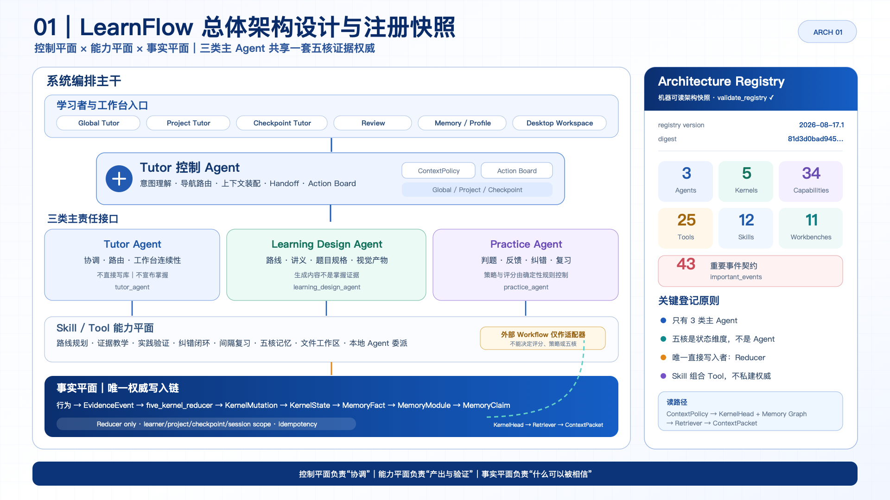
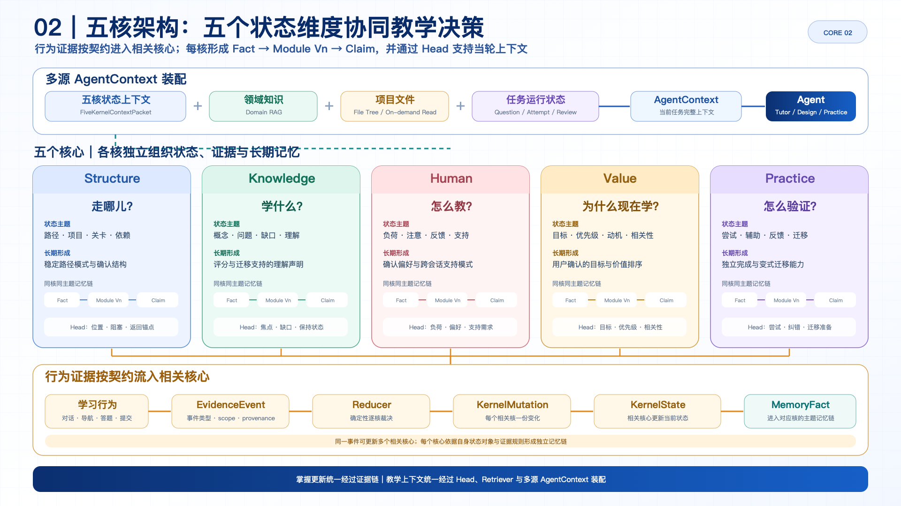
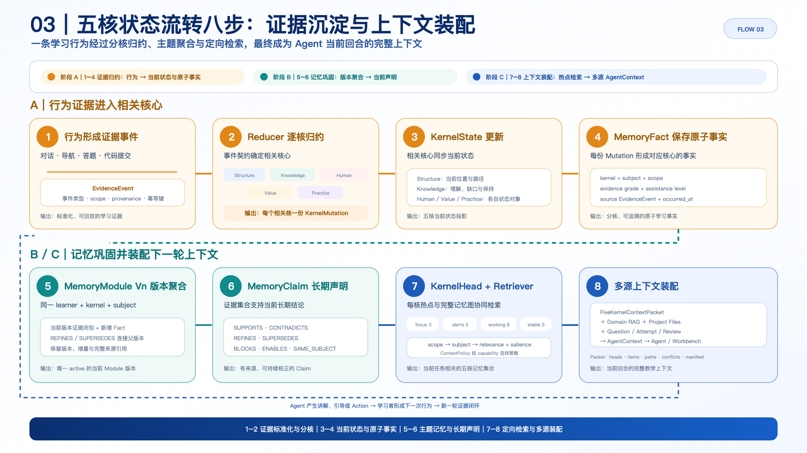
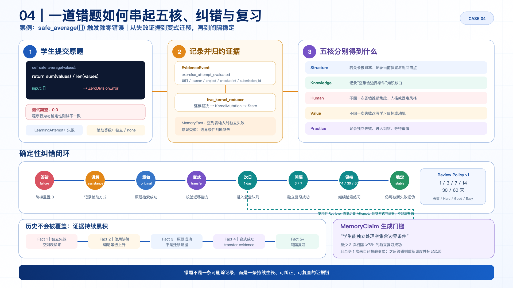

# LearnFlow 汇报图组

本图组以 `backend/app/services/architecture_registry.py`、`docs/ARCHITECTURE_AUTHORITY.md` 和 `docs/FIVE_KERNEL_MEMORY_FABRIC_V2.md` 为事实来源，统一采用 16:9 技术汇报版式。SVG 用于继续编辑，PNG 用于直接插入幻灯片或文档。

## 01 总体架构设计与简要注册表

- 主旨：三类主 Agent、工作台、Skill/Tool 与事实平面的分工。
- 汇报重点：只有 reducer 可以直接改变五核；右侧展示当前机器可读注册快照。

## 02 五核架构

- 主旨：五核分别回答走哪儿、学什么、怎么教、为什么学、怎么验证。
- 汇报重点：五核作为五个状态维度，各自形成 Fact → Module Vn → Claim，并通过 Head 参与多源 AgentContext 装配。

## 03 五核状态流转八步

- 主旨：行为证据如何分配到相关核心、形成主题与长期声明，并装配为下一轮教学上下文。
- 汇报重点：步骤 1–2 完成证据标准化与分核，3–4 更新状态与事实，5–6 用当前证据闭包与新增 Fact 形成下一 Module 版本，7–8 完成检索与多源装配。

## 04 错题闭环案例

- 主旨：`safe_average([])` 错题怎样触发五核归约、纠错、变式、间隔复习和长期声明。
- 汇报重点：错误历史持续保留；稳定掌握由间隔独立成功和变式迁移证据共同支持。

## 口头汇报顺序

1. 先用图 01 说明系统分层与架构权威。
2. 用图 02 解释五核各自的职责边界。
3. 用图 03 解释状态为何可信、如何被 Agent 使用。
4. 用图 04 将抽象架构落到一条完整错题闭环。
