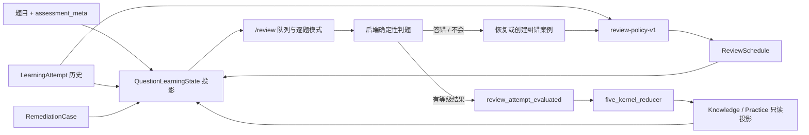

# LearnFlow 全局复习台与错题机制

## 1. 目标与边界

`/review` 汇总当前学习者所有已经判题的概念题与练习，优先恢复未完成纠错、逾期错题和辅助成功题。复习调度是可重建运行投影；学习事实的唯一权威仍是：

```text
LearningAttempt
  -> EvidenceEvent
  -> five_kernel_reducer
  -> KernelState
  -> MemoryFact -> MemoryModule -> MemoryClaim
```

`ReviewSchedule` 不直接写五核。Learning Design Agent 可以提供候选变式，但评分、阶段跳转、间隔和稳定门槛全部由确定性规则决定。

## 2. 组件与数据流



统一状态包括：

- 作答：`unseen`、`incorrect`、`unknown`、`correct_with_support`、`correct_independent`。
- 纠错：`none`、`explaining`、`variant_ready`、`completed`。
- 复习：`due`、`overdue`、`upcoming`、`stable`、`suspended`。
- 证据：`none`、`assisted_success`、`verified_once`、`transfer_verified`、`spaced_stable`。
- 错题：`first_error`、`repeated_error`、`corrected_due_review`、`corrected`、`relapsed`。

答对只改变当前状态，历史 Attempt、纠错案例和证据不会删除。

## 3. review-policy-v1

固定间隔阶梯是 `1 / 3 / 7 / 14 / 30 / 60 天`。

| 结果 | 评级 | 阶梯变化 | 证据语义 |
|---|---|---|---|
| 答错或明确不会 | Again | 重置为 0，立即进入纠错 | 检索失败；“不会”不生成具体误解 |
| 辅助答对 | Hard | 下降一级，最低 0 | 有支持成功 |
| 独立完成原题 | Good | 上升一级 | 独立检索，不是迁移 |
| 独立完成已校验变式 | Easy | 上升两级 | 独立迁移候选 |
| 纠错闭环完成 | Remediated | 重置为 0，1 天后复查 | 保留完整纠错证据链 |
| 跳过 | 无 | 保持到期 | 不创建 Attempt，不生成能力证据 |

队列排序为：未完成纠错 → 逾期错题 → 辅助成功题 → 普通到期题；同层按到期时间和遗忘次数排序。每个到期周期最多延期一天一次。暂停退出队列，恢复后立即到期且保留原阶梯。

长期稳定需要至少两次相隔 72 小时的独立复习成功，并至少包含一次已校验变式。之后失败会保留既有历史声明，同时将当前保持状态标记为风险并重新调度。

### 3.1 熟悉度语义与当前边界

当前熟悉度不是一个由模型猜测的百分比，而是一组可以回溯到 Attempt 的证据等级：辅助成功、单次独立验证、变式迁移验证和间隔稳定。调度采用检索练习、间隔效应和失败后再巩固的原则，并借鉴 FSRS 对 Again/Hard/Good/Easy 的结果分级；`review-policy-v1` 仍使用固定阶梯，不声称已经完成 FSRS 的个体参数拟合。

因此，当前机制适合在纵向样本不足时提供稳定、保守、可解释的复习计划。后续只有在同一学习者积累足够多跨时间作答后，才评估引入个体化稳定性/难度参数；参数只能调整调度，不能替代五核证据或掌握门槛。

### 3.2 与正式学习及 Agent 的联动

- 正式概念题和代码题完成后都会创建或更新同一条 `ReviewSchedule`；复习再次答错会恢复既有确定性纠错链，完成后回到正式的间隔队列。
- `/review` 当前选中题会通过 Workspace 上下文发布给右侧 Tutor。浏览器只发送 `review_schedule_id`，后端按 learner scope 重读题面、Attempt、纠错、Knowledge/Practice 投影和调度，生成不含答案的只读 `active_surface_context`。
- Tutor 可以解释当前错因、给下一步提示、说明为什么此时复习，并结合五核投影控制表达；判题、调度、纠错阶段和掌握升级仍由 Practice 能力与确定性规则负责。聊天本身不形成答题成功证据。
- 该交互仍是三类主 Agent 之内的 Tutor 入口，不新增“复习 Agent”权威；界面中的“复习 Tutor”只是当前会话表面名称。

## 4. 取题与安全

- 未闭环错题直接恢复已有 `RemediationCase`。
- 其他到期题优先展示 `assessment_meta.variant` 中经过结构校验、带 `validated=true`（或 `validator_status=passed`）且尚未展示的变式。
- 无合格变式时回退原题，并以 `question_form=original` 限制证据等级。
- 正确选项、期望输出、测试用例和 solution 不进入取题响应；只在后端私有判题契约中使用。
- 在线模型只能生成候选变式；离线模式可使用固定变式或原题完成全流程。
- 所有读取都绑定服务端 `CurrentLearner`，所有写入校验 learner/project/checkpoint ownership。

## 5. API 与并发

- `GET /api/review/summary`
- `GET /api/review/items`
- `GET /api/review/items/{id}`
- `GET /api/review/items/{id}/history`
- `POST /api/review/items/{id}/submit`
- `POST /api/review/items/{id}/defer`
- `POST /api/review/items/{id}/suspend`
- `POST /api/review/items/{id}/resume`

提交携带 `client_submission_id`、`expected_version` 和 `presentation_version`。相同幂等键重放原结果；状态版本或题面版本陈旧返回 `409`。概念题和代码题原提交接口继续兼容旧客户端，提供幂等字段时才启用重放。

## 6. 迁移与验证

`v10-review-workbench` 在 SQLite 迁移前创建一致性备份，再从历史 Attempt 和 RemediationCase 回填唯一调度行。回填不创建 EvidenceEvent，不伪造五核证据；唯一约束保证重复执行不产生重复调度记录。

```bash
cd backend
venv/bin/python -m pytest tests/test_review.py tests/test_remediation.py tests/test_architecture_registry.py -q

cd ../frontend
npm run build
```
