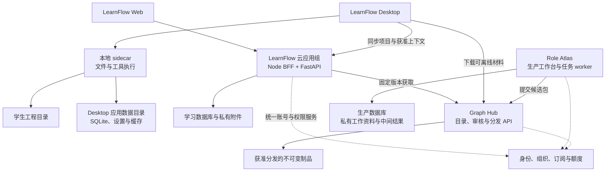

# LearnFlow 产品上线部署与数据归属

状态：上线架构建议，尚未实施或部署

日期：2026-09-05

配套产品规格：[三类学习项目](../product/THREE_PROJECT_MODELS.md)

本文回答 LearnFlow Web、LearnFlow Desktop、岗位图谱 Hub 与 Role Atlas 如何一起上线，以及各自保存什么、运行什么。
它记录当前代码事实与建议目标，不替代架构注册表，不表示已完成账号互通、数据库迁移、案例运行时或云同步。
本文不涉及真实数据迁移、服务器开通、域名变更或线上发布。

## 1. 建议的产品关系

**LearnFlow 是学习者使用的产品，Web 与 Desktop 是它的两个入口；Role Atlas 是内容生产工作台；Graph Hub 是审核与分发层。**
这四个入口可以共享身份体系、设计语言和制品协议，但各有明确的数据责任。初期无需四套独立基础设施，也不能让它们直接共享业务表。

| 入口 | 首要用户 | 核心功能 | 建议运行位置 |
| --- | --- | --- | --- |
| LearnFlow Web | 初次体验、阅读、规划和复盘的学生 | 三类项目入口、资料学习、Tutor、项目路线、练习复习、成果与能力记录、案例选用 | 浏览器 + LearnFlow 云服务 |
| LearnFlow Desktop | 在电脑上持续完成实验和软件类实践的学生 | Web 核心学习体验 + 本地目录、代码与文件纸张、受控工具执行、调试、外部 IDE 协作和工作恢复 | 学生电脑上的 Tauri + 本地 sidecar，按项目模式连接云服务 |
| Graph Hub | 学生、教师、案例作者、审核者 | 发现、审核、授权、版本发布、撤回、下载岗位包和工作案例包 | 云端目录/API + 发布制品存储；初期可与 Atlas 共用应用部署 |
| Role Atlas | 企业内容提供方、教研、岗位研究者、案例作者 | 提取工作区信息、整理岗位与流程、追溯依据、编制和迭代岗位包/案例候选 | 受权限保护的云工作台 + 后台任务；以后可扩展企业私有部署 |

学生的默认动线是“在 LearnFlow 选一个目标 → 必要时选 Hub 案例 → 在桌面继续动手”。
他们不需要先接企业协作文档、运行 Atlas 或自己生产一张岗位图谱，才能获得有价值的类实习体验。

岗位包描述岗位任务、流程和能力结构；工作案例包描述一次具体工作情境、初始环境、阶段材料和评价规则。
二者独立版本化并相互引用，避免把所有案例代码、数据和后续事件塞进岗位图谱。

## 2. 当前实现与目标之间的距离

本次核对两个独立仓库：当前 `edagent`（文档编写前基线 `03393a0`）与只读参考 `/Users/a1-6/LearnFlow`（基线 `9eb4f57`）。
参考仓中的 `apps/role-atlas` 与 cohost 配置不属于当前 edagent 的可部署组件；采用它们需要单独维护发布，不自动合并仓库。

| 范围 | 已核实的当前事实 | 对上线的含义 |
| --- | --- | --- |
| Web | React 前端的 `/api/tutor` 运行在 Node/Vite 中间件中，其余 API 代理至 FastAPI；Docker 启动 `npm run preview` | 不能仅上传 `dist/` 就得到完整产品；应先提取正式 Node BFF/运行入口 |
| LearnFlow 存储 | SQLite + 本地上传/缓存目录；迁移中含 SQLite 专用 SQL | 单实例可做受控试运行；PostgreSQL 是需要适配和迁移验证的目标，不是换 URL 即可完成 |
| Desktop | 每台设备启动独立 loopback FastAPI 和应用数据目录 SQLite，API 默认全指向本地 | 已有本地应用，不等于云端账户、项目与进度已经同步 |
| Desktop 设置 | provider 设置仍写入应用数据目录的 `settings.env`，未接系统凭据存储 | 系统保护的密钥存储属于待实现目标 |
| 身份 | Web/桌面复用认证代码，但本地整数账户/learner ID 各自生成 | 相同用户名不等于同一全局身份，不能按本地 ID 合并数据 |
| 纸张 | 正式 Session/Message 在后端；部分纸张投影、标签与布局在浏览器缓存 | 跨设备恢复需要补正式纸张/工作区持久化合同 |
| 插件 | Web 有 TS 插件执行层，Desktop 正式 Tutor 走本地 Python turn | 共用 Renderer 不等于两端执行能力相同；桌面插件能力需要专门接通 |
| Atlas/Hub | 参考 cohost 有 5 个服务、3 个子域；Atlas 与 Hub 共用 Atlas 进程；Compose 覆盖为 `npm run dev` | 是单机试运行基础；多个域名不会自动形成权限隔离 |
| Atlas 存储 | D1 接口；cohost 持久化 Miniflare 本地状态；发布包完整 JSON 当前也存 D1 | 当前 R2 未启用，需要落实对象存储 |
| Atlas 发布入口 | 已有 Worker fetch 入口与 vinext build/start；D1 使用本地占位配置，未见完整正式资源绑定与发布流水线 | 有 Cloudflare 运行适配基础，仍需新增生产资源、发布配置与预发布验收 |
| Hub 消费 | 已能在线发现包；实际岗位工具仍读取启动时加载的本地包 | “发现 → 获取 → 校验 → 缓存 → 激活”尚未自动闭环，当前仍有文件导入和重启步骤 |
| Atlas 权限 | 部分生命周期有 owner 校验，但列表、Registry、Release 等路径缺少一致的主体/对象权限检查 | 正式多用户上线前必须补齐读、写、导出、发布和 job 权限 |
| Hub 治理 | 文件 Hub 有独立 reviewer 门；在线 Atlas 发布路径未统一复用该审核流程 | 结构校验通过、标记 published 与独立审核通过必须分别记录 |
| Atlas 长任务 | 有持久化 job、租约、心跳和 checkpoint，执行仍由请求启动 | 需要独立调度/worker；queued 状态本身不会保证自动恢复 |
| Desktop 发布 | 已有 Windows/macOS 安装包 Release 工作流；未接入正式平台签名、公证和应用内 updater | 下载发行已有基础，正式可信更新链仍需建设 |

Vite 官方明确将 preview 定位为本地预览，不作为生产服务器；这也是提取当前 Tutor 中间件的直接原因。
见 [Vite 部署说明](https://vite.dev/guide/static-deploy.html)。
Cloudflare 将 Miniflare/D1 local 用于本地模拟与测试；持久化这个目录不能被描述为已使用托管 D1。
见 [D1 本地开发文档](https://developers.cloudflare.com/d1/best-practices/local-development/)。

## 3. 目标拓扑与部署单位

下面是建议拓扑，域名仅为占位示例。箭头表示经认证的业务接口或获准制品流，不表示共享数据库。



### 3.1 第一版正式架构建议

| 部署单位 | 建议方式 | 内部职责与持久化 |
| --- | --- | --- |
| LearnFlow 云应用组 | Linux 容器；正式 Node BFF + FastAPI，初期各一个实例 | BFF 承接 Tutor 流与插件适配；FastAPI 持有正式对象、认证、评价和证据链；数据库和附件独立持久化 |
| LearnFlow 后台任务 | 与 API 分进程的 worker，可先同主机 | 资料处理、索引、较长生成/评估；持久任务状态、幂等和恢复，不能依赖网页连接 |
| Atlas/Hub 内容应用组 | 优先沿现有 Cloudflare runtime 评估正式部署，接真实持久化服务；也可选择容器+存储适配方案 | 保留生产与发布两个权限模块，独立后台任务；私有来源和发布制品分存 |
| 学习数据 | 受控试运行可用持久卷 SQLite；面向扩容的目标是 PostgreSQL | 先完成驱动、迁移、事务、唯一约束和恢复验证，再切换；不直接复制桌面数据库 |
| Atlas 数据 | 优先保留 D1 数据接口，正式接托管 D1；对象内容逐步落 R2/等价对象存储 | 当前本地 D1 与发布包表需要迁移；若统一为 PostgreSQL，需另做 Atlas repository 适配 |
| 静态资源与安装包 | HTTPS 分发，可使用对象存储/CDN | Web assets、获准公开包、桌面安装包/更新清单；私有文件不通过公共缓存裸露 |
| 学生设备 | Tauri 安装包 + 打包 sidecar | 不安装云端数据库、Atlas、企业连接器；C 编译器等工具按 Profile 检测与引导配置 |

优先分清服务、存储和权限，再选择供应商与机器规格。早期不需要 Kubernetes；应依据实际并发 Tutor、资料处理和案例构建负载压测扩容。
选择云区域时，应验证目标学生与模型服务的真实网络体验，再确定部署区域和数据驻留范围；本文没有采购或成本承诺。

Atlas 的 Cloudflare 路线是基于现有代码接口的迁移建议，不表示生产构建、平台限制、长任务与现有文件系统依赖已经验收。
同机容器方案可以作为内部验证起点，但不能直接把本地模拟状态卷扩成多个副本。两条路线应在上线实施时择一验收，避免维护两套生产权威。

### 3.2 域名与网络入口

- `learn.example.com`：LearnFlow Web，公开 API 经统一入口到 BFF/FastAPI。
- `roles.example.com`：Role Atlas，必须登录并根据组织、项目与操作鉴权。
- `hub.example.com`：公开目录、授权目录和制品下载；审核/发布使用单独权限，公共入口仅开放必要路由。
- `downloads.example.com`：安装包与签名更新清单，可以与静态分发共用底层服务。

数据库、任务调度、内部凭据桥和模型服务密钥不成为公网浏览器接口。Hub 若与 Atlas 共用进程，要同时做路由 allow-list 与服务端 ACL；
仅把 Hub 首页换成 `/hub` 不会限制其他 Atlas API 的访问。

## 4. 数据在哪里：每类对象只有一个明确权威

下表描述目标分工。“LearnFlow 云”适用于云同步项目；纯本地项目的相应学习对象以本地数据库为权威。

| 数据/对象 | 权威归属 | 允许的副本或消费者 | 默认规则 |
| --- | --- | --- | --- |
| 账号、组织成员、订阅、额度 | 统一云身份/账户服务 | 各产品持有稳定 subject 与必要授权投影 | 每个服务自己校验操作权限，登录成功不能代替对象授权 |
| 学生 Project、Roadmap、Checkpoint、LearningTask | LearnFlow | 桌面缓存、Web 展示 | Atlas/Hub 不直接写这些表 |
| 正式 Session/Message、已提交纸张与学习笔记 | 项目所属 LearnFlow runtime | 同步客户端与受权导出 | 按项目同步策略保存；未提交草稿、布局和标签页可为设备本地状态，不冒充已同步记录 |
| 学习 Attempt、EvidenceEvent、五核与复习 | LearnFlow 正式 runtime | 设备上的缓存/暂定投影 | 经统一 reducer 更新，禁止上传整个 KernelState 覆盖云状态 |
| 教材、学生上传资料、受管讲义/练习 | 相应 LearnFlow 项目；元数据在 DB，正文/附件可在私有存储 | 获权客户端缓存 | 用户选择导入/上传；本地来源不会因绑定目录自动上云 |
| 工程源文件、Git 历史、构建产物 | 学生本地目录或其自选 Git 服务 | LearnFlow 只持有引用；可选上传明确提交的快照 | 不自动把整个工程或 Git 目录同步到 LearnFlow 云 |
| 绝对路径、工具链、设备设置、运行环境 | 本机 | 云端可保存非敏感能力摘要 | 不跨设备复用绝对路径，不同步密钥 |
| 本地运行、diff、备份、WorkspaceOperation | 本地 sidecar | 获准的运行摘要、提交 manifest 和证据可上云 | 运行成功不直接等于学习掌握 |
| 企业协作文档、工单、源码历史等原始材料 | Atlas 私有生产域或企业自有系统 | 受限提取 worker 与审阅者 | 不默认传给 Hub、学生或通用 Tutor |
| Atlas 草稿、工作过程抽取、图谱版本与构建记录 | Atlas | 审核时提交必要候选及依据 | 不存学生的学习进度和五核 |
| 岗位包、案例包的已发布版本 | Hub 发布记录与不可变制品存储 | LearnFlow 固定版本缓存、下载者的授权副本 | 内容变更新版本；selector 与 hash 固定，不静默升级 |
| 案例隐藏测试、参考轨迹与未开放事件 | 受限评价/案例服务 | 仅当前有权 evaluator 和阶段投影 | 不下发完整秘密到学生设备，再只靠 UI 隐藏 |
| 模型配置与密钥 | 云密钥管理/账户加密配置；用户本地 BYOK 可在系统凭据存储 | 有权服务在调用时取用 | 平台共享密钥不打包进桌面，不出现在前端资源或日志 |

Hub 的目录记录、发布许可与包哈希是分发权威；Atlas 仍保留生产过程依据。
不可变不等于永久公开：撤回版本后停止新授权/下载，并保留审计元数据；对已下载副本不能承诺技术上远程抹除。

## 5. 桌面与网页如何成为同一个学习过程

### 5.1 两种清晰的项目保存方式

**云同步项目：**云端保存正式学习对象与已接收的学习记录；桌面保留缓存、未提交事件、文件引用与本地工程。
Web 能接着阅读、提问和复盘；需要本机工程的关卡显示“在关联设备继续”。另一台电脑必须重新关联目录或取回用户主动保存的快照。

**仅本地项目：**本地数据库保存正式项目与学习记录，不向云自动复制。联网 Tutor/BYOK 仍可能发送用户本次选定上下文给模型服务，
所以“仅本地保存”与“完全不联网”是两个不同开关。没有本地模型时，离线可读写材料和继续工具工作，不能承诺完整离线 AI。

由本地转云同步应是一次明确的项目导入：显示将上传的对象/附件，分配全局 ID，建立旧 ID 映射与证据来源，确认后导入。
同名账号、项目标题或相同整数 learner ID 都不能用作自动合并依据。

### 5.2 最小同步合同（待实现）

1. **身份先行：**统一 issuer + 稳定 account subject，登记设备会话；各产品本地 learner/owner ID 只是内部映射。
2. **分开路由：**桌面客户端按 API 责任路由：本地文件/工具到 sidecar；云项目对象到云 API；纯本地项目仍到本地 API。
3. **可重试提交：**同步对象带全局 ID、schemaVersion、serverVersion；待提交命令/事件带 operationId、deviceId、baseVersion 与来源。
4. **确定性接收：**云端校验 ownership、版本、辅助等级和评价合同，同一 operationId 幂等接收；客户端申报的测试成功不是可信远程判题。
5. **单一证据链：**云端从合格 Attempt/EvidenceEvent 更新投影；离线派生状态标为暂定，不能把本地五核快照最后写入覆盖云端。
6. **分对象处理冲突：**对话用客户端消息 ID 去重并关联原 Session；路线/Task 结构用版本提案；纸张编辑保留冲突副本或显式合并；
   磁盘代码依赖 hash/diff 或用户自己的 Git，不由云同步服务猜测合并。
7. **完成生命周期：**包含附件先后依赖、删除 tombstone、撤销授权、重试/断线恢复与兼容版本；删除云项目不删除本机目录。

应先实现“在线同账号继续”，再实现必要的离线 outbox；首版若没有完成同步，应在产品中明确 Web 与桌面项目独立，提供可校验的项目导出/导入，
而不是显示一个实际无法跨端恢复的同步图标。

### 5.3 登录与内容交接是两条链

现有 Atlas→LearnFlow 使用共享会话校验与绑定主体/包版本的短时交接令牌，可以复用这一内容交接思路。
它只证明“谁要打开哪份包”，不能替代桌面登录、包下载、项目物化或案例权限检查。

桌面建议采用系统浏览器完成授权码 + PKCE 登录，回到已登记的应用回调，并把刷新凭据放入系统保护的凭据存储。
不要把 WebView 的浏览器 Cookie 共享当作桌面 SSO。规范依据见 [RFC 8252：原生应用 OAuth](https://www.rfc-editor.org/rfc/rfc8252)。

## 6. 功能与模型计算放在哪里

| 能力 | 默认执行位置 | 分工 |
| --- | --- | --- |
| 项目确认、阶段结构、身份、配额、同步 | LearnFlow 正式 runtime | 确定性代码持有正式写入权；云同步项目在云端，本地项目在本地 |
| Tutor、路线/教学候选生成 | 云 Tutor；可选本地/BYOK adapter | 同一三类主 Agent 合同；模型只获得当轮获准来源和可见案例材料 |
| 文件索引、选区、hash、diff、写回、外部 IDE 协作 | Desktop sidecar | 保持项目目录范围、变化检查、确认和回滚；不向公网开放本地文件 API |
| 实验构建与预设测试 | 默认学生本机受控 Tool Profile | 记录环境、输入快照、输出与状态；运行器、依赖检测和多文件提交是新增能力 |
| 需要秘密/独立性的验证 | 隔离评价服务 | 与开放工作目录分离；保存最少获准提交，按 rubric/规则及必要人工评审确认结果 |
| 资料解析、较长索引与生成 | 项目所属 runtime 的后台任务 | 云项目可云处理，本地私密来源在本地处理；耗时任务与交互请求分离 |
| 企业来源接入、岗位研究、案例编制 | Atlas worker | 凭据只属于内容生产域；可访问的材料范围由来源授权决定 |
| 包转换插件 | LearnFlow 可信插件 host | 读取当前授权包，输出候选；由 Host 校验确认并物化正式项目/任务 |
| 包校验、审核、许可与发布 | Hub 发布模块 | hash/schema 校验自动化；真实性/适用性审核保留可追溯责任 |

平台付费模型统一经云端额度、取消、超时和审计；桌面 BYOK 可以直接访问配置的服务，但应清楚展示上下文去向。
不要为 Web 和 Desktop 分别发展不兼容的教学决策、事件或插件合同。技术运行时可以不同，Host 行为和契约验收必须相同。

在学生可控制的电脑上隐藏的答案仍可被读取。本地隐藏验证适合自学反馈；需要可信独立结果时应使用远程隔离验证或人工评审，并标注证据等级。
仅本地项目使用远程验证时，需要在本次提交或预先配置的项目授权中明确最小上传范围；不授权上传时保留本地测试与适用的人工评审，
按实际可核验证据标注独立性，不把拒绝上传视为学习失败。
当前 trusted-local 执行器不能直接打开给公共 Web 运行任意用户代码；公共执行要单独建设文件、进程、资源、网络和密钥隔离。

## 7. 从企业工作过程到学生案例的流转

```text
企业工作区 / 公开可授权案例
  → Atlas：接入授权、来源定位、脱敏、保留证据限制
  → Atlas：抽取任务、角色、决策、产物、事件与能力关联
  → Atlas：形成岗位包和独立工作案例候选
  → Hub：结构校验、内容审核、分发许可、固定版本发布
  → LearnFlow：发现、授权获取、校验、缓存、候选教学转换
  → 用户确认：Project → Roadmap → Checkpoint → LearningTask
  → Desktop：获取初始材料、关联目录、执行实验与工作步骤
  → LearnFlow：收集提交、评价、辅助等级与学习证据，复盘迁移
```

上线的最小消费协议应包含以下动作，不要求采用这里的命名：

- **发现与授权：**查询当前主体可以看到的目录，公开与私有结果不可混用公共缓存。
- **解析精确版本：**岗位包使用 `packageId + packageVersion + snapshotId + rootHash`；案例使用其独立版本和内容 hash，固定依赖。
- **获取与校验：**取 manifest 和当前被允许的材料，校验 schema/hash/签发者/兼容性/工具要求；失败不创建半可用学习项目。
- **候选转换与确认：**插件输出提案，Host 校验可见内容、阶段、来源与评价能力，然后由用户确认物化。
- **更新与撤回：**新版本可提示升级；进行中的案例固定版本并保留记录。重大撤回阻止新使用，并说明现有项目的处理状态。

如果转换服务不能读取授权制品地址，必须扩展其输入协议或增加可读取制品的 adapter；不能把一个 URL 塞进 500 字符 wire 就认为已传入完整案例。

企业来源正文、派生说明、代码样本、案例初始环境都需要检查分发范围。只删除引用 URL 或原文片段，不足以保证派生内容可公开。
实际案例的起始时点应固定：初始仓库也要处理后续 commit、最终解法、评审答案和未来事件，不能只在页面上隐藏。

学生交付物与学习记录默认只属于其 LearnFlow 项目。向 Atlas 回流最多是经授权的案例质量反馈；把学生作品发布为新案例必须另走授权与审核流程。

## 8. 发布顺序与验收门

### 阶段 A：内部闭环与产品试用

- 使用固定资料、SAT 实验和经核验工作案例跑通三条黄金情境。
- 允许单机持久卷部署和桌面 local-only，清楚标注范围；私有生产材料不进入未经完整隔离的公开环境。
- 明确包导入、模型配置、目录关联、工具安装与恢复点，记录失败，不以 mock 输出冒充执行。

### 阶段 B：公开多用户基础

- 从 Vite 插件提取正式 BFF；Atlas 正式运行入口与存储方案完成验证。
- 补齐所有 Atlas/Hub list/read/write/export/job/publication 的主体与对象权限，以及公共域的路由边界。
- 统一文件与在线 Hub 的审核/发布合同；落地制品获取、精确版本校验和撤回语义。
- 持久任务与 worker 可在页面断开、服务重启后恢复；限额、幂等和取消生效。
- 选择数据库/对象存储并完成备份恢复演练；不要在真实用户数据上试验未经验证的迁移。

### 阶段 C：双端连续体验

- 稳定全局身份、设备会话、API 双路由与跨端纸张持久化。
- 先完成在线同账号恢复，再加入离线 outbox、冲突和旧客户端兼容。
- 接通 Desktop 插件合同、真实 C 工具 Profile、多文件提交与版本化运行记录。
- 在两台设备、Web 和桌面之间验证断线、重试、同一事件重复上传、外部文件变化、项目删除不伤害本地工程。

### 阶段 D：扩大案例供给和可靠运营

- 从少量人工核验案例逐步扩展企业连接器、增量采集与教研审核。
- 随负载拆分 Atlas 构建 worker、LearnFlow 资料 worker 与隔离 evaluator；Hub 可独立部署，数据协议保持不变。
- 对运行失败率、任务恢复率、包获取失败、案例退回率和独立学习证据建立观测，避免用消息量或生成量替代产品效果。

## 9. 安装、升级、备份与环境管理

- **三套环境：**开发、预发布、正式各用独立数据库、对象前缀、模型凭据与发布目录；正式数据不默认复制到开发环境。
- **云服务发布：**固定镜像版本；迁移先在恢复副本验证，先兼容扩展后切换读写；应用回滚与数据库恢复分别设计。
- **桌面发行：**延用 Windows/macOS 构建基础，补平台签名/公证、发布前检查和签名更新清单；旧桌面遇到新案例 schema 时提示升级。
- **更新信任：**Tauri updater 的更新签名与操作系统签名是不同环节，均需规划；updater 使用公钥验证制品。
  官方说明见 [Tauri Updater](https://v2.tauri.app/plugin/updater/)。
- **恢复范围：**学习 DB、附件、Atlas DB/私有原料、Hub 制品与目录、发布审核、加密密钥和配置版本应能一致恢复。
  KEK 丢失会影响原加密配置恢复；备份存在不等于恢复已经验证。
- **本地保护：**升级先备份本地 schema/配置；工程目录属于用户，不随卸载、云删除或失败迁移自动清理。
- **日志：**用 account/project/job/operation/package 等关联 ID 定位问题，避免在日志保留密钥、完整企业材料和未获准代码正文。

## 10. 本次代码依据与实现入口

### 当前 edagent 仓库

| 事实 | 文件与核对位置 |
| --- | --- |
| 容器入口 | `deploy/frontend.Dockerfile:1`、`deploy/backend.Dockerfile:1` |
| Tutor Node 中间件、preview 注入与 API proxy | `frontend/vite.config.ts:229,600,611,649` |
| 默认存储与 SQLite 迁移依赖 | `backend/app/core/config.py:87`、`backend/app/db/database.py:610`、`backend/requirements.txt:1` |
| sidecar 启动、独立路径与本地 API 路由 | `desktop/src-tauri/src/lib.rs:1107,1154`、`backend/desktop_entry.py:14`、`frontend/src/runtime-client.ts:264` |
| 本地认证与 learner 映射 | `backend/app/services/auth.py:880`、`backend/app/api/auth.py:227`、`frontend/src/runtime-client.ts:95` |
| Web/Desktop Tutor 路径 | `frontend/src/tutor.ts:504,551` |
| 本地文件与 Agent 接口 | `backend/app/api/workspace.py:42`、`backend/app/api/local_agent.py:53` |
| 桌面发行基础 | `.github/workflows/desktop-release.yml:1,60,112`、`.github/workflows/desktop-internal.yml:48`、`desktop/README.md:23` |

### 只读参考仓 `/Users/a1-6/LearnFlow`

| 事实 | 相对此参考仓的文件与核对位置 |
| --- | --- |
| cohost 拓扑与开发启动覆盖 | `apps/role-atlas/deploy/cohost/compose.yaml:1,70,76,95,113,133`、`Caddyfile:10-27`、`README.md:57-59`（后二者同目录） |
| D1 与制品 JSON 实际落点 | `apps/role-atlas/db/index.ts:26-84,164-212`、`apps/role-atlas/lib/packages/artifact-store.ts:7-31` |
| Worker 与正式发布配置缺口 | `apps/role-atlas/package.json:9-11`、`apps/role-atlas/vite.config.ts:6-7,42-50`、`apps/role-atlas/worker/index.ts:28-44`、`apps/role-atlas/.openai/hosting.json:3-4` |
| 在线目录与本地包 runtime | `apps/role-atlas/lib/hub/repository.ts:16-18,68-78`、`frontend/plugins/role_capability_graph/server.ts:257,289,321`、`runtime.ts:334-374`（同插件目录） |
| 身份桥与包交接 | `apps/role-atlas/lib/integrations/learnflow/auth.ts:32-68`、`launch-token.ts:31-55`（同目录）、`backend/app/api/agent.py:609-628` |
| 权限缺口核查 | `apps/role-atlas/app/api/projects/route.ts:16-31`、`lib/projects/repository.ts:48-59`、`app/api/registry/route.ts:7-27`、`app/api/releases/route.ts:45-69`、`app/api/releases/[releaseId]/export/route.ts:6-16`（后三组均从 Atlas 根算起） |
| 两条发布治理路径 | `apps/role-atlas/lib/hub/file-hub.ts:185-214`、`apps/role-atlas/lib/releases/service.ts:141-164` |
| 来源分发策略 | `apps/role-atlas/lib/packages/compiler.ts:19-34,63-69,84-93` |
| job 持久化与请求驱动执行 | `apps/role-atlas/lib/jobs/repository.ts:49-85,98-139`、`lib/jobs/runtime.ts:78-155`、`app/api/build-runs/route.ts:134-171`、`worker/index.ts:28-44`（后三者从 Atlas 根算起） |

这些是源代码与配置审阅结果，没有执行部署、线上权限渗透测试、数据迁移或生产负载测试。
落地上述新增能力时，应同步更新注册表、正式合同、实现与对应测试；本设计文档不授予插件、模型或新服务额外写入权。
