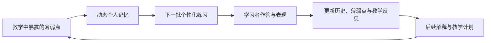
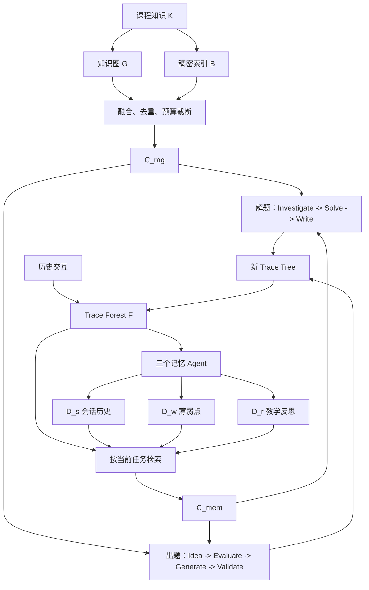

# DeepTutor 论文与代码阅读文档

> 阅读对象：[DeepTutor: Towards Agentic Personalized Tutoring](https://arxiv.org/abs/2604.26962)（arXiv v3，2026-07-09）\
> 论文实现：[HKUDS/DeepTutor `eval` 分支](https://github.com/HKUDS/DeepTutor/tree/eval)\
> 代码快照：[`a6d5f73`](https://github.com/HKUDS/DeepTutor/tree/a6d5f73db10e9afcb75ba4e9e04474e34ffec582)\
> 文档目标：读懂 DeepTutor 的研究问题、记忆结构、闭环机制、实验边界和核心代码对象，并据此判断 LearnFlow 的可借鉴点与创新空间。

## 0. 先划清版本边界

阅读 DeepTutor 最容易犯的错误，是把论文、论文实验代码和持续更新的产品主分支混在一起。

| 对象 | 应该用来回答什么 | 不应该用来回答什么 |
|---|---|---|
| arXiv v3 论文 | 作者提出了什么问题、方法和实验结论 | 当前产品所有功能如何实现 |
| `eval` 分支及固定快照 | 论文核心管线如何落到代码对象与调用链 | 2026 年 8 月主分支的完整架构 |
| `main` 分支和官方文档 | DeepTutor 后来演化成了什么产品 | 论文实验当时究竟验证了什么 |

论文首页将其标为 **Technical Report**，仓库的引用文件将其标为 arXiv preprint。因此阅读时可以说“作者报告了某结果”，暂时不要说“已由同行评审证明”。

还有一篇 2015 年的同名论文 [DeepTutor: An Effective, Online Intelligent Tutoring System That Promotes Deep Learning](https://ojs.aaai.org/index.php/AAAI/article/view/9269)，与本文不是同一个系统。

## 1. 你读完后必须能回答的六个问题

1. DeepTutor 认为现有教育智能体缺少的到底是什么？
2. 静态知识 grounding 与动态个人记忆分别保存什么，为什么不能合并成一段提示词？
3. Trace Forest、学习者画像和当前回合上下文是什么关系？
4. 解题与出题怎样共享学习者状态并形成闭环？
5. TutorBench 实际测量的是教学对话质量，还是学生的长期学习效果？
6. DeepTutor 的“图”和“自我更新”与 LearnFlow 的岗位能力图谱、五核证据状态有何本质差异？

如果读完只能复述“Planner、Solver、Writer 三个 Agent”，还没有抓到论文主张。真正的研究对象是：**历史交互怎样成为可检索证据，证据怎样改变后续教学动作，闭环又怎样被评测。**

## 2. 推荐阅读顺序

不要从第一页线性读到最后一页。按下面四轮完成，每轮都要有产物。

| 轮次 | 时间 | 原文范围 | 目标 | 当轮产物 |
|---|---:|---|---|---|
| 第一轮：定位 | 45 分钟 | 摘要、§1、Figure 1、Figure 2、§7、Limitations | 找到问题、方法、结论和边界 | 一张 200 字论文卡 |
| 第二轮：方法 | 90 分钟 | §2.1 至 §2.4、Algorithm 1 | 精读记忆、解题、出题和闭环 | 一张状态流转图 |
| 第三轮：证据 | 90 分钟 | §4、§5、Figure 5-9、Table 2-3、Appendix D | 判断实验到底支持哪些主张 | 一张结果与局限表 |
| 第四轮：代码 | 120 分钟 | `eval` 分支核心文件 | 用对象、状态、动作复原实现 | 两条调用链和一张对象表 |

§3 的 Book Engine、Partners、Co-Writer 等扩展放到最后。它们能展示系统愿景，但论文明确说定量实验集中在 tutoring core；扩展功能的真实学习效果仍需纵向人类研究。

## 3. 第一轮：定位论文主张

### 3.1 原文问题定义

原文位置：摘要、§1、Figure 1。

论文指出了四个彼此相连的断点：

1. 有些 Tutor 会在当前回合诊断学生，但诊断结果不会稳定进入后续会话。
2. 出题系统往往只接收主题或预设目标，不读取近期教学轨迹。
3. 解题和出题各有一套局部上下文，没有共享、持续演化的学习者模型。
4. 评测通常从教师或通用用户视角打分，难以检验多轮对话是否真的针对某个学习者的具体缺口。

因此本文不是单纯增加更多 Agent，而是试图建立这个循环：



### 3.2 论文的核心主张

用一句尽量贴近原文的中文概括：

> DeepTutor 用 Hybrid Personalization Engine 统一 citation-grounded problem tutoring 和 difficulty-calibrated question generation，使两类任务共享课程知识、交互轨迹与持续更新的学习者画像。

这里有三个不可省略的限定词：

- **citation-grounded**：回答与题目要能回到课程资料证据。
- **learner-calibrated**：解释深度和题目难度要依赖学习者状态。
- **closed-loop**：教学诊断影响练习，练习表现又影响后续教学。

### 3.3 第一轮检查题

合上论文后口头回答：

1. DeepTutor 相比“知识库 + LLM 输出 JSON”多了哪一个可持续机制？
2. 为什么“多 Agent”本身不是论文的主要创新？
3. Figure 1 中原有系统的断点在哪里，DeepTutor 新增的回边是什么？

## 4. 第二轮：精读 Hybrid Personalization Engine

### 4.1 原文符号

原文位置：§2 开头和 Figure 2。

| 符号 | 原文含义 | 阅读时的直觉 |
|---|---|---|
| `q` | 学生提出的问题 | 当前教学任务 |
| `a` | 有引用、适合学习者的指导 | 解题管线输出 |
| `tau` | 出题主题 | 练习生成入口 |
| `K` | 课程知识 | 稳定的领域材料 |
| `G` | 知识图 | 课程内容单元之间的结构与上下文关系 |
| `B` | 稠密向量索引 | 语义相似检索 |
| `C_rag` | 静态知识检索上下文 | “关于内容，系统知道什么” |
| `F` | Trace Forest | 可检索的完整交互证据空间 |
| `D_s` | session history | 学过什么、走过什么路径、表现趋势如何 |
| `D_w` | weakness inventory | 反复困惑、错题模式、活跃或已解决缺口 |
| `D_r` | pedagogical reflections | 以后应该怎样教这个学习者 |
| `C_mem` | 本回合组装的个人记忆上下文 | “关于这个人，此 Agent 此刻需要知道什么” |

关键区别是 `F`、`D`、`C_mem` 不是同一个东西：

- `F` 是原始和中间交互轨迹的证据库。
- `D` 是三个记忆 Agent 根据跨会话证据维护的解释性画像。
- `C_mem` 是针对当前角色和 token 预算，从 `F` 与 `D` 中临时组装的上下文。

### 4.2 Static Knowledge Grounding

原文位置：§2.1.1。

作者先把课程文档拆成保留模态结构的原子内容单元，再同时建立两类索引：

1. 知识图 `G`：保存内容单元的显式结构关系和上下文关系。
2. 稠密索引 `B`：通过 embedding 找语义相似内容。

查询时执行图遍历和稠密检索，再用 Reciprocal Rank Fusion 融合、去重并按上下文预算截断，得到 `C_rag`。

这里要克制一个容易过度推断的结论：论文中的 `G` 主要是**静态课程材料检索结构**。原文没有把它定义成会根据就业市场、岗位变化和学习证据自动修订的能力图谱。

### 4.3 Dynamic Personal Memory

原文位置：§2.1.2，是全文最值得精读的部分。

每次完整教学交互会形成一棵 Trace Tree，所有树构成 Trace Forest `F`。论文定义三层粒度：

| 层级 | 保存内容 | 解决的问题 |
|---|---|---|
| Level 1 | 会话输入与全局摘要 | 这次交互总体在做什么 |
| Level 2 | 任务分解后的中间规划单元 | 系统采取了哪些步骤 |
| Level 3 | 工具输出、证据、验证结果等细粒度执行记录 | 某个判断究竟依据什么 |

每个节点带 embedding，因此系统既能按时间查看完整交互，也能跨树语义检索相似的步骤和错误。

论文把 TraceToolkit 抽象成三个操作：

- `SearchTrace`：在整个森林中做语义近邻检索。
- `ListTraces`：按时间、任务类型或主题列举轨迹。
- `ReadNodes`：读取节点完整内容和祖先路径。

这三个动作的研究意义比函数名称更重要：Agent 先宽搜相关历史，再定位会话，最后下钻到证据细节。

### 4.4 画像不是“最近一轮摘要”

新轨迹进入后，三个专门的记忆 Agent 会主动检索历史、比较跨会话模式，再分别更新：

| 画像 | 应记录 | 不应误记为 |
|---|---|---|
| `D_s` | 主题、解题路径、作答表现与趋势 | 一段原始聊天历史 |
| `D_w` | 有证据的重复困惑、错题模式、活跃/已解决缺口 | 模型对学生能力的无依据猜测 |
| `D_r` | 对未来教学方式的反思 | 学生的知识掌握状态 |

在每个 Agent 步骤之前，系统又做两次选择：

1. 从 `F` 检索当前任务相关的轨迹节点。
2. 按角色提取不同画像片段，例如 Planner 读取 `D_s + D_w`，Writer 读取 `D_r`，出题 Agent 读取 `D_w` 和历史题型。

最后，系统在 `C_rag` 与 `C_mem` 之间动态分配 token 预算。也就是说，个性化不是把整份用户档案无差别塞给所有 Agent，而是一个**角色相关、证据相关、预算受限的上下文组装过程**。

### 4.5 架构总图



### 4.6 第二轮检查题

1. `F` 与 `D_w` 中哪个更接近证据，哪个更接近解释？
2. 如果 `D_w` 写错了，系统怎样回到原始轨迹复核？论文提出了能力，但是否提出了强制证据约束？
3. 三层 Trace Tree 为什么不是普通的聊天摘要？
4. `C_rag` 与 `C_mem` 的预算竞争可能造成什么失败？

## 5. 第二轮：精读两条任务管线

### 5.1 Personalized Problem Tutoring

原文位置：§2.2，对应 Algorithm 1 的阶段 1-3。

#### 阶段 1：Personalized Investigation

Planner 不立即作答，而是把 `q` 分解成 meta-questions，并查询课程知识、Trace Forest 和必要工具。它结合 `C_rag` 与 `C_mem`，生成带注释的子目标计划：

`P = <s_1, ..., s_K>`

动作核心：**调查 -> 分解 -> 取证 -> 形成针对真实缺口的计划**。

#### 阶段 2：Step-by-step Guided Solving

Solver 逐个完成子目标。原文强调三个机制：

- self-notes：把每一步结果压成后续可复用的短结论。
- hierarchical compression：把已完成子目标压缩，给后续推理腾出上下文。
- adaptive replanning：计划不够好时只修订剩余步骤，保留已完成工作。

动作核心：**执行子目标 -> 记录可复用结论 -> 压缩历史 -> 必要时局部重规划**。

#### 阶段 3：Evidence-based Iterative Writing

Writer 不直接拼接工具输出，而是从 scratchpad 中提取结构化证据，多轮修订回答并处理冲突。`C_mem` 决定解释深度与语气，外部事实需要引用到课程资料或启用的外部证据。

动作核心：**整理证据 -> 适配表达 -> 迭代修订 -> 保留引用**。

### 5.2 Personalized Question Generation

原文位置：§2.3，对应 Algorithm 1 的阶段 4-5。

#### 阶段 4：Personalized Idea Generation

Idea Agent 不直接写题，而是先结合主题 `tau`、历史错误、难度趋势与相关旧题，生成候选想法。每个想法包括目标概念、题型和针对该学习者的理由。Evaluator 再按清晰度、相关性和多样性筛选、排序，形成模板 `{T_i}`。

动作核心：**确定该问什么 -> 说明为何适合此人 -> 过滤重复或低质想法**。

#### 阶段 5：Critic-Guided Q-A-Explanation

Generator 根据模板生成 `(q_i, a_i, e_i)`。与 Generator 结构分离的 Validator 独立检查：

- 是否符合模板目标。
- 事实与答案是否正确。
- 教学设计是否合理。
- 计算题能否通过沙箱代码执行。

失败项携带诊断反馈重新生成。这里的关键不是“再调用一次 LLM”，而是把**生成动作**和**验收动作**交给不同上下文，降低沿用同一错误推理链进行自证的风险。

### 5.3 闭环怎样成立

原文位置：§2.4。

- 解题中识别的薄弱点进入 `D_w`，影响之后“出什么题”。
- 练习表现更新 `D_s` 与 `D_r`，影响之后“怎样解释”。
- 两类交互都追加到 `F`，任何 Agent 都可检索细粒度先例。

必须注意：这是**上下文和学习者模型层的闭环**。论文没有用奖励训练 Tutor 的模型参数，也没有证明策略随交互自动变优，因此不要把它直接称为强化学习或模型自训练。

## 6. 第三轮：TutorBench 与实验原文

### 6.1 TutorBench 构造

原文位置：§4、Figure 3、Appendix C。

| 数据量 | 原文定义 |
|---:|---|
| 30 | 来自 humanities、sciences、engineering、business、frontier research 的知识库 |
| 90 | 每个知识库构造 3 种水平的学习者画像 |
| 270 | 每个画像经 rejection sampling 保留 3 个互动任务 |
| 3/任务 | 每个条目带 3 个定位到资料页码的知识缺口 |

每个 benchmark entry 包含学习者画像、来源支撑的知识缺口、互动任务和来源引用。Student Simulator 会把缺口转成第一人称信念，再与 Tutor 多轮互动，最后要求生成定制练习。

这里的设计亮点是：模拟学生不直接说“我的设定是对 X 有误解”，而是以第一人称表达那个错误信念。这样更接近 Tutor 必须从对话中诊断，而不是读取答案标签。

### 6.2 十个指标

原文位置：§5.1。

| 教学侧 | 含义 | 练习侧 | 含义 |
|---|---|---|---|
| SF | 来源忠实度 | FIT | 是否针对本次诊断缺口且难度合适 |
| PER | 是否针对当前学习者状态 | GND | 题干、答案、解释是否有来源依据 |
| APP | 指导是否具体可行动 | DIV | 角度和认知要求是否多样 |
| VID | 是否有效使用丰富表征 | ANS | 答案与干扰项质量 |
| LD | 是否有因果链和中间推理 | CC | 是否真正连接多个会话概念 |

所有指标为 1-5 分。每份 transcript 由固定 Judge 评分三次后取平均。主实验中 Gemini-3-Flash 同时作为学生模拟器和各 Tutor 的 backbone，Claude Sonnet 4.6 作为温度为 0 的 Judge。

### 6.3 主结果应怎样表述

原文位置：Table 2。

| 系统 | Tutoring Avg | Practice Avg | Overall Quality | 相对 Naive Tutor |
|---|---:|---:|---:|---:|
| Naive Tutor | 3.96 | 3.10 | 3.53 | - |
| CoT Tutor | 3.97 | 3.06 | 3.52 | -0.28% |
| Self-Refine Tutor | 4.05 | 3.08 | 3.57 | +1.13% |
| ReAct Tutor | 3.96 | 3.08 | 3.52 | -0.28% |
| DeepTutor | 4.39 | 3.42 | 3.91 | +10.76% |

严谨表述：**在作者构建的 TutorBench、同一 RAG 与 backbone 的四个统一基线下，DeepTutor 的十指标 Overall Quality 为 3.91，相比 Naive Tutor 的 3.53 相对提升 10.76%。**

不能据此表述：DeepTutor 已经让真实学生的长期学习成绩提高 10.76%。该实验测量的是模拟对话和定制练习的 rubric 质量。

### 6.4 人类偏好、消融和迁移实验

原文位置：§5.3 至 §5.5、Figure 7-9、Table 3。

- 人类偏好：45 个分层抽样会话，每个领域 9 个。人类与 LLM Judge 在十个指标上的 DeepTutor 胜率趋势相关，Pearson `r=0.82, p=0.0038`，Spearman `rho=0.83, p=0.0027`。
- 移除 SKG：Groundedness、Source Faithfulness、Cross Concept 下降最明显，支持其主要负责“说什么有依据”。
- 移除 DPM：Personalization 与 Fitness 下降最明显，支持其主要负责“怎样适配学习者”。
- 同时移除 SKG 和 DPM：整体退化最大，支持二者互补，但不能单独证明每个内部子模块都必要。
- 通用 Agent 迁移：关闭 SKG 与 DPM，只保留 investigate-solve-write 管线，在五个 backbone 家族上的平均相对增益为 25.69%-32.03%，作者汇总为约 29.4%。这个数字是跨 benchmark group 的相对增益平均，不是所有题目的统一准确率提高 29.4 个百分点。

### 6.5 证据强度与局限

论文自己的 Limitations 已承认：依赖 LLM 学生模拟器和 rubric Judge；多阶段推理带来额外成本；Book Engine 与 Partners 的留存、参与度、打扰成本和真实学习效果仍需要纵向人类研究。

在此基础上还要继续追问：

1. 画像和知识缺口主要由构造流程生成，是否覆盖真实学习者含混、矛盾和随时间变化的行为？
2. `D_s/D_w/D_r` 是文本画像，记忆 Agent 对轨迹的错误解释会不会被写回并放大？
3. Trace Forest 变大后，embedding 检索的召回、预算竞争、延迟与长期维护成本怎样变化？
4. “已解决薄弱点”根据什么证据关闭？是否区分自述、提示后答对、独立答对和迁移成功？
5. 人类偏好对齐能支持 Judge 合理性，但不能替代真实学生的学习增益、保持和迁移实验。

## 7. 第四轮：只用对象和动作读代码

以下代码链接固定到论文 `eval` 分支快照，避免未来主分支变化导致对不上。

### 7.1 记忆系统对象

| 核心对象 | 持有的状态 | 核心动作 | 源码 |
|---|---|---|---|
| `TraceNode` | 层级、文本、节点类型、action、data、父子关系 | 序列化、从字典恢复、形成全局节点 ID | [`trace_tree.py`](https://github.com/HKUDS/DeepTutor/blob/a6d5f73db10e9afcb75ba4e9e04474e34ffec582/src/personalization/trace_tree.py) |
| `TraceTree` | trace 类型、时间、根节点、全部节点、答案路径、工具与统计 | 从解题 scratchpad 或出题 summary 建树、迁移旧结构、压缩输出 | [`trace_tree.py`](https://github.com/HKUDS/DeepTutor/blob/a6d5f73db10e9afcb75ba4e9e04474e34ffec582/src/personalization/trace_tree.py) |
| `TraceForest` | 树索引、节点索引、embedding | 注册新树、节点语义检索、列出最近轨迹、读取或重载树 | [`trace_forest.py`](https://github.com/HKUDS/DeepTutor/blob/a6d5f73db10e9afcb75ba4e9e04474e34ffec582/src/personalization/trace_forest.py) |
| `TraceToolkit` | Trace Forest 与个人文档访问入口 | 搜索轨迹、列举轨迹、读节点细节、读写记忆文档 | [`trace_tools.py`](https://github.com/HKUDS/DeepTutor/blob/a6d5f73db10e9afcb75ba4e9e04474e34ffec582/src/personalization/trace_tools.py) |
| `MemoryReader` | 针对角色的记忆组装规则 | 为 Planner、Solver、Writer、Idea、Evaluator、Generator 生成不同上下文 | [`memory_reader.py`](https://github.com/HKUDS/DeepTutor/blob/a6d5f73db10e9afcb75ba4e9e04474e34ffec582/src/personalization/memory_reader.py) |
| `PersonalizationService` | 事件监听、森林、文档和 Agent 配置 | 接收完成事件、构建并注册树、并行运行记忆 Agent、记录用户答案 | [`service.py`](https://github.com/HKUDS/DeepTutor/blob/a6d5f73db10e9afcb75ba4e9e04474e34ffec582/src/personalization/service.py) |
| `ReActRunner` | 当前记忆 Agent、工具和轮数限制 | 解析 Agent 的工具动作、执行、返回 observation、循环到完成 | [`react_runner.py`](https://github.com/HKUDS/DeepTutor/blob/a6d5f73db10e9afcb75ba4e9e04474e34ffec582/src/personalization/react_runner.py) |

代码里 `D_s/D_w/D_r` 没有实现成三个复杂数据库类，而主要落为三份持续维护的 Markdown 文档：

- `memory.md`：会话和表现摘要，对应 `D_s`。
- `weakness.md`：活跃/已解决薄弱点，对应 `D_w`。
- `reflection.md`：教学偏好与反思，对应 `D_r`。

论文把 TraceToolkit 概括为三个研究动作；代码额外暴露了 `read_document` 与 `write_document`，并把论文的 `ReadNodes` 具体化为 `get_trace_detail`。这是抽象层级差异，不是方法冲突。

### 7.2 三个记忆 Agent 的动作边界

| Agent | 读取 | 判断 | 写入 |
|---|---|---|---|
| Summary Agent | 新轨迹、已有 `memory.md`、相关历史 | 此次学了什么、表现如何、是否已记录 | 简洁事实性会话记录 |
| Weakness Agent | 用户输入、重复提问、错误答案节点、知识结构 | 缺口是否有证据、重复出现、仍活跃或已解决 | `weakness.md` 的 Active/Resolved 项 |
| Reflection Agent | 学习者意图、重复请求、回答形式和风格反馈 | 当前教学是否适合此人的偏好与需求 | `reflection.md` 的教学反思 |

代码 prompt 有一个值得 LearnFlow 借鉴的约束：Weakness Agent 不应把重规划次数、工具调用或系统内部失败直接解释成学生薄弱点。**系统执行困难不是学习者能力证据。**

### 7.3 解题对象与动作

| 对象 | 持有的状态 | 核心动作 | 源码 |
|---|---|---|---|
| `Plan` / `PlanStep` | 子目标、状态与步骤顺序 | 设置计划、局部更新、标记完成 | [`scratchpad.py`](https://github.com/HKUDS/DeepTutor/blob/a6d5f73db10e9afcb75ba4e9e04474e34ffec582/src/agents/solve/memory/scratchpad.py) |
| `Entry` | 某一步的 thought、action、observation、self-note 与来源 | 追加一次细粒度执行记录 | [`scratchpad.py`](https://github.com/HKUDS/DeepTutor/blob/a6d5f73db10e9afcb75ba4e9e04474e34ffec582/src/agents/solve/memory/scratchpad.py) |
| `Scratchpad` | 问题、计划、执行 entries、来源 | 为 Solver/Writer 压缩上下文、聚合引用、持久化中间过程 | [`scratchpad.py`](https://github.com/HKUDS/DeepTutor/blob/a6d5f73db10e9afcb75ba4e9e04474e34ffec582/src/agents/solve/memory/scratchpad.py) |
| `MainSolver` | Planner、Solver、Writer、工具和 scratchpad | 调查规划、逐步执行、必要时重规划、写出最终答案、发布完成事件 | [`main_solver.py`](https://github.com/HKUDS/DeepTutor/blob/a6d5f73db10e9afcb75ba4e9e04474e34ffec582/src/agents/solve/main_solver.py) |

核心调用链：

```text
MainSolver.solve(question)
  -> MemoryReader.get_planner_context(question)
  -> Planner 调查并生成 Plan
  -> 对每个 PlanStep：读取 solver context -> ReAct 工具循环 -> 写 Entry/self-note
  -> 失败时局部更新剩余 PlanStep
  -> Writer 读取 scratchpad、来源和 reflection context
  -> 生成带引用答案
  -> 发布 SOLVE_COMPLETE
  -> PersonalizationService 构建 TraceTree 并更新记忆
```

### 7.4 出题对象与动作

| 对象 | 持有的状态 | 核心动作 | 源码 |
|---|---|---|---|
| `QuestionTemplate` | 目标概念、题型、难度和个性化理由 | 约束后续题目生成 | [`models.py`](https://github.com/HKUDS/DeepTutor/blob/a6d5f73db10e9afcb75ba4e9e04474e34ffec582/src/agents/question/models.py) |
| `QAPair` | 题目、答案、解释与验证状态 | 保存最终可用练习项 | [`models.py`](https://github.com/HKUDS/DeepTutor/blob/a6d5f73db10e9afcb75ba4e9e04474e34ffec582/src/agents/question/models.py) |
| `AgentCoordinator` | Idea、Evaluator、Generator、Validator 与批次产物 | 运行两层反馈循环、持久化产物、发布完成事件 | [`coordinator.py`](https://github.com/HKUDS/DeepTutor/blob/a6d5f73db10e9afcb75ba4e9e04474e34ffec582/src/agents/question/coordinator.py) |

核心调用链：

```text
AgentCoordinator.generate_from_topic(topic)
  -> 读取 Idea memory context
  -> Idea Agent 产生候选想法
  -> Evaluator 筛选；不合格则反馈到 Idea Agent
  -> 形成 QuestionTemplate
  -> Generator 产生 QAPair
  -> Validator 独立验证；不合格则携带诊断重新生成
  -> 发布 QUESTION_COMPLETE
  -> 等学习者答案被 record_user_answer 记录
  -> PersonalizationService 更新会话、薄弱点和反思
```

这里有一个容易漏掉的工程细节：题目生成完成不等于获得了学习证据。`eval` 分支会等用户答案被记录后再运行相关记忆更新。这与 LearnFlow“生成题目只算接触，独立作答才形成掌握证据”的方向一致。

### 7.5 TutorBench 代码对象

| 对象 | 核心动作 | 源码 |
|---|---|---|
| `DataGenerationPipeline` | 发现知识库、构造画像、知识缺口和任务、筛选并输出条目 | [`pipeline.py`](https://github.com/HKUDS/DeepTutor/blob/a6d5f73db10e9afcb75ba4e9e04474e34ffec582/benchmark/data_generation/pipeline.py) |
| `StudentAgent` | 从 benchmark entry 初始化第一人称角色、发出初始问题、根据 Tutor 回复继续对话 | [`student_agent.py`](https://github.com/HKUDS/DeepTutor/blob/a6d5f73db10e9afcb75ba4e9e04474e34ffec582/benchmark/simulation/student_agent.py) |
| conversation runner | 运行 baseline 或 DeepTutor 的多轮会话，支持关闭 memory evolution 等设置 | [`conversation.py`](https://github.com/HKUDS/DeepTutor/blob/a6d5f73db10e9afcb75ba4e9e04474e34ffec582/benchmark/simulation/conversation.py) |
| evaluator | 对 transcript 和练习题执行 rubric 评分并汇总 | [`evaluator.py`](https://github.com/HKUDS/DeepTutor/blob/a6d5f73db10e9afcb75ba4e9e04474e34ffec582/benchmark/evaluation/evaluator.py) |

阅读 benchmark 代码时，以论文 §5 和固定 commit 的实际 prompt 为准。仓库 README、prompt 和 evaluator 在迭代中可能保留不同版本的指标合并描述，不能把后来的说明反向用于解释论文 Table 2。

## 8. 论文实现与当前主分支的区别

论文 `eval` 分支的 Trace Tree 三层是：会话 -> 计划步骤 -> 执行记录。当前 `main` 分支的官方架构文档则描述了新的跨 surface 三层记忆：原始事件、每个 capability 的摘要、跨 capability 综合。名称都叫“三层”，语义却不同。

当前主分支还把系统重构为 Tool、Capability、Orchestrator 等运行时对象。它适合回答“DeepTutor 产品后来怎样扩展”，不适合替代论文代码阅读。完成本文后再看：

- [当前主分支架构说明](https://github.com/HKUDS/DeepTutor/blob/main/AGENTS.md)
- [当前记忆服务](https://github.com/HKUDS/DeepTutor/tree/main/deeptutor/services/memory)
- [当前 capabilities](https://github.com/HKUDS/DeepTutor/tree/main/deeptutor/capabilities)
- [当前 question agents](https://github.com/HKUDS/DeepTutor/tree/main/deeptutor/agents/question)

## 9. 与 LearnFlow 的逐项对照

### 9.1 可以直接借鉴

1. **原始轨迹与解释性画像分离**：EvidenceEvent 对应可审计证据，五核状态对应派生解释，不能互相替代。
2. **角色相关记忆注入**：路线规划、讲义生成、练习生成、状态判断不必读取同一份完整画像。
3. **生成与验收分离**：尤其适合岗位能力抽取、能力关系更新、题目生成与证据判定。
4. **题目完成后再等作答证据**：生成练习不是学习进步，学习者行为才可能更新状态。
5. **第一人称交互评测**：构造带隐藏错误信念的模拟学习者，测试 Tutor 能否诊断、纠偏和保持上下文。

### 9.2 DeepTutor 没有替你解决

| LearnFlow 问题 | DeepTutor 覆盖程度 | 仍需新增的机制 |
|---|---|---|
| 五类学习者状态怎样有证据地更新 | 部分覆盖：有轨迹与三个文本画像 | 状态 schema、证据类型、冲突处理、过期与重建规则 |
| 接触、提示后完成、独立掌握怎样区分 | 覆盖有限 | 明确 EvidenceEvent 与掌握门控 |
| 岗位 -> 能力 -> 知识 -> 项目怎样维护 | 基本未覆盖 | 图谱实体、关系、来源、版本、置信度和变更提案 |
| 图谱怎样随岗位材料变化 | 未验证 | 增量抽取、实体对齐、边更新、冲突检测、人工确认、回滚 |
| Tutor 策略是否越用越好 | 只有上下文闭环 | 可比较的策略、奖励/偏好信号、离线评估或 bandit |
| 是否提升真实学习效果 | 未证明 | 真实或更强模拟的保持、迁移与纵向实验 |

### 9.3 对岗位能力图谱的最重要启发

不要只把 DeepTutor 的课程知识图 `G` 换个名称叫“岗位能力图”。岗位能力图需要至少四类对象和五类更新动作：

| 类别 | 建议对象/动作 |
|---|---|
| 对象 | `Role`、`Capability`、`KnowledgeConcept`、`EvidenceSource` |
| 关系 | requires、contains、prerequisite、demonstrated_by、supported_by |
| 证据状态 | 来源、时间、版本、置信度、抽取器、审核状态 |
| 更新动作 | 新增候选、实体对齐、关系修订、冲突合并、弃用或回滚 |

可借鉴 DeepTutor 的地方是：把每次抽取和验证保存成可检索 Trace，把当前图谱看成这些证据归约后的物化结果；Validator 独立检查候选图变更；下游路线规划只读取与目标岗位和学习者相关的子图。

真正可能形成创新点的，不是“LLM 输出岗位能力 JSON”，而是：

> **来源可追溯、版本化的岗位能力图更新协议，加上学习证据约束的个体能力状态，使岗位变化、课程知识和个人实践产物进入同一个可审计闭环。**

这比 DeepTutor 更进一步，因为 DeepTutor 主要让学习者记忆自更新，而没有验证一个动态职业能力本体怎样自我维护。

## 10. 你现在按这个顺序动手

### 第一天：只完成论文闭环图

1. 读摘要、§1、Figure 1-2、§2.4、§7 和 Limitations。
2. 不看代码，用纸重新画出 `K/G/B/C_rag/F/D/C_mem` 的关系。
3. 用 200 字回答：“DeepTutor 解决的不是回答质量，而是哪一种跨任务状态断裂？”

验收：图中必须有“解题 -> 薄弱点 -> 出题 -> 作答 -> 后续教学”的回边。

### 第二天：精读记忆与代码对象

1. 精读 §2.1.2，每读一段就给 `F`、`D`、`C_mem` 各写一句定义。
2. 按顺序看 `trace_tree.py`、`trace_forest.py`、`trace_tools.py`、`memory_reader.py`、`service.py`。
3. 只记录对象持有什么、接收什么、产生什么，不抄工具函数细节。

验收：能解释“一次完成事件如何变成 Trace Tree，再怎样改变下一轮 Planner 的输入”。

### 第三天：读两条管线和实验

1. 精读 §2.2-2.3，并对照 `MainSolver` 与 `AgentCoordinator`。
2. 读 §4-5、Table 2-3 和 Figure 9。
3. 写两列：“实验支持的主张”和“实验没有支持的主张”。

验收：不能把 10.76% 说成真实学习成绩提升，也不能把闭环说成强化学习。

### 第四天：映射到 LearnFlow

写一页对照，必须包含：

- DeepTutor 的 `F/D/C_mem` 分别对应 LearnFlow 哪些现有对象。
- 五核比 `D_s/D_w/D_r` 多表达了什么。
- LearnFlow 目前哪些状态更新仍然只是 LLM 解释，哪些有可重放证据。
- 岗位能力图的最小更新单元是什么，谁提出变更，谁验证，怎样回滚。

最终只选一个两周内可做的高收益实验：

> 对同一批多轮学习轨迹，比较“最近对话”“单体摘要”“DeepTutor 式三份画像”“五核证据状态”在状态忠实度、错误晋级率和下一教学动作质量上的差异。

## 11. 单篇论文卡模板

读完后不要写流水账，用下面模板压缩：

```markdown
# DeepTutor 论文卡

## 一句话问题
现有方法在哪个闭环上断了？

## 一句话方法
作者新增了什么状态、更新与行动机制？

## 核心对象
K / G / B / F / D_s / D_w / D_r / C_rag / C_mem

## 核心动作
检索、调查、规划、执行、压缩、写作、生成、验证、记忆更新

## 最强证据
实验设置、基线、指标、主结果。

## 不能推出
至少写三条论文没有证明的结论。

## 对 LearnFlow 的改变
这篇论文让我们新增、删除或重新定义了哪个假设？

## 一个可复现实验
输入、对照组、输出、指标、失败标准。
```

## 12. 最终判断

DeepTutor 最值得学习的不是 Agent 数量，而是三层分工：

1. 课程知识提供“说什么”的静态依据。
2. 可检索轨迹和三类画像提供“对谁、怎样说”的动态依据。
3. 解题、出题、作答和画像更新组成一个可执行、可评测的闭环。

它对 LearnFlow 的直接价值，是帮助我们把“五核灵感”继续压成**对象、证据、更新动作和评测协议**。它留下的研究空白也很清楚：文本画像还不是严格的学习状态估计，个性化闭环还不是强化学习，静态课程图也不是会根据岗位证据自我维护的能力图谱。这三处正是后续最值得提炼创新点的地方。

## 参考入口

- [论文摘要与版本记录](https://arxiv.org/abs/2604.26962)
- [论文 PDF](https://arxiv.org/pdf/2604.26962)
- [官方仓库](https://github.com/HKUDS/DeepTutor)
- [论文评测分支](https://github.com/HKUDS/DeepTutor/tree/eval)
- [`eval` 分支说明](https://github.com/HKUDS/DeepTutor/blob/eval/AGENTS.md)
- [Benchmark 说明](https://github.com/HKUDS/DeepTutor/blob/eval/benchmark/README.md)
- [官方 Explore 文档](https://docs.deeptutor.info/explore/)
- [官方 Memory 文档](https://docs.deeptutor.info/explore/memory/)
- [官方 Knowledge 文档](https://docs.deeptutor.info/explore/knowledge/)
