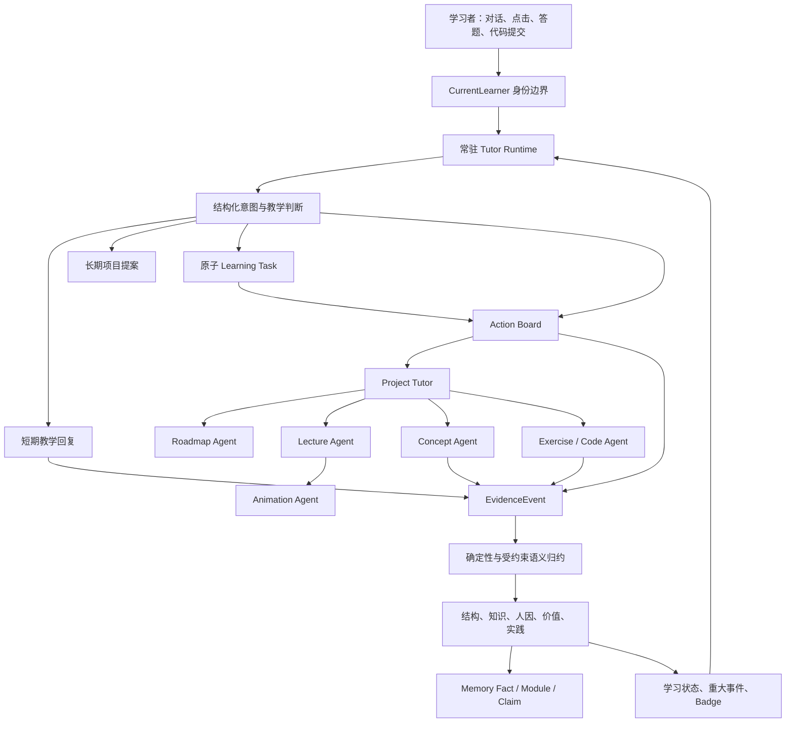
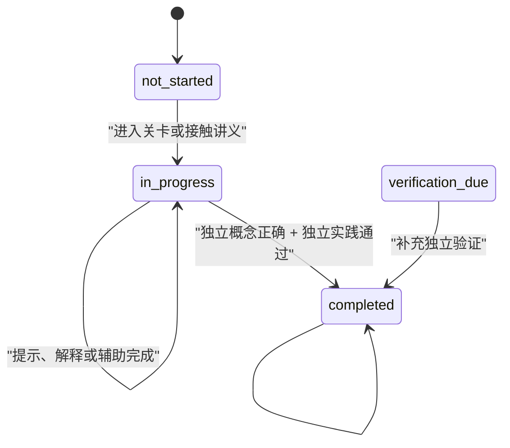

# LearnFlow 智能体架构与协作指南

Contract impact（`2026-09-07.4`）：学习方法主入口收敛为清晰讲解、费曼复述、讲义与练习共学；其余稳定 ID 保留旧运行兼容。Skill runtime v7 以真实文件/已读/Attempt 同步文件学习阶段，生成与验证解耦且保留任务原 scope。多节讲义、配对练习、失败缺口和重复/受助提交投影向后兼容；无新表、主 Agent 或五核 reducer 改动。当前合同优先见[学习方法与文件闭环 v2](implementation/LEARNING_METHODS_AND_FILES_V2.md)。

Contract impact（`2026-09-07.3`）：图解与动画产品迁入 `educational_visuals` 插件，Learning Design 内部的统一工作流负责检索、两种构建器、改编和有限修复；宿主新增受限 artifact grant 与私有作品/版本/运行/检查点服务，重要操作统一发出零 target `visual_workspace_changed`。预算失败暂停并保留候选，旧版本不覆盖。四个扩展点、三类主 Agent、五核与掌握语义不变。Web/Desktop 使用同一个工作流，旧视觉聊天仍可读。详见 [插件工作流](design/visualize/PLUGIN-WORKFLOW.md)。本条取代此前把所有新图解限定为主 Tutor VisualBrief 分支和无独立作品存储的产品描述。

> 2026-09-07 视觉规划入口与课程图库：registry 2026-09-07.2，隔离 Tutor 正文合同与视觉 JSON 规划合同，15 份维护作品关联正式学习路径并提供问题/别名/适用边界检索。Contract impact：只读元数据增量，稳定工具 ID、五核及事件语义不变，无数据库迁移。见 [实现与验证](design/visualize/CURRICULUM-LIBRARY-2026-09-07.md)。

> 2026-09-07 可组合视觉升级：VisualSpec 0.2.0 在兼容 0.1.0 的同时增加注册运算组合、结构分镜、维护作品检索与从零生成。图解请求先检索能力，Learning Design 一次产出教学计划与候选 Spec，宿主真实编译校验后渲染；原有讲解保持有效，正式 Desktop Tutor 仍先持久化简短交接。
> Contract impact：registry 2026-09-07.1，新增只读 visual_content_library / retrieve_learning_visual 与 catalog/template API；无主 Agent、五核、事件语义或数据库迁移。当前合同见 [可组合视觉升级](design/visualize/UPGRADE-2026-09-07.md)，以下旧版流程为历史记录。

> 2026-09-06 视觉重构：新生成以 VisualSpec 0.1.0、共享宿主模拟/独立验证、PresentationPlan/SVG 与状态快照回流为主。下文 ASCII 主路径记录保留为历史，旧产物兼容。三类 Agent 不变，独立讲解先提交；视觉探索不是掌握证据。
> Contract impact：registry 2026-09-06.8，新增零 target `visual_exploration_recorded`，复用 Practice 的 evaluate_visual_prediction 责任，经 record_event 幂等审计；无 schema 破坏或数据库迁移。实现范围与接口见 [视觉重构](design/visualize/README.md)。


Contract impact（2026-09-06.7）：共享 API / 平台发现 / 独立记忆 Worker 与桌面在线入口已按 `learnflow-platform/v1` 登记；旧事件与身份边界保持兼容。详见 implementation/LEARNING_PLATFORM_INTEGRATION.md。

Contract impact（2026-09-06 单仓共享核心 0.1.0）：五核、记忆、上下文、教学指导、观察与纠错实现迁入根仓 `packages/learning-core/src/learnflow_core/`，旧 `app.services.*` 保持模块身份兼容；三类 Agent/Kernel/schema 声明迁入 registry_core.py。两个宿主组合各自 registry，并公开 shared_core_version。无事件 schema、评分策略、数据库或身份迁移。共同事件契约由根跨端检查验证；不同宿主各自运行与测试。目录迁移详见根仓 docs/MONOREPO.md。


Contract impact（`2026-09-06.2`）：迁移五核记忆证据与即时教学升级，保留当前学习路径 v2、岗位插件与任务交接合同。新增 semantic_observation_proposed 与 vnext_teaching_input_received 注册事件；模型观察仅为短期候选，教学指导由确定性 reducer 生成有 scope 的控制投影。Module policy 升至 memory-module-version-v2，完善撤回、独立事件门槛、检索过滤与偏好更新。旧事件与数据库结构保留；新旧客户端增量兼容，前后端应共同发布。详见 [迁移记录](MEMORY_UPGRADE_MIGRATION.md)。

Contract impact（`2026-09-06.1`）：学习路径规范语义归 Learning Design Agent 所有；新增的 `learning_path_source_v2 / role_learning_alignment_v2 / graph_extension_proposal_v2` 是只读／提案校验的数据契约，字段权威为 `frontend/src/learning-path-contract-v2.ts`，不作为模型工具暴露。Role Atlas 维护岗位情境、任务与挂载依据；LearnFlow 维护规范课程和知识技能语义；Graph Hub 发现并分发固定版本。图谱特殊节点进入共享源图的运行时接收尚待实现，不能借个人节点网关代写，也不能把生成内容升级为学习证据。v1 读图、规划、个人覆盖层和三类主 Agent 保持兼容。详见 [v2 契约](product/LEARNING_PATH_CONTRACT_V2.md)。

Contract impact（`2026-09-02.7`）：从学习任务队列或确认卡进入正式任务时，前端不再只打开来源页面，而是启动/恢复该 `LearningTask`、恢复原 Conversation/Session scope、切换到 `guided_learning` 并创建浏览器 `LearningTaskBinding`。随后首个正式 SkillRun 请求携带 `learning_task_id`，运行时验证 learner/project/checkpoint/session 后把 SkillRun 绑定到同一任务；重复请求重放现有运行，不生成第二条原子任务。该变化只补齐 Tutor 主状态到正式 SkillRun 的既有包含关系，不新增状态机、Agent、事件或掌握写入。

Contract impact（`2026-09-02.6`）：点击或拖入的 Plugin Object 在发送时同时保留学习者可见引用文本与已校验结构化信封。学习型任务转化可据此精确锁定被引用的 `task` label/摘要，把 `plugin-object://` 仅保存为来源，不再让“引用插件对象”包装语或 URI 污染任务契约；宿主保持插件无关。候选确认会把原正式 Session、Chat、纸张及插件对象引用传入正式 `LearningTask.source_refs`，因此任务队列的“回到学习现场”重新打开同一对话和纸张；旧任务由客户端按 session 或项目内最近转化对话兼容恢复。插件请求指纹与后端幂等输入保持同构，隐藏控制回合不再影响上下文、对话标题、纸张预览、输入计数或中断恢复。现有项目范围、双确认、Practice 评分与五核证据边界不变。

Contract impact（`2026-09-02.5`）：LearnFlow、Role Atlas 是对等一级产品，Graph Hub 是共享发现层。Graph Hub/Role Atlas 通过短时、主体绑定的签名令牌把精确岗位包交给 LearnFlow；LearnFlow 在确定性 API 中创建普通对话并投影 `role_package_reference` ToolRun，使岗位插件从第一轮起锁定不可变版本。导航、验签和会话创建不交给模型，不新增主 Agent，也不写核心对象、EvidenceEvent 或五核。`search_graph_hub` 仍以正式 `learner_id` 派生主体并保持只读。

Contract impact（`2026-09-02.3`）：岗位包发现从“列出全部可见包”收紧为“按用户目标岗位确定性匹配”。Tutor 在未引用岗位包时必须把岗位名称传给 `list_role_packages`；工具只返回标题、岗位根节点或 alias 与查询整体包含匹配的不可变版本。无匹配时返回 `matchStatus=not_found` 和预填 `role` 参数的 Role Atlas `/projects/new` 入口，Skill 禁止继续调用岗位内容工具或借用无关包。链接基地址由 `LEARNFLOW_ROLE_AGENT_BASE_URL` 配置，本地默认 `http://localhost:3000`。LearnFlow 仍不执行冷启动、迭代或发布，不写核心对象、EvidenceEvent 或五核。

Contract impact（`2026-09-02.3`）：学习型任务转化在 Tutor 内先由能力专属语义模型按严格 JSON 合同判断输入层级，再由本地规则锁定原文语义锚点并要求显式确认；未确认或 hash 漂移时不得调用讯飞。讯飞结束节点的固定 HTTPS 交接 JSON 只会规范化为候选并经确定性校验；候选仅可在学习者再次明确确认 `candidateId + sourceSnapshot.rootHash` 后，由 Learning Design 与正式任务运行时幂等创建 `LearningTask`。确认只产生正式任务与零 target 操作事件，不证明掌握。Practice Agent 与确定性规则继续独占评分、Rubric 通过、证据升级及独立验证；三类主 Agent 和五核权威不变。

Contract impact（`2026-09-02.2`）：岗位包选择采用两步只读 ACI，而不是模型隐式状态。Tutor 先以 `list_role_packages` 取得当前可见候选、来源范围和完整不可变身份；学习者明确选择后，Tutor 才能以四元身份调用 `reference_role_package`。成功 ToolRun 返回 `role_package_reference` 与 `requiredSelector`，后续岗位工具必须逐字段复用。引用仍依赖可重放 ToolRun/Plugin Object，不建立插件数据库或第二套对话状态。开发环境对 role-agent 目录的自动发现只是 Hub 可见性模拟；生产环境不会启用该隐式源。

Contract impact（`2026-09-02.1`）：岗位图谱生态采用“role-agent 生产、Hub 治理、LearnFlow 消费”分层。冷启动和迭代不再进入 LearnFlow Tutor 工具面；旧候选 Tool/Skill/Object/Renderer 已移除。LearnFlow 只保留固定快照阅读，以及面向解释的节点风险研究：从精确 `objectId` 有界展开两跳邻域，逐字保留关系方向，汇总直接/邻域证据、证据限制、candidate 状态、低置信度和显式事理风险，并披露截断。该研究不调用外部来源、不生成 patch，也不能触发 Hub 提交、审核或发布。Hub 的公共发布使用独立 reviewer，私有包仅对 owner 可见；插件安装仍是维护期确定性命令且零 Kernel target。

Contract impact（`2026-09-01.5`）：学习型任务转化以 Tutor 可选的 `learning_task_conversion` Product Skill 接入，不成为第四个主 Agent。插件只声明现有 `objects / tools / skills / renderers`，模型调用的是 namespaced `learning_task_conversion__draft_learning_task`；宿主用当前登录会话和项目范围把请求转给后端，插件看不到 Cookie、后端地址或讯飞凭据。远程 workflow 只生成候选，LearnFlow 固定来源快照并重新校验；没有引用时明确 `ungrounded` 或 `source_supplied_unverified`。候选 handoff 只进入 Tutor 当前对话的审阅上下文，用户确认前不创建正式 `LearningTask`、不进入 Learning Design 正式规划、也不写五核或掌握证据。兼容和部署合同见 `docs/implementation/LEARNING_TASK_CONVERSION_XINGCHEN.md`。

Contract impact（`2026-09-01.4`）：Tutor 的模型终态新增 provider 完整性门。流适配器必须保留 `finish_reason/status/incomplete_details`；token 上限中断只能进入有界续接，续接轮不再开放工具，完整正文通过既有展示协议后才可提交。规划态的长段背景不直接进入 Agent 状态栏或五核：确定性提炼器只输出版本化 `planning-profile-self-report.v1`，新事件再由 reducer 分核投影；Knowledge 与 Practice 自报不表示掌握或独立能力，Human 投入只限当前规划语境，Value 方向保持 exploring，Structure 只保存简洁规划锚点。三类主 Agent、评分、路线确认和长期记忆门槛不变。

Contract impact（`2026-09-01.3`）：岗位插件在既有 Tool/Skill/Object/Tool Renderer 接口内增加两个候选工作流。`role_cold_start` 先确认岗位、用途、受众和实际来源，再由 artifact Tool 形成带任务屏障的候选构建合同；没有来源时停在 `waiting_sources`。`role_snapshot_iteration` 固定不可变基线，在目标邻域内形成 proposed patch、结构检查和回归验收合同。两者均由 Tutor 拥有对话控制权，不新增主 Agent；模型只能补候选内容，确定性 handler 固定 hash、范围、阶段和停止条件。当前版本不执行联网研究、外部 role-agent、快照写盘或发布，候选对象不进入学习证据或五核。

Contract impact（`2026-09-01.2`）：插件选择是对话级单调上下文。显式启用但尚未调用时仍可撤销；一旦插件 ToolRun 出现在主对话或任一对话纸张，宿主便从历史记录确定性恢复该插件，把其 Tool 与 Skill 持续放入后续 Tutor 回合，并在选择器中显示“已使用 · 锁定”。这保证对象引用、快照 grounding、失败诊断与代词式追问在刷新、正式会话恢复和纸张切换后仍可重放。状态不由模型统计，也不按插件 ID 硬编码；删除整个对话才结束该上下文。

Contract impact（`2026-09-01.1`）：插件结果继续只存在于 Tutor ToolRun，但 Renderer 可通过通用宿主回调把同一结果展开成只读对话纸张，或把已校验 Plugin Object 拖入当前草稿成为稳定引用。纸张不复制领域权威，引用不自动发送；两者均不产生学习证据。岗位插件在自身客户端包内组合全景、能力雷达和对象卡片切换，宿主只处理 ToolRun、Plugin Object 和纸张，不出现岗位 ID、类型或视图分支。三类主 Agent、四类插件扩展点、五核和 EvidenceEvent 链不变。

Contract impact（`2026-08-31.7`）：插件 ACI 从连续细粒度检索升级为“目标级工具优先、对象工具下钻”。岗位首次介绍优先一次读取定位、任务、能力、场景和相邻岗位，并返回 `snapshot_facts_only` grounding；Tutor 只能把列出的 statement 当作快照事实，其他常识必须标为非快照补充。最近插件 ToolRun 在 ContextEnvelope 中保留有界快照与对象引用，Renderer 可用通用 `onPrompt` 将精确引用写入下一轮草稿，因此插件对话可续接而无需宿主岗位分支。能力雷达是以岗位为中心、按岗位边界、任务、能力、能力单元与知识技能 `ring` 向外展开的语义图投影，不是数值评分图；关系图与事理森林各自保持独立语义。

Contract impact（`2026-08-31.6`）：`visual_teaching_composition` 的视觉执行改为“语义 Skill → 确定性状态重放 → ASCII Designer → Tool 验证”。Skill 必须先提供可独立成立的讲解，再只描述对象、关系、初始状态、逐帧状态变化与事实边界；Designer 接收 Tool 重放后的完整帧快照，拥有空间布局和帧间节奏自由，但只可提交 ASCII 画布及实体锚点。Tool 逐帧验证主体对象覆盖、引用、断言、尺寸和控制字符；遗漏的持久对象只可补入显式状态台账并标记 degraded，模型失败则显式降级为通用 ASCII 状态清单。视觉失败不撤销已提交讲解，不新增 Agent、EvidenceEvent、Kernel writer 或数据库迁移。

Contract impact（`2026-08-31.5`）：`learnflow.plugin-api.v1` 完成首个官方岗位图谱消费包。通用客户端贡献增加可选名称、描述和图标，宿主据此在对话选项栏动态显示已安装插件，并把当前对话选择作为 `activePluginIds` 传给 Tutor；宿主不登记岗位插件 ID、对象枚举或 Renderer 分支。岗位包在插件内部按目录发现，固定 `packageId + packageVersion + snapshotId + rootHash`，校验组件 hash 后只开放六个有界只读工具、一个操作 Skill、五类版本化 Plugin Object 与五个 ToolRun Renderer。解释仍由 Tutor 负责；冷启动、迭代、发布、数据库和学习状态写入均未接入。

Contract impact（`2026-08-31.4`）：新增极小的内置 Agent Package 扩展面，只开放 namespaced Tool、Agent Skill、版本化 JSON Plugin Object 与对话 ToolRun Renderer。插件 Skill 只提供路由条件和工具操作说明，不成为可选择教学法或第四类主 Agent；Tool 第一版只允许只读/产物结果；Object 不进入核心对象或学习证据；Renderer 只读取已校验结果，缺失时回退通用对象卡。宿主通过目录发现和注册表合并贡献，不按插件 ID、岗位、对象类型或图表类型写产品分支。无插件进程、工作台、数据库、Snapshot、Kernel writer 或 EventContract。

Contract impact（`2026-08-31.3`）：Learning Design 的 `visual_teaching_composition` 现在把“教学决定”和“确定性渲染”明确分层。Skill 在讲解已经独立提交后生成 `learnflow.visual-storyboard.v1`：稳定对象、关系、分组、初始状态、类型化操作、逐帧断言、学习目标和事实边界；Tool 只验证引用、重放状态、检查断言、布局并渲染，不从短提示猜主题，也不保存或复制讲解正文。视觉失败仍进入 `explanation_only`，已提交讲解保持有效。旧 VisualBrief/VisualSpec v3 保持兼容；无新增 Agent、EventContract、Kernel writer 或数据库迁移。

Contract impact（`2026-08-31.2`）：Tutor 的动态上下文继续由“有 scope 的五核只读投影 + 领域知识 Packet + 学习路径/正式文件/插件等其他增强”组成；领域增强不建立第二套用户画像。Learning Design 消费的 `domain-knowledge-packet-v2` 把事实 Claim、带归因真人观点、来源多维画像和覆盖依据分开。Harness 以类型化 Chunk 和 RRF 进行确定性召回；模型只可帮助理解查询或表达候选，不决定来源晋升、关键覆盖、项目基线或掌握状态。规划态推荐只把来源推进到 `recommended`，学习者显式确认后才能进入项目并由基线固定到不可变 SourceVersion。来源读取、推荐、晋升、固定和失效仍全部为零 Kernel target，不新增主 Agent、Kernel writer 或数据库表。

Contract impact（`2026-08-31.1`）：Learning Design 新增 `visual_teaching_composition` Playbook，统一承担讲解、VisualBrief 和视觉失败降级，图解/动画生成器继续只是渲染 Tool。视觉请求先提交不可由后续 `text_reset` 清除的教学段，再调用 Tool；渲染失败进入 `explanation_only`，已经提交的讲解和正式 Desktop Tutor 消息保持有效。底层 Tool 缺少已校验 Brief 时快速失败，动画/图解不得静默互换。新增 VisualBrief v1 和 `VisualTeachingBundle`，不新增主 Agent、数据库、EvidenceEvent 或 Kernel writer。

Contract impact（`2026-08-30.10`）：Tutor 与 Learning Design 的视觉交接改为“上下文锚定—请求主题契约—可重放产物—有界事实回灌”。“给我一个动画示例”等追问可从最近视觉 artifact 或用户主题恢复目标；没有目标则在规划前失败。长尾模型计划必须通过动态主题覆盖；声明式过程还要求 semantic/帧内容实际覆盖主题并具有最小状态变化，标题不能替代过程内容。这是一条动态请求契约，不是按算法硬编码。Tutor 最终文案只能解释工具 grounding 已列出的帧和变化，不得凭主题知识声称产物展示了不存在的动作。该调整不新增主 Agent、模型工具、状态权威或五核写入。

Contract impact（`2026-08-30.9`）：Tutor 与 Learning Design 的用户可见异步工作采用统一分层预算。浏览器等待时间长于 Agent 回合，Agent 回合长于单次 provider/工具请求；普通解释、规划、带领学习、图解和动画分别按工作复杂度递增。后端内容生成、来源获取和模型连通性检查同步扩容，但所有路径仍有确定性硬上限，且重试、工具面、五核写入与掌握判定不变。密码哈希、数据库锁、代码执行和进程退出等安全/资源保护超时保持原值。

Contract impact（`2026-08-30.6`）：Learning Design 的安全视觉 Harness 把 CNN 卷积过程纳入确定性 `convolution_trace`，并将长尾模型输出约束为 provider 原生 JSON object。只可本地修复尾逗号与相邻 JSON 容器之间的缺失逗号，所有标量、引用、语义、布局、安全与重放规则仍完整校验；失败后只有一次有预算的结构化修复。Tutor 以结构化主题锚点处理“演示一下”等省略表达，并对显式视觉意图执行单一视觉调用，失败后不切换形式或反复搜索视频。规划阶段和尝试诊断进入 Tool Run/轨迹，但不是学习证据，也不新增状态权威。

Contract impact（`2026-08-30.4`）：学习设计视觉能力新增共享的上下文补全、三态确定性编译和一次结构化修复。浏览器与 Desktop 不再拥有两套视觉执行路径：两端共同运行 VisualSpec parser/compiler/verifier/renderer，Desktop 后端桥接仅为长尾候选提供有界模型文本。教学示例必须在标题、说明和无障碍摘要中披露，不能冒充学习者输入；缺失了部分关键参数的请求仍返回可追问失败。该变化不新增主 Agent，不改变五核、掌握判定或证据链。

Contract impact（`2026-08-30.1`）：Tutor 的视觉工具面采用双重显式意图门。普通解释、文件共学和资源策展不暴露图解/动画工具；明确“画图/流程图/时序图”等只暴露图解，明确“动画/逐帧/演示变化”等只暴露动画，执行器再次校验。Learning Design 的 VisualSpec 必须具有可教学的语义对象、真实关系或状态变化，并通过确定性布局、安全和重放门；未知主题的单节点降级被取消。文件提案在真正物化前只能称为待确认提案。事件序号改由数据库行原子分配，五核仍只消费既有 EvidenceEvent/reducer 链。

Contract impact（`2026-08-29.1`）：引入统一领域知识供给平面。Tutor 仍只使用现有的知识库读取、Search 和 Page Reader ACI；`source_version_runtime`、`domain_knowledge_packet_compiler` 和 `source_integrity_monitor` 都是 Harness/Policy，不向模型新增工具。学习设计在正式步骤前必须得到可发布 Packet；讲义和练习共用同一 TeachingContentBrief。用户资料决定语境、范围和课程版本，但其中的指令始终是不可信数据，事实权威不会静默压过官方或学习者已确认的项目版本。所有来源健康事件零 Kernel target。

Contract impact（`2026-08-28.7`）：文件共学不再把“选学习文件”误执行成开放资源策展。初始聊天只给至多三句话的概念起点，Harness 根据正式 LearningTask 的文件引用确定性选择“复用现有文件”或“显示一次生成确认卡”；主体内容、例子和练习留在完整纸张中。只有学习者明确要求资料、视频或联网证据时，Search/Video ACI 才重新进入该 Skill 的工具面；`metadata_only` 视频不得被描述为适合或值得推荐。该调整复用现有工具和 Action Board 能力，不扩大模型工具面。

> 面向对象：维护、扩展或评审 LearnFlow 的编码智能体、研究智能体与产品智能体  
> 文档性质：架构约束与协作契约，不是面向用户的产品介绍  
> 当前状态：常驻 Tutor、统一 Learning Task、双队列、可验证微学习、五核运行时、项目提案、Action Board、多用户隔离和记忆图谱均已有实现
> 权威入口：职责变更必须同时更新 `backend/app/services/architecture_registry.py`、本文与对应测试；维护边界和变更流程见 `docs/ARCHITECTURE_AUTHORITY.md`

Contract impact（`2026-08-28.6`）：seeded competition demo 的唯一固定 Python 纠错题由内部版本化 AST 合同判题，不启动解释器，也不复用生产代码执行工具。只有演示模式、来源、grader ID、合同 SHA-256 与固定测试集全部匹配才会返回结果；其他题继续进入默认拒绝的通用代码执行策略。该结果只在正式提交后形成 Attempt/EvidenceEvent，并保留 `execution_performed=false`，不能被解释为任意代码已在沙箱中运行。

Contract impact（`2026-08-28.5`）：确定性 reducer 在实现旁显式导出 `REDUCER_EVENT_TYPES`，注册表据此逐项验证非空 target Event，而不是从声明清单或源码文本猜测 handler。`code_executor` 的稳定 ID 不变，但对外名称收紧为 `Policy-gated Local Code Executor`：默认及生产模式不可用，开发者只有显式选择 `trusted_local_process` 才能运行主机进程；该模式不声称隔离文件系统、网络或密钥。生成代码、运行成功和测试结果仍不自动成为学习掌握证据。

Contract impact（`2026-08-28.4`）：Tool、Product Skill、Workbench、Capability 与 Event 的“已登记”和“可用”被明确分开。每个发布项都有 `implemented / optional_unimplemented / deprecated` lifecycle；内部 `implemented` 项必须绑定真实 Python symbol、FastAPI route 或仓库内静态可核验的 frontend component/handler。前端校验不动态导入 TypeScript。`schema_valid` 只校验契约结构与交叉引用，`implementation_valid` 才解析 binding，`valid` 要求两者同时成立；旧 `errors` 保持兼容。没有运行入口的外部 workflow/星辰条目以及无 handler 的资源能力不会进入 available 能力。非空 target Event 必须声明 payload version 与 reducer binding；该版本会在运行时缺少独立 `REDUCER_EVENT_TYPES` 时诚实失败，`2026-08-28.5` 已补齐该实现契约。

Contract impact（`2026-08-28.3`）：Human 的会话内适配采用“显式文本规则 → 带 scope EvidenceEvent → 确定性 reducer → 8 小时临时状态 → 安全 ContextPacket 指令”。Tutor 可据此调整步幅、表征、信息量和支持方式，但不得看到 Human 原始敏感记忆，也不得把一次错误、不会作答或低分推断成情绪、人格、能力或固定学习风格。类型化信号发生在本轮观察装配之前，因此同一轮即可生效；事件幂等且只经正式五核链写入。

Contract impact（`2026-08-28.1`）：Learning Design 的教学交付投影拆为 Knowledge 输入契约、教学包成熟度和原子任务就绪度。Knowledge 只通过可选、answer-free、scoped `ContextPacket` 提供起点与缺口；缺失时通用包仍可生成。包成熟度只看既有教学资产，任务就绪度只组合 learner-owned LearningTask 与包阶段，并允许最小讲解、仅带领学习或仅练习等透明软降级。旧 `delivery_readiness` 顶层摘要保持兼容；没有新表、事件、Agent、Skill、五核写入或掌握语义变化。详见 `docs/implementation/TEACHING_DELIVERY_AND_VIDEO_HARNESS.md`。

Contract impact（`2026-08-27.8`）：Learning Design 在现有 Checkpoint 上执行轻量 Teaching Contract 门禁和可重建 `delivery_readiness`，不建立新表或第二套学习状态。教学生成失败时由确定性 fallback 保证仍有可继续学习的最小产物。视频推荐作为 `learning_resource_curation`、`learning_file_study` 与 `evidence_grounded_teaching` 可组合的两级 ACI：先搜索候选，再核验本轮候选字幕和时间点；底层 Bilibili/YouTube/字幕/ASR 适配器不直接暴露。任何候选、视频观看或字幕读取都不形成掌握证据。详见 `docs/implementation/TEACHING_DELIVERY_AND_VIDEO_HARNESS.md`。

Contract impact（`2026-08-27.6`）：新增文件驱动教学 Skill `learning_file_study` 与当前纸张精确读取 ACI `read_active_learning_file`。Tutor 仍拥有主对话和纸张协调，Learning Design 仍拥有讲义/练习候选，Practice Agent 仍拥有正式提交与判题；Skill 只编排选择、阅读锚点、文件内练习和独立验证。讲义、练习、来源和追问纸允许形成任意深度的有根纸张树，但纸张关系只是可恢复 UI 状态。来源指令不执行，练习答案不进入模型观察，打开和阅读不升级掌握。详见 `docs/implementation/GUIDED_LEARNING_FILE_PAPERS.md`。

Contract impact（`2026-08-27.4`）：教学方法继续采用 `SkillSpec v2` 单一权威。费曼 Skill 新增注册表声明的四轴校准和确定性表面诊断；Tutor 模型只渲染当前指令，不拥有状态、缺口事实或掌握判定。`learning_skill_calibration_updated` 与 `learning_skill_teach_back_diagnostic_updated` 均为零 Kernel target，只有正式独立验证可以沿 EvidenceEvent/reducer 写入五核。前端校准项继续由注册表生成，不建立第二套常量。

Contract impact（`2026-08-27.2`）：路径 ACI 的职责不变，但外部证据和路线顺序被收紧。Harness 固定执行 `exact -> conditional fuzzy -> clarify | external research -> evidence gate -> proposal`；`propose_personal_path_node` 的模型 schema 不再接受 URL，只有刚刚执行的搜索结果能通过受信元数据进入提案器。路线规划由确定性硬前置闭包和拓扑排序控制，`co_learning` 不制造先后关系。以上变化不新增 Agent、Kernel writer 或事件类型。

Contract impact（`2026-08-27.1`）：模型可见的学习路径 ACI 收敛为精确读取、条件模糊检索和有来源的个人节点提案。Harness 固定执行 `exact -> conditional fuzzy -> clarify | external research -> proposal`，并在执行前校验工具是否属于本轮 allow-list；旧聚合读取接口仅用于兼容。三个工具均不直接写五核，个人节点正式加入仍由学习者确认和既有 EvidenceEvent 链完成。

Contract impact（`2026-08-26.21`）：规划态资源推荐使用 `learning_resource_curation` Playbook。它先由 `domain_knowledge_reader` 读取当前对话主动附加的文件/URL 片段与 provenance，再读取学习路径定位目标和前置，只有覆盖不足时才联网搜索。领域库是隐藏基础设施，来源从 Chat 输入区附加，不另设产品工作台。Tool 只返回证据，Skill 负责比较覆盖、权威层级、实践价值和成本；推荐结果仍是候选，不自动加入项目。来源正文是不可信输入，其中的指令不得执行。讲义与练习工作台消费正式 `Lecture/ConceptQuestion/Exercise`，纸张只保存 artifact ref；文件生成、打开和纸张接入是零 Kernel target，讲义阅读是 exposure-only，练习提交仍走确定性评分链。详见 `docs/KNOWLEDGE_AND_LEARNING_FILES.md`。

Contract impact（`2026-08-26.27`）：动态习题由 `dynamic_practice_loop` Playbook 编排。Learning Design 生成候选；受限 ACI 只在正式带领学习任务与项目关卡 scope 中物化通过确定性质量门的未校准题集；Practice Agent 复用正式判题、纠错与复习。生成与查看不写五核，正式提交写 Knowledge / Practice；Structure / Human 只接收学习者显式卡点与确认有效的支持形式。详见 `docs/DYNAMIC_PRACTICE_ENGINE.md`。

## 1. 阅读方式

第一次接触项目时，建议按以下顺序建立上下文：

1. 先读本文，理解角色边界与系统不变量。
2. 再读 `docs/FIVE_KERNEL_TUTOR.md`，查看 Tutor、Action Board、证据和项目提案的运行图。
3. 再读 `docs/FIVE_KERNEL_MEMORY_GRAPH.md`，理解事件、事实、声明与记忆合成。
4. 修改具体功能前，进入本文末尾的“代码地图”找到对应服务，不要从页面表现反推全部业务逻辑。

本文使用以下规范词：

- **MUST**：系统不变量，修改时不可破坏。
- **SHOULD**：默认设计原则，偏离时需要有明确理由和测试。
- **MAY**：可以选择的实现策略。

## 2. 核心心智模型

LearnFlow 不是一个“聊天机器人包装器”，也不是多个人格化 Agent 同时与用户对话。它是一套围绕单个学习者持续运行的教学系统：

`frontend/` 的正式 Chat 服从同一责任边界：联网资料由学习设计能力通过 Search Harness 形成有界 Evidence Bundle。模型先以 `search_computer_knowledge` 取得候选、覆盖和 provider 状态；只有精确机制、版本、日期、数值、排错结论或研究判断需要原文时，才以 `read_web_evidence` 读取本轮候选中的精确 URL。query 改写、隐私清理、provider 路由、熔断、缓存、混合重排、MMR、覆盖审计、一次补搜和 deep research 预算都在 Harness 内部，不拆成更多模型工具。安全视觉产物由学习设计能力生成，选中追问上下文由 Tutor 组装。联网片段是不可信数据；搜索、读取、研究简报与讲解只产生来源，不能直接形成掌握证据。它们只产生来源、产物或会话分支，不直接写五核。

- 常驻 Tutor 维护教学关系、理解意图并协调下一步。
- Action Board 把自然语言转换为受控、可审计、可幂等执行的语义行动。
- 项目内领域 Agent 生产路线、讲义、题目、代码任务与可视化。
- Learning Runtime 根据证据更新学习状态，而不是让生成模型自行宣布掌握。
- Evidence Ledger 与 Memory Graph 保存可追溯、可纠正的长期学习历史。

最重要的架构原则是三个分离：

1. **教学关系与内容生产分离**：Tutor 负责“怎样陪这个人学”，领域 Agent 负责“怎样生成某类专业产物”。
2. **语言判断与真实执行分离**：LLM 可以提出意图和建议，Action Board 才能造成持久化副作用。
3. **教学内容与能力证据分离**：讲解、讲义、题目生成都不是掌握证明，只有用户行为与可验证产物可以改变状态。

## 3. 总体架构



从控制关系看，Tutor 是控制平面，领域 Agent 是能力平面，Evidence 与 Runtime 是事实平面。三个平面可以协作，但不能互相越权。

## 4. Agent 角色边界

### 4.1 Global Main Agent

Global Main Agent 是学习者在产品层面的总入口，职责是：

- 梳理学习方向、价值、优先级与长期目标。
- 接住“不知道学什么”“不知道是否适合”等迷茫。
- 对简单知识问题提供简述、类比或最小示例。
- 关注挫败、负荷、节奏和支持强度，但不做医学诊断。
- 识别持续目标，创建或修订无副作用项目提案。
- 在用户明确授权后创建项目、进入项目或执行其他高层行动。

Global Main Agent MUST NOT：

- 因为最近访问过某项目，就自称该项目负责人。
- 主动续接某个项目的路线、关卡、来源或课前后辅导。
- 在全局聊天中替代项目 Tutor 展开系统课程。
- 把结构核中的最近项目位置当作本轮默认主题。

全局上下文中的项目与关卡信息只用于理解学习者，不代表当前责任归属。

### 4.2 Project Tutor

Project Tutor 绑定一个明确的 `project_id`，是该学习项目的持续负责人，职责是：

- 承接项目目标、来源、正式路线与阶段推进。
- 组织候选来源推荐、选择完成后的路线确认对话。
- 基于来源、画像和已确认对话生成正式路线提案。
- 接收路线调整需求，并先提出修订方案，再以 Action 卡等待确认应用。
- 回答项目相关的小问题，进行课前引导和课后复盘。
- 将正式学习活动引导到对应关卡。

Project Tutor MUST NOT：

- 在聊天框里连续展开整份讲义或整套多步骤作业。
- 把“开始”解释为直接发送练习文本，而不进入正式关卡。
- 把项目提案的阶段预览原样写成正式路线。
- 未经确认直接重排、增删正式关卡。
- 使用其他项目的上下文替换当前绑定项目。

### 4.3 Checkpoint Learning Surface

关卡是正式教学与验证的主阵地，不是另一个争夺身份的聊天 Agent。它承载：

- 结构化讲义与来源引用。
- 选中内容解释与小范围追问。
- 概念验证、代码任务和实践产物。
- 尝试记录、辅助等级和结果评估。
- 通关条件与下一关解锁。

Tutor 负责把学习者带到正确关卡；关卡内的领域能力负责教学产物和验证。

### 4.4 Domain Agents

领域 Agent 是专业技能适配器，SHOULD 返回结构化产物与 provenance，而不是塑造独立人格。

| Agent | 主要输入 | 主要输出 | 不负责 |
|---|---|---|---|
| Roadmap Agent | 已处理来源、用户画像、五核投影、确认对话 | 正式路线 proposal、关卡 brief、依赖关系 | 直接完成关卡 |
| Lecture Agent | 关卡目标、来源片段、偏好提示 | 分节讲义、引用、自检点、视觉需求 | 证明掌握 |
| Concept Agent | 学习目标、证据声明、目标概念、来源 | 可评估概念题、答案规则、解释 | 用题型代替认知目标 |
| Exercise Agent | 关卡实践目标、技术环境、来源 | 代码任务、产物约束、可执行测试 | 根据“看起来不错”判定通过 |
| Code Agent | 完整代码、选中代码、任务上下文 | 解释、审阅、提示与反馈 | 无证据地提升 mastery |
| Animation Agent | 讲义段落、过程或结构描述 | animation、static 或 none | 为每段内容强行生成视觉 |

## 5. Tutor Turn 生命周期

每次 `POST /api/agent/sessions/{id}/turns` SHOULD 按以下顺序处理：

1. 使用服务端 `CurrentLearner` 校验 session、project、checkpoint 与 action 归属。
2. 使用 `client_turn_id` 检查是否为重复请求；若已有完整结果，直接重放。
3. 解析显式 `selected_skill_id` 或自然语言方法切换指令；只允许使用注册表中
   `learner_selectable` 的 Skill，并把选择保存在当前 Session。
4. 持久化用户消息，并追加 `user_message` 类型的 `EvidenceEvent`；方法发生变化时追加
   零 Kernel target 的 `learning_skill_selected`，不得据此巩固偏好或掌握。
5. 解析页面上下文，例如选中文本、候选来源选择完成或当前关卡。
6. 优先解析明确行动指令和已有 Pending Action。
7. 参数充分时直接进入 Action Board；不要先生成一句“可以帮你”。
8. 只缺一个必要参数时，保存 Pending Action 并询问一个最小问题。
9. 非直接行动回合才调用 Tutor LLM，并把当前 Session Skill 的受约束教学指令加入上下文。
10. 验证并应用本轮短期 observations，越权字段必须丢弃。
11. 根据长期目标创建或补丁式修订一个项目提案。
12. 处理满足严格条件的重大事件候选与 Badge。
13. 返回自然消息、当前 Skill、Session 标题、状态摘要、可选 action 和项目提案。

路线提案是一个专门的 Action Board 编排：Roadmap Agent 先给出可迭代的关卡方案，
Tutor 必须在同一回合创建 `apply_learning_path` 的 `pending_confirmation` Action 卡。用户点击
“确认并生成关卡图”后才写入关卡 DAG；不得要求用户再发送“确认路线”之类的自然语言，也不得
在未生成关卡图时声称路线已经生效。

模型调用失败时，消息和已记录证据仍然保留。语义更新可以跳过，但确定性行动、状态恢复和后续对话必须继续可用。

## 6. Tutor 结构化输出契约

Tutor 模型输出包括：

- `reply`：用户可见的自然教学回复。
- `observations`：本轮输入直接支持的五核短期观察。
- `learning_intent`：短期需要、长期目标、产物意图和相关 proposal key。
- `project_opportunity`：仅在值得持续跟踪时提供的项目候选结构。
- `major_event_candidates`：目前仅允许严格条件下的职业方向确立事件。

LLM MUST NOT：

- 直接写入任意数据库字段。
- 输出未在白名单中的五核键并期待系统接受。
- 将普通答错自动标为稳定误解。
- 将自述基础写成已验证掌握。
- 将用户说“懂了”解释为 mastery 提升。
- 自行声明异步任务或项目创建已经完成。

## 7. 双轨教学与项目提案

Tutor 每轮同时考虑：

- **短期教学轨道**：眼前疑问、最小解释、例子、提示或下一步。
- **长期项目轨道**：持续目标、明确产物、多步骤计划、系统学习诉求。

单次事实问答 SHOULD 只走短期轨道。明确产物、多步骤目标或连续主题讨论 MAY 触发项目机会分析。

`LearningProjectProposal` 具有稳定 `proposal_key`。同一目标的新证据应修订原提案，而不是生成重复卡片。修订必须使用字段补丁：

- 用户编辑过的字段自动锁定，模型不得覆盖。
- 用户锁定里程碑顺序后，模型可补充阶段，但不得擅自重排。
- 每次修订追加 `ProjectProposalRevision`，保留原因和证据引用。
- 提案创建和修订无项目副作用，也不构成掌握证据。
- 用户点击、拖放或明确语言接受后，才原子创建或进入项目。

项目提案中的 `milestones` 是阶段预览，只用于帮助用户理解候选方向。正式路线 MUST 主要依据：

1. 项目中真实接入并处理完成的来源。
2. 当前学习者画像和五核投影。
3. 项目对话中确认的基础、难点、投入与环境。
4. 已接受项目目标和实践产物。

## 8. Action Board 与工具调用

首先区分四个容易混淆的对象：

- **ACI Tool**：模型可选择的、输入输出有 schema 的外部观察或动作接口。
- **Harness**：装配上下文、执行循环、预算、重试、暂停和轨迹记录的服务端运行环境，不是模型工具。
- **Learning Skill**：绑定 Tutor 学习态、具有局部子状态和循环的教学方法。
- **Playbook**：跨多个 Tool/Agent/Workbench 的产品闭环，例如原子学习、纠错和间隔复习。

Reducer、Memory Graph、ContextPacket assembler 和策略机不能因为历史上登记在 `TOOLS` 集合就暴露
给模型。机器可读注册表的 `interface_role`、`model_exposure` 与 `skill_kind` 是该边界的权威分类。

vNext 每轮 MUST 经过 `vnext_agent_turn_runtime`。它先生成 typed `ContextEnvelope`，再按模式执行有界的
observe/decide/act 循环：自由态与简单讲解最多 5 轮模型、8 次工具、90 秒；学习规划态最多 7 轮模型、
12 次工具、150 秒；带领学习态最多 9 轮模型、14 次工具、180 秒。带领学习和学习规划可在主预算耗尽后
使用独立的无工具收束预算，但总预算仍由 Harness 明确限制并可观测。运行时最终返回可展示的
`AgentTurnTrace`。Tool result MUST 以正式 tool message 回灌，不能只拼在 system prompt；相同参数调用
MUST 去重，工具失败 MUST 分类并留给模型恢复。vNext native ACI 必须按模式与正式 scope 过滤；动态出题、
同构变式和质量检查只在带领学习态且有 `LearningTask + checkpoint` 时开放。它们只能物化经过确定性静态门的
未校准练习文件，不能写五核或宣布掌握；所有学习状态写入仍通过正式提交、Action Board、确认策略和
EvidenceEvent 网关。

浏览器提交后 MUST 先本地确认用户消息、清空输入框并建立 live turn，再异步完成正式 Session、SkillRun、
五核与工作区观察的同步；这些权威操作不得阻塞输入反馈。模型调用使用供应商原生流式协议，正文增量作为
可撤销草稿发送 `text_delta`。若当前模型轮转而选择工具、发生可重试错误、终态校验失败或最终正文与草稿
不一致，Harness MUST 先发送带原因的 `text_reset`，再进入下一轮或重放权威正文。只有通过终态 verifier
的完整回复可以持久化为 AgentMessage；草稿增量、工具前导语和被撤销文本都不是学习证据。
`AgentTurnTrace.timings` 以可选的 `firstTextDeltaMs` 和必填 `totalMs` 分别观测首字延迟与总耗时，不能把
“工具卡已经出现”误报为正文首字。`AgentTurnTrace.decisionSummaries` MAY 保存由 Harness 根据工具定义、
结构化调用参数和工具结果确定性生成的“调用理由—观察摘要—下一步”；它用于复盘工具之间的决策桥，
不是模型私有思维链，不得保存隐藏推理或把生成性自述冒充真实内部过程。带领学习态即使供应商持续返回
空正文或发生暂时故障，也 MUST 用当前 SkillRun 的确定性步骤指令形成可继续作答的最小教学回复，不能把
“预算内无正文”直接暴露为学习中断。如果模型已经流出可展示且仅缺少工具失败说明、检索覆盖声明或正式
来源链接，Harness MUST 确定性补齐这些可审计缺口并保留原教学正文；不得因收尾连接中断而用通用 fallback
覆盖已经形成的有效教学内容。涉及越权写入、无证据掌握、未知引用、记忆冲突或历史臆断等语义违规时仍
必须拒绝该草稿，不能用确定性补句掩盖安全问题。

显式图解或动画请求由 `visual_teaching_composition` 协调。Harness 先显示运行状态并检索已安装能力与维护作品摘要，Learning Design 一次给出教学计划、简短独立说明与 VisualSpec，或选择精确版本的维护作品。检索无匹配时继续从零组合；明确从零请求禁止引用维护作品。作品内容是只读参考数据，不能替代用户题意；适配后保留来源并重新编译。

宿主验证规格、数据引用、有限计算轨迹与当前验证范围，真实编译失败最多修复一次；unsupported 与 needs_clarification 不进入同样的重试循环。渲染器仅消费已绑定状态。结构分镜必须标注作者示意，不宣称算法或数值真值已验证。旧 VisualStoryboard/VisualBrief 继续兼容读取。

已有讲解和已提交教学段不能被视觉失败清除。成功为 `bundle_ready`，失败保留具体原因；两者都不产生掌握证据。Desktop 本地正式 Tutor 先持久化简短机制说明与视觉交接，再生成视觉；无需生成长篇文字分镜。选择对象、参数、步骤和内容哈希经过 inspect 核验后回流 Tutor，不从点击或播放推断掌握。

`dynamic_practice_loop` 是 Playbook，不是第四类 Agent，也不是单一 Tool。Tutor 决定是否进入“生成—作答—
纠错—变式—复习”闭环；Learning Design 只生成题目候选，`dynamic_practice` 服务检查题型、target skill、
答案确定性、重复指纹和答案安全，Practice Agent 复用正式确定性判题。题目质量检查与学习者作答评估必须分离。
生成、质量检查、打开和拖入纸张都是零 target 事件；正式作答固定形成 Knowledge / Practice 证据。Structure
只消费学习者明确填写的前置卡点，Human 只消费学习者明确确认有效的支持形式，严禁从分数推断偏好或负荷。

`vnext_learning_workspace_reader` MUST 从后端按 learner/session/project/checkpoint 重新装配工作区观察，
而不是信任浏览器提交的实践状态。投影包含正式任务队列、近期 `LearningAttempt`、开放
`RemediationCase`、`ReviewSchedule` 摘要和当前项目已处理来源的知识领域；不得包含提交正文、答案、
solution 或测试用例。有提示与独立成功、原题与变式、任务完成与掌握必须保持可区分。项目来源领域
只能约束当前项目的路线与讲解，不能写入 Knowledge 或替代 Practice 证据。

`read_active_learning_file` 只在当前页面确实打开一个受管文件纸张时进入本轮 Tool allow-list。其输入为空，
由 Harness 从 `ContextEnvelope.activeArtifact` 解析 learner-owned artifact；模型不能传任意文件 ID 绕过
scope。讲义返回当前版本正文与来源，练习只返回题面和学习者可见状态，来源返回有界 chunk、provenance
与 `untrusted_source_content` 边界。Harness 对同一回合的当前纸张最多自动读取一次；切换纸张后才允许读取
新的 artifact。普通自由讨论不应为了“可能有用”而同时读取五核、学习工作区、联网搜索和当前文件。

`learning_file_study` 的编排契约是：

```text
selecting_learning_artifact（引导态）
  -> reading_with_anchor（阅读态，可在当前文件内小循环）
  -> practicing_in_file（练习态，答案隔离）
  -> verification_ready（验证态，进入正式独立验证）
```

- 每轮主对话 SHOULD 只有一个自然问题或行动邀请，工具轨迹在回答旁轻量展示，文件正文留在纸张。
- 文件不存在时，先复用已有受管文件；生成新讲义/练习是有副作用行动，遵守 Action Board 确认策略。
- 纸张可以挂在主消息或任意现有纸张下；打开子纸继承祖先上下文，但只把有界摘要送入模型。
- 删除非主纸张时，子纸重挂到被删纸的父节点；非法父引用、重复 ID 和环在恢复时确定性修复。
- 阅读完成、生成完成或任务流程完成都不是掌握；只有正式 Attempt 能进入 Knowledge / Practice。

生产路径 MUST 只有这一个模型/工具循环；历史预调用工具函数不得参与 Tutor 回合。模型提出最终回答后，
确定性 verifier MUST 检查展示协议、未确认写入声明、无证据掌握声明、未解释的工具失败和搜索引用。
不合格回答只可在同一预算内要求模型纠正；预算耗尽且仍不合格时必须失败，不得向 UI 泄漏伪终态。

`vnext_chat_session_store` 是服务端 adapter，不是模型工具。它把 learner-owned `AgentSession` 和带
幂等键的 `AgentMessage` 作为 Safari、内置浏览器与桌面壳共享的普通对话目录；浏览器缓存只保留草稿、
标签和纸张布局。同步端点不得调用 Tutor、不得追加学习证据、不得修改五核；模式事件、学习任务事件和
评估证据必须继续通过各自登记的 runtime。客户端首次连接要迁移本地普通对话，并按正式 Session 合并，
不能用空浏览器缓存覆盖服务端历史。

Action Board 是所有聊天按钮和页面按钮共享的语义事务层。每个 action 定义至少包含：

- `capability`
- `side_effect`
- `confirmation_policy`
- `evidence_target`
- `next_affordances`

主要能力链为：

```text
搜索已有项目
  -> 起草项目
  -> 创建或进入项目
  -> 添加并处理来源
  -> 生成正式路线 proposal
  -> 确认并应用路线
  -> 进入检查点
  -> 生成讲义或评估任务
  -> 评估尝试
  -> 推进下一关
```

工具执行规则：

- 用户明确要求的行动本身就是授权，参数充分时 MUST 当轮执行。
- Tutor 主动发现的有副作用机会 MUST 先呈现行动卡或提案。
- 每轮最多选择一个主要语义动作；复合初始化使用高层事务 action。
- 所有成功消息必须来自真实持久化结果。
- 异步 action 只报告已启动、当前进度、失败或终态。
- 工具失败必须报告失败原因和可执行修复，不能伪装成功。
- 重复 URL、重复请求和重复确认必须保持幂等。
- 页面按钮和聊天指令 SHOULD 经过同一个 ActionService，避免两套行为语义。

已确认的正式路线成功写入后，`apply_learning_path` MUST 在同一事务中通过标准
`checkpoint_entered` 路径进入首个可用关卡，并将该关卡返回给前端导航。此处是
无副作用的上下文 handoff，不应额外要求学习者回复“开始”，也不得顺带自动生成讲义、
题目或掌握结论；进入关卡后仍由学习者选择何时生成和开始这些产物。

后台任务的完成、产物生成与失败也必须使用已登记的 EventContract：内容生成或来源
处理只记录产物/操作状态，失败只记录当前结构阻塞，均不能被解释为学习掌握证据。

### 8.1 全局复习工作台

`/review` 是 Tutor 导航和过滤、Practice Agent 判题与调度、Learning Design Agent 仅提供候选变式的协作面。它不新增第四类主 Agent。

```text
Tutor: plan_review_queue / 导航 / 过滤
  -> Practice: evaluate_review_attempt / manage_review_item
  -> Learning Design: 仅候选变式
  -> LearningAttempt + EvidenceEvent
  -> 五核与 ReviewSchedule 投影
```

`QuestionLearningState` 联合题目、历史 Attempt、`RemediationCase`、Knowledge/Practice 投影和 `ReviewSchedule`，统一表达作答、纠错、到期、证据与错题状态。队列按未完成纠错、逾期错题、辅助成功题、普通到期题排序；答对后不删除错题历史。

`review_scheduler` 只能写 `ReviewSchedule`，不能写 `KernelState`。复习提交必须携带 `client_submission_id` 和 `expected_version`；重复提交重放原结果，陈旧版本返回 409。跳过不创建 Attempt，延期/暂停/恢复只产生零 kernel target 事件。答案、测试期望和变式正确项只存在于后端判题契约中，取题响应不得暴露。

复习工作台的题面提交是一个统一 ACI：客户端只提交当前服务端题面版本和作答，不判断它属于普通复习还是纠错变式。服务端读取 learner-owned `ReviewSchedule + RemediationCase` 后，在 `evaluate_review_attempt / evaluate_transfer_variant` 之间确定性分派，沿用同一个幂等键，并把重放结果裁剪为 answer-free 响应。迁移变式仍必须经过已登记的 deterministic assessment，不能由 Tutor 或前端决定通过。

vNext `/review` 使用 `concept-proficiency-v1` 展示可重建的证据化熟练度与 D/S/R 冷启动状态，并同时展示误解、有效启发、独立/迁移优势和待解决问题。`review_context_reader` 可以把这些答案隔离后的观察带入 Tutor 的 ReAct 循环；`review_proficiency_projector` 仍是确定性服务端投影，不是模型工具。学习者显式反思通过 `review_reflection_gateway -> review_reflection_recorded -> five_kernel_reducer` 进入 Knowledge，固定为待验证、可纠正且不产生掌握推断。完整规则见 `docs/REVIEW_EVIDENCE_MODEL.md`。

复习和纠错事件同时携带 `memory_subject_key / concept_key / concept_name`，但这只是 Knowledge/Structure 共用的 ConceptAnchor 身份坐标。事件仍先经 reducer 生成 MemoryFact；个人概念图只从事实重建节点内部历程，不另写掌握结论，也不把反思或一次通过升级为长期 Claim。

复习台选择题目后，Workspace 只向 Tutor 回合发送 `review_schedule_id`。后端必须验证 learner ownership，并从题目、Attempt、纠错案例、Knowledge/Practice 投影和 `ReviewSchedule` 重新装配 answer-free 的 `active_surface_context`；不得信任浏览器提交的熟悉度、错因或证据状态。Tutor 只可解释、提示与说明调度，不能通过对话改变判题、间隔或掌握。

详细规则和接口见 `docs/REVIEW_WORKBENCH.md`。

### 8.2 Chat Mode、Learning Task、项目关卡与双队列

每段 Chat MUST 暴露并持久化四个粗粒度模式：`free`、`explain`、`learn`、`plan`。模式是
Tutor 的交互姿态，不是新的 Agent 或掌握状态。简单定义、区别和最小示例进入 `explain`，
不得自动建任务；明确的深度理解、选择运行型 Skill 或已有非终态任务进入 `learn`；跨多个
任务、来源、阶段或真实产物的目标进入 `plan` 并优先形成项目；其余保持 `free`。关卡 Session
初始就是 `learn`，项目 Session 仍可在四种模式间切换。

模式迁移 MUST 由确定性 runtime 裁决。简单讲解交付后标记完成，下一轮从 `free` 重新判断；
`learn` 中可把清晰讲解当作子 Skill，不得因为计划存在而拒绝必要解释。非自由段结束时 MUST
以 `learning_action_segment_completed` 记录消息边界、目标和领域引用，再经统一 reducer 投影；
该事件不得绕过正式判题升级掌握。

`LearningTask` 是学习领域中的可恢复执行单元，用来统一对话里形成的原子目标、Tutor
推荐且经用户接受的目标、项目 Checkpoint 和 `MicroLearningRun`。它不同于负责异步生成
状态的旧 `Task`，也不同于 Session：Session 保存对话连续性，Learning Task 保存跨对话
可安排、可暂停、可重规划的学习承诺。

```text
Dialogue / Checkpoint
  -> proposed or queued LearningTask
  -> versioned coarse plan
  -> skill / explanation / lecture / practice / visualization
  -> graded evidence handoff
  -> operational completion
  -> independent ReviewSchedule queue
```

Tutor MUST 负责识别、提议、接受、开始、暂停和导航；Learning Design MUST 只生成结构化
任务计划与内容候选；Practice MUST 继续负责提交、判题、反馈和纠错。推荐任务 MUST 在
`proposed` 等待明确同意。计划 SHOULD 保持 2–4 个 `learn / practice / verify /
consolidate` 粗阶段，并按互动情况使用已登记 Skill；不得把每种学习方法建成新 Agent 或
把一个知识主题拆成大量固定关卡。

Tutor 每回合 MUST 读取同一 Session 中非终态任务的 answer-free 只读投影，包括目标、状态、
当前阶段、方法和完成规则；已有 active 任务时继续该目标，不得让模型为同一目标重复建任务。
服务端 MUST 在 Tutor 模型调用前对边界清楚的显式原子学习措辞进行保守确定性识别并先建立
任务，使模型超时不能阻塞学习入口；模糊或过大的目标 MUST 留在对话中澄清，不能静默入队。
对话创建的任务 MUST 保留原 Session 作为
来源与返回锚点，专注附件使用的 checkpoint Session 不得覆盖它。

所有用户等待中的模型增强 MUST 使用可配置的 wall-clock budget。Tutor 的结构化调用和
纯文本兼容调用 MUST 共享一个 deadline，不能按重试次数重复消耗完整预算；Learning Task
计划与学习包生成超时后 MUST 返回经过同一 schema 校验的确定性结果。模型成功、超时或
供应商/校验失败只影响内容来源标记，不得影响 EvidenceEvent、阶段门槛和掌握状态。

项目中的每个 Checkpoint MUST 唯一对应一个 checkpoint Session 和一个 Learning Task。
Checkpoint 仍表达真实产物旅程中的知识主题、依赖与通关条件；Learning Task 只负责该关
如何执行。讲义、练习和题目仍由 `Lecture / Exercise / ConceptQuestion` 权威保存，任务
只保存受管引用。手工任务需要正式内容和验证时，可以物化为隐藏的
`task_artifact/internal` 微学习 scope，不污染真实项目组合。

`/tasks` 与 `/review` 是两个并列工作台：前者只负责排序、暂停、恢复、移除和返回来源，
不得成为任务教学、计划编辑或材料生成的第二主现场；后者由
`ReviewSchedule` 的确定性策略调度。任务完成只说明流程结束，所有 Learning Task 生命周期
事件 MUST 保持零 Kernel target；掌握、误解、独立实践和迁移仍只能来自判题证据链。
完整契约见 `docs/LEARNING_TASK_RUNTIME.md`。

正式 `frontend/` 已把任务生命周期接入 `AgentSession -> LearningSkillRun -> LearningTask`：对话识别或
Skill 启动时先建立 Session，再启动 SkillRun 并绑定其正式任务；后续学习者输入只调用确定性
Skill turn API，不能触发第二次 Tutor 模型回答。暂停、恢复、取消、重开和流程完成同步到全局任务队列。每个 Learning Skill 仍
自己定义步骤、循环和支架；`vnext_learning_skill_step_entered` 与
`vnext_learning_skill_looped` 只是零 target 的对话导航事件，MUST NOT 表示前一步达标或升级
掌握。旧 `vnext_learning_task_phase_entered` 只用于兼容 v0.5 浏览器存储。正式
`practice / verify / consolidate` 完成仍由证据投影裁决，不能沿用浏览器中的 Skill 导航。

浏览器持久化对象的准确名称是 `LearningTaskBinding`：正式运行时必须同时持有
`formalSessionId / formalSkillRunId / formalTaskId / expectedVersion`，本地事件只镜像正式 SkillRun
步骤；正式引用不存在时必须标为 `local_offline_fallback`。它不能成为第二个任务队列、Skill 状态机或掌握权威。
同理，浏览器原 `LearningPlan` 是 `PlanningDialogue`，只负责收集信息和展示候选；确认后的长期
路线是独立 `LearningPathPlan`。两者通过稳定 ID/事件关联，不共享生命周期结论。

vNext MUST 使用 `Tutor 主状态 -> 绑定 Skill -> 正式 SkillRun 当前子状态` 的单一包含关系。首批四个
Learning Skill 只允许绑定 `guided_learning`；用户预选 Skill 时只绑定下一轮，发送消息并建立任务后
才启动 Skill。每个步骤 MUST 声明可见子状态，`vnext_learning_skill_step_entered` 同时投影步骤与
子状态；循环 MUST 留在本步。UI 和 Tutor LLM 只能读取该投影，不得维护或转换另一套子状态机。
正式 turn API 必须幂等并校验 learner/session/run ownership 与 expected version；“不知道”和明确支援
请求只能增加支架轮次，不得推进知识步骤或产生 Knowledge/Practice 正向证据。

vNext 的 `learning_plan` MUST 只处理跨多个任务/阶段、复杂真实产物或长期发展方向，不得吞并
边界清楚的讲解和原子学习任务。`project_seed` 只能收集目标产物、基础、资源、时间、实践验收和
约束，并 MUST 明示项目创建尚未接入。`direction` 可以产生 Value Claim Proposal，但 MUST 同时
呈现旧内容、新建议、直接原话依据和作用域；学习者必须能接受、修改或拒绝。浏览器本地的决定
候选、拒绝和未确认事件 MUST 保持零 Kernel target。学习者明确接受时，前端 MUST 调用正式
`confirm_value_claim` capability；网关记录带 scope 的 EvidenceEvent 并由 reducer 形成 Value
投影。Tutor、UI 或本地 PlanningEvent 不能直接完成写入，失败时必须显示“未正式写入”。

vNext Tutor 每轮 SHOULD 调用正式 `five_kernel_retriever`；浏览器 Reader 只负责请求和展示
ContextPacket，不再维护模拟画像。Reader MUST 按当前问题、任务目标和 Skill 做确定性相关检索
与预算裁剪，MUST NOT 全量注入 KernelState。敏感 Human Claim MUST 通过
`adapt_silently / ask_before_surface` 过滤，且不得形成固定学习风格、情绪、人格或能力标签。
Knowledge 与 Structure 可以通过稳定 Module 关系联合读取，但二者不得共享写入权威；Practice
项目能力必须引用产物与 rubric 证据，不能从任务事件、生成材料或提交计数直接推断。

vNext `learning_plan` MUST 先调用 `vnext_learning_path_exact_reader`。精确工具只接受 ID、标题、别名
等值命中；未命中或自然语言存在错别字、近义表达时才调用 `vnext_learning_path_fuzzy_reader`。
模糊工具对词法、拼写和主题信号独立排序并确定性融合，输出候选、原因、置信度和下一动作。
`ambiguous` MUST 请求学习者消歧；`not_found` 才表示需要联网研究的图谱缺口。模型不得跳过精确
读取、不得把歧义候选当作已解析节点，也不得调用未向当前 mode/scope 暴露的旧接口。

外部搜索得到结构化结果后，Harness MAY 把这些结果作为只读元数据注入
`vnext_personal_path_node_proposer`；模型参数中的 URL MUST 被忽略或拒绝。提案器必须验证查询主题在
标题/摘要中的覆盖、来源等级和独立来源数量，并再次执行重复检查，固定
`confirmation_required=true`、`mastery_unchanged=true`，保持零 Kernel target。单个低权威仓库、
URL-only 结果或与主题无关的权威页面都不能成为个人节点证据。`vnext_personal_path_node_runtime`
只有在学习者点击确认后才可追加个人节点事件；正式网关
验证 learner scope、所有权和 DAG 约束后调用 `record_event()`。节点状态必须显示为自报，禁止
转译为 Knowledge mastery。详细算法与验收矩阵见 `docs/LEARNING_PATH_RETRIEVAL.md`。

`vnext_learning_path_planner` MUST 只消费唯一 resolved 目标。路线必须包含目标的直接硬前置，并在
预算内递归补齐硬前置闭包；直接软前置可以加入路线，但 `co_learning` 只能作为并行建议。最终节点
顺序 MUST 来自确定性拓扑排序，不能回退到手工 `order` 排序。层次视图若因硬前置闭包引入本层之外
的课程，UI MUST 显式标记“补充前置”。

vNext Tutor 还可以调用 `personal_concept_graph_reader`。该只读工具把同一 `concept_key` 下的
Knowledge 节点内部历程与 Structure 节点间关系装成有界上下文；共享的 `ConceptAnchor` 仅提供名称、
别名、来源和官方课程节点引用，不提供掌握结论。学习者在画像页显式提交自述时，
`concept_self_report_gateway` 必须先保留原文，再追加独立的 Knowledge observation 和 Structure
relation 事件。工具或模型不得把“学过”“熟悉”或课程图标记提升为 mastery，也不得从一条阻碍关系
反推前置概念不会；只有后续验证事件可以改变证据等级。官方课程图仍是一般培养路径，个人概念图是
学习者实际认识与联系。规划读取必须使用 `LearningGraphAlignmentProjection` 显式连接四类图：
课程路径图（官方课程与个人覆盖层）、个人概念图、项目来源知识领域和已确认长期路线。每条 Alignment MUST
记录双方图类型/对象 ID、关系、匹配方式、置信度与依据；无法匹配的对象 MUST 进入 gap 列表，供搜索
或学习者确认，而不是隐式丢弃。Alignment 固定 `carriesMastery=false`，不得携带或推断 mastery。
Project、Checkpoint 与 Session Tutor 读取该图时
必须沿用 ContextPolicy 的 scope 过滤：允许全局事实与当前 scope，禁止带入其他项目或关卡的题目原文。

Learning Task Runtime MUST 从现有内容对象和证据对象重建阶段，而不是另存一套掌握状态：
`learn` 需要 Skill 完成、材料查看或学习者明确确认互动结束，`practice` 需要真实 Attempt，
`verify` 需要无辅助成功的原始正式 Attempt 或已校验变式（诊断、提示成功、纠错原题重做和
复习重放均不够），`consolidate` 需要 ReviewSchedule。Lecture、Exercise、ConceptQuestion 的稳定引用
MUST 持久挂在任务上；生成材料本身 MUST NOT 完成 learn 或改变五核。`runtime.next_action`
是确定性导航建议，不是 Agent 决策或新证据。

`user_message.payload.learning_task_id` 只把对话行为关联到当前原子任务。Reducer MAY 根据
消息中明确表达的目标、缺口、负荷或偏好更新已有五核字段，但 MUST NOT 因“属于某个任务”
而自动升级任何 Kernel。任务生命周期、材料生成与流程完成事件 MUST 继续保持零 target。

### 8.3 对话 Session、学习 Skill 与可验证工作台

`/chat/:conversationId` 是 canonical frontend 中已绑定的 Tutor 独立对话主界面，并包含模式条、
当前任务计划、文件入口和选中文字追问等轻量工作台能力。`/agent/:sessionId` 对应的
`global_tutor` 稳定工作台 ID 已标记为 `deprecated`，不能作为当前可用 route。一个学习者可以拥有多段并列对话；
项目是可由对话创建、进入或挂载的长期上下文，工作台则是 Skill 在需要时生成的结构化
附件。前端不得以固定学习方法表单替代 Session，也不得让右侧上下文 Tutor 与独立对话
同时竞争主输入。

学习者可在输入区选择“清晰讲解、苏格拉底追问、费曼复述、示例渐隐”，也可用自然语言明确切换。
Tutor 可以推荐注册表中的 learner-selectable Skill，但不能静默切换。普通对话中的 Skill
只改变教学行为；讲解、追问或复述反馈都不是掌握证据。需要可评分证据时，必须进入已有
确定性评估或 `verified_micro_learning` 流程。

四种首批方法都由 `LearningSkillRun` 保存 Session 范围的目标、当前步骤、轮次预算、暂停
点、`LearningTask` 与验证引用。SkillRun 启动时 MUST 建立或复用同目标原子任务，并同步
暂停、恢复和教学阶段完成；这些同步不得写入五核。Tutor LLM MUST 服从确定性 runtime 给出的当前步
指令，MUST NOT 改变状态或自行宣布完成。自适应推荐 MUST 返回待确认卡；接受、拒绝、暂停、
恢复和独立验证均由显式用户动作触发。运行事件 MUST 保持零 Kernel target。

SkillRun 的内部步骤 MUST 根据学习者在主对话中的真实回答，由确定性 runtime 自动推进或保持；前端不得
要求学习者发送“进入下一步”一类伪用户消息，也不得用“下一步”按钮替代 Agent 对当前回答的处理。只有
切换教学方法、暂停或退出、不可逆写入以及进入独立验证等边界动作需要显式确认。步骤推进本身不构成掌握
证据，仍需后续确定性评估。

Skill runtime MUST 区分可检查尝试、明确不会、请求直接解释、跳过、仅确认和缺失输入。只有
可检查尝试可以消耗有效引导轮次并推进步骤；其他信号 MUST 保留当前位置并补支架，且不得被
描述为学生已经给出判断或完成复述。苏格拉底和费曼用于陌生主题时 MUST 先建立最小知识起点，
不能让学生从空白猜关键关系。SkillRun 已绑定的 LearningTask 在同一 Session 中 MUST 合并为
一条流程展示，不能同时给出“继续当前方法”和“另行生成学习包”两个竞争的下一步。

```text
Tutor Session -> confirmed SkillRun + LearningTask -> bounded dialogue
  -> verification_ready -> same-task verification handoff
  -> MicroLearningRun -> graded attempts / remediation / review
```

`/learn/:runId` 是未来由对话按需产生的学习文件附件契约，但 canonical frontend 当前没有
route/component binding，因此 `focused_learning` lifecycle 为 `optional_unimplemented`，不得对用户
宣称可直接打开。现有闭环由 `/chat/:conversationId`、`/tasks`、`/learning-files`、正式练习文件与
`/review` 承载。未来实现独立附件时仍由 Tutor 所有，不新增第四个主 Agent，并 MUST 使用
LearningTask 的 `origin_navigation` 返回原 Chat/关卡、以原 `session_id` 打开同一 Tutor 历史。

```text
start_micro_learning
  -> learning_card（接触证据）
  -> analyze_teach_back（诊断证据，mastery 不变）
  -> evaluate_visual_prediction
       -> wrong: remediation_loop
  -> ReviewSchedule
```

`MicroLearningRun` MUST 只作为可恢复流程投影。服务端 MUST 根据已有 `LearningAttempt` 和 `RemediationCase` 重建题目进度，MUST 过滤答案与私有变式契约，并使用 `expected_version` 和客户端幂等 ID。生成模型 MAY 生成学习卡和题目候选，但服务端 MUST 校验题型、答案索引与变式；费曼复述只做确定性覆盖诊断。完成一轮 MUST NOT 宣布稳定掌握，微学习题的同 session 多题正确也不得绕过跨时间复习门槛。

微学习产品契约见 `docs/MICRO_LEARNING_MVP.md`；对话状态机、SkillRun API、事件和冻结
样例比对见 `docs/CONVERSATION_SKILL_RUNTIME.md`；方法选型与研究依据见
`docs/ATOMIC_LEARNING_SKILLS.md`。

#### 8.3.1 对话和项目删除

独立 Chat 和学习项目 MUST 提供清晰可发现的删除入口，并在执行前显示统一确认弹窗。该动作
由 Tutor 所有的 `workspace_lifecycle` 处理，不允许页面各自实现不同的数据库级联逻辑。

删除是工作区生命周期操作：global Session 标记为 `deleted`，项目标记
`visibility=deleted`，相关的非终态 LearningTask、SkillRun、生成任务和待确认 Action 必须停止。
项目/关卡 Session 不能单独删除，只能随所属项目一起移除。项目关联的外部本地目录不在删除
范围内，避免 UI 动作造成未单独确认的文件系统破坏。

`conversation_deleted` 与 `project_deleted` MUST 是零 Kernel target 事件。工作区删除不得删除
历史 `EvidenceEvent`、`LearningAttempt`、`ReviewSchedule`、Memory Fact/Module/Claim，也不得据此
重算、降级或升级掌握。受保护 API MUST 对 deleted 对象返回 404，Explorer 和工作区标签必须
同步清除旧入口。

### 8.4 用户成长工作台

`/learner-profile` 是 canonical frontend 中已实现的 Tutor 只读画像入口。`/growth` 描述的是把个人
资料、五核当前状态、Memory Fact 依据、复习待办、重大事件和 Badge 组合为“我的成长”的候选形态，
但当前没有 route/component binding，`learner_growth` lifecycle 为 `optional_unimplemented`。候选页面
不得进入 available 工作台；即使未来实现，它也不是新的画像权威，不增加 Kernel、Agent 或写入路径。

面向学习者时，五核名称必须转换为“正在进行、理解情况、实践表现、学习节奏、目标与
兴趣”等行动语言；证据等级转换为“你告诉我的、学习中验证过、根据学习记录”等来源
说明。原始置信度、节点 ID、predicate、provenance 和 JSON 不得出现在默认体验中。
学习者可以归档或恢复系统当前参考的记忆，但归档不能删除原始 EvidenceEvent、历史
Attempt、重大事件或 Badge。`/profile` 与 `/memory` 只保留 `deprecated` 稳定声明；当前 frontend
没有 redirect binding，不得把兼容意图写成已实现跳转。

### 8.5 桌面文件工作台

桌面工作区复用 Tutor 控制平面，不增加主 Agent 类型。文件能力链固定为：

```text
link_project_workspace
  -> inspect_workspace_files
  -> propose_workspace_change
  -> apply_workspace_change
  -> open_managed_learning_artifact
  -> edit_managed_lecture / annotate_learning_artifact
  -> delegate_local_agent_task
  -> inspect_local_agent_run / cancel_local_agent_run
  -> apply_local_agent_result
```

Agent 文件提案 MUST 绑定 `learner_id + project_id + checkpoint_id + session_id`，携带基础文件 SHA-256，并先返回 diff。确认前不落盘；确认时若文件已变化，提案自动失效。`.learnflow` 内的受管学习对象只能通过版本化领域能力修改，普通文件工具不得绕过。

`.lflecture/.lfexercise` 只是数据库学习对象的逻辑文件入口：讲义按 `base_version` 保存并保留 `LectureVersion`，练习题面/答案/测试受保护，个人草稿与批注独立存储。普通文件支持 UTF-8 轻量编辑、Markdown 安全预览、图片/PDF 预览，但不提供解释器、终端或运行按钮。

文件关联与变更事件的 kernel target 为空。编辑成功、保存草稿和练习“运行”都不是掌握证据；只有播放器内的正式练习提交可进入评估链。本地代码 Agent 只能通过 Tutor 所有的 Broker 工具在隔离副本中工作，不新增第四类主 Agent。Tutor 只表达任务语义，Broker 按 Profile 能力/优先级确定性选择；首次确认启动，第二次确认并通过 hash 校验后写回，删除和移动逐项确认。安全细节以 `docs/DESKTOP_WORKSPACE_SECURITY.md` 为准。

### 8.6 vNext 项目 Tutor、关卡与项目自由对话

vNext 项目系统把项目作为真实产物导向的学徒旅程，而不是课程文件夹。其运行对象只有既有
`Project`、`Roadmap`、`Checkpoint`、`AgentSession`、`LearningTask`、`Source`、`Lecture` 和
`Exercise`；页面和 Agent 都不得维护第二套项目权威。

项目 Tutor 的标准 ReAct 观察顺序为：有 scope 的五核 ContextPacket、项目工作台摘要、项目来源
与受管文件的按需内容，必要时再读取学习路径。模型可见的项目工具分为三类：

- 感知：`project_workspace_reader`、`project_source_reader`、`project_learning_file_reader`，以及仅项目
  Tutor 可用的 `project_roadmap_reader`；
- 提案：`project_roadmap_proposer`、`project_learning_file_proposer`；
- 执行：路线应用、文件生成、来源增删和会话创建只通过 UI 确认后的 Action/API，不暴露给模型。

路线提案必须锁定当前项目主题、使用稳定 checkpoint key、只允许指向更早节点的 prerequisite，
并携带每关成功标准。确认事务物化 Roadmap/Checkpoint 后，为每关创建唯一 checkpoint Session 与
formal LearningTask。关卡对话固定为 `guided_learning`；项目 Tutor 固定为 `learning_plan`；显式
创建的项目自由对话保持 `free`。最近使用的自由对话不能夺取项目 Tutor 身份。

已有关卡图的修订必须先读当前 revision，再提交完整 DAG。服务端用乐观版本检查并锁定所有非
`not_started` 节点；未开始节点可重排、修改、新增或软归档。模型仍只拥有 proposal，学习者确认后
才写 `roadmap_revised -> structure`。空图是合法观察，不得因没有关卡而中断项目 Tutor。

项目侧栏和所有项目对话共享正式 `Source/Chunk` 权威；两处上传、URL 添加、处理和移除调用相同
API。显式选择“项目来源”时调用 `project_source_reader`，而不是个人对话资料库。

项目文件生成仍遵循“提案—确认—物化—打开”的边界。Agent 读取练习时只能看到答案安全投影；
生成内容、来源覆盖和文件打开均不构成学习证据。详细对象、接口、失败语义和测试矩阵见
`docs/VNEXT_PROJECT_SYSTEM.md`。

## 9. 五核学习者模型

五核是学习者状态的五个互补维度，不是五个聊天 Agent，也不是五份可以互相覆盖的长期画像。它们分别服务于五个不同的教学决策：走哪儿、学什么、怎么教、为什么现在学、如何验证能否做出来。

### 9.1 统一结构定义

| Kernel | 核心问题 | 状态对象 | 典型短期内容 | 典型长期内容 | 不能直接推断 |
|---|---|---|---|---|---|
| `structure` | 现在位于哪里，下一步如何走，离开后怎样回来？ | 学习路径、项目、检查点与依赖 | 当前关卡、依赖、转向、阻塞、返回锚点 | 稳定路径模式与项目图谱 | 掌握、动机、情绪、实践能力 |
| `knowledge` | 对哪个概念理解到什么程度，证据是什么？ | 概念、问题、错误推理与理解状态 | 知识缺口、待解问题、近期错误、明确误解 | 有评分证据支持的掌握或可纠正误解 | 只凭看过、讲解、自述或一次答错宣布长期结论 |
| `human` | 当前怎样教、怎样交互更合适？ | 当下负荷、注意、情绪反应与交互偏好 | 情绪、负荷、注意、挫败、节奏、讲法偏好 | 用户确认或跨 session 一致的稳定偏好 | 人格、医学状态、固定学习风格 |
| `value` | 为什么学，当前什么目标和投入更值得优先？ | 目标、优先级、动机、兴趣与相关性 | 当前优先级、动机、兴趣信号、目标候选 | 明确确认的长期目标、职业方向与价值排序 | 模型猜测的目标，或任何能力/掌握结论 |
| `practice` | 能否在给定约束下独立做出来，并迁移到新情境？ | 尝试、辅助、产物、反馈与迁移表现 | 当前尝试、辅助等级、产物状态、近期反馈 | 独立实践能力与迁移证据 | 有提示成功、原题重做或生成内容等同独立迁移 |

把五核看成“决策分工”而不是“信息分类”更准确：`structure` 决定导航，`knowledge` 决定内容与验证对象，`human` 决定交互适配，`value` 决定优先级，`practice` 决定能力验证。一个事件可以同时触及多个核，但每个 `kernel_target` 都必须有独立证据理由，不能因为某个核发生变化就自动复制到其他核。

五核共用 Fact/Module/Claim 的审计骨架，不共用内容模板。注册表的 KernelContract 还必须声明
每个核的 Fact、Module、Claim 对象角色和 Claim 模式：Structure 是稀疏导航锚点，Knowledge 是
证据声明，Human 是凝练交互指令，Value 是经同意的目标声明，Practice 是带产物和迁移证据的表现
声明。Memory worker MUST 使用这些策略生成和校验候选，不能把一个通用摘要模板套到五个核。

### 9.2 结构与知识的边界

结构记忆回答“位于哪里以及怎样回来”，知识记忆回答“具体理解了什么”。

例如，学习者在因果自注意力关卡中因为不熟悉张量 shape 而暂时转去补基础：

- structure：暂停于因果自注意力，先修转到张量形状，完成后回到 Q/K/V shape 验证。
- knowledge：矩阵乘法 shape 是待补缺口；只有用户明确说出错误规则或评估发现稳定错误时才记录 misconception。

两个核通过 checkpoint ID、concept key 和 evidence ID 关联，不应复制同一结论。

### 9.3 跨核边界、时间与置信度

- 情绪、负荷和注意力是易变状态，默认具有短期有效期。
- 稳定偏好需要用户明确确认，或多个不同 session 的一致证据。
- 用户自述是有效背景，但不是知识或实践能力证明。
- 语义 observations 默认只进入短期状态；长期状态需要更严格归约。
- 答错时，`practice` 可以记录失败尝试和辅助等级；只有错误答案或理由足以定位概念问题时，`knowledge` 才记录对应缺口。
- 只有路径实际被影响时，`structure` 才记录阻塞或返回锚点；普通答错不会自动改变学习位置。
- 没有学习者明确表达或可重复证据时，不得从答题结果顺带推断 `human` 或 `value`。

## 10. Evidence、Attempt 与通关

`EvidenceEvent` 是只追加的学习事实账本。任何状态判断 SHOULD 能追溯到事件、尝试或产物。

以下行为不是掌握证据：

- 生成或阅读讲义。
- 生成题目。
- Tutor 给出解释。
- 用户说“懂了”“明白了”。
- 在大量提示下完成任务。

以下行为可以形成能力证据：

- 用户独立提交概念答案并被确定性或受约束评估判定正确。
- 用户独立提交代码或实践产物并通过测试。
- 用户在新情境中完成高置信度迁移任务。
- 用户明确表达可定位错误的具体理解，经诊断形成 misconception 证据。

每次概念或实践提交都应创建 `LearningAttempt`，记录：

- item 与 checkpoint
- submission 与 result
- assistance level
- 开始、提交与评估时间
- provenance 与关联事件

关卡状态遵循：



一次高置信度独立迁移成功可以替代组合条件。历史聚合完成记录只进入 `verification_due`，不能自动成为新系统中的已验证完成。

## 11. 记忆图谱

学习状态不是无限增长的聊天摘要。记忆采用可检查的分层结构：

```text
EvidenceEvent
  -> KernelMutation
  -> MemoryFact
  -> MemoryModule
  -> MemoryClaim
  -> MemoryEdge
```

运行时读取不再把完整 `KernelState.short_term/long_term` 和全部图谱塞入 prompt。每个核
维护一个有界 `KernelHead`：`summary`、最多 3 个 focus、5 个 alert、8 个 working、
5 个 stable 引用和少量 facets。引用只指向 Memory Graph 节点，移出热头部不会删除
`MemoryFact`、`MemoryModule` 或 `MemoryClaim`。

每个 capability 先选择 `ContextPolicy`，再经过 `FiveKernelRetriever` 按顺序执行：

1. learner ownership 与 project/checkpoint/session 精确过滤；
2. subject key 精确召回，再用本地词项匹配和 salience 排序；
3. 只展开白名单内的一跳稀疏关系；
4. 按 item、path、个人概念图与统一 token 预算生成 answer-free `ContextPacket`。接入个人概念图后，各策略预算增加 700 个估算 token，保留原有五核召回能力；超限时按确定性顺序裁剪，而不是在 API 层无预算追加。

`ContextPacket` 包含五核热头部、召回项、关系路径、冲突、缺失 facet、省略统计和
evidence manifest。它是一次 Agent 回合的只读快照，不是第六个核，也不参与掌握归约。
完整字段与能力策略见 `docs/FIVE_KERNEL_MEMORY_FABRIC_V2.md`。

- `EvidenceEvent`：不可变动作账本，保留发生时间、记录时间和学习者内序号。
- `KernelMutation`：某个事件对某一核造成的补丁及前后版本。
- `MemoryFact`：由 mutation 展开的原子事实，可幂等重放。
- `MemoryModule`：同一学习者、同一核、同一主题事实的不可变版本快照；新事实与当前版本证据闭包形成下一版本。
- `MemoryClaim`：模块中可独立检查的声明，必须有事实支持。
- `MemoryEdge`：稀疏、高价值关系，例如支持、关联和合并。

事件写入请求本身不调用 LLM。确定性 reducer 先生成事实；默认开启的异步 worker 再按
每核门槛形成 Module/Claim，并且只能引用预先声明的候选 fact ID。worker 每次启动都会
从 eligible Facts 幂等重建遗漏队列；模型服务不可用时使用确定性合成，不阻断图谱闭合。

用户对错误记忆进行归档、纠正或撤回时，系统追加纠正证据，不删除历史。归档内容必须从 Tutor 当前投影中排除。

### 11.1 Module 版本化与当前版本

同一 `(learner, kernel, subject)` 的 Module 形成单向版本链。V1 记录首次巩固；后续
版本显式保存父 Module、继承证据、增量事实、修订类型和策略版本。普通增量生成
`REFINES`，学习者纠正生成 `SUPERSEDES`。父 Module 与父 Claim 保留为历史节点，只有
最新有效版本保持 `active`，因此 Agent 使用的是当前解释，同时审计页面可以还原完整
演变过程。

版本合成以当前 Module 的 `evidence_fact_ids` 和新一批 `delta_fact_ids` 为白名单，最多
保留 64 条证据。worker 只锁定尚未消费的 delta；继承事实可以继续通过图边支持新
Claim，其首次消费归属保持不变。每次运行在 `MemorySynthesisRun` 中保存 base module、
目标版本和完整证据指纹，用于并发重基、幂等与失败恢复。

Reducer 仍负责单事件的确定性归约。某条事件当时未形成某核 Fact 时，原始
`EvidenceEvent` 继续保留；后续跨事件模式能力若要补充该核证据，必须先生成引用原始
事件的派生 EvidenceEvent，再进入统一写入链。

## 12. 上下文装配与 Handoff

Tutor 的稳定表达前缀统一消费注册表 `teaching_response_v1`，权威内容为
`backend/app/contracts/teaching-response.v1.json`；浏览器构建使用确定性导出，正式后端读取同源内容。
它只约束既有 `reply` 的教学表达：直接回答、按需解释机制、贯穿例子和必要的公式/代码/视觉观察提示。
普通解释不默认追加自检题；正式 SkillRun 的当前动作和答案隔离规则优先。局部追问只补局部，
不以表达规范替代教学策略、阶段推进或掌握判定。代码与公式使用已有 Markdown renderer，
视觉仍需显式请求和已校验产物；不得虚构交互组件或引用。动态学习者上下文不写入这份稳定前缀。
详见 [教学表达实现](implementation/TEACHING_RESPONSE_PRESENTATION.md)。

Tutor 的上下文不是简单拼接全部历史，而是分层装配：

- 当前 session 最近消息。
- 当前学习者五核 `KernelHead` 与按能力召回的 `ContextPacket`。
- 当前状态摘要。
- 当前学习者可见的项目与活跃提案。
- project session 中的当前项目、来源、正式路线和已接受目标。
- 从 global 进入 project 时的 handoff 引用。

Global session 中的 active project 必须降级为 `recent_project_reference` 语义，避免污染主 Agent 身份。

Project/Checkpoint/Review 上下文会在热头部和深层记忆两个位置同时执行 scope 过滤；
`human` 的瞬时情绪与负荷还必须匹配当前 session。上下文序列化按字段逐级降级并保持
合法 JSON，不再对整包五核 JSON 做字符串截断。

Handoff 只保存原始消息 ID、EvidenceEvent ID 和目标摘要，不复制或改写证据。这样可以保持连续性，同时避免出现两份不同版本的学习历史。

## 13. 来源与正式路线

来源用于约束课程事实与实现路径。候选来源搜索和正式来源接入是两件不同的事：

- 候选来源搜索是只读操作，只能展示真实搜索结果中的 URL。
- 模型可以排序和解释，但不得编造仓库链接。
- 用户点击添加后，才执行来源入库和处理任务。
- 来源处理失败只影响该来源，不应破坏项目提案和 Tutor 对话。
- 正式路线优先使用已处理来源的结构、摘要和相关片段。

在装配路线上下文时，系统还会从仓库 README 目录、章节目录和文件摘要派生“来源知识领域”。
它只约束路线可覆盖的内容，和五核投影并列提供给 Roadmap Agent；它不是学习者画像、掌握状态
或 EvidenceEvent，不能由此推断学习者会什么、跳过验证或写入任何 kernel。

对于仓库型来源，Roadmap Agent SHOULD 使用分层理解：

- L0：目录、文件类型和项目结构。
- L1：文件摘要、标题与主题标签。
- L2：按路径或主题读取相关 chunk。
- L3：必要时进行语义检索与补充读取。

不要把整个仓库一次性塞入 prompt，也不要只根据仓库名和星数规划课程。

## 14. 多用户隔离

每个账号唯一绑定一个 Learner。以下数据 MUST 以当前 Learner 为强制边界：

- 画像、五核与记忆图谱。
- 项目、来源、路线、关卡和产物。
- Agent session、message、action 与 proposal。
- EvidenceEvent、LearningAttempt、Task 与 Badge。
- SSE、文件读取、任务查询、取消和恢复。

API 不接受客户端提交的 learner 身份作为可信依据。所有资源 resolver 必须使用服务端 `CurrentLearner` 做 owner scope；访问其他用户资源统一返回 `404`，不暴露资源是否存在。

后台任务必须携带 `learner_id`，任务执行与结果写回时再次校验归属。智能体在添加新模型或接口时，MUST 同时补齐 learner ownership 和越权测试。

## 15. 重大事件与 Badge

重大事件用于记录学习生命历程，不用于制造即时奖励。

当前主要事件包括：

- 首次满足严格完成条件的学习项目。
- 用户以第一人称明确确定职业方向，且语义置信度达到阈值。

Badge 使用 learner 范围内的幂等 `award_key`。记忆后续被纠正时，Badge 作为阶段历史永久保留，但关联事件可以标记为已纠正。

探索性表达、假设、替他人描述或一般兴趣不能自动升级为职业方向确立事件。

## 16. 前端空间与责任

| 已实现页面 | 主要责任 |
|---|---|
| `/chat/:conversationId` | Tutor 独立对话、轻量工作台、会话级 Skill、原子任务与文件入口 |
| `/tasks` | Learning Task 纯管理队列；支持排序、暂停、恢复、移除和返回原 Chat/关卡 |
| `/review` | 独立复习队列、确定性调度、判题与纠错闭环 |
| `/projects` | 项目组合、待创建提案和项目管理 |
| `/projects/:id` | 当前项目目标、来源、正式路线和 Project Tutor |
| `/learning-path` | 官方与个人学习路径图、节点检索和确认管理 |
| `/learner-profile` | 五核只读画像、可追溯依据与明确资料管理 |
| `/learning-files` | 正式讲义与练习文件目录 |
| `/files/lecture/:lectureId` | 讲义文件阅读与批注 |
| `/files/practice/:practiceRef` | 答案隔离的练习文件与正式提交 |

`/agent/:sessionId`、旧关卡 lecture/assessment、独立 RemediationPanel、`/profile` 与 `/memory`
均为 `deprecated` 稳定声明；`/learn/:runId` 与 `/growth` 为 `optional_unimplemented`。它们没有
canonical frontend binding，不得出现在 available 工作台或被文档描述为当前可用页面。

页面只显示用户能理解和行动的信息。内部 Kernel 名称、工具 handler、路由权重和原始 JSON 不应直接暴露在主要学习体验中。

## 17. 失败与降级语义

系统应优先保证事实正确，而不是保持“什么都成功”的表象：

- Tutor LLM 失败：优先保留已通过语义边界且可确定性补齐来源/失败说明的教学正文；否则保留消息与事件，跳过语义观察，允许确定性 action 继续。
- 结构化输出不可解析：使用受限 fallback，不应用越权状态。
- 交互模型超时：Tutor 在共享总预算后停止重试；任务计划和学习包使用确定性同契约降级。
- 来源搜索失败：保留项目提案，来源区域显示失败并允许重试。
- 后台任务失败：Action 返回真实错误与修复建议，不写完成事件。
- 记忆合成失败：原子事实与 KernelState 仍然可用，运行可重新排队。
- 路线生成失败：不覆盖现有正式路线。
- 幂等重放：返回已有真实结果，不重复制造副作用。

## 18. 设计灵感

LearnFlow 的架构可以理解为以下思想的组合，但实现必须以本项目代码和测试为准：

- **导师制与认知学徒制**：稳定 Tutor 通过解释、示范、脚手架、实践和反馈逐步降低辅助。
- **掌握学习**：接触内容不是完成，必须达到可验证标准才能推进。
- **证据中心设计**：先定义要证明的能力，再设计任务与证据，题型只是交互载体。
- **任务与关卡游戏结构**：项目是长期任务，路线是 DAG，关卡具有依赖、阻塞、验证和解锁。
- **Event Sourcing / CQRS**：原始事件只追加，KernelState 是可重建投影，Mutation 提供审计历史。
- **控制平面与能力平面**：Tutor 解释和协调，Action Board 治理副作用，领域 Agent 生产专业产物。
- **Human-in-the-loop**：提案可编辑、字段可锁定、正式路线需确认、来源需主动接入。
- **分层 RAG**：先理解来源结构，再按需要读取细节，控制上下文规模与事实质量。
- **记忆巩固**：离散事件逐步形成原子事实、主题模块和可检查声明，而不是累积一段不可审计摘要。

项目最初更接近“来源 -> 路线 -> 讲义 -> 练习”的生成流水线；当前目标已经演进为“常驻教学关系 + 可执行工作流 + 证据驱动学习者模型”。新增功能应服务于后一种架构。

## 19. 示例：从“我想实现 GPT”到正式学习

### 回合 1

用户：“我想自己动手实现一个 GPT。”

系统应：

- Main Agent 简短回应目标和可行的最小实现方向。
- `learning_intent.long_term_goal` 识别为持续目标。
- `artifact_intent` 识别为可运行的 MiniGPT 产物。
- 创建 `build` 类型项目提案，不直接创建项目。

### 回合 2

用户：“用 PyTorch。”

系统应修订同一个 proposal，锁定或补充技术栈，不创建第二张提案。

### 回合 3

用户：“没用过 PyTorch，只学过 CS61A。”

系统应：

- 回答当前起点是否足够。
- 在知识核记录未验证起点与 PyTorch 缺口，不记录已掌握。
- 在提案中补充张量、自动求导和训练循环热身阶段。

### 用户接受提案

Action Board 原子创建项目、绑定接受快照与证据引用，并进入 Project Tutor。

### 来源阶段

Project Tutor 推荐真实候选仓库。用户选择来源后，来源入库并异步处理。选择完成时，Tutor 概述路线安排逻辑并集中询问仍需确认的少量问题。

### 正式路线

Roadmap Agent 使用真实来源、画像、五核投影和确认对话生成正式路线 proposal。用户确认后才持久化关卡 DAG。

### 正式学习

Tutor 将用户带入第一关。Lecture Agent 生成来源约束讲义；Concept Agent 和 Exercise Agent 创建验证任务；Learning Runtime 根据独立尝试决定是否完成关卡。

## 20. 常见反模式

后续智能体修改代码时，应主动检查以下问题：

1. **主 Agent 被项目污染**：全局 Tutor 开始自称最近项目负责人。
2. **聊天替代关卡**：Project Tutor 在消息中发送整套讲义或练习，路线图却没有正式关卡。
3. **模型直接写状态**：LLM 输出 mastery 后未经证据归约直接保存。
4. **把答错当误解**：一次错误被永久写成 misconception。
5. **把曝光当掌握**：生成或阅读讲义后关卡自动完成。
6. **工具只说不做**：用户明确要求创建、添加或生成，Tutor 只回复“可以”。
7. **假完成**：异步任务刚启动就报告已完成。
8. **提案等于路线**：阶段预览未经来源和确认直接物化为正式关卡。
9. **题型等于目标**：先决定 WWPD、选择题或判断题，再倒推要评估什么。
10. **来源由模型编造**：展示没有真实检索结果支持的仓库 URL。
11. **五核重复存储**：同一段判断同时复制到结构和知识。
12. **跨用户读取**：根据客户端 ID 直接查询资源，没有 learner owner scope。
13. **旁路 Action Board**：聊天按钮和页面按钮调用两套不一致的业务逻辑。
14. **不可追溯记忆**：长期画像声明找不到原始事件或事实支持。

## 21. 扩展新能力的检查清单

新增 Agent、工具、事件或页面流程时，至少回答以下问题：

- 发布 lifecycle 是 `implemented`、`optional_unimplemented` 还是 `deprecated`？如果是
  `implemented`，对应的 Python symbol、FastAPI route 或静态 frontend component/handler binding 在哪里？
- `schema_valid` 与 `implementation_valid` 是否分别通过？不能用清单内 owner、路径字符串或源码文本命中替代实现校验。
- 它属于全局 Tutor、项目 Tutor、关卡还是领域 Agent？
- 它是教学回复、无副作用提案、同步 action 还是异步 action？
- 用户是否已经明确授权副作用？
- 缺少参数时最小问题是什么，Pending Action 如何恢复？
- 是否需要幂等键，重复请求应返回什么？
- 成功结果的真实来源是什么？失败时如何降级？
- 它产生哪种 EvidenceEvent？是否需要 LearningAttempt？
- EventContract 有非空 Kernel target 时，payload version 与 reducer event-set binding 是否齐全？
- 哪个 Kernel 可以更新，允许的字段是什么？
- 这个行为是接触、辅助、独立证明还是迁移证明？
- 是否会改变 checkpoint 状态，依据是否足够？
- provenance 如何回到来源、消息、任务、题目或产物？
- 用户纠正时怎样保留历史并排除错误投影？
- 所有查询与任务是否受 CurrentLearner 隔离？
- 前端刷新后能否从服务端恢复真实状态？
- 是否覆盖直接指令、失败、重试、越权和移动端交互测试？

## 22. 代码地图

| 责任 | 主要文件 |
|---|---|
| Tutor 角色、上下文装配、回合编排 | `backend/app/services/tutor_service.py` |
| vNext 项目聚合、路线确认与项目上下文 | `backend/app/api/vnext_projects.py` |
| 对话 Skill 推荐、状态机与验证交接 | `backend/app/services/learning_skill_runtime.py` |
| Tutor 结构化输入输出 | `backend/app/schemas/agent.py` |
| Action 能力与确认策略 | `backend/app/services/action_board.py` |
| 五核归约、Evidence、Attempt、通关 | `backend/app/services/learning_runtime.py` |
| Learning Task 计划、状态、双队列 API | `backend/app/services/learning_tasks.py`、`backend/app/api/learning_tasks.py` |
| 全局复习状态、调度与 API | `backend/app/services/review.py`、`backend/app/api/review.py` |
| 可演化项目提案 | `backend/app/services/project_proposals.py` |
| 路线规划 | `backend/app/services/roadmap_agent.py` |
| 讲义生成 | `backend/app/services/lecture_agent.py` |
| 概念评估 | `backend/app/services/concept_agent.py` |
| 实践任务 | `backend/app/services/exercise_agent.py` |
| 受管学习对象、批注与草稿 | `backend/app/api/phase2.py`、`backend/app/api/phase3.py` |
| 桌面普通文件服务 | `backend/app/services/workspace_files.py`、`backend/app/api/workspace.py` |
| 本地 Agent Broker、Profile、隔离与双确认 | `backend/app/services/local_agent_broker.py`、`backend/app/api/local_agent.py` |
| 代码解释与审阅 | `backend/app/services/code_agent.py` |
| 动画与静态图决策 | `backend/app/services/animation_agent.py` |
| 后台任务编排 | `backend/app/services/task_runners.py` |
| 记忆图谱写入与查询 | `backend/app/services/memory_graph.py` |
| 五核热头部、ContextPolicy 与检索包 | `backend/app/services/five_kernel_context.py` |
| 记忆异步合成 | `backend/app/services/memory_worker.py` |
| 重大事件、Badge、画像 | `backend/app/services/profile.py` |
| 身份与会话 | `backend/app/services/auth.py`、`backend/app/api/auth.py` |
| Agent API 与 owner resolver | `backend/app/api/agent.py` |
| 学习者与 Agent 持久化模型 | `backend/app/models/learning.py` |
| 唯一前端路由、Chat、页签与 Tutor UI | `frontend/src/main.tsx` |
| 项目列表、侧栏、工作台与对话联动 | `frontend/src/ProjectsPage.tsx`、`frontend/src/ProjectWorkspacePage.tsx`、`frontend/src/ProjectContextPanel.tsx` |
| 有界 Agent 回合与原生工具运行时 | `frontend/server/agent-runtime.ts`、`frontend/server/tool-runtime.ts` |
| 正式 API、桌面 sidecar 地址与认证适配 | `frontend/src/formal-runtime.ts`、`frontend/src/runtime-client.ts` |
| 学习任务、复习、路径与画像工作台 | `frontend/src/LearningTasksPage.tsx`、`frontend/src/ReviewWorkbenchPage.tsx`、`frontend/src/LearningPathPage.tsx`、`frontend/src/LearnerProfilePage.tsx` |
| 讲义与练习文件工作台 | `frontend/src/LearningFilesPage.tsx`、`frontend/src/LectureFilePage.tsx`、`frontend/src/PracticeFilePage.tsx` |

## 23. 最终判断准则

当一个实现方案存在争议时，优先选择同时满足以下条件的方案：

1. 学习者始终感受到一个连续、可信的 Tutor 关系。
2. 正式学习发生在项目路线和关卡中，而不是散落在聊天历史里。
3. 所有副作用都有授权、幂等、真实状态和失败语义。
4. 所有掌握判断都有独立证据和 provenance。
5. 五核边界清晰，同时可以通过证据引用协同。
6. 学习记忆可以检查、纠正、重放和归档。
7. 任何数据都不能跨 Learner 泄漏。

这七条比“让某一次模型回复更聪明”更重要。

### 岗位图谱跨产品接入

`/ecosystem` 提供固定版本岗位包读取、岗位助手、知识技能挂载预览与源图提交。Tutor 所有的 `ecosystem_gateway` 通过签名委托访问 Role Atlas/Graph Hub；`learning_design_agent` 所有的 `curriculum_source_runtime` 保存源图扩展与挂载。只读岗位助手不是第四类主 Agent。`learning_path_extension_committed` 是零 target 内容审计，不表示学习行为或掌握。桌面本地身份不得作为中央身份委托。详细边界见 [岗位图谱服务契约](product/ECOSYSTEM_GATEWAY_V1.md)。

### 黄金岗位本地协作研究

`labs/golden-role` 是供宿主 Codex 使用的离线 artifact 工作区，由 Tutor 所有的 adapter 登记，不是新的 LearnFlow 对话主 Agent。固定图谱与指令版本，源材料逐字引用、完整候选差异、幂等事务、过期基线拒绝、配对案例报告和人工晋升构成协作闭环。研究操作日志不能进入五核；导出物保持未发布研究材料。工具只管理本地研究内容，不启动代码 Agent；未来启动代码执行仍复用 broker。详见 [README](../labs/golden-role/README.md)。
