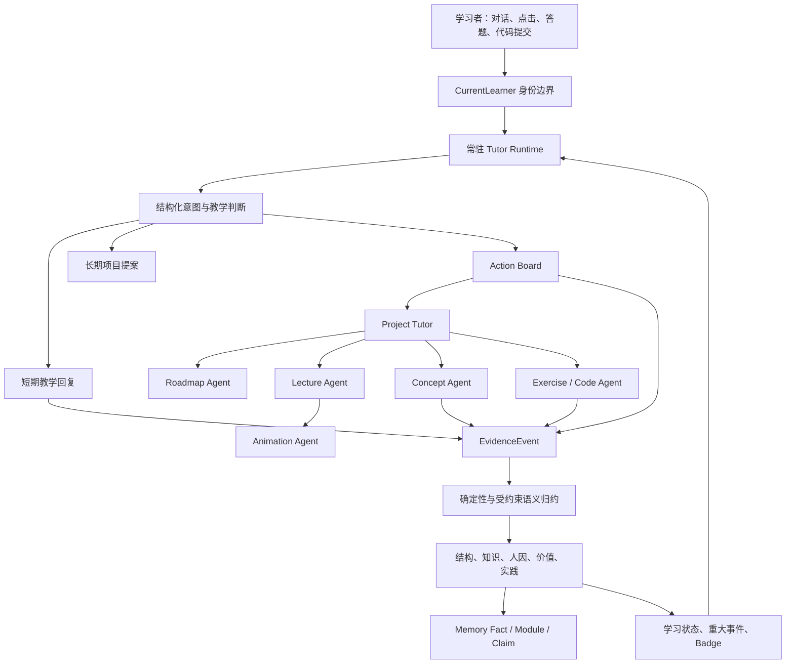
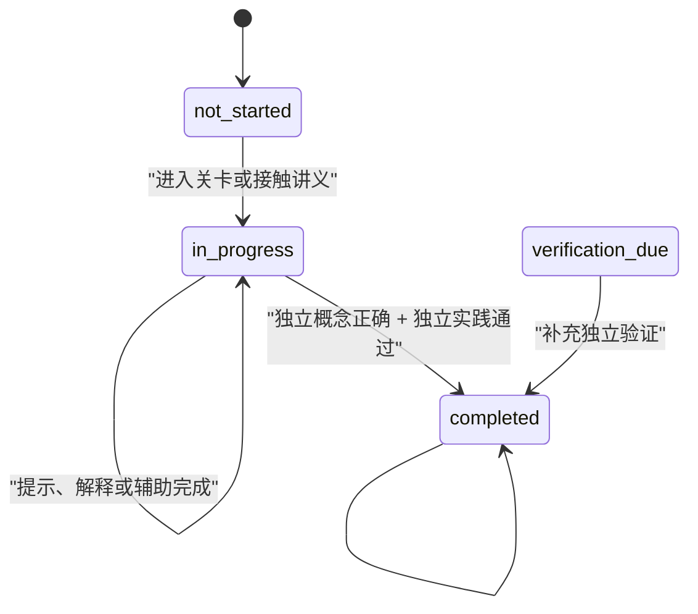

# LearnFlow 智能体架构与协作指南

> 面向对象：维护、扩展或评审 LearnFlow 的编码智能体、研究智能体与产品智能体  
> 文档性质：架构约束与协作契约，不是面向用户的产品介绍  
> 当前状态：常驻 Tutor、五核运行时、项目提案、Action Board、多用户隔离和记忆图谱均已有实现
> 权威入口：职责变更必须同时更新 `backend/app/services/architecture_registry.py`、本文与对应测试；维护边界和变更流程见 `docs/ARCHITECTURE_AUTHORITY.md`

## 1. 阅读方式

第一次接触项目时，建议按以下顺序建立上下文：

1. 先读本文，理解角色边界与系统不变量。
2. 再读 `docs/FIVE_KERNEL_TUTOR.md`，查看 Tutor、Action Board、证据和项目提案的运行图。
3. 再读 `docs/FIVE_KERNEL_MEMORY_GRAPH.md`，理解事件、事实、声明与记忆合成。
4. 修改具体功能前，进入本文末尾的“代码地图”找到对应服务，不要从页面表现反推全部业务逻辑。

本文使用以下规范词：

- **MUST**：系统不变量，修改时不可破坏。
- **SHOULD**：默认设计原则，偏离时需要有明确理由和测试。
- **MAY**：可以选择的实现策略。

## 2. 核心心智模型

LearnFlow 不是一个“聊天机器人包装器”，也不是多个人格化 Agent 同时与用户对话。它是一套围绕单个学习者持续运行的教学系统：

- 常驻 Tutor 维护教学关系、理解意图并协调下一步。
- Action Board 把自然语言转换为受控、可审计、可幂等执行的语义行动。
- 项目内领域 Agent 生产路线、讲义、题目、代码任务与可视化。
- Learning Runtime 根据证据更新学习状态，而不是让生成模型自行宣布掌握。
- Evidence Ledger 与 Memory Graph 保存可追溯、可纠正的长期学习历史。

最重要的架构原则是三个分离：

1. **教学关系与内容生产分离**：Tutor 负责“怎样陪这个人学”，领域 Agent 负责“怎样生成某类专业产物”。
2. **语言判断与真实执行分离**：LLM 可以提出意图和建议，Action Board 才能造成持久化副作用。
3. **教学内容与能力证据分离**：讲解、讲义、题目生成都不是掌握证明，只有用户行为与可验证产物可以改变状态。

## 3. 总体架构



从控制关系看，Tutor 是控制平面，领域 Agent 是能力平面，Evidence 与 Runtime 是事实平面。三个平面可以协作，但不能互相越权。

## 4. Agent 角色边界

### 4.1 Global Main Agent

Global Main Agent 是学习者在产品层面的总入口，职责是：

- 梳理学习方向、价值、优先级与长期目标。
- 接住“不知道学什么”“不知道是否适合”等迷茫。
- 对简单知识问题提供简述、类比或最小示例。
- 关注挫败、负荷、节奏和支持强度，但不做医学诊断。
- 识别持续目标，创建或修订无副作用项目提案。
- 在用户明确授权后创建项目、进入项目或执行其他高层行动。

Global Main Agent MUST NOT：

- 因为最近访问过某项目，就自称该项目负责人。
- 主动续接某个项目的路线、关卡、来源或课前后辅导。
- 在全局聊天中替代项目 Tutor 展开系统课程。
- 把结构核中的最近项目位置当作本轮默认主题。

全局上下文中的项目与关卡信息只用于理解学习者，不代表当前责任归属。

### 4.2 Project Tutor

Project Tutor 绑定一个明确的 `project_id`，是该学习项目的持续负责人，职责是：

- 承接项目目标、来源、正式路线与阶段推进。
- 组织候选来源推荐、选择完成后的路线确认对话。
- 基于来源、画像和已确认对话生成正式路线提案。
- 接收路线调整需求，并先提出修订方案，再以 Action 卡等待确认应用。
- 回答项目相关的小问题，进行课前引导和课后复盘。
- 将正式学习活动引导到对应关卡。

Project Tutor MUST NOT：

- 在聊天框里连续展开整份讲义或整套多步骤作业。
- 把“开始”解释为直接发送练习文本，而不进入正式关卡。
- 把项目提案的阶段预览原样写成正式路线。
- 未经确认直接重排、增删正式关卡。
- 使用其他项目的上下文替换当前绑定项目。

### 4.3 Checkpoint Learning Surface

关卡是正式教学与验证的主阵地，不是另一个争夺身份的聊天 Agent。它承载：

- 结构化讲义与来源引用。
- 选中内容解释与小范围追问。
- 概念验证、代码任务和实践产物。
- 尝试记录、辅助等级和结果评估。
- 通关条件与下一关解锁。

Tutor 负责把学习者带到正确关卡；关卡内的领域能力负责教学产物和验证。

### 4.4 Domain Agents

领域 Agent 是专业技能适配器，SHOULD 返回结构化产物与 provenance，而不是塑造独立人格。

| Agent | 主要输入 | 主要输出 | 不负责 |
|---|---|---|---|
| Roadmap Agent | 已处理来源、用户画像、五核投影、确认对话 | 正式路线 proposal、关卡 brief、依赖关系 | 直接完成关卡 |
| Lecture Agent | 关卡目标、来源片段、偏好提示 | 分节讲义、引用、自检点、视觉需求 | 证明掌握 |
| Concept Agent | 学习目标、证据声明、目标概念、来源 | 可评估概念题、答案规则、解释 | 用题型代替认知目标 |
| Exercise Agent | 关卡实践目标、技术环境、来源 | 代码任务、产物约束、可执行测试 | 根据“看起来不错”判定通过 |
| Code Agent | 完整代码、选中代码、任务上下文 | 解释、审阅、提示与反馈 | 无证据地提升 mastery |
| Animation Agent | 讲义段落、过程或结构描述 | animation、static 或 none | 为每段内容强行生成视觉 |

## 5. Tutor Turn 生命周期

每次 `POST /api/agent/sessions/{id}/turns` SHOULD 按以下顺序处理：

1. 使用服务端 `CurrentLearner` 校验 session、project、checkpoint 与 action 归属。
2. 使用 `client_turn_id` 检查是否为重复请求；若已有完整结果，直接重放。
3. 持久化用户消息，并追加 `user_message` 类型的 `EvidenceEvent`。
4. 解析页面上下文，例如选中文本、候选来源选择完成或当前关卡。
5. 优先解析明确行动指令和已有 Pending Action。
6. 参数充分时直接进入 Action Board；不要先生成一句“可以帮你”。
7. 只缺一个必要参数时，保存 Pending Action 并询问一个最小问题。
8. 非直接行动回合才调用 Tutor LLM，要求返回受约束结构化结果。
9. 验证并应用本轮短期 observations，越权字段必须丢弃。
10. 根据长期目标创建或补丁式修订一个项目提案。
11. 处理满足严格条件的重大事件候选与 Badge。
12. 返回自然消息、状态摘要、可选 executed action、可选 action card 和当前项目提案。

路线提案是一个专门的 Action Board 编排：Roadmap Agent 先给出可迭代的关卡方案，
Tutor 必须在同一回合创建 `apply_learning_path` 的 `pending_confirmation` Action 卡。用户点击
“确认并生成关卡图”后才写入关卡 DAG；不得要求用户再发送“确认路线”之类的自然语言，也不得
在未生成关卡图时声称路线已经生效。

模型调用失败时，消息和已记录证据仍然保留。语义更新可以跳过，但确定性行动、状态恢复和后续对话必须继续可用。

## 6. Tutor 结构化输出契约

Tutor 模型输出包括：

- `reply`：用户可见的自然教学回复。
- `observations`：本轮输入直接支持的五核短期观察。
- `learning_intent`：短期需要、长期目标、产物意图和相关 proposal key。
- `project_opportunity`：仅在值得持续跟踪时提供的项目候选结构。
- `major_event_candidates`：目前仅允许严格条件下的职业方向确立事件。

LLM MUST NOT：

- 直接写入任意数据库字段。
- 输出未在白名单中的五核键并期待系统接受。
- 将普通答错自动标为稳定误解。
- 将自述基础写成已验证掌握。
- 将用户说“懂了”解释为 mastery 提升。
- 自行声明异步任务或项目创建已经完成。

## 7. 双轨教学与项目提案

Tutor 每轮同时考虑：

- **短期教学轨道**：眼前疑问、最小解释、例子、提示或下一步。
- **长期项目轨道**：持续目标、明确产物、多步骤计划、系统学习诉求。

单次事实问答 SHOULD 只走短期轨道。明确产物、多步骤目标或连续主题讨论 MAY 触发项目机会分析。

`LearningProjectProposal` 具有稳定 `proposal_key`。同一目标的新证据应修订原提案，而不是生成重复卡片。修订必须使用字段补丁：

- 用户编辑过的字段自动锁定，模型不得覆盖。
- 用户锁定里程碑顺序后，模型可补充阶段，但不得擅自重排。
- 每次修订追加 `ProjectProposalRevision`，保留原因和证据引用。
- 提案创建和修订无项目副作用，也不构成掌握证据。
- 用户点击、拖放或明确语言接受后，才原子创建或进入项目。

项目提案中的 `milestones` 是阶段预览，只用于帮助用户理解候选方向。正式路线 MUST 主要依据：

1. 项目中真实接入并处理完成的来源。
2. 当前学习者画像和五核投影。
3. 项目对话中确认的基础、难点、投入与环境。
4. 已接受项目目标和实践产物。

## 8. Action Board 与工具调用

Action Board 是所有聊天按钮和页面按钮共享的语义事务层。每个 action 定义至少包含：

- `capability`
- `side_effect`
- `confirmation_policy`
- `evidence_target`
- `next_affordances`

主要能力链为：

```text
搜索已有项目
  -> 起草项目
  -> 创建或进入项目
  -> 添加并处理来源
  -> 生成正式路线 proposal
  -> 确认并应用路线
  -> 进入检查点
  -> 生成讲义或评估任务
  -> 评估尝试
  -> 推进下一关
```

工具执行规则：

- 用户明确要求的行动本身就是授权，参数充分时 MUST 当轮执行。
- Tutor 主动发现的有副作用机会 MUST 先呈现行动卡或提案。
- 每轮最多选择一个主要语义动作；复合初始化使用高层事务 action。
- 所有成功消息必须来自真实持久化结果。
- 异步 action 只报告已启动、当前进度、失败或终态。
- 工具失败必须报告失败原因和可执行修复，不能伪装成功。
- 重复 URL、重复请求和重复确认必须保持幂等。
- 页面按钮和聊天指令 SHOULD 经过同一个 ActionService，避免两套行为语义。

已确认的正式路线成功写入后，`apply_learning_path` MUST 在同一事务中通过标准
`checkpoint_entered` 路径进入首个可用关卡，并将该关卡返回给前端导航。此处是
无副作用的上下文 handoff，不应额外要求学习者回复“开始”，也不得顺带自动生成讲义、
题目或掌握结论；进入关卡后仍由学习者选择何时生成和开始这些产物。

后台任务的完成、产物生成与失败也必须使用已登记的 EventContract：内容生成或来源
处理只记录产物/操作状态，失败只记录当前结构阻塞，均不能被解释为学习掌握证据。

### 8.1 全局复习工作台

`/review` 是 Tutor 导航和过滤、Practice Agent 判题与调度、Learning Design Agent 仅提供候选变式的协作面。它不新增第四类主 Agent。

```text
Tutor: plan_review_queue / 导航 / 过滤
  -> Practice: evaluate_review_attempt / manage_review_item
  -> Learning Design: 仅候选变式
  -> LearningAttempt + EvidenceEvent
  -> 五核与 ReviewSchedule 投影
```

`QuestionLearningState` 联合题目、历史 Attempt、`RemediationCase`、Knowledge/Practice 投影和 `ReviewSchedule`，统一表达作答、纠错、到期、证据与错题状态。队列按未完成纠错、逾期错题、辅助成功题、普通到期题排序；答对后不删除错题历史。

`review_scheduler` 只能写 `ReviewSchedule`，不能写 `KernelState`。复习提交必须携带 `client_submission_id` 和 `expected_version`；重复提交重放原结果，陈旧版本返回 409。跳过不创建 Attempt，延期/暂停/恢复只产生零 kernel target 事件。答案、测试期望和变式正确项只存在于后端判题契约中，取题响应不得暴露。

复习台选择题目后，Workspace 只向 Tutor 回合发送 `review_schedule_id`。后端必须验证 learner ownership，并从题目、Attempt、纠错案例、Knowledge/Practice 投影和 `ReviewSchedule` 重新装配 answer-free 的 `active_surface_context`；不得信任浏览器提交的熟悉度、错因或证据状态。Tutor 只可解释、提示与说明调度，不能通过对话改变判题、间隔或掌握。

详细规则和接口见 `docs/REVIEW_WORKBENCH.md`。

### 8.2 桌面文件工作台

桌面工作区复用 Tutor 控制平面，不增加主 Agent 类型。文件能力链固定为：

```text
link_project_workspace
  -> inspect_workspace_files
  -> propose_workspace_change
  -> apply_workspace_change
  -> open_managed_learning_artifact
  -> edit_managed_lecture / annotate_learning_artifact
  -> delegate_local_agent_task
  -> inspect_local_agent_run / cancel_local_agent_run
  -> apply_local_agent_result
```

Agent 文件提案 MUST 绑定 `learner_id + project_id + checkpoint_id + session_id`，携带基础文件 SHA-256，并先返回 diff。确认前不落盘；确认时若文件已变化，提案自动失效。`.learnflow` 内的受管学习对象只能通过版本化领域能力修改，普通文件工具不得绕过。

`.lflecture/.lfexercise` 只是数据库学习对象的逻辑文件入口：讲义按 `base_version` 保存并保留 `LectureVersion`，练习题面/答案/测试受保护，个人草稿与批注独立存储。普通文件支持 UTF-8 轻量编辑、Markdown 安全预览、图片/PDF 预览，但不提供解释器、终端或运行按钮。

文件关联与变更事件的 kernel target 为空。编辑成功、保存草稿和练习“运行”都不是掌握证据；只有播放器内的正式练习提交可进入评估链。本地代码 Agent 只能通过 Tutor 所有的 Broker 工具在隔离副本中工作，不新增第四类主 Agent。Tutor 只表达任务语义，Broker 按 Profile 能力/优先级确定性选择；首次确认启动，第二次确认并通过 hash 校验后写回，删除和移动逐项确认。安全细节以 `docs/DESKTOP_WORKSPACE_SECURITY.md` 为准。

## 9. 五核学习者模型

五核是学习者状态的五个互补维度，不是五个聊天 Agent，也不是五份可以互相覆盖的长期画像。它们分别服务于五个不同的教学决策：走哪儿、学什么、怎么教、为什么现在学、如何验证能否做出来。

### 9.1 统一结构定义

| Kernel | 核心问题 | 状态对象 | 典型短期内容 | 典型长期内容 | 不能直接推断 |
|---|---|---|---|---|---|
| `structure` | 现在位于哪里，下一步如何走，离开后怎样回来？ | 学习路径、项目、检查点与依赖 | 当前关卡、依赖、转向、阻塞、返回锚点 | 稳定路径模式与项目图谱 | 掌握、动机、情绪、实践能力 |
| `knowledge` | 对哪个概念理解到什么程度，证据是什么？ | 概念、问题、错误推理与理解状态 | 知识缺口、待解问题、近期错误、明确误解 | 有评分证据支持的掌握或可纠正误解 | 只凭看过、讲解、自述或一次答错宣布长期结论 |
| `human` | 当前怎样教、怎样交互更合适？ | 当下负荷、注意、情绪反应与交互偏好 | 情绪、负荷、注意、挫败、节奏、讲法偏好 | 用户确认或跨 session 一致的稳定偏好 | 人格、医学状态、固定学习风格 |
| `value` | 为什么学，当前什么目标和投入更值得优先？ | 目标、优先级、动机、兴趣与相关性 | 当前优先级、动机、兴趣信号、目标候选 | 明确确认的长期目标、职业方向与价值排序 | 模型猜测的目标，或任何能力/掌握结论 |
| `practice` | 能否在给定约束下独立做出来，并迁移到新情境？ | 尝试、辅助、产物、反馈与迁移表现 | 当前尝试、辅助等级、产物状态、近期反馈 | 独立实践能力与迁移证据 | 有提示成功、原题重做或生成内容等同独立迁移 |

把五核看成“决策分工”而不是“信息分类”更准确：`structure` 决定导航，`knowledge` 决定内容与验证对象，`human` 决定交互适配，`value` 决定优先级，`practice` 决定能力验证。一个事件可以同时触及多个核，但每个 `kernel_target` 都必须有独立证据理由，不能因为某个核发生变化就自动复制到其他核。

### 9.2 结构与知识的边界

结构记忆回答“位于哪里以及怎样回来”，知识记忆回答“具体理解了什么”。

例如，学习者在因果自注意力关卡中因为不熟悉张量 shape 而暂时转去补基础：

- structure：暂停于因果自注意力，先修转到张量形状，完成后回到 Q/K/V shape 验证。
- knowledge：矩阵乘法 shape 是待补缺口；只有用户明确说出错误规则或评估发现稳定错误时才记录 misconception。

两个核通过 checkpoint ID、concept key 和 evidence ID 关联，不应复制同一结论。

### 9.3 跨核边界、时间与置信度

- 情绪、负荷和注意力是易变状态，默认具有短期有效期。
- 稳定偏好需要用户明确确认，或多个不同 session 的一致证据。
- 用户自述是有效背景，但不是知识或实践能力证明。
- 语义 observations 默认只进入短期状态；长期状态需要更严格归约。
- 答错时，`practice` 可以记录失败尝试和辅助等级；只有错误答案或理由足以定位概念问题时，`knowledge` 才记录对应缺口。
- 只有路径实际被影响时，`structure` 才记录阻塞或返回锚点；普通答错不会自动改变学习位置。
- 没有学习者明确表达或可重复证据时，不得从答题结果顺带推断 `human` 或 `value`。

## 10. Evidence、Attempt 与通关

`EvidenceEvent` 是只追加的学习事实账本。任何状态判断 SHOULD 能追溯到事件、尝试或产物。

以下行为不是掌握证据：

- 生成或阅读讲义。
- 生成题目。
- Tutor 给出解释。
- 用户说“懂了”“明白了”。
- 在大量提示下完成任务。

以下行为可以形成能力证据：

- 用户独立提交概念答案并被确定性或受约束评估判定正确。
- 用户独立提交代码或实践产物并通过测试。
- 用户在新情境中完成高置信度迁移任务。
- 用户明确表达可定位错误的具体理解，经诊断形成 misconception 证据。

每次概念或实践提交都应创建 `LearningAttempt`，记录：

- item 与 checkpoint
- submission 与 result
- assistance level
- 开始、提交与评估时间
- provenance 与关联事件

关卡状态遵循：



一次高置信度独立迁移成功可以替代组合条件。历史聚合完成记录只进入 `verification_due`，不能自动成为新系统中的已验证完成。

## 11. 记忆图谱

学习状态不是无限增长的聊天摘要。记忆采用可检查的分层结构：

```text
EvidenceEvent
  -> KernelMutation
  -> MemoryFact
  -> MemoryModule
  -> MemoryClaim
  -> MemoryEdge
```

- `EvidenceEvent`：不可变动作账本，保留发生时间、记录时间和学习者内序号。
- `KernelMutation`：某个事件对某一核造成的补丁及前后版本。
- `MemoryFact`：由 mutation 展开的原子事实，可幂等重放。
- `MemoryModule`：同一学习者、同一核、同一主题事实的不可变综合。
- `MemoryClaim`：模块中可独立检查的声明，必须有事实支持。
- `MemoryEdge`：稀疏、高价值关系，例如支持、关联和合并。

事件写入请求本身不调用 LLM。确定性 reducer 先生成事实；记忆合成可以异步进行，并且只能引用预先声明的候选 fact ID。

用户对错误记忆进行归档、纠正或撤回时，系统追加纠正证据，不删除历史。归档内容必须从 Tutor 当前投影中排除。

## 12. 上下文装配与 Handoff

Tutor 的上下文不是简单拼接全部历史，而是分层装配：

- 当前 session 最近消息。
- 当前学习者五核投影。
- 当前状态摘要。
- 当前学习者可见的项目与活跃提案。
- project session 中的当前项目、来源、正式路线和已接受目标。
- 从 global 进入 project 时的 handoff 引用。

Global session 中的 active project 必须降级为 `recent_project_reference` 语义，避免污染主 Agent 身份。

Handoff 只保存原始消息 ID、EvidenceEvent ID 和目标摘要，不复制或改写证据。这样可以保持连续性，同时避免出现两份不同版本的学习历史。

## 13. 来源与正式路线

来源用于约束课程事实与实现路径。候选来源搜索和正式来源接入是两件不同的事：

- 候选来源搜索是只读操作，只能展示真实搜索结果中的 URL。
- 模型可以排序和解释，但不得编造仓库链接。
- 用户点击添加后，才执行来源入库和处理任务。
- 来源处理失败只影响该来源，不应破坏项目提案和 Tutor 对话。
- 正式路线优先使用已处理来源的结构、摘要和相关片段。

在装配路线上下文时，系统还会从仓库 README 目录、章节目录和文件摘要派生“来源知识领域”。
它只约束路线可覆盖的内容，和五核投影并列提供给 Roadmap Agent；它不是学习者画像、掌握状态
或 EvidenceEvent，不能由此推断学习者会什么、跳过验证或写入任何 kernel。

对于仓库型来源，Roadmap Agent SHOULD 使用分层理解：

- L0：目录、文件类型和项目结构。
- L1：文件摘要、标题与主题标签。
- L2：按路径或主题读取相关 chunk。
- L3：必要时进行语义检索与补充读取。

不要把整个仓库一次性塞入 prompt，也不要只根据仓库名和星数规划课程。

## 14. 多用户隔离

每个账号唯一绑定一个 Learner。以下数据 MUST 以当前 Learner 为强制边界：

- 画像、五核与记忆图谱。
- 项目、来源、路线、关卡和产物。
- Agent session、message、action 与 proposal。
- EvidenceEvent、LearningAttempt、Task 与 Badge。
- SSE、文件读取、任务查询、取消和恢复。

API 不接受客户端提交的 learner 身份作为可信依据。所有资源 resolver 必须使用服务端 `CurrentLearner` 做 owner scope；访问其他用户资源统一返回 `404`，不暴露资源是否存在。

后台任务必须携带 `learner_id`，任务执行与结果写回时再次校验归属。智能体在添加新模型或接口时，MUST 同时补齐 learner ownership 和越权测试。

## 15. 重大事件与 Badge

重大事件用于记录学习生命历程，不用于制造即时奖励。

当前主要事件包括：

- 首次满足严格完成条件的学习项目。
- 用户以第一人称明确确定职业方向，且语义置信度达到阈值。

Badge 使用 learner 范围内的幂等 `award_key`。记忆后续被纠正时，Badge 作为阶段历史永久保留，但关联事件可以标记为已纠正。

探索性表达、假设、替他人描述或一般兴趣不能自动升级为职业方向确立事件。

## 16. 前端空间与责任

| 页面 | 主要责任 |
|---|---|
| `/agent` | Global Main Agent、学习方向、项目提案与高层行动 |
| `/projects` | 项目组合、待创建提案和项目管理 |
| `/projects/:id` | 当前项目目标、来源、正式路线和 Project Tutor |
| `/projects/:id/checkpoints/:id` | 正式讲义、关卡学习与选中内容追问 |
| `/projects/:id/checkpoints/:id/exercises` | 概念验证、代码实践与尝试结果 |
| `/profile` | 基本画像、五维友好记忆和学习旅程 Badge |
| `/memory` | 可检查记忆图谱、时间线、事实与声明来源 |

页面只显示用户能理解和行动的信息。内部 Kernel 名称、工具 handler、路由权重和原始 JSON 不应直接暴露在主要学习体验中。

## 17. 失败与降级语义

系统应优先保证事实正确，而不是保持“什么都成功”的表象：

- Tutor LLM 失败：保留消息与事件，跳过语义观察，允许确定性 action 继续。
- 结构化输出不可解析：使用受限 fallback，不应用越权状态。
- 来源搜索失败：保留项目提案，来源区域显示失败并允许重试。
- 后台任务失败：Action 返回真实错误与修复建议，不写完成事件。
- 记忆合成失败：原子事实与 KernelState 仍然可用，运行可重新排队。
- 路线生成失败：不覆盖现有正式路线。
- 幂等重放：返回已有真实结果，不重复制造副作用。

## 18. 设计灵感

LearnFlow 的架构可以理解为以下思想的组合，但实现必须以本项目代码和测试为准：

- **导师制与认知学徒制**：稳定 Tutor 通过解释、示范、脚手架、实践和反馈逐步降低辅助。
- **掌握学习**：接触内容不是完成，必须达到可验证标准才能推进。
- **证据中心设计**：先定义要证明的能力，再设计任务与证据，题型只是交互载体。
- **任务与关卡游戏结构**：项目是长期任务，路线是 DAG，关卡具有依赖、阻塞、验证和解锁。
- **Event Sourcing / CQRS**：原始事件只追加，KernelState 是可重建投影，Mutation 提供审计历史。
- **控制平面与能力平面**：Tutor 解释和协调，Action Board 治理副作用，领域 Agent 生产专业产物。
- **Human-in-the-loop**：提案可编辑、字段可锁定、正式路线需确认、来源需主动接入。
- **分层 RAG**：先理解来源结构，再按需要读取细节，控制上下文规模与事实质量。
- **记忆巩固**：离散事件逐步形成原子事实、主题模块和可检查声明，而不是累积一段不可审计摘要。

项目最初更接近“来源 -> 路线 -> 讲义 -> 练习”的生成流水线；当前目标已经演进为“常驻教学关系 + 可执行工作流 + 证据驱动学习者模型”。新增功能应服务于后一种架构。

## 19. 示例：从“我想实现 GPT”到正式学习

### 回合 1

用户：“我想自己动手实现一个 GPT。”

系统应：

- Main Agent 简短回应目标和可行的最小实现方向。
- `learning_intent.long_term_goal` 识别为持续目标。
- `artifact_intent` 识别为可运行的 MiniGPT 产物。
- 创建 `build` 类型项目提案，不直接创建项目。

### 回合 2

用户：“用 PyTorch。”

系统应修订同一个 proposal，锁定或补充技术栈，不创建第二张提案。

### 回合 3

用户：“没用过 PyTorch，只学过 CS61A。”

系统应：

- 回答当前起点是否足够。
- 在知识核记录未验证起点与 PyTorch 缺口，不记录已掌握。
- 在提案中补充张量、自动求导和训练循环热身阶段。

### 用户接受提案

Action Board 原子创建项目、绑定接受快照与证据引用，并进入 Project Tutor。

### 来源阶段

Project Tutor 推荐真实候选仓库。用户选择来源后，来源入库并异步处理。选择完成时，Tutor 概述路线安排逻辑并集中询问仍需确认的少量问题。

### 正式路线

Roadmap Agent 使用真实来源、画像、五核投影和确认对话生成正式路线 proposal。用户确认后才持久化关卡 DAG。

### 正式学习

Tutor 将用户带入第一关。Lecture Agent 生成来源约束讲义；Concept Agent 和 Exercise Agent 创建验证任务；Learning Runtime 根据独立尝试决定是否完成关卡。

## 20. 常见反模式

学习型工作任务网页可以通过 `open_personalized_learning` 把单个知识点、来源步骤、强关联技能和回传契约交给个性化学习功能。该动作只是上下文交接，不是掌握证据；后续内容生成仍属学习设计 Agent，练习和验证仍属实践与验证 Agent。

后续智能体修改代码时，应主动检查以下问题：

1. **主 Agent 被项目污染**：全局 Tutor 开始自称最近项目负责人。
2. **聊天替代关卡**：Project Tutor 在消息中发送整套讲义或练习，路线图却没有正式关卡。
3. **模型直接写状态**：LLM 输出 mastery 后未经证据归约直接保存。
4. **把答错当误解**：一次错误被永久写成 misconception。
5. **把曝光当掌握**：生成或阅读讲义后关卡自动完成。
6. **工具只说不做**：用户明确要求创建、添加或生成，Tutor 只回复“可以”。
7. **假完成**：异步任务刚启动就报告已完成。
8. **提案等于路线**：阶段预览未经来源和确认直接物化为正式关卡。
9. **题型等于目标**：先决定 WWPD、选择题或判断题，再倒推要评估什么。
10. **来源由模型编造**：展示没有真实检索结果支持的仓库 URL。
11. **五核重复存储**：同一段判断同时复制到结构和知识。
12. **跨用户读取**：根据客户端 ID 直接查询资源，没有 learner owner scope。
13. **旁路 Action Board**：聊天按钮和页面按钮调用两套不一致的业务逻辑。
14. **不可追溯记忆**：长期画像声明找不到原始事件或事实支持。

## 21. 扩展新能力的检查清单

新增 Agent、工具、事件或页面流程时，至少回答以下问题：

- 它属于全局 Tutor、项目 Tutor、关卡还是领域 Agent？
- 它是教学回复、无副作用提案、同步 action 还是异步 action？
- 用户是否已经明确授权副作用？
- 缺少参数时最小问题是什么，Pending Action 如何恢复？
- 是否需要幂等键，重复请求应返回什么？
- 成功结果的真实来源是什么？失败时如何降级？
- 它产生哪种 EvidenceEvent？是否需要 LearningAttempt？
- 哪个 Kernel 可以更新，允许的字段是什么？
- 这个行为是接触、辅助、独立证明还是迁移证明？
- 是否会改变 checkpoint 状态，依据是否足够？
- provenance 如何回到来源、消息、任务、题目或产物？
- 用户纠正时怎样保留历史并排除错误投影？
- 所有查询与任务是否受 CurrentLearner 隔离？
- 前端刷新后能否从服务端恢复真实状态？
- 是否覆盖直接指令、失败、重试、越权和移动端交互测试？

## 22. 代码地图

| 责任 | 主要文件 |
|---|---|
| Tutor 角色、上下文装配、回合编排 | `backend/app/services/tutor_service.py` |
| Tutor 结构化输入输出 | `backend/app/schemas/agent.py` |
| Action 能力与确认策略 | `backend/app/services/action_board.py` |
| 五核归约、Evidence、Attempt、通关 | `backend/app/services/learning_runtime.py` |
| 全局复习状态、调度与 API | `backend/app/services/review.py`、`backend/app/api/review.py` |
| 可演化项目提案 | `backend/app/services/project_proposals.py` |
| 路线规划 | `backend/app/services/roadmap_agent.py` |
| 讲义生成 | `backend/app/services/lecture_agent.py` |
| 概念评估 | `backend/app/services/concept_agent.py` |
| 实践任务 | `backend/app/services/exercise_agent.py` |
| 受管学习对象、批注与草稿 | `backend/app/api/phase2.py`、`backend/app/api/phase3.py` |
| 桌面普通文件服务 | `backend/app/services/workspace_files.py`、`backend/app/api/workspace.py` |
| 本地 Agent Broker、Profile、隔离与双确认 | `backend/app/services/local_agent_broker.py`、`backend/app/api/local_agent.py` |
| 代码解释与审阅 | `backend/app/services/code_agent.py` |
| 动画与静态图决策 | `backend/app/services/animation_agent.py` |
| 学习型工作任务与个性化学习交接 | `backend/app/api/learning_task_conversion.py`、`frontend/src/pages/PersonalizedLearningEntryPage.tsx` |
| 后台任务编排 | `backend/app/services/task_runners.py` |
| 记忆图谱写入与查询 | `backend/app/services/memory_graph.py` |
| 记忆异步合成 | `backend/app/services/memory_worker.py` |
| 重大事件、Badge、画像 | `backend/app/services/profile.py` |
| 身份与会话 | `backend/app/services/auth.py`、`backend/app/api/auth.py` |
| Agent API 与 owner resolver | `backend/app/api/agent.py` |
| 学习者与 Agent 持久化模型 | `backend/app/models/learning.py` |
| 前端路由与空间划分 | `frontend/src/App.tsx` |
| Tutor UI 与提案轨道 | `frontend/src/components/tutor/` |
| 项目、关卡、练习与复习页面 | `frontend/src/pages/ProjectPage.tsx`、`CheckpointPage.tsx`、`ExercisePage.tsx`、`ReviewPage.tsx` |

## 23. 最终判断准则

当一个实现方案存在争议时，优先选择同时满足以下条件的方案：

1. 学习者始终感受到一个连续、可信的 Tutor 关系。
2. 正式学习发生在项目路线和关卡中，而不是散落在聊天历史里。
3. 所有副作用都有授权、幂等、真实状态和失败语义。
4. 所有掌握判断都有独立证据和 provenance。
5. 五核边界清晰，同时可以通过证据引用协同。
6. 学习记忆可以检查、纠正、重放和归档。
7. 任何数据都不能跨 Learner 泄漏。

这七条比“让某一次模型回复更聪明”更重要。
