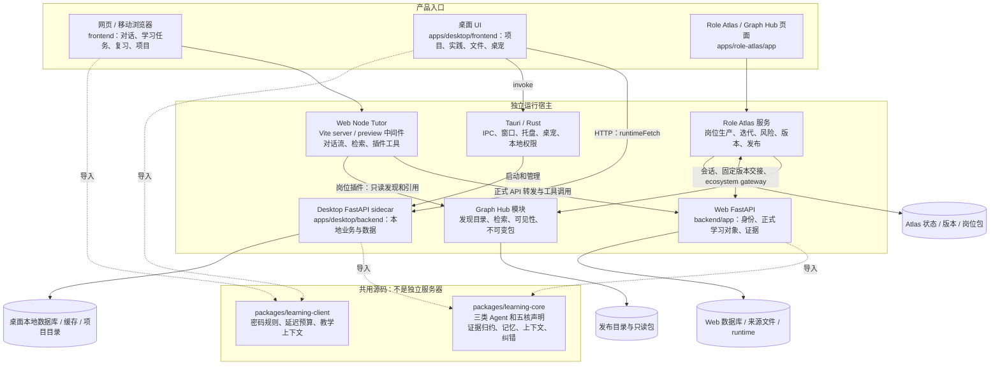
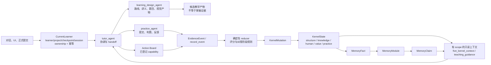
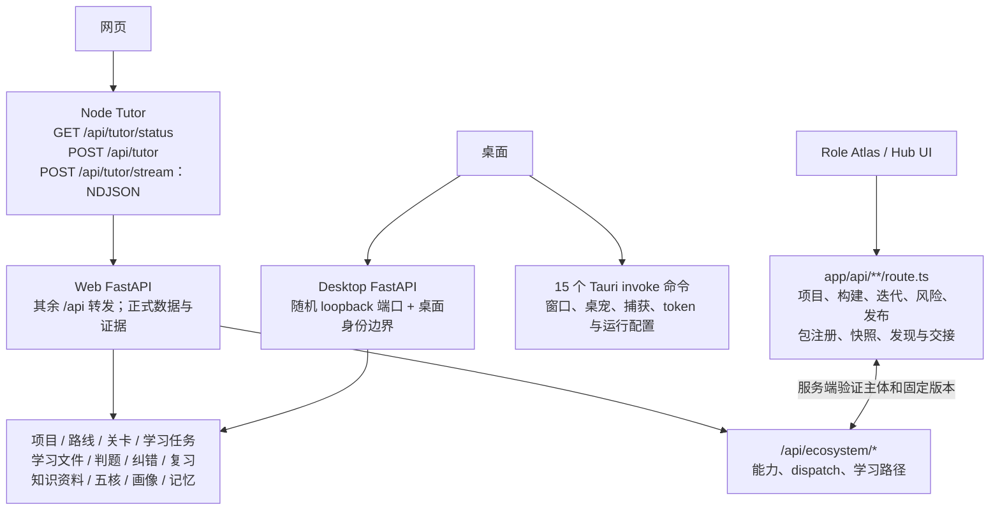
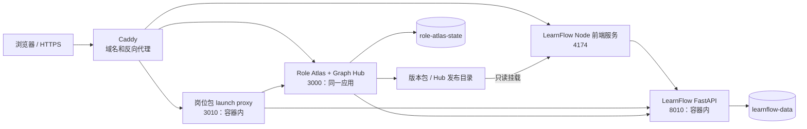

# LearnFlow 项目模块与 API 总览

源码快照：2026-09-06 单仓迁移后。本文描述当前实现和仓库中的部署配置，不表示这些服务已经全部部署上线。架构权威仍是 registry 与 ARCHITECTURE_AUTHORITY；本图只是入口导航。Contract impact：本次总览不修改任何 API、schema、事件或运行行为。

## 1. 产品、进程与共享源码

- Web 与 Desktop 已共用源码；它们的数据库、账户和云同步尚未因此合并。共享包仍依赖所选宿主的 app 模型与服务，每个后端独立进程运行。
- Graph Hub 当前位于 Role Atlas 应用中，cohost 配置通过不同域名将 `/hub` 与 Atlas 页面提供给用户；它尚不是独立部署的微服务。
- 桌面正式 Tauri 运行时走本地 FastAPI。桌面前端的 Vite dev/preview 另有 Node Tutor 中间件，不能把它画成安装包必备的 Node 服务。
- 桌面的岗位插件源代码已在仓内，但正式原生 Tutor 的插件执行与云端账户交接需要分别验收；总览不把 Web 的完整跨产品接入画成桌面已经实现的云同步。

## 2. 学习内核与证据调用链

三类 Agent 是责任接口，不是三个部署服务；五核是学习者状态维度。模型可以生成候选或讲解，不能直接写 KernelState 或决定掌握升级。共享 registry_core 保存基础声明，两端 registry 分别组合各自工具、事件与实现绑定。

## 3. 模块导航

下表的 Python API 实现目录在两端分别为 `backend/app/api` 和 `apps/desktop/backend/app/api`；各自完整路径见 API 清单。

| 模块 | 主要责任 | 代码入口 / API 模块 |
|---|---|---|
| Web 学习空间 | Chat、项目、学习任务、复习、学习路径、画像、学习文件 | frontend/src/main.tsx、各 *Page.tsx |
| 桌面学习空间 | 桌面项目与实验、本地文件、桌宠 UI、原生通信 | apps/desktop/frontend/src；desktop/src-tauri/src/lib.rs |
| Tutor 与工具运行 | 上下文装配、模型通信、检索、工具预算、插件 | frontend/server/agent-runtime.ts、frontend/vite.config.ts；API agent.py |
| 身份与平台配置 | 登录、会话、模型配置、浏览器请求安全 | API auth.py、settings.py；services/auth.py |
| 项目与路线 | 项目生命周期、来源、关卡、工作流 | API projects.py、phase1.py、phase2.py、vnext_projects.py |
| 讲义、练习、实践 | 学习文件、正式提交、确定性判题 | API learning_files.py、phase3.py、assessment_design.py |
| 学习任务与工作任务转化 | 候选确认、正式任务、阶段和运行锚点 | API learning_tasks.py、learning_task_integrations.py、tasks.py |
| 纠错与复习 | 错误诊断、纠错阶段、变式和复习调度 | API remediation.py、review.py；共享 remediation.py |
| 知识与资料 | 个人/项目来源、版本、检索与领域知识 | API knowledge_library.py；services/source_processor.py |
| 五核、学习者状态与记忆 | 短期状态、事实、模块、声明、只读画像 | API memory.py、profile.py、learner_state.py；packages/learning-core |
| 微学习 | 短任务、流程投影、验证 | API micro_learning.py |
| 桌面本地工作区 | 文件读写、目录联动、权限、冲突与恢复 | API workspace.py、local_agent.py；services/local_agent_broker.py |
| 桌宠与实验 | 桌宠会话/能力、提醒、实验操作 | 桌面 API pet.py、experiments.py；Tauri IPC |
| 架构与运行诊断 | registry、版本、能力实现校验、health/demo | API architecture.py、health.py |
| LearnFlow 生态网关 | 能力发现、dispatch、学习路径交接 | Web API ecosystem.py；services/ecosystem_gateway.py |
| 岗位消费插件 | 发现、固定版本引用、关系阅读、证据追溯 | 两端 frontend/plugins/role_capability_graph |
| Role Atlas 生产 | 岗位项目、构建、迭代、风险研究、版本和发布 | apps/role-atlas/lib/{build,iteration,risk,versioning,registry} |
| Graph Hub 发现 | 公开目录、检索、可见性与固定版本包 | apps/role-atlas/lib/{hub,graph-hub}；app/api/hub/search |
| 共用客户端逻辑 | 密码规则、延迟预算、教学指导上下文 | packages/learning-client |
| GoldenRole 研究 | 本地岗位研究方法与只读资料产物 | labs/golden-role；独立原始研究资料不并入运行系统 |
| 交付与质量 | 双端测试、契约检查、桌面打包、容器配置 | .github/workflows、scripts、deploy、apps/role-atlas/deploy/cohost |

## 4. API 按调用方分层

API 总数、宿主差异和逐路由实现链接见 [API_CATALOG.md](API_CATALOG.md)。JSON 版本见 [api-catalog.json](api-catalog.json)。

| 宿主 | 已登记方法 + 路径条目 |
|---|---:|
| Web FastAPI | 232 |
| Desktop FastAPI | 253 |
| Web Node Tutor | 3 |
| Desktop Node Tutor（dev/preview） | 3 |
| Role Atlas / Graph Hub | 46 |
| Desktop Tauri IPC | 15 |

共 537 个 HTTP 方法与路径条目、15 个 IPC 命令。这个计数包含不同宿主上的重复路径，不是 537 种独立产品能力。两套 FastAPI 按方法和路径比对共有 227 项；Web 额外 5 项 ecosystem 接口，Desktop 额外 26 项桌宠、视觉凭据、实验与项目工作流接口。共有路径的内部行为和权限并不自动相同。

“两个后端都有 workspace/local_agent 路由”不意味着网页获得桌面本机权限；路由是否可调用仍受运行模式、ownership、确认与权限检查控制。开发诊断和内部凭据桥接路由也不能当作公开业务 API。

## 5. 部署配置中的边界

依据 `apps/role-atlas/deploy/cohost/compose.yaml` 和 Caddyfile；这是仓内可部署拓扑，不是本轮服务器部署结果。桌面 Tauri 和 sidecar 在用户机器内运行，不应搬到此云端拓扑当作同一进程。Web 本地默认端口 4174/8010，Desktop 开发默认 4175/8011，安装包 sidecar 使用随机端口。

## 6. 后续同步更新规则

共享逻辑改 `packages/`，两端 UI/API 接入按宿主分别修改；同一功能在一个任务中说明两端验收并成组提交。涉及身份、模型凭据、桌面权限或云同步时单独设计契约，不能直接复制另一端策略。项目入口统一用仓库根，平行写入任务使用独立 worktree。

更新 API 清单：`python3 scripts/generate_api_catalog.py`；校验是否漂移：`python3 scripts/generate_api_catalog.py --check`。生成器不启动服务、不执行 lifespan、不连接用户数据库；它核对 FastAPI OpenAPI 的已挂载方法覆盖，扫描 Atlas 显式导出方法及 Tauri 注册表。
