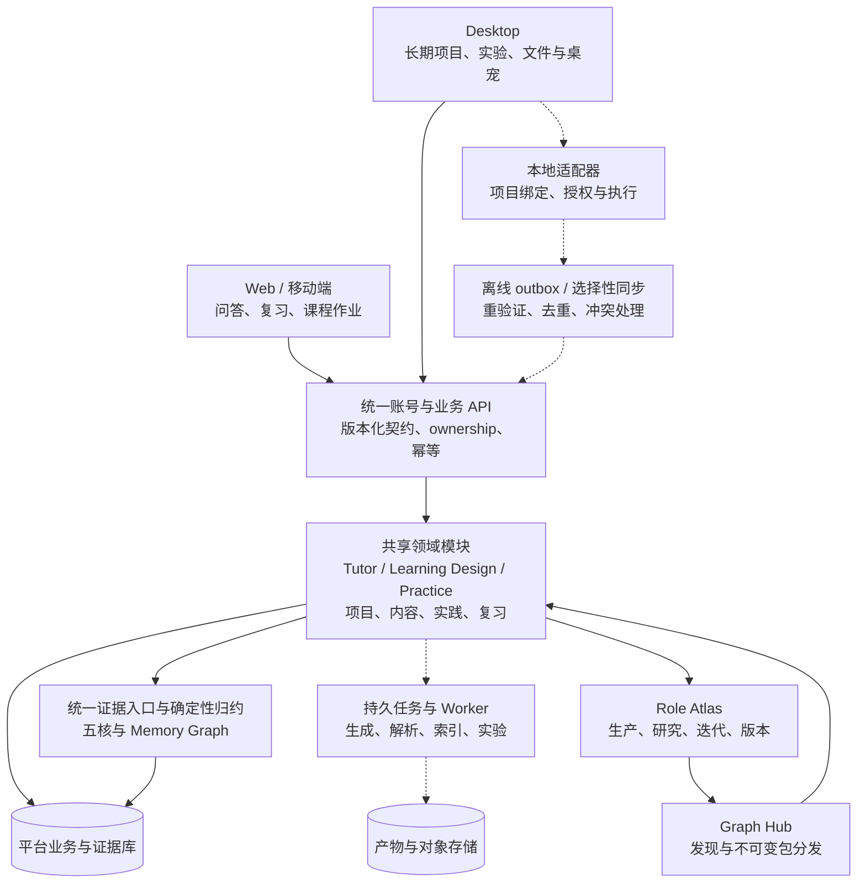
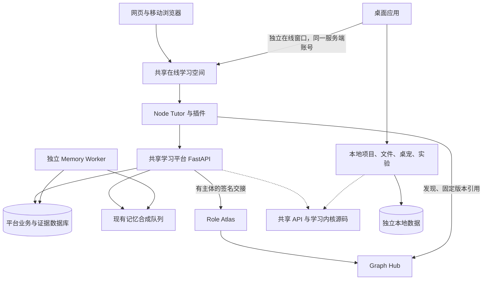
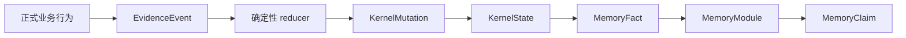

# LearnFlow 目标架构与首发整合

目标：Web 与 Desktop 消费同一学习平台，Role Atlas 生产岗位图谱，Graph Hub 提供发现与版本化分发。三类主 Agent 与五核证据链维持唯一正式权威；桌面本地能力通过受控适配器接入。

## 理想架构

下图包含后续目标，虚线表示本次尚未实现的连接；具体完成边界见下一节。

这些是模块边界，并不要求每个框都成为独立服务器。首发使用单台服务器上的容器组合，后续按负载与隔离需要拆分。

## 首发代码完成的接入结构

在线窗口不向本地宿主共享 Cookie 或原生能力。本地窗口也不把文件、token、旧数据库、项目 ID 直接送给在线平台。两个空间使用同一套学习 API 实现，但数据归属仍明确分开；不能把本地历史当成服务端已经验证的证据。

## 目标与当前交付的差距

| 模块 | 本次交付 | 后续完整目标 |
|---|---|---|
| 业务 API | 21 个重复模块归一，旧 URL 与权限保持；新增平台发现和就绪检查 | 继续收敛宿主配置、认证与领域适配器；按兼容协议升级 API |
| Web / Desktop 在线业务 | 桌面内置独立在线窗口，使用同一 Web 产品和平台账号 | 桌面各本地工作台直接消费云 API，统一在线项目导航 |
| 本地能力 | 文件、桌宠、实验与本地 Agent 保留，权限不扩大 | cloud project ↔ local workspace 显式绑定与 scoped delegation |
| 学习状态 | 在线学习全部使用服务端正式状态；本地历史保留在本地 | 离线事件 outbox，经服务器重验证、去重后归约 |
| 图谱服务 | 补齐 cohost 中已有生态网关的地址与独立签名密钥配置 | 生产与发现边界保持；按负载再拆物理服务 |
| Worker | 现有 MemorySynthesisRun 队列独立进程消费、共享卷独占锁 | 生成、解析、索引任务进入带租约和重试的持久化任务执行器 |
| 存储 | 平台数据卷、本地数据、图谱状态各自隔离 | 对象存储、选择性文件同步、冲突与删除标记 |
| 课程与课堂 | 复用当前项目、学习任务与练习 | 班级、课程、作业分配的正式领域模型和权限 |

因此本次是目标架构的首发整合，并未宣称完整离线同步、课程系统或本地云端项目映射已经完成。发布时优先验收在线闭环，不把尚未完成的能力放进宣传或 API 状态。

## 不变的正式证据链

编排、内容生成和视觉表达可以使用模型；评分、纠错阶段、幂等、作用域和掌握升级必须由代码控制。未来离线同步也只能提交可验证操作，不能上传 KernelState 覆盖正式状态。

接口实现导航见 [API 清单](API_CATALOG.md)，迁移说明见 [平台整合契约](implementation/LEARNING_PLATFORM_INTEGRATION.md)，首发步骤见 [上线计划](LAUNCH_PLAN.md)。
