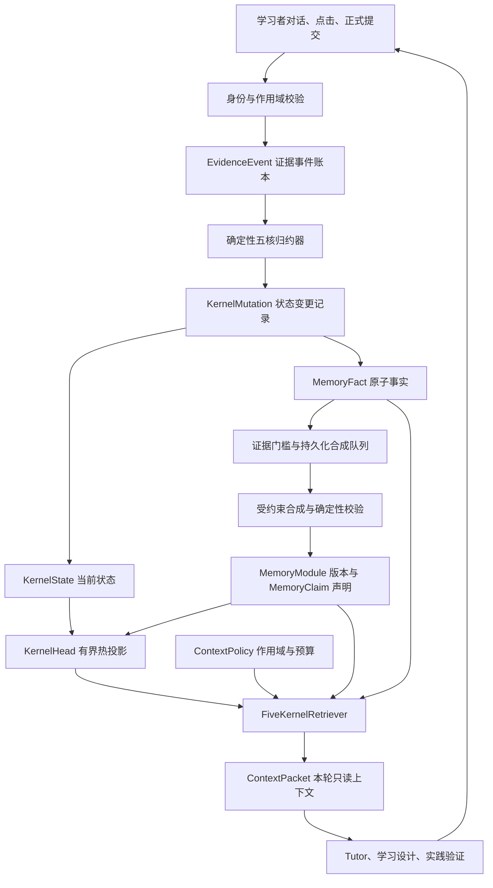

# LearnFlow 记忆系统技术报告

> 面向比赛答辩与技术展示 · 2026 年 9 月 8 日
>
> 基于仓库提交 `6cd77646f22588de6988c68d86d76c69004026c2` 的源码核验与本次专项回归。本文描述已实现机制；教学效果、规模性能与未来工作分别标明。与本文配套：[规划系统技术报告](PLANNING_SYSTEM_TECHNICAL_REPORT.md)、[验证记录与复现说明](VERIFICATION.md)。

## 摘要

持续学习需要系统记住目标、理解障碍、实践表现和有效的支持方式，同时能够解释每项判断来自哪里。LearnFlow 将学习者记忆组织为五个互补维度：结构、知识、人因、价值和实践。用户行为先进入证据事件账本，再由确定性规则更新学习状态，展开为原子事实，并按证据门槛形成版本化记忆模块和可追溯声明。Agent 每轮只读取经过作用域过滤和预算裁剪的上下文包。

这套设计把“发生过什么”“当前怎样理解这些证据”“本轮教学需要什么”分别落到事件、记忆图谱和读取投影上。学习者可以纠正或撤回记忆；历史版本仍可追溯。模型承担表达与受约束合成，评分、掌握升级和长期记忆的证据门槛由程序控制。

当前已实现共享事件归约、五核状态、事实图谱、模块版本链、异步合成、有界检索和用户反馈入口。本次专项验证覆盖 Web 与 Desktop 两个消费者。验证证明的是所测软件契约成立，尚不能据此量化学习效率提升或长期教育效果。

**关键词：** 学习者建模；证据驱动记忆；事件归约；版本化知识图谱；上下文检索；可纠正 AI。

## 1. 问题与设计目标

学习辅导中的记忆存在三个直接影响教学质量的问题。

第一，信息的可信程度不同。“我学过 Python”、在提示下答对和独立完成变式，都对教学有用，但支持的结论不同。如果混成一句“已掌握 Python”，系统会跳过必要的验证。

第二，学习状态随时间和情境变化。某次“今天很累”适合改变当前交互节奏；过去一项理解结论也可能被新错误挑战。系统需要保留有效期、适用范围和修订依据。

第三，完整历史不适合直接进入每轮提示词。教学现场需要少量相关证据，同时保留回到原始行为的入口。

因此，LearnFlow 的目标是让记忆满足四个条件：**有来源、分证据等级、能纠正、可按需读取**。它服务于持续教学决策，也为比赛中的“为什么这样教”提供可展示的依据。

## 2. 总体架构：从行为到可用记忆

这张图中的回路通过新的用户行为继续积累证据。Agent 的输出本身不能绕过事件归约器写入学习状态。[M1][M2]

产品只有三类主 Agent 责任：Tutor 协调对话与行动，Learning Design 生产路线和教学内容，Practice 负责提交验证。五核是三类 Agent 共享的学习者状态维度。

## 3. 五核：按教学决策划分记忆

| 维度 | 支持的决策 | 可以记住的内容 | 证据边界 |
| --- | --- | --- | --- |
| Structure 结构 | 下一步去哪，如何返回 | 路线、先修关系、阻塞点、返回锚点 | 路线位置不证明理解程度 |
| Knowledge 知识 | 哪个概念需要解释或验证 | 接触记录、答案、缺口、误解、检索与理解证据 | 看过、自述和一次答错不足以支持稳定掌握结论 |
| Human 人因 | 当前怎样支持更合适 | 明确的节奏、负荷、表征和支持请求 | 普通错误不能推断人格、医学状态或固定学习风格 |
| Value 价值 | 为什么学，什么优先 | 方向候选、目标、优先级及确认决定 | 模型建议需要与学习者确认的目标区分 |
| Practice 实践 | 能否在明确约束下做出来 | 尝试、辅助等级、产物、反馈与迁移验证 | 受助成功、重做原题与独立迁移分别记录 |

同一次行为可以产生多个核的事实，但各核分别说明依据。例如，“我想做 Agent 项目，但没实践过 RAG”可以提供目标候选和实践背景；它不自动证明 RAG 概念掌握不足，更不能推断缺乏学习动力。[M1]

Knowledge 与 Structure 可以共享 `concept_key` 这一概念身份坐标：前者保存理解历程，后者保存前置、关联和返回路径。共享概念名称不会让两个核共享掌握结论，也不会产生第六套学习者画像。

## 4. 关键技术机制

### 4.1 事件账本与确定性归约

`record_event()` 校验学习者及所引用项目、关卡、会话的归属关系；已有 `client_event_id` 会按学习者命名空间检查并重放。事件保留行为发生时间 `occurred_at`、系统记录时间 `created_at`、学习者内序号 `learner_seq`，以及来源、置信度和产物引用。[M2]

归约器根据登记的事件语义产生 `KernelMutation`，记录 patch、原因和状态版本变化，再更新 `KernelState`。生成材料、打开文件、任务生命周期等操作可以留下运行审计，但没有掌握证据含义的操作不因此产生正向能力结论。

这使“点击过”“尝试过”“验证成功”具有独立语义，也使重复网络请求能够复用已有事件。这里的幂等依赖稳定请求键和数据库约束；本次测试包含重复请求场景，不代表已完成所有并发压力验证。

### 4.2 Fact、Module、Claim 三层组织

| 对象 | 技术作用 | 追溯方式 |
| --- | --- | --- |
| MemoryFact | 将一次状态变更展开为原子事实 | 指向源 Event、Mutation；保存证据等级和 scope |
| MemoryModule | 合成同一学习者、同一核、同一主题的阶段性记忆 | 保存父版本、增量事实、证据集合、策略版本 |
| MemoryClaim | 将模块拆为可以单独检查的声明 | 通过 `SUPPORTS` 边直接连接支持事实 |

Fact 的 `(source_mutation_id, fact_ordinal)` 唯一约束避免同一次变更重复展开。Module 保存不可变内容；新增证据生成下一版本，普通细化使用 `REFINES`，纠正使用 `SUPERSEDES`。当前读取采用活动版本，历史版本保留。[M3][M4]

例如，第一阶段的声明可以是“学习者自述接触过某概念，尚无独立验证证据”；经过后续验证，系统形成带新证据的新版本。系统无需把旧自述覆盖成“早已掌握”。

当前模块策略为 `memory-module-version-v2`，单个版本的证据集合上限为 64 条。该集合是有界合成输入，原始历史仍保存在事件和事实图中，不能把它理解为每个模块包含全部历史。

### 4.3 分核门槛与声明校验

长期合成由代码中的门槛触发。例如：同一概念至少两条经过结构化处理的明确自述，可以形成接触范围模块，但声明保持 `self_reported`；Knowledge 的评估合成考虑独立验证事件；Human 的明确偏好和跨会话证据分别处理。[M3]

**触发合成不等于批准掌握。** Worker 还检查每条声明的事实白名单与类型：`stable_mastery` 至少需要两个独立 verified 事件；`transfer` 必须引用相应迁移验证；Structure 不得发布掌握声明，Value 的长期目标表达需要确认依据。[M5]

这些条件属于软件证据策略。不同学习活动另有更具体的规则，例如复习中的间隔稳定判定；不能把“两条 verified”概括为适用于全部知识、全部任务的教育学掌握标准。

### 4.4 异步合成与离线恢复

用户事件写入过程中不等待 LLM。事实生成后，由 `MemorySynthesisRun` 保存待合成任务，再由 Worker 预留输入、执行合成、校验并提交模块。任务保存输入指纹、基准模块、目标版本、失败原因和尝试次数。[M3][M5]

模型调用失败时使用确定性合成器，继续接受相同证据校验。进程中断后可以释放预留并重新排队；启动时也会检查符合条件但尚未排入队列的事实。由此，模型不可用时仍能维护基本记忆结构。

当前部署支持内嵌 Worker 或使用同一数据库的独立 Worker。独立模式采用共享卷文件锁限制单进程，不应描述为已经实现分布式多 Worker 调度。[M8]

### 4.5 有界上下文检索

读取链为 `ContextPolicy → FiveKernelRetriever → ContextPacket`。策略先决定允许读取的核、作用域、条目数、关系展开数和 token 估算预算，再检索候选。[M6]

当前实现综合主题精确匹配、项目/关卡/会话一致性、词法重叠、活动声明、热头部引用、显著性和时间衰减进行确定性排序。它采用本地结构与词法信号，没有在这条核心路径中实现 embedding 向量检索。

| 读取对象 | 当前配置 | 用途 |
| --- | --- | --- |
| 每核 KernelHead | focus 3、alerts 5、working 8、stable 5 | 保存少量热引用，淘汰引用不删除历史 |
| Global Tutor | 最多 10 项、4 条关系路径、估算预算 2,400 tokens | 全局辅导与项目参考 |
| Checkpoint Tutor | 最多 12 项、6 条路径、估算预算 2,900 tokens | 当前关卡教学 |
| Learning Plan | 最多 14 项、6 条路径、估算预算 3,200 tokens | 规划读取 Structure、Knowledge、Human、Value |

预算数值属于当前策略配置，并非实测 API 账单 token 数。返回包还包含证据标识、冲突、预算和省略说明。过期、撤回、归档及敏感内容经过过滤；答案字段从教学上下文中移除。

### 4.6 可纠正性与人因适配

学习者可以确认、纠正或撤回声明。反馈形成新的事件或版本，更新当前有效投影并保留审计历史。[M7]

明确的当前节奏、负荷或支持请求默认按短期 scope 使用，相关瞬时状态采用 8 小时有效期。临时 Human 事实排除在长期合成之外；上下文将其转成“每次推进一个步骤”等交互指令，避免把敏感原话反复送入模型。[M6][M9]

## 5. 与规划系统共同工作的案例

下面是机制讲解案例，不是参与者实验数据。

| 学习进程 | 记忆系统保存什么 | 下一轮可支持的行为 |
| --- | --- | --- |
| 学生说“学过 Python，想半年内学 Agent 开发” | 学习背景自述、目标候选、规划位置 | 询问必要缺口，查找路径目标；保留自述等级 |
| 学生确认一条长期路线 | Structure 活动路线，Value 已确认目标及证据 ID | 后续规划读取已确认路线，避免失去方向 |
| 正式提交中出现错误 | Practice 尝试与辅助等级；有依据的 Knowledge 错误信息 | 进入确定性反馈与纠错流程 |
| 学生选择“看示例” | 明确支援请求与相关讲法反馈 | 按当前支持需要调整表达 |
| 独立完成后续验证 | 对应验证事实及题型、辅助、迁移条件 | 满足各自门槛后更新模块；继续安排必要复习 |
| 学生纠正背景或改变目标 | 追加反馈事件，产生后继版本或归档状态 | 新一轮读取当前有效记忆，历史依据可查 |

记忆让规划具有连续性，规划则给记忆提供明确的使用情境。两者之间传递的是带范围和证据含义的结构化信息。

## 6. 技术价值与验证证据

本系统的主要工程贡献在于四种机制的组合：五核保持教学职责边界；事件与事实保存证据来源；版本化模块支持纠正；有界读取将长期历史转成当前可用上下文。这些是可通过代码和运行结果检查的设计价值，本文不主张未经文献比较的“首创”或性能领先。

2026 年 9 月 8 日，本次执行的相关后端专项集在 Web 通过 74 项、Desktop 通过 73 项；规划、路径和记忆读取相关前端集分别通过 39 项、38 项。共享检查确认两端消费共同核心和 144 个共同事件合同。两端数字包含大量对应场景，不能相加宣称为互不重复的覆盖数量。

测试包含事件幂等、跨核事实、模块版本、记忆读取、Human 过期、自述不升级掌握、长期路线写入及注册漂移。完整命令、环境、结果和未执行项见[验证记录](VERIFICATION.md)。

## 7. 当前边界与后续评估

当前有界检索可能遗漏候选窗口外的旧事实；模块的 64 条证据输入也需要评估在长学习周期中的保留策略。撤回传播、跨 scope 过滤和声明限制已有针对性测试，但不能据此宣称零错误或完整语义安全证明。五核归约共享实现，Worker 与部分宿主模型仍分端装配；代码复用不自动合并旧本地身份、数据库或离线历史。

后续评估应分三类进行：

| 评估层 | 建议指标 | 本次证据状态 |
| --- | --- | --- |
| 软件正确性 | 声明证据覆盖、撤回生效、作用域泄漏、重放一致性 | 已有专项测试；本次通过所列集合 |
| 运行效率 | 数据规模分层下的检索 p50/p95、队列延迟、上下文成本 | 本次未做性能基准，不填写推测数值 |
| 教育效果 | 延迟回忆、迁移成绩、纠错后保持率、教师判断一致性 | 尚需真实学习者研究与对照设计 |

## 8. 答辩讲解提纲（约 60 秒）

“LearnFlow 的记忆系统要回答的是：系统为什么认为学生理解了、卡在哪里，以及接下来怎样支持。我们把学习者状态分成结构、知识、人因、价值和实践五个维度。每项更新都从行为事件出发，由确定性规则形成事实；事实达到门槛后，再生成带证据链接的版本化记忆。学生能够纠正或撤回，模型不能自行宣布掌握。真正用于每轮教学时，系统按当前任务读取一个有预算的上下文包。这样既保留长期学习连续性，也能回到具体证据解释一次教学决策。”

## 附录：实现依据

- **[M1]** [架构指南：五核、证据与记忆](../../AGENT_ARCHITECTURE_GUIDE.md)、[五核记忆图谱规范](../../FIVE_KERNEL_MEMORY_GRAPH.md)。
- **[M2]** [learning_runtime.py](../../../packages/learning-core/src/learnflow_core/learning_runtime.py)：`record_event`、`_reduce_event`、`_apply_patch`。
- **[M3]** [memory_graph.py](../../../packages/learning-core/src/learnflow_core/memory_graph.py)：`create_facts_for_mutation`、`_trigger_reason`、`maybe_queue_synthesis`、`effective_evidence_ids`。
- **[M4]** [数据模型](../../../backend/app/models/learning.py)：EvidenceEvent、KernelMutation、MemoryNode、MemoryFact、MemoryModule、MemoryClaim、MemoryEdge。
- **[M5]** [memory_worker.py](../../../backend/app/services/memory_worker.py)：`_validate_draft`、`process_synthesis_run`、恢复与补队列函数。
- **[M6]** [five_kernel_context.py](../../../packages/learning-core/src/learnflow_core/five_kernel_context.py)：`CONTEXT_POLICIES`、热投影、过滤、排序与预算。
- **[M7]** [记忆 API](../../../packages/learning-core/src/learnflow_core/api/memory.py)、[学习者状态 API](../../../packages/learning-core/src/learnflow_core/api/learner_state.py)。
- **[M8]** [平台与独立 Worker 部署边界](../../implementation/LEARNING_PLATFORM_INTEGRATION.md)、[单仓共享边界](../../MONOREPO.md)。
- **[M9]** [学习者状态测试](../../../backend/tests/test_learner_state.py)、[记忆上下文升级测试](../../../backend/tests/test_memory_context_upgrade.py)。
