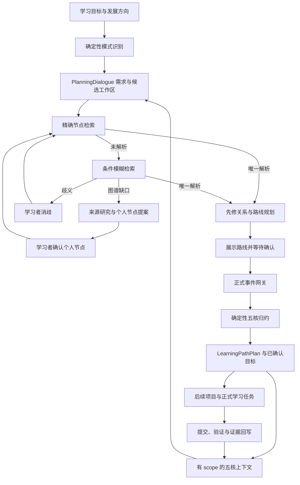

# LearnFlow 规划系统技术报告

> 面向比赛答辩与技术展示 · 2026 年 9 月 8 日
>
> 基于仓库提交 `6cd77646f22588de6988c68d86d76c69004026c2` 的源码核验与本次专项回归。配套材料：[记忆系统技术报告](MEMORY_SYSTEM_TECHNICAL_REPORT.md)、[验证记录与复现说明](VERIFICATION.md)。

## 摘要

LearnFlow 的学习规划面向跨多个任务的持续目标、复杂项目和长期发展方向。系统在对话中收集目标与约束，读取带证据边界的学习者记忆，将自然语言目标定位到课程或技能节点，再依据先修关系生成有序路线。路线作为候选展示，学习者确认后通过正式事件入口写入结构核与价值核，供后续辅导继续读取。

规划系统将需求澄清、图谱检索、路线生成和正式确认分为可检查的阶段。大模型负责对话解释与建议表达，确定性程序负责目标消歧、路径排序和状态写入。当前路线算法是依赖图上的有界启发式规划，已实现候选生成、确认、修订和归档；尚不提供基于工时与资源约束的最优排程，也不保证在给定月数内完成全部节点。

**关键词：** 个性化学习路径；先修关系图；确定性规划；人机协同；目标确认；持续学习。

## 1. 从学习意愿到可执行结构

“我想用半年系统学习 Agent 开发”包含方向和时间愿望，但没有确定知识起点、先修关系、产物标准或验证方式。直接输出一份长清单，仍可能让学习者不知道从哪里开始，也无法判断后续学习是否偏离目标。

LearnFlow 将这个问题拆成三个层次：先明确目标及约束，再用图谱形成候选学习顺序，最后由学习者确认正式路线，并交给任务与教学运行时承接。规划负责方向与组织；Practice 对真实提交进行验证；记忆系统保存证据和后续变化。

本文重点描述当前 `learning_plan` 对话规划与长期学习路径。正式项目的来源约束路线、工作任务转学习项目作为衔接机制介绍，避免将不同入口的完成状态混为一体。

## 2. 系统架构与对象边界

从正式路线到项目、任务的衔接需要相应入口与确认。图中的最后一段不意味着确认课程路线就自动创建全部项目、关卡和作业。[P1][P6]

| 对象 | 保存什么 | 权威范围 |
| --- | --- | --- |
| PlanningDialogue | 当前目标、已收集信息、缺口与候选决定 | 浏览器规划工作区，可重放本地事件；不代表正式目标已写入 |
| LearningPathPlanProposal | 固定读取快照下的目标、路线、里程碑与理由 | 待确认方案 |
| LearningPathPlan | 已确认路线、修订号、状态及证据关联 | 由正式事件归约形成的个人长期导航 |
| Project / Roadmap / Checkpoint | 项目、正式阶段和关卡 | 正式项目运行体系 |
| LearningTask / LearningSkillRun | 原子任务与教学步骤 | 正式执行与流程状态；能力证据另由提交验证产生 |

代码保留旧 `LearningPlan` 类型别名以兼容已保存的浏览器记录，其准确语义是 `PlanningDialogue`。[P2]

## 3. 对话规划：先建立可检查的需求

### 3.1 进入条件与两类分支

确定性规则识别“系统学习”“跨月目标”“发展方向”“复杂真实产物”等信号。边界明确的简单讲解和原子学习目标由对应教学模式承接。该分类目前主要基于显式文本规则，具备可解释性，也存在语言覆盖范围。[P2]

| 分支 | 收集的六类信息 | 输出 |
| --- | --- | --- |
| `project_seed` 项目雏形 | 目标产物、当前基础、来源资源、时间投入、实践验收、现实约束 | 可检查的项目启动信息 |
| `direction` 方向探索 | 当前位置、候选方向、决策时间、选择标准、探索证据、现实约束 | 方向比较依据与 Value 候选 |

新增输入以 `PlanningEvent` 追加，投影按事件序号恢复当前信息与状态。Tutor 上下文优先给出第一个尚未补齐的问题，每轮围绕少量缺口推进。当前更新函数在六类信息中命中至少四类时产生 ready 里程碑；它只表示信息达到初步整理阈值，不能证明需求充分、方案可行或已经完成项目创建。

### 3.2 自述与长期目标分开处理

规划背景提取器把学习阶段、每周时间、接触经历、缺口和实践经历拆为带原话依据的结构化自述。否定、第三人称归因和假设表达有相应过滤；普通“继续”不生成新的个人背景事实。正式入口再由 reducer 将它们写入相应五核，Knowledge 与 Practice 保持自述等级。[P2][P6]

方向候选展示建议、原话依据和决定状态，学习者可接受、修改或拒绝。本地接受还需记录 `formalWriteCompleted`；只有正式 Value 确认网关成功，才可显示目标已写入。当前候选中的“当前 Value”字段仍使用固定文案，这是需要完善的已知展示限制，不能用来证明已经正确读取每位学习者的旧目标。

## 4. 学习图谱与目标解析

### 4.1 不同图谱保留各自含义

官方课程图描述一般先修关系；个人覆盖层保存学习者确认的个人节点与自报状态；个人概念图描述实际接触、理解历程和关系；项目来源知识领域限定材料背景；已确认长期路线保存个人目标及导航顺序。

`LearningGraphAlignmentProjection` 用显式对齐记录连接这些对象，记录图类型、对象 ID、关系、匹配方式、置信度与依据。无法对齐的条目进入 gap 列表，所有对齐记录固定 `carriesMastery=false`。[P3]

本次直接读取当前 Web 图数据，确认课程图 `learnflow:computing`、revision `2026-09-06.1` 包含 **108 个节点、187 条关系**。这是当前内置计算机学习图的规模，不是全部学科覆盖量，也不是用户学习数据量。

### 4.2 精确、模糊、缺口三段式解析

检索首先按稳定 ID、标题和别名执行精确匹配；未解析时再进行模糊检索。模糊检索结合词法、拼写相似度与主题信号，通过确定性排名融合生成候选、原因和下一动作。[P4]

| 结果 | 处理方式 | 示例含义 |
| --- | --- | --- |
| `resolved` | 读取唯一节点并规划 | 已定位“机器学习”节点 |
| `ambiguous` | 请求学习者消歧 | “安全”可能对应多个方向 |
| `not_found` | 将缺口交给来源研究 | “量子机器学习”不能仅凭包含词折叠为“机器学习” |

外部来源形成个人节点提案时，运行时只接受实际搜索获得的结构化元数据。提案器检查主题相关性、来源等级、独立性和重复节点；单条通过的官方/学术来源，或达到要求的多个独立来源，才可能形成候选。模型自行填入的 URL 不具有来源效力。候选仍需学习者确认，且不表示掌握。[P4]

## 5. 确定性路线生成

### 5.1 输入与输出

`buildLearningPathPlanProposal()` 读取目标消息、当前官方图与个人覆盖层，以及已解析的路径读取包。其主要输出包括：

- `generatedFromSnapshotId`：生成所依赖的读取快照。
- `targetNodeIds / routeNodeIds / milestoneNodeIds`：目标、路线和里程碑。
- `objective / horizon / rationale / evidenceQuote`：目标、时间表达、规划理由和用户原话。
- `policyId`：当前为 `vnext-learning-path-planner-v2`。

### 5.2 算法过程

1. 从目标节点沿反向先修边进行有界扩展；共学边不作为先后约束。
2. 使用目标优先、领域重合、距离、硬前置、基础阶段和自报状态等信号排序候选。
3. 单独收集有界硬前置集合与目标的直接软前置，在候选预算中优先保留。
4. 对入选节点的硬、软前置关系进行拓扑排序；阶段变化与目标形成里程碑。
5. 生成带来源快照和说明的候选路线，等待确认。[P3]

当前源码的候选排序可概括为：

\[
S(n)=100I_{target}+7|D_n\cap D_t|+\max(0,28-4.5d)
+6I_{hard}+B_{stage}-3I_{self\_reported\_mastered}
\]

其中，`d` 是有界反向搜索得到的距离，硬、软前置步长分别为 1 与 1.6；基础阶段加分为 4，核心阶段为 2。分数用于候选选择，最终顺序受拓扑关系约束。自报掌握只有较小排序调整，不会转换为独立验证结果。

这种方法使路线生成过程可重复、可检查。它的计算目标是组织依赖与候选优先级，并未建立学习耗时、遗忘概率和资源约束的联合最优化模型。

### 5.3 本次直接执行的路线案例

输入：**“我想用半年系统学习 Agent 开发”。**

在初始路径状态下，当前函数返回目标 `agent-engineering`，时间字段为“6 个月”，生成 **22 个路线节点、7 个里程碑**。实际输出按顺序包括：

> 微积分 → 离散数学 → 线性代数 → 概率论与数理统计 → 程序设计基础 → Python 程序设计 → 数据结构 → 数据库技术基础 → 面向对象程序设计 → 软件开发基础 → 算法设计与分析 → 数据库系统 → 软件工程 → 机器学习 → 软件架构与大型系统设计 → 信息检索 → 优化方法 → 深度学习 → 自然语言处理 → 大语言模型基础 → 检索增强生成（RAG） → 智能体工程。

该结果来自本次直接调用确定性函数，未调用 LLM、未保存个人路线。它适合展示目标定位与依赖组织，也揭示当前路线可能较宽。**“6 个月”是从目标文本提取的时间表达，并未经过 22 个节点的总工时可行性校验。** 教学执行还需要结合起点验证缩小学习范围。

## 6. 正式确认、记忆回流与项目衔接

### 6.1 从候选到正式路线

学习者点击确认后，正式 API 使用当前认证学习者身份，追加 `vnext_learning_path_plan_committed`；同一 plan ID 的后续修改使用 `revised`，归档使用 `archived`。[P6]

同一事件分别产生两个有明确职责的投影：Structure 保存路线、当前位置和返回锚点；Value 保存已确认目标及依据。Knowledge 与 Practice 不因为路线确认而升级。

后续 `learning_plan` 上下文可以读到活动路线，所以规划具备持续目标记忆。修订和归档有事件历史，重复确认请求通过稳定事件键保持幂等。本次后端测试覆盖首次确认、重复请求、上下文读取和归档。

### 6.2 个性化能力的实际范围

当前个性化来自三个层面：对话使用有 scope 的记忆与明确约束；图谱读取结合个人节点和自报状态；确认后的路线进入长期导航。核心路线函数本身并不直接消费完整五核 Packet，也没有依据五核数值计算最优课程组合。

因此，可对外表述为“结合学习者背景、个人图谱与确认目标的持续规划”，但不能表述为“已实现全自动、最优、实时自适应排程”。新证据可支持重新讨论和提出修订，正式路线变更仍需确认。

### 6.3 与正式项目执行连接

`project_seed` 目前只产出规划雏形，`projectCreationAvailable=false`。与此同时，仓库已经有独立的“工作任务转学习项目”入口：通过项目候选准备、固定哈希和显式确认创建正式项目及阶段，实验和带教操作由桌面承接。[P7]

这两点可以同时成立：通用规划雏形未直接接入自动建项目，专门的项目引导已有正式确认链。不能从一个入口已实现，推断所有规划都已自动进入执行。

正式项目中的路线和任务继续由已有 Action Board、Roadmap、LearningTask 与 SkillRun 管理。内容生成、任务创建或工程助手运行成功，都不能代替学习者自己的 Practice 验证。

## 7. 验证、适用范围与待完善项

本次 Web/桌面规划、路径和记忆读取前端专项集分别通过 39/38 项。路径评测在测试内部遍历全部 108 个官方目标，检查标题定位、生成路线中的先修顺序以及目标直接硬前置的保留；三种学历视图还检查可见课程的硬前置不会被筛选隐藏。这是当前图上的软件结构验证，不是对学习收益或规划最优性的验证。[P8]

| 已核验边界 | 当前情况 | 后续方向 |
| --- | --- | --- |
| 对话需求收集 | 文本规则与四字段 ready 阈值 | 增加缺口质量、冲突与约束一致性检查 |
| 旧目标呈现 | Value 候选仍有固定“当前目标”文案 | 改为当前学习者正式 Value 投影，并处理空值 |
| 路线深度 | 反向候选扩展与硬前置收集均有上限 | 增加更深合成图的闭包与截断测试 |
| 图环处理 | 当前内置 DAG 测试通过；拓扑函数遇环仍有追加残余节点的回退 | 对异常图明确拒绝并返回可检查错误 |
| 服务端路线校验 | 已有字段、目标包含、身份和事件幂等校验 | 增加服务端图快照绑定与完整先修顺序复核 |
| 时间规划 | 提取 horizon，未计算工时可行性 | 加入有依据的估时、预算约束和阶段校准 |
| 端侧一致性 | 核心后端共享；前端规划和图算法仍分端保存 | 继续收敛共享实现并保持两端行为验证 |

上述待完善项是本次源码核验所得，报告任务未修改它们。完整测试结果、复现命令和未执行项见[验证记录](VERIFICATION.md)。对真实学生的目标完成率、坚持度和时间节省，本次没有可报告的实验数据。

## 8. 答辩讲解提纲（约 60 秒）

“当学生说想系统学习 Agent 开发时，LearnFlow 先收集基础、时间和验收目标，再到课程图中定位唯一目标。目标模糊时会请求消歧，图谱没有覆盖时才研究来源并提出个人节点。路线的先修顺序由确定性图算法生成，学生确认后进入结构核和价值核，后续对话能够沿用这条路线。之后的学习表现通过正式提交回写记忆，成为再次规划的依据。当前我们已验证内置图上的解析、依赖顺序和确认闭环；工时最优排程和长期教学效果是下一阶段需要继续验证的内容。”

## 附录：实现依据

- **[P1]** [学习规划产品说明](../../product/LEARNING_PLANNING.md)、[Agent 架构指南](../../AGENT_ARCHITECTURE_GUIDE.md)。
- **[P2]** [planning.ts](../../../frontend/src/planning.ts)：`PlanningDialogue`、自述提取、候选决定、事件投影及 Tutor 上下文。
- **[P3]** [learning-path-graph.ts](../../../frontend/src/learning-path-graph.ts)：图数据、Alignment、读取包、`buildLearningPathPlanProposal`、`topologicallyOrderLearningPathRoute`。
- **[P4]** [learning-path-retrieval.ts](../../../frontend/src/learning-path-retrieval.ts)、[检索与提案规范](../../LEARNING_PATH_RETRIEVAL.md)。
- **[P5]** [five_kernel_context.py](../../../packages/learning-core/src/learnflow_core/five_kernel_context.py)：`learning_plan` 策略。
- **[P6]** [learner_state.py](../../../packages/learning-core/src/learnflow_core/api/learner_state.py)：`LearningPathPlanRequest`、确认与归档 API；[learning_runtime.py](../../../packages/learning-core/src/learnflow_core/learning_runtime.py)：路线确认与归档归约。
- **[P7]** [工作任务到三类学习项目](../../implementation/DESKTOP_PROJECT_GUIDANCE.md)、[Action Board](../../../backend/app/services/action_board.py)。
- **[P8]** [规划测试](../../../frontend/server/planning.test.ts)、[图谱测试](../../../frontend/server/learning-path-graph.test.ts)、[全图评测](../../../frontend/server/learning-path-production-eval.test.ts)、[后端学习者状态测试](../../../backend/tests/test_learner_state.py)。
