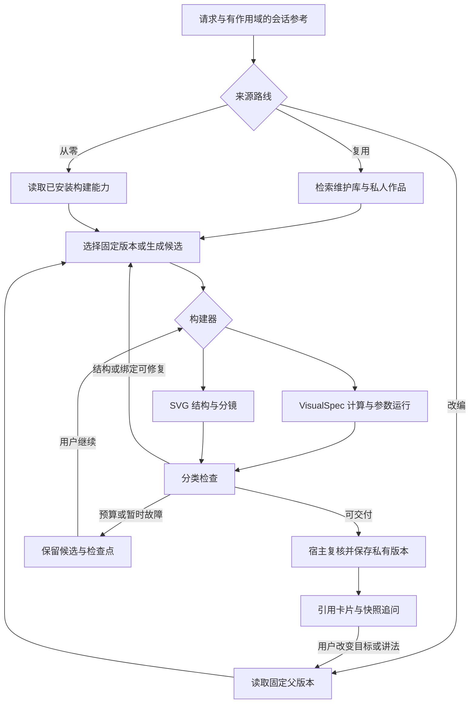

# 图解与动画插件工作流

图解与动画的用户入口是 `educational_visuals` 插件。Tutor 保留主对话控制权；工作流属于 Learning Design 内部能力。Web 和 Desktop 加载同一个插件包与工作流，只注入不同的认证请求和模型调用桥接。旧消息中的 VisualArtifact / VisualBundle 继续可读，新请求不再走主 Agent 中的 VisualBrief 强制校验分支。

## 使用与产品位置

在聊天中启用「图解与动画」插件，或直接明确要求图解/动画。明确请求会启用该会话插件，工具记录仍遵守现有会话粘性规则。普通解释不会自动生成作品。工具能力目录不再把它列为独立系统核心能力。

聊天卡片显示作品并可展开到既有纸张；从同一卡片播放、逐步查看、调参、追问、反馈、继续未完成任务或创建个人改编。没有第四类主 Agent，也没有独立应用或第二套学习者画像。

## 一次构建的工作流

图是有界工作流，编排状态使用类型化代码，不为节点额外引入通用 Agent 或新的编排依赖。简单请求合并规划与构建；不为每次生成强制增加一轮模型审稿。运行时重新计算实际数值，分镜检查结构、引用、有限布局与可播放变化。验证报告明确各自范围，不能把作者写的结构示意称为数值证明。

来源与表现形式分开：`auto / reuse / adapt / fresh` 决定作品来源，`diagram / animation` 决定呈现。检索未命中仍可从零生成；用户指定的矩阵、网络参数和算法输入不得被相似的维护案例替换。个人改编保留固定父版本，维护库不会自动吸收私人作品。

## 已安装构建器

| 构建器 | 输入与适用场景 | 实际输出与验证范围 |
| --- | --- | --- |
| `visual_spec` | VisualSpec 0.1/0.2；矩阵、卷积、梯度下降、算法状态等已注册运算，及既有维护案例 | 数值/状态 trace、参数重算、快照；域运算校验与作者分镜的验证范围分别标识 |
| `svg_story` | 独立的 story_version=1 节点、关系和步骤 DSL；结构、机制、协议流程 | 宿主布局的安全 SVG 分镜、文字说明、稳定对象和快照；结构示意，不声称执行了数值模拟 |

两者消费不同构建契约，统一返回作品引用。未安装 Manim、任意 HTML/JS 沙箱或生图 API；这些工具未来可以接相同引用与版本协议，但本版本不伪装已具备它们。

## 保存、恢复与教学迭代

宿主 `/api/visuals/workspace` 管理私有 Job、Work、Revision、Run、ViewState 和反馈审计。读取与写入都从已认证 learner 重新校验 ownership；项目/会话作用域创建后固定。插件接不到数据库、Cookie、任意 URL 或核心学习对象写接口。

- Job 保存请求、路线、候选、诊断、阶段、版本和终态。检查点使用 expected_version 防止旧执行覆盖新状态；完成和重试使用幂等键。
- Revision 是不可变源作品；改讲法、教学目标或结构产生新版本，不覆盖上一个有效版本。
- Run 是参数运行；参数变化由宿主重新计算，并保留相应的运行和快照。
- ViewState 保存步骤、速度和焦点；这类显示变化不制造作品版本。
- 反馈保存所指作品/运行/快照及明确意见。后续改编是另一个有界任务，不能无限自我反思；观看、生成与反馈均不推导掌握。

插件结果限制仍为 128 KiB，返回 `learnflow.plugin-object.v1` 中的 `visual_work@1.0.0` 小引用。大规格、trace 和 SVG 通过认证宿主接口按作品读取，避免 CNN 42 帧结果撑破工具协议。

## 失败处理

格式、引用或真实编译错误返回精确路径并有限修复；不能把补齐 Brief 文案字段当成生成前提。没有通用领域检查器时明确标注示意范围，不因缺检查器认定作品错误。发现实际错误不把错误候选当成可用作品。预算耗尽或暂时故障保存候选并暂停，用户可以继续；取消后旧执行不能发布。身份、权限与安全边界错误终止对应操作。恢复优先继续已有候选，避免重新调用已完成的生成步骤。

作品源数据、运行、反馈不进入五核权威。重要私有产物操作通过 `visual_workspace_changed` 零 target EventContract 审计，只有已有正式实践证据链能够更新学习状态。

## 验收边界

仅维护少量黄金链路：CNN 维护案例复用、从零矩阵计算、从零 SVG 分镜，以及暂停/恢复/取消/私人改编链路；同时验证跨 learner 隔离、幂等、旧版本保留、两端共享实现和插件禁用时无普通解释误触发。维护案例库继续沿官方计算机学习路径检索。

Contract impact：新增 host artifact grant、私有持久化表、manage_visual_workspace capability 与零 target operational event。保持四个插件扩展点和三类主 Agent；VisualSpec 与旧聊天对象可读，数据库为新增表，不迁移或重写既有学习数据。共享 core 版本 0.2.1，注册表 2026-09-07.3。
