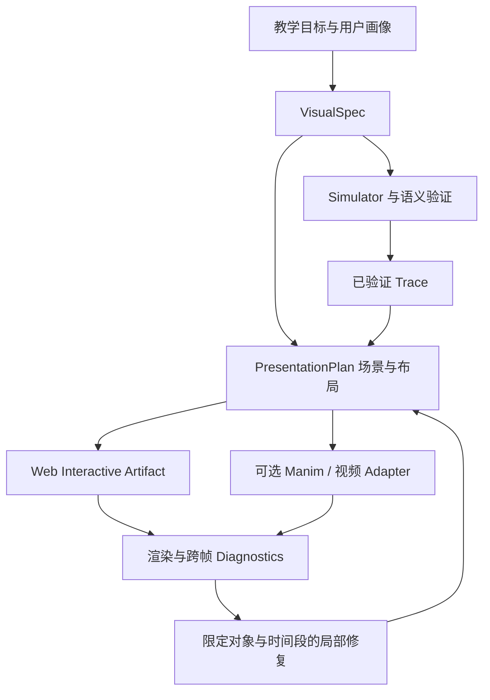

# 代码驱动教学动画：四项工作核验与 Visualize 设计增补

日期：2026-09-06｜设计增补版本：0.1.1｜适用基线：VisualSpec 0.1.0
范围：TeachMaster、Code2Video、LAVES/LASEV、OmniManim 的论文、部分项目资料及 Code2Video 评估源码。未运行其完整生成流程，未复现性能、成本或学习效果。本文“核对”指原文可查，不等于独立验证作者实验。

## 1. 对本项目的判断

这些工作支持继续采用可编辑、可执行的结构化中间表示，但没有理由因此把当前产品改为“每次让模型写一个 Manim 视频”。本项目需要学生操作图、改变参数、询问当前状态；视频生成研究主要解决自动内容制作。应共享教学计划与计算事实，分别输出交互 Artifact 或教学视频。

建议现在吸收：场景/布局计划、跨帧诊断、局部修复和独立教学评估。稍后增加音画同步与视频导出。是否采用多个模型角色、训练布局模型、放开代码生成，应由本项目消融实验决定。

关于“pixel-level video generation 不适合严肃教学”的结论，应收敛为项目规则：**公式、数值、关系、步骤和状态不能依赖未经验证的像素生成；图像/视频模型可生成情境素材，但必须与可核验的语义层分离。** 可执行代码也可能稳定地产生错误，code-centric 不等于 correctness-guaranteed。

## 2. 四项工作的原文核对

### 2.1 TeachMaster

核对版本为 [2601.04204v2](https://arxiv.org/html/2601.04204v2)，2026-04-25。它将教学意图转成分页内容，分开生成视觉与讲述，再做调试、同步和布局修复；也允许把生成图像作为可编程素材。§3.2 报告其部署配置下制作 45 小时课程约 $83.70，并与传统课程费用比较得出约 0.3%。这是作者报告的特定成本口径，不是对我们系统的降本保证。

**本项目采用决策**：把教师可编辑的教学目标、先修依赖、场景顺序放在渲染代码之前；音频采用独立轨道。成本验收按“成功且通过审核的教学任务”计算，并计入人工复核与失败重试。

### 2.2 Code2Video

[论文 v1](https://arxiv.org/html/2510.01174v1) 的 Planner/Coder/Critic、视觉锚点与 ScopeRefine 局部修复值得关注。MMMC 不是只有“117 个主题”：原文有 117 个长视频及 339 个片段，共 456 单元、13 类；材料来源偏向 3Blue1Brown。TeachQuiz 比较模型学生在受控条件下看视频前后的答题表现，不能直接代表真实学生学习提升。

[官方仓库](https://github.com/showlab/Code2Video) 提供可检查的实现。[eval_TQ.py](https://raw.githubusercontent.com/showlab/Code2Video/main/src/eval_TQ.py) 中，unlearning 通过 prompt 条件进行，learning_gain 为看视频后的得分减去该条件下的得分；不是参数级遗忘训练。代码还以“得分未上升”作为 unlearning_success 的简单判据。我们不能把这个标记视为已证实知识真的被移除。

**本项目采用决策**：借鉴故障定位与增益评价思路，自建覆盖系统、安全、工程等方向的测试集。MMMC 可作外部参照，不能替代专业群领域回归。自动代理评价仅作辅助指标。

### 2.3 LAVES / LASEV

你提供的工作对应 [2602.11790](https://arxiv.org/html/2602.11790v2)，其摘要和正文/项目中的简称存在 LAVES、LASEV 两种写法，[作者项目页](https://robitsg.github.io/LASEV/) 使用 LASEV。它拆分解题、图示与讲述，并结合语义、规则和执行检查。论文表中数学内容 Publishable 为 96%，Perfect 为 58%，两者不能混称“96% 完全正确”。成本和吞吐也属于作者的特定部署报告。

**本项目采用决策**：解题真值与讲解方式分开，先验算再组织叙事；报告分别记录可生成、可发布、无已知缺陷和学习有效，禁止合成一个“质量率”。语义正确、运行成功和表达清楚必须分别过关。

### 2.4 OmniManim

[论文 2605.15585v1](https://arxiv.org/html/2605.15585v1)，2026-05-15，强调共享场景状态、稀疏 keyframe 布局、插值过程约束与结构化渲染诊断。其 Vision Agent 包含专门训练的 coarse-to-fine 布局预测机制，并非普通截图问答。附录写的是计划发布训练/评估等材料，本次没有核实到可直接复现实验的完整开放包。

**本项目采用决策**：优先用现有语义对象的 bounding box 和路径做确定性检查，再用截图补充诊断。先实现布局约束与局部修复，不立即承担训练布局模型的成本。

## 3. 哪些结论可以落地，哪些需要保留

| 项目判断 | 结论强度 | 工程动作 |
|---|---|---|
| 精确符号与步骤适合结构化表达 | 对本项目合理且与研究方向一致 | 保留 VisualSpec + 确定性模拟 |
| 可运行不代表布局正确 | 可直接构造反例验证 | 加入真实渲染与动画过程检查 |
| 布局错误应局部修复 | 有明确工程收益假设 | 测修复成功率、成本、回归率 |
| 更多 Agent 必然更好 | 这些结果不足以支持 | 逻辑角色先实现为工作流；按信息增益决定拆分 |
| 同一框架可覆盖整个专业群 | 未被现有基准充分证明 | 用 32 领域目录逐包验收 |
| 代理学生得分等于真人学习 | 不成立 | 真人前后测/迁移题单独评估 |
| 成本能降到传统方式的 0.3% | 不能迁移到本项目预算 | 统一内容长度、质量、成本分母后重新测量 |
| 文生图完全无用 | 不应如此概括 | 允许素材，禁止其成为精确语义真值 |

以上是本项目的采用判断，不是四篇论文共同证明的定理。

## 4. 对现有架构的具体增补

### 4.1 增加 PresentationPlan，而不重写 VisualSpec

VisualSpec 继续表达教学语义、模型参数、对象与交互。编译侧增加 `PresentationPlan`：把经过校验的语义对象安排到场景、布局、可见时段和讲述锚点。



这里的 PresentationPlan 是**编译侧拟定契约**，不向现有 `VisualSpec 0.1.0` JSON 根直接添加新字段。当前 schema 使用封闭字段，直接加 `scenes` 应被拒绝。若未来需由模型直接编写布局约束，应通过版本化 schema 扩展。

### 4.2 布局计划应包含什么

| 字段组 | 建议内容 | 约束 |
|---|---|---|
| identity | plan_revision、spec_digest、trace_digest | 必须能追溯同一内容版本 |
| scenes | scene_id、目标、semantic step 区间 | 不复制计算真值；用引用 |
| object lifecycle | object_id、出现/消失、所属场景、持久性 | 处理前一场景残留、对象身份变化 |
| layout constraints | viewport、margin、min_text_size、above/inside/align | 区分硬约束和偏好，不能把所有物体一律禁重叠 |
| spatial plan | normalized bbox、布局组、z-order | 屏幕坐标不能替代数据坐标 |
| temporal plan | semantic anchors、transition path、可见区间 | 插值时间与语义 step 分离 |
| accessibility | reading_order、focus_order、motion fallback | 降级后仍可完成教学任务 |
| narration（可选） | segment_id、script、semantic_anchor、audio_ref | 语音长度和实际时间由 TTS/对齐阶段产生 |

不建议一开始要求模型给所有像素坐标。优先让它选结构关系与布局模板，再由代码求解；布局不可满足时减少内容或拆场景，而不是不断缩小字号。

### 4.3 跨帧验证规则

必须区分三类正确性：语义状态正确、视觉终点正确、过渡路径可读。前两类不能推出第三类。

例如两个数组元素交换位置，起终点没有遮挡，直线移动到一半可能重合。需要检查路径，或改成分层弧线；但不能为了“避免重叠”更改数组排序结果。概率面积本来就应在曲线下方，集合交集也必须允许重叠。

初版方案：关键帧 + 中间采样 + 高风险区间加密；可解析的线性/分段路径再增加连续碰撞检测。固定采样只能降低遗漏，不能证明全部时刻无冲突。

建议规则：

- `TEXT_OCCLUDED`：文本可读区域被非许可对象遮挡。
- `VIEWPORT_OVERFLOW`：目标对象越过可视范围，且未被明确设计为裁剪。
- `UNINTENDED_OVERLAP`：违反该对象对的 overlap policy。
- `RELATION_BROKEN`：箭头失去锚定、包含/排列关系破坏。
- `STALE_OBJECT`：场景已结束但对象仍残留。
- `SCALE_MISMATCH`：比较图失去约定的共同刻度或单位。
- `TRANSITION_COLLISION`：过渡路径发生未许可遮挡。

Web 路线优先使用自身 scene graph、DOM/SVG 几何和绘制记录检测，避免只靠图像反推对象。截图适合发现字体替换、实际裁剪与像素层问题；VLM 处理“这次重叠是否有教学意图”等难以完全规则化的判断。

### 4.4 RenderDiagnostics 与局部修复

诊断示例是拟定接口，不是现有已实现 tool 返回值：

```json
{
  "diagnostic_version": "0.1-draft",
  "spec_revision": "r1",
  "presentation_revision": "p3",
  "scene_id": "array-swap",
  "semantic_anchor": {"from_step": 2, "to_step": 3},
  "visual_time_range_ms": [240, 410],
  "code": "TEXT_OCCLUDED",
  "object_ids": ["item-a-label", "item-b-label"],
  "overlap_policy": "forbidden",
  "evidence_ref": "preview-swap-midpoint",
  "allowed_repair_fields": ["transition_path", "label_offset", "scene_layout"],
  "semantic_mutation_allowed": false
}
```

修复器输入小范围场景、受影响对象和证据；返回受控 patch，不生成整个课程。先对 expected_revision 做并发检查，然后验证 patch 没有修改语义字段，再重渲受影响时间段及相邻段。

布局修复默认不得改变参数、公式、状态、边权、节点身份或评分逻辑。若必须改变教学内容，转回 Planner/Builder 生成新 Spec revision，并重新模拟与验证。缓存失效沿依赖图传播：字体变化可能影响全部场景，不能只检查一个 bbox。

### 4.5 可选音画同步

用 semantic anchors 连接讲稿与步骤，避免模型凭估计秒数编排全部时间。TTS 生成实际音频后，再调整 pause、highlight、transition 和字幕；检查字幕时间区间、指代对象可见性、讲述内容与当前状态是否一致。

学生在交互图中暂停或拖参数后，预录讲述可能失效。默认暂停该段音频，重新绑定当前 run 的解释；不能继续播放旧参数下的“现在 α=0.75”。视频导出只对应一个确定参数快照，不冒充任意交互状态的叙事。

## 5. 代码与 DSL 如何共存

建议三层而非二选一：

1. **语义层**：VisualSpec + 校验后的 Trace，保存状态真值与教学意图。
2. **表现层**：PresentationPlan，保存场景、布局、路径、讲述锚点。
3. **执行层**：受控 adapter 将计划转换成 React/SVG/Canvas 或 Manim 程序。

高频任务由可信模板编译，不要求模型每次自由写代码。长尾确实无法表达时，再走隔离的 code synthesis 实验分支；通过审查的复用能力才能进入 registry。新代码运行成功之后，仍需学科验证、视觉验证和交互验收。

这种分层允许保留代码的表达力与编辑性，同时维持 Tutor 必需的类型、状态回流与权限约束。Manim 是后端选择之一，不承担通用教学语义。

## 6. 教学评估：借鉴增益思想，避免代理指标替代目标

现有系统增加两套互补评估：

### 6.1 快速自动回归

对同一隐藏题集比较：不提供材料、仅提供解释文本、提供静态图、提供交互操作后快照或视频。优先测试“学生能否预测、构造反例、解释状态变化”，不只测试记住标签。对代理学生记录其模型/版本、提示词、输入模态与是否已答对。

“移除知识”的提示词不视为可信的遗忘操作。可将陌生合成规则、小型虚构协议或新状态机作为补充任务，减少模型先验知识混淆，但其效果仍不能直接等同人类学习。材料有题目答案泄漏时必须单独标记。

### 6.2 真人效果

真人前测、独立后测、结构不同的迁移题和延迟保留继续作为学习效果证据。随机分组或匹配基线，控制时间、提示、先修和题目难度；呈现零效果与负效果领域。

单独记录：执行成功率、语义通过率、布局通过率、可发布率、无已知缺陷率、代理答题增益、真人学习增益。指标分母不能静默排除渲染失败或未完成样例。

## 7. 建议新增的实验与实施优先级

| 优先级 | 改动 | 小实验 | 验收依据 |
|---|---|---|---|
| P0 | Object lifecycle + 布局约束 | 3 个现有示例，每个加入窄屏/长标签/极值/场景切换 | 抓住已注入缺陷，正常教学重叠不误杀 |
| P0 | 跨帧检查 | 元素交换、标签移动、箭头转接 | 终点正常但中途冲突的用例可定位 |
| P0 | 局部修复 | 相同错误，比较局部 patch 与整图重生成 | 成功率、成本、延迟、语义漂移与新错误 |
| P1 | 教学增益评估 | 12 个跨领域任务，比较文字/静态/交互 | 分任务结果；代理指标与真人结果分开 |
| P1 | 场景分段 | 一个复杂图与多个连续小场景 | 目标完成、解释正确、主观负荷与耗时 |
| P2 | TTS/字幕/视频 adapter | 固定参数导出一段带语音解释 | 锚点对应、字幕、总时长、状态版本一致 |
| P3 | 学习型布局规划器 | 规则基线确有稳定不足再构建数据 | 对未见内容/组合/屏幕的增益覆盖训练成本 |

实验至少设置“无布局计划”“仅关键帧检查”“含中间过程检查”“局部修复”几组消融。预算统一；生成失败纳入统计。预设正常 overlap，例如 Venn 交集、曲线下面积、节点包含标签，检查误拒绝。

推荐先补已有三例的 PresentationPlan/Diagnostics，而不是先复现四套完整多 Agent 视频系统。先证实可重复的工程收益，再决定加入哪一个训练或编排模块。

## 8. 对长期 Context 的修改与未做工作

主文档新增 §25 并更新 §12、§19 的阅读指引；开发 Context 增加“表现计划、过渡检查、局部修复”的规则。文档版本升为 0.1.1，**VisualSpec schema 仍为 0.1.0**。新结构是编译侧设计提案，未作为已实现字段加入三个样例。

本次没有安装/运行这四套系统，没有训练布局模型，没有生成视频，没有将代理分数当真人实验。也未据此扩张原 45 项参考检查的覆盖范围。后续任何代码复用需单独核对仓库版本、许可证、依赖和本项目契约。
