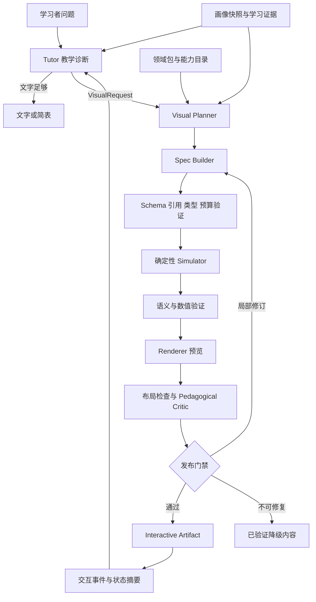

# 计算机专业群教育智能体 Visualize 系统技术设计文档

版本：0.1.1｜状态：实施基线草案（Proposed）｜日期：2026-09-06
读者：产品与教学设计、前后端、模型应用、测试、学科负责人、开发 Agent
现有前提：Tutor 使用 DeepSeek V4 Flash；已有领域知识与用户画像上下文；Visualize 能力薄弱。本文不要求替换现有 Tutor、知识库或 Agent 框架。

> 本文定义一套拟建系统，不声称复现 GPT、豆包或 Kimi 的私有实现。文中 MUST 表示项目必须实现的约束，SHOULD 表示默认实现，MAY 表示后续可选能力。所有延迟、质量门槛和周期均为建议验收目标，不是已实测的产品表现。本交付包含设计、机器可读 schema 和契约样例，不包含已上线的 Renderer 或教学效果验证。

## 阅读导航与规范优先级

- 架构与职责：§1–3；自动路由和用户画像：§4–5。
- 可组合原语、教学模式、32 个领域：§6–8。
- VisualSpec、状态机、验证：§9–11。
- Renderer、工具、Skill 与交互回流：§12–15。
- 故障、安全、评估、工程目录、Roadmap：§16–21。
- 决策记录、来源、交付边界：§22–24。
- 代码驱动教学动画研究增补：§25；文档 0.1.1，VisualSpec 保持 0.1.0。

规范冲突按以下顺序处理：安全与状态一致性硬约束 → 版本化 schema + registry 的字段契约 → 本文语义规则 → 领域包与 Skill → 示例。示例不能扩大 schema 权限；发现冲突必须提修订，不得悄悄改参数。运行时只接受已安装能力清单中的 schema、primitive、simulator 和 validator 版本。

## 1. 产品目标与设计原则

### 1.1 要解决的问题

Visualize 的输出是一个师生共享、可操作、可回放的认知对象（Interactive Artifact）。学习者能够调参数、预测下一步、查看中间状态、提出针对当前图的疑问；Tutor 能读取准确状态并继续解释。

主要链路：

**教学诊断 → Visual Planner → VisualSpec/DSL → 验证与模拟 → Renderer → Pedagogical Critic → Interactive Artifact → 交互状态回流 Tutor。**

“解释清楚”必须被转化为可观察目标，例如“学生能预测 α=0.75 时下一步跨过最优点，但距离缩小”，不能只写“理解梯度下降”。

### 1.2 系统原则

1. **语义正确优先于观感**：程序化、结构化、可交互视觉为主；文生图只用于不承载精确语义的情境素材。公式、标签、箭头、数值和协议步骤必须由结构化层产生。
2. **先诊断，再选择表达**：问题类型和用户画像进入 Planner；学习者尚不具备先修知识时先分解任务，不靠堆更多图层弥补。
3. **确定性代码处理不变量**：算法、数值、协议、权限、重放和版本一致性由代码保证；模型处理教学目标、视角、类比与注释。
4. **组合优于知识点组件枚举**：Primitive + Layout + State + Transition + Interaction + Annotation + Pattern 构成内容。`GradientDescentLesson` 可以是内容模板，不能成为唯一可调用的渲染能力。
5. **渐进披露**：先展示目标相关结构，细节通过点击、展开、联动视图读取；一个 Artifact 默认一个可考核主目标。
6. **视觉不是必选项**：词义、单步计算、已经清晰的简短定义可文字回答；动效不能作为使用量 KPI。
7. **完整闭环先于广覆盖**：MVP 也必须有验证、回流、错误路径与无障碍，不把它们推迟到“最后加 Critic”。
8. **实测适配模型**：使用用户现有 DeepSeek V4 Flash；不预设它具备视觉输入、完整 JSON Schema 支持或固定延迟。能力由部署端点探测确定。

### 1.3 不应写入产品承诺的推断

动画不必然提升学习；点击多不等于掌握；图上相关性不等于因果；有限模拟不等于定理证明；LLM 自评通过不等于正确。本文的教学模式是需评估的设计假设。

原讨论中“任意算法只要描述状态就能动画化”应改为：已具备准确状态语义、合法转换规则、可视编码和足够验证覆盖的过程，可以交由通用播放器呈现。模型不能凭空补全未实现的模拟语义。

## 2. 组件职责、输入输出与所有权

| 组件 | 负责 | 输入 → 输出 | 不负责 / 必须避免 |
|---|---|---|---|
| Tutor | 对话、诊断假设、主教学目标、回答当前图问题 | 问题 + 画像 + 学习证据 → VisualRequest / 解释 | 不指定未经验证的数值或每个像素 |
| Visual Planner | 选领域、误解类型、视觉策略、复杂度、交互与检查点 | VisualRequest + 相关画像 + 能力目录 → PedagogicalPlan | 不执行代码；不绕过能力限制 |
| Spec Builder | 把计划映射为可组合声明 | Plan + 原语契约 + 领域包 → VisualSpec | 不输出任意 React/JS；不伪造验证结果 |
| VisualSpec / DSL | 版本化语义契约；描述对象、绑定、交互、模拟配置 | JSON 文档 | 本身不是可执行脚本，也不是教学正确性证明 |
| Tool | 给 Agent 的窄接口；参数校验和稳定返回 | 有类型请求 → job / ArtifactRef / 结构化错误 | 不等同于 Skill；不把几十个底层 API 全部暴露给 Tutor |
| Skill | 教学决策流程、反例、领域选择与修复方法 | 按需加载的自然语言规范 | 不执行模拟；不作为权限边界 |
| Harness | 编排、预算、取消、幂等、重试、上下文、状态与日志 | 模型与工具结果 → 可审计工作流 | 不依赖模型自己决定是否通过硬门禁 |
| Simulator | 计算领域状态、转换与派生数据 | 固定版本模型 + 参数 + seed / 调度 → Trace | 不排版；不让动画插值改变数值语义 |
| Validator | schema、引用、类型、数学/算法不变量与资源检查 | Spec / Trace → 有范围的 VerificationReport | 不用 LLM 评语替代 oracle |
| Renderer | 布局、坐标变换、图元、可访问性、事件映射 | 已验证 Spec + Trace + ViewState → UI / 静态导出 | 不决定算法下一步，不偷偷修正业务数据 |
| Pedagogical Critic | 检查目标匹配、误导、负荷、可读性、预测题 | Plan + 检验报告 + 场景快照 → 修订建议 | 不能覆盖验证失败；没有视觉输入时不得声称看过图 |
| Evaluator | 离线/在线统一评测框架 | 用例、oracle、评分规程、行为结果 → 指标与回归 | 与单次 Critic 不同；不能仅评“美观” |
| Artifact Runtime | 播放、控件、同一语义对象的多视图、事件记录 | RenderBundle + 事件 → 新状态与 TutorContext | 不将浏览器自报成绩当可信学习证据 |

角色是逻辑边界，不意味着每层都部署为独立 Agent 或微服务。MVP 采用现有服务中的工作流 + 共享类型包 + 浏览器 Runtime；Planner 与 Builder 可用同一模型分两阶段执行。熟悉模板可一次模型调用返回 Plan + Spec，但仍分别验证。

建议责任分配：平台后端拥有 Harness 与 Artifact Store；前端拥有 Runtime 与 Renderer；学科工程师拥有 Simulator 与 oracle；教学负责人拥有误解分类、Pattern 与题目；模型工程师拥有 Planner、Skill 和路由评测；QA 对发布门禁负责。

## 3. 端到端架构与发布流程



### 3.1 一次构建

1. Tutor 给出原问题、证据片段、诊断假设与目标，引用已有画像快照；不能重建一份不一致的用户档案。
2. Router 检索相关领域包与能力；Planner 返回结构化 Plan，允许 `text_only`、`needs_clarification`、`unsupported`。
3. Builder 产生 CandidateSpec。服务端校验字节数、层级、schema、引用和能力，不接受半截流式 JSON。
4. 模拟器计算 Trace；服务端合并强制 validator 清单，执行 oracle、参数边界、数值稳定性和终止检查。
5. 在隔离预览中渲染默认状态、教学检查点、参数边界与故障态；检查溢出、遮挡、坐标、标签与可访问性。
6. Critic 看目标和已验证状态、结构快照，必要时看截图；仅返回问题与限定修订。修改 Spec 后重新计算受影响验证。
7. 发布服务依据报告签发不可变版本与清单。只有服务端能赋予 `ready` / `degraded`，模型不能生成可信状态。
8. 用户控件改变参数时计算新 run；Runtime 更新状态，提交语义事件，Tutor 获取同一 revision 下的快照。

### 3.2 构建状态机

`queued → planning → validating → simulating → rendering → evaluating → ready`。

任何阶段可进入 `failed` 或 `cancelled`；可恢复失败进入原阶段的下一 attempt；语义保持的替代输出为 `degraded`。服务端记录 `job_id, attempt, spec_revision, stage, started_at, elapsed_ms, error_code`。重复请求用幂等键查询既有结果，不重复计费构建。预算耗尽停止，不能无限生成—批评循环。

### 3.3 内容真值与缓存

- Spec 保存语义意图；Trace 保存计算事实；ViewState 保存观看位置；Evidence 保存学生作答。四者分离。
- 内容键建议为 canonical JSON(Spec) + schema/registry/simulator/renderer 版本 + dataset digest + seed + 数值模式的哈希；先定义规范化规则，不能随意对浮点字符串重排。
- 画像只影响计划和难度，不把敏感原文写入共享缓存键或可公开 Artifact。共享的是脱敏内容结构，个人答题与会话状态单独按租户授权存储。
- Spec 改动生成新 revision。旧链接可回放原版本；迁移必须有显式函数和回归用例，禁止读取时静默升级语义。

## 4. 领域分类与自动路由

### 4.1 多轴分类

不要用单标签 `domain="CS"`，也不要把词“网络”直接判为计算机网络。采用以下独立轴：

| 轴 | 内容 | 示例 |
|---|---|---|
| curricular domain | 主领域 + 次领域 | `optimization` + `machine_learning` |
| concept | 稳定概念 ID、课程映射、同义词 | `gradient_descent.step_size` |
| misconception | 认知障碍，多选并带证据 | `rate_vs_amount`, `local_vs_global` |
| task | 解释、预测、调试、比较、构造、证明辅助 | `predict_next_state` |
| representation | 抽象结构、时序、几何、统计、代码联动 | `trace`, `parameter_sweep` |
| capabilities | 设备、无障碍、模拟器、资源与权限 | `svg`, `stepper`, `reduced_motion` |

主领域按本次教学目标归属，次领域记录先修或交叉依赖。比如“为什么 attention 的矩阵要除以 √d”主领域可为 `nlp_llm`，次领域为概率与线性代数；不要把完整三套课程 context 都装入模型。

随附 [机器可读路由候选目录](context/domain-routing-catalog.json) 包含 32 个领域的模式、原语和 Renderer 候选，全部标为 planned。它是检索种子，不是按关键词直接执行的规则，也不代表已安装生产能力。

### 4.2 Misconception taxonomy v0.1

| ID | 典型障碍 | 优先策略 |
|---|---|---|
| `structure_relation` | 对象与关系、层级、引用混淆 | graph / decomposition / linked views |
| `state_sequence` | 不理解哪个状态先发生 | step-through + code trace |
| `causal_mechanism` | 看见结果，不知道机制 | controlled comparison；区分实证与假设 |
| `representation_mapping` | 代码、公式、图之间不会对应 | linked highlighting |
| `scale_units` | 数值规模、单位或坐标轴误读 | calibrated plot + units |
| `rate_vs_amount` | 导数与函数、速率与累计量混淆 | quantity/rate 双视图 |
| `local_vs_global` | 局部决策当全局保证 | counterexample + multi-scale |
| `probability_measure` | 密度、高度、面积、条件样本空间混淆 | region + frequency + distribution |
| `randomness_variability` | 单次样本当规律 | seeded repeated sampling |
| `concurrency_order` | 同时与交错、因果与时钟混淆 | timeline + happens-before |
| `abstraction_boundary` | 混淆语言、机器、协议或系统层 | layered decomposition |
| `invariant_constraint` | 只看终态，不理解全过程约束 | invariant overlay + counterexample |
| `geometry_transform` | 基变换、投影与空间关系障碍 | vectors + transformation |
| `optimization_tradeoff` | 以为指标能同时最优 | Pareto / sweep / comparison |
| `generalization_evidence` | 样本内拟合等同真实泛化 | train/test linked comparison |
| `unknown` | 诊断证据不足 | 一个预测问题或最小两例比较 |

模型输出的是误解假设，不是学习者的永久属性。显式区分“用户说 X”“作答显示 Y”“模型推测 Z”，记录 evidence_ref 与不确定性。

### 4.3 路由算法

```text
1. 根据当前问题 + 教学目标 + 已有课程位置检索 top-k concept/domain（建议 k=3）。
2. 规则提取实体、语言/协议/数学约定；画像只取相关先修技能和 UI 需求。
3. 模型联合判断主/次领域、misconception、task、是否需可视化；输出候选及证据。
4. registry 按 required capabilities 过滤不可执行候选。
5. 对剩余候选排序：目标匹配、可验证性、认知负荷、交互收益、成本。
6. 编译选择 renderer；模型仅给 preference，最终受设备和能力硬约束。
7. 多候选难分且会改变语义时，向学生问一个有区分力的问题；否则给最小共享视图。
```

初期排序为可解释规则，不把模型自报 confidence 当校准概率。后续用人工路由集校准；低置信阈值由误路由成本确定。应支持 `no_visual` 和 `unsupported`，不可为了“覆盖率”硬选最接近的模拟器。

### 4.4 路由实例

| 用户问题 | domain / misconception | strategy | primitives | renderer / oracle |
|---|---|---|---|---|
| “两个线程各加一次为什么不是 2？” | concurrency / concurrency_order | 交错反例、预测下一步 | timeline + code + memory | SVG / 枚举教学机器调度 |
| “密度能大于 1 吗？” | probability_statistics / probability_measure | 保持面积对比高度 | axis + curve + region + number | Plot / CDF 差与归一化 |
| “token 都生成完了 KV cache 还做什么？” | nlp_llm / state_sequence | prefill/decode 分解 | matrix + sequence + timeline | SVG / shape 与缓存长度 |
| “缓存失效为什么还读到旧值？” | 待分：architecture / distributed / web_platform | 先确认缓存层与一致性约定 | layer + timeline | 未确定前不执行特定模拟 |
| “贝叶斯公式是什么？” | probability_statistics / 未必有误解 | 简式解释或频数表 | table（按需） | 静态 / 频数核对 |
| “证明算法对所有输入正确” | algorithms / invariant_constraint | 不变量与反例辅助 | code + graph + annotation | SVG / 有界检验，不能冒充一般证明 |

### 4.5 DomainPack 注册契约

每包 MUST 提供：`id, version, aliases, concept_ids, prerequisites, supported_tasks, misconception_rules, primitive_requirements, patterns, simulator_refs, validator_refs, assumptions, prohibited_inferences, golden_cases, fallback`。补充语言标准、协议版本、矩阵约定、概率假设等关键 metadata。

能力状态分 `planned / experimental / production / deprecated`。§8 是完整规划目录，不代表 MVP 已安装所有领域能力。Router 只能用 `production`，明确试验开关下可用 `experimental`；`planned` 仅供知识说明与开发计划。

## 5. 用户画像如何进入 Visual Planner

Planner 应消费已有 LearnerProfile 的裁剪快照，包含：相关概念的 mastery estimate 与证据日期、先修缺口、最近错误答案、熟悉的语言/符号、阅读语言、可访问性、设备能力、当前目标和愿意投入的时间。不要输入与教学无关的身份、联系方式或全量历史。

```json
{
  "profile_snapshot_ref": "profile_snapshot_17",
  "known_concepts": ["derivative", "quadratic_function"],
  "uncertain_concepts": ["iterative_optimization"],
  "recent_evidence": [{"ref": "answer_42", "observation": "认为步长越大越快"}],
  "presentation": {"language": "zh-CN", "notation": "column_vectors", "reduced_motion": true},
  "objective": "预测过冲与发散的区别"
}
```

同一反向传播目标的适配：初学者先展示标量计算图和局部变化；熟悉微积分者展示每条边的局部导数和链式相乘；熟悉张量者增加 shape、Jacobian-vector product 与梯度累加。不能把“误差像物质倒流”当严格语义；教学类比必须注明适用边界。

默认每图 1 个主目标、1–2 个主要控件、2–3 个可见视图是初期设计预算，需用真实学习任务验证。熟练用户可自行展开细节。不要采用未经验证的“视觉型学习者”标签锁定教学媒介。

画像回写只提交证据事件与候选更新，例如“无提示预测正确 2 次，覆盖 α<0.5 和 0.5<α<1”；由现有 Learner Model 决定如何更新。拖动、停留、跳过只能作为行为信号，不能直接升级 mastery。

## 6. Visual Primitive 与组合机制

### 6.1 四层结构

- L0 图形基础：point、line、path、rect、text、axis、region、marker。处理几何、样式和标签，不携带算法语义。
- L1 结构化原语：array、matrix、graph、tree、stack、queue、memory、code、timeline、table、distribution、vector、image-grid。规定数据类型和视觉映射。
- L2 Pedagogical Pattern：comparison、trace、transformation、decomposition、prediction、parameter-sweep、counterexample、sampling、linked-views。规定教学组织，不写具体知识点。
- L3 Domain Model / Template：BFS 模拟器、事务调度器、数值积分器；或组合配方“概率密度与面积”。模板可实例化并展开为 Spec，模拟器是受控程序。

新增知识点优先复用 L1/L2；只有对象语义或交互能力确实缺失才新增原语。新增数值/算法规则通常进入 simulator，不应塞进 SVG 组件。

### 6.2 原语目录与关键契约

| 家族 | 原语 | 数据契约与验证要点 |
|---|---|---|
| 基本关系 | node / edge / group / label | stable ID；边端点必须存在；组关系无循环 |
| 离散容器 | array / stack / queue / deque | 元素 identity 与位置分离；入出队方向明确；不以动画推测数据 |
| 图与树 | graph / tree / dag / state-machine | 有向性、权重、平行边语义；tree 根与 parent 约束 |
| 程序执行 | code / frame / heap / pointer / register | 行号与源码 digest 绑定；地址和对象 ID 区别；语言与机器假设 |
| 时序 | timeline / lane / event / message | 因果边与墙上时钟分离；时间单位；并发无假总序 |
| 数据 | table / matrix / tensor / heatmap | shape、dtype、索引顺序、missing、单位；数值与颜色图例对应 |
| 几何 | axis / point / vector / curve / region / transform | 坐标系、基、domain/range、尺度；视觉裁剪不改值 |
| 统计 | distribution / histogram / interval / sample-cloud | PDF/PMF/CDF 区分；bin 边界；概率质量与密度不同 |
| 系统 | resource-pool / pipeline / packet / cache-line | 由通用容器/时间轴组合；资源容量、协议字段与模型版本 |
| 感知与图像 | image-grid / bbox / mask / feature-map | 像素坐标和原图坐标转换；颜色空间；资产 provenance |
| 解释辅助 | annotation / formula / legend / metric / checkpoint | 注释锚定语义 ID；公式转义；指标可追溯；题目有评分依据 |

MVP 只实现其中一个封闭子集（见 §21）。本包的 core schema 支持 `axis/curve/point/region/array/matrix/graph/code/text/metric`；其余是后续 registry 扩展，不可在 v0.1 中随意写入 kind。

### 6.3 组合和布局规则

组合采用有 ID 的视图和有类型数据绑定。例：BFS = Graph(邻接数据) + Array(queue) + Array(visited) + Text(当前动作) + Stepper(trace)。梯度下降 = Curve(f) + Point(current) + Curve(path) + Metric(loss) + Slider(α) + Stepper；两者复用 State/Interaction/Annotation。

Layout 使用 `stack / columns / grid`、顺序与宽度约束；节点布局由注册算法负责。默认不用模型指定全画布绝对像素。用户拖动图节点的屏幕位置只改 ViewState；修改图边权才改变 SimulationState。

绑定先解析成类型化数据流：数据源 → 派生输出 → primitive input。缺失字段、循环依赖、shape 不符、单位不符均失败。新增 binding 不是执行字符串表达式的许可。

视觉编码必须稳定：同一对象跨步骤保持 ID、颜色和标签含义；selection、active、visited 等采用语义 token。颜色必须与形状/文字共同传达，不只靠红绿。比较图使用共同刻度，若有独立刻度必须显式标记。

## 7. Pedagogical Patterns

| Pattern | 适用障碍 | 操作协议 | 评估点与失败风险 |
|---|---|---|---|
| `trace` | 过程、状态变化 | 预测 → 单步 → 解释变化 → 回放 | 能解释一次转换；不能直接播完泄露答案 |
| `comparison` | 相近概念混淆 | 固定其他变量，只改一项，联动对照 | 学生能指出不变项与变化项；避免偷偷换尺度 |
| `decomposition` | 黑箱或跨层误解 | 总览 → 展开一层 → 连接上层 | 能映射输入输出；避免无限展开 |
| `transformation` | 空间/代数对应 | 拖动参数，原像与像同时显示 | 能预测方向、维度或不变量 |
| `parameter_sweep` | 定量机制与边界 | 先预测临界点，再扫描参数 | 分清单调/震荡/发散；不能只给漂亮轨迹 |
| `counterexample` | 错误全称命题 | 构造最小失败输入，逐步解释 | 能说出原命题缺失的前提 |
| `repeated_sampling` | 随机性误读 | 固定分布，独立重复，展示分布族 | 区分个体、样本统计量和理论分布 |
| `linked_views` | 符号、代码、图断裂 | hover/select 同步高亮 | 能追踪同一对象；不能只有颜色联动 |
| `predict_observe_explain` | 被动观看 | 记录预测 → 放开运行 → 解释差异 | 分开记录初答、提示后答与独立迁移题 |
| `invariant_monitor` | 忽略全过程约束 | 每步显示谓词和首次违反处 | 识别合法状态；模拟检查不是一般证明 |
| `abstraction_ladder` | 混淆不同系统层 | 上下层映射 + 共同事件标记 | 说明抽象省略什么、保留什么 |
| `tradeoff_exploration` | 单指标最优错觉 | 调策略，看多指标与约束 | 解释为什么不能直接比较不同约束条件 |

模式应有 `prerequisites, goal_template, phases, allowed_controls, checkpoint_template, stop_rule, known_misleading_cases`。一个问题最多先选 1 个主模式与 1 个辅助模式；复杂课题拆成多个连续 Artifact。

## 8. 计算机专业群领域设计目录

本分类参考计算机教育知识体系的广度，再按视觉语义和工程模块拆分为 32 个领域，属于本项目分类，不是官方课程目录的逐项复制。CS2023 覆盖体系结构、数据管理、软件工程、安全、HCI、图形、并行分布式及社会伦理等知识领域，可作为学校课程映射的参考。[CS2023 Knowledge Areas](https://csed.acm.org/knowledge-areas/)

每个领域的案例都按“学生任务 → 可操作演示 → 可核验结果”描述。以下推荐表示待实现的领域包能力；是否可路由执行以 registry 的成熟度为准。

### 8.01 程序设计与编程语言 `programming_languages`

- **范围与认知障碍**：变量与对象、值与引用、作用域与生命周期、类型与运行时值、异常与正常控制流、闭包捕获、递归返回；学生常把赋值理解成数学等式，把两个变量同值理解成指向同一对象。
- **视觉范式 / Patterns**：源码—环境—堆三视图联动；逐步执行、别名对比、作用域展开；先展示语义机器，再解释具体实现差异。
- **Primitives**：code、frame、memory、pointer、graph、stack、value-table；闭包 = 环境节点 + 引用边。
- **动态 / 交互**：step into/over/out、修改输入、点击变量追踪引用、预测下一行值；更换语言时必须切换语言语义包，不能共用错误的“通用赋值规则”。
- **程序验证**：固定解释器/编译器版本运行小程序，与 trace 对照；作用域解析、对象 identity、别名、异常路径；C/C++ 未定义行为不得展示为唯一确定结果。
- **案例 A**：Python `a=[1]; b=a; b.append(2)` 与 `b=a.copy()` 对比。学生先预测 `a`，再看同一堆对象或两个对象；验证对象 ID 和结果分别 `[1,2]` / `[1]`。
- **案例 B**：`factorial(4)` 展开与返回。每步定位调用栈、返回值与源码；验证 `4×3×2×1=24`，说明教学栈帧不是某 ABI 的真实字节布局，尾调用优化依语言实现而异。

### 8.02 数据结构与算法 `algorithms`

- **认知障碍**：逻辑结构与物理存储、循环不变量、递归子问题、渐近复杂度与具体耗时、贪心局部选择与全局最优、DP 状态与数组格子混淆。
- **范式 / Patterns**：结构 + trace + 不变量监视；同输入算法对照；递归树与重复状态合并；操作计数替代把播放时长当复杂度。
- **Primitives**：array、graph、tree、queue、stack、matrix、code、metric、annotation。
- **交互**：修改数组/图、单步、断点、选下一节点、调整 gap/分治规模、显示比较次数和移动次数；稳定排序保留元素原始 ID。
- **验证**：多重集守恒、排序结果、稳定性、合法队列转换、最短路径 oracle、DP 递推与穷举小实例；Dijkstra 负权输入需阻断或切换演示目标。
- **案例 A**：BFS 的 queue 与 distance 联动；节点入队时标记 discovered，固定邻居顺序；验证无权图分层距离，包含菱形图去重和不连通分量。
- **案例 B**：Shell Sort 的 gap=4、2、1 对比直接插入排序。统计特定输入上的移动而非宣称“任何输入都更快”；验证每轮 gap 子序列有序和最终排序，说明复杂度依 gap 序列。

### 8.03 离散数学与逻辑 `discrete_logic`

- **认知障碍**：蕴含与因果、必要与充分、量词作用域、集合与元素、关系与函数、递推与归纳、有限例证与全称证明。
- **范式 / Patterns**：真值表—公式—集合区域联动；反模型构造；关系图与矩阵对照；归纳基础和归纳步分区。
- **Primitives**：table、region、graph、matrix、formula、tree、annotation。
- **交互**：翻转命题真值、交换量词、构造有向关系、逐步展示归纳假设允许使用的位置。
- **验证**：有限真值表穷举、集合运算、关系自反/对称/传递性、有限模型满足性；无限域命题必须限定证明手段。
- **案例 A**：比较 `∀x∃y R(x,y)` 与 `∃y∀x R(x,y)`，在两行两列关系矩阵点选边；有限域枚举找到前真后假的反模型。
- **案例 B**：展示 `P→Q` 与逆命题的真值组合。学生选反例行，再联动集合包含关系；不画成“P 发出力量导致 Q”。

### 8.04 计算机组成与体系结构 `architecture`

- **认知障碍**：指令语义与微架构、流水线吞吐与延迟、cache 与主存、地址拆分、局部性、数值编码与数值本身。
- **范式 / Patterns**：位字段分解、数据通路高亮、流水线时空图、cache hit/miss 对照；分清教学 CPU 与真实处理器。
- **Primitives**：bit-array、register、pipeline、timeline、cache-line、memory、metric。
- **交互**：改变访问序列、cache 容量/相联度/替换策略；插入依赖指令；开关 forwarding；逐周期执行。
- **验证**：ISA 子集解释器、地址 tag/index/offset、缓存容量和替换状态、数据冒险检测、周期计数；必须记录写策略与初始缓存状态。
- **案例 A**：直接映射 cache 的两个地址交替访问。学生先预测命中率，模拟显示冲突 miss；换相联度后按相同 trace 计数。
- **案例 B**：五级教学流水线中 load-use hazard。逐周期显示 stall 与 forwarding 生效点；验证寄存器依赖和指令提交值，不用任意移动方块代表周期。

### 8.05 操作系统 `operating_systems`

- **认知障碍**：进程与线程、虚拟与物理地址、阻塞与就绪、调度与同步、页错误与非法访问、文件名与 inode、死锁与饥饿。
- **范式 / Patterns**：进程状态机、CPU/I/O 时间轴、地址转换分层、资源分配图；从一次事件解释状态变化。
- **Primitives**：state-machine、timeline、queue、table、memory、graph、metric。
- **交互**：改时间片、到达与 I/O 时间、页访问串；逐步分配/释放资源；查看页表与 TLB。
- **验证**：调度等待/周转时间、页表映射、替换结果、资源守恒、死锁条件；固定抢占规则与同时间事件处理次序。
- **案例 A**：Round Robin 在时间片 1 与 4 下对同一进程集的表现。学生比较响应和切换开销；验证甘特图时段与等待时间，不把某个量必然更小泛化。
- **案例 B**：虚拟地址拆为页号和偏移，经 TLB miss、页表查询、可选缺页处理。验证物理地址计算；缺页不一定代表访问非法。

### 8.06 计算机网络 `networking`

- **认知障碍**：分层封装、包与字节流、传输/传播/排队延迟、流控与拥塞控制、可靠性与有序性、路由与转发、带宽与吞吐。
- **范式 / Patterns**：端到端泳道、packet 生命周期、窗口与缓冲区联动、拓扑路由、字段逐层展开。
- **Primitives**：graph、packet、timeline、queue、array、metric、plot。
- **交互**：改变丢包、时延、窗口、链路速率；单步 ACK/重传；切换固定版本协议策略。
- **验证**：序列号与确认号、字节守恒、窗口边界、事件时序、路由表与可达性、延迟分解；随机丢包记录 seed 与事件 trace。
- **案例 A**：TCP 教学子集下一个数据段丢失，展示累计 ACK 和重传。明确是超时还是重复 ACK 触发，说明实现策略和计时假设。
- **案例 B**：长度 L 的包经过两条 store-and-forward 链路，分别调整带宽 R 与传播延迟 d；验证每跳 `L/R+d`，不能用包在屏幕上的速度表示全部网络延迟。

### 8.07 数据库 `databases`

- **认知障碍**：逻辑查询与物理计划、JOIN 基数、NULL 三值逻辑、索引与全表扫描、事务隔离与串行化、函数依赖与范式。
- **范式 / Patterns**：关系表联动高亮、算子 DAG、B+ 树页结构、事务时间线与可见版本。
- **Primitives**：table、tree、graph、timeline、matrix、code、metric。
- **交互**：修改小表、选择 JOIN 条件、逐算子执行、切换索引、交错事务、查看快照；标明数据库引擎与隔离语义。
- **验证**：用真实小型数据库核对 SQL 结果及 NULL；按具体模型验证 MVCC 可见性；冲突图检验冲突可串行化，不能代表所有串行化判定。
- **案例 A**：两个存在重复键的表 INNER JOIN。学生预测结果行数，再展开匹配配对；验证笛卡尔候选和过滤，防止默认“一对一 JOIN”。
- **案例 B**：在声明的 Snapshot Isolation 模型下两事务执行 write skew。展示读快照与不同记录写入；验证约束被破坏，区分 lost update，不能暗示所有 MVCC 都阻止异常。

### 8.08 编译原理 `compilers`

- **认知障碍**：字符/token/AST/IR 混淆，语法正确与语义正确、优先级、作用域绑定、SSA φ、优化正确性和寄存器分配。
- **范式 / Patterns**：源码区间—token—AST 联动；自动机逐符号；CFG 与数据流；优化前后等价对照。
- **Primitives**：code、array、tree、graph、table、timeline、annotation。
- **交互**：改表达式、单步 shift/reduce、查看 FIRST/FOLLOW；沿 CFG 路径取值；启用一项优化。
- **验证**：固定文法 parser、AST 构造、类型检查、CFG 边、def-use；小输入对照解释执行；优化需处理溢出、副作用和语言未定义行为。
- **案例 A**：`a+b*c` 与 `(a+b)*c`，点击 token 高亮 AST 子树并求值；验证优先级和求值结果，而非只画不同树形。
- **案例 B**：if 分支在汇合处使用 φ。用户选择前驱路径，看 φ 选相应定义；验证支配关系与路径语义，避免解释为同时计算两边再平均。

### 8.09 软件工程 `software_engineering`

- **认知障碍**：需求与实现、依赖与调用、内聚与耦合、单测覆盖与质量、设计模式与真实问题、版本图与时间线、测试替身与真实服务。
- **范式 / Patterns**：需求—测试—代码追踪矩阵、模块依赖图、变更影响传播、序列图与故障路径、测试缺口反例。
- **Primitives**：graph、table、timeline、code-diff、state-machine、metric。
- **交互**：选择需求查看覆盖链，修改接口后观察受影响模块，切换故障场景，重放 Git 分叉合并；图中的推断依赖与实际静态分析依赖分开。
- **验证**：真实测试结果、依赖分析、schema/契约校验、mutation score、需求链接完整性；不能程序证明“这个架构一定更好”。
- **案例 A**：接口字段由可选变必填。联动调用方、契约测试与 CI 失败点；验证哪些调用真的失效，显示尚未测量的影响。
- **案例 B**：100% 行覆盖但漏测边界的函数，学生构造失败输入；运行 mutation/边界测试展示覆盖率的局限，避免把测试数量当质量。

### 8.10 分布式系统与云计算 `distributed_cloud`

- **认知障碍**：局部视角、部分失败、复制与备份、时钟与因果、一致性模型、quorum、弹性与即时无限资源、控制面与数据面。
- **范式 / Patterns**：每节点独立状态 + 消息事件日志；故障注入；一致性历史对照；部署拓扑与请求路径联动。
- **Primitives**：graph、timeline、message、log-array、resource-pool、plot、metric。
- **交互**：延迟/丢弃/重排消息、节点崩溃恢复、网络分区、调副本数与 quorum；保留调度以重放。
- **验证**：状态机模型、日志前缀、leader 任期、声明范围内的安全性；小历史线性化检查；活性需额外公平性和通信假设，不能用一次成功运行证明。
- **案例 A**：三节点复制的教学模型中 leader 失联；学生判断哪些写入可确认。按具体 Raft 子集检查 term、commit 与多数派规则，不把“多数节点亮绿”直接当提交。
- **案例 B**：云扩容在排队压力下有启动延迟。学生调阈值与冷启动时间，比较 p95 延迟和实例占用；验证排队/服务事件，成本用声明单价的教学模型，不能冒充真实报价。

### 8.11 并行与并发 `concurrency`

- **认知障碍**：并发与并行、原子性与可见性、data race 与 race condition、happens-before、锁与无锁、吞吐与加速比。
- **范式 / Patterns**：可控调度时间轴、共享内存表、偏序图、临界区高亮；并排比较顺序一致教学机器与语言内存模型。
- **Primitives**：timeline、code、memory、graph、queue、metric。
- **交互**：选择下一线程、插入锁/原子操作、探索小规模交错、调整并行占比；不得把未实现的弱内存行为伪装为已模拟。
- **验证**：有界 interleaving 枚举、锁所有权与互斥、happens-before 规则、死锁检测；加速比按明确开销模型核算。
- **案例 A**：两个线程执行 read-modify-write 的教学计数器，分别显示读、加、写，构造结果 1。若展示 C++ 非原子共享变量，必须标记 data race/未定义行为，不能承诺其具体输出。
- **案例 B**：Amdahl 模型中串行比例 0.2，调核数观察理想上界趋近 5；加入通信开销后对比，验证公式而不声称真实程序必达上界。

### 8.12 网络安全与系统安全 `security`

- **认知障碍**：威胁、漏洞、攻击路径和影响混淆；认证与授权、信任边界、数据与代码、最小权限、检测率与实际告警质量。
- **范式 / Patterns**：资产—信任边界—数据流图，攻击树与防御切断，输入流污点传播，权限矩阵；只使用隔离教学对象。
- **Primitives**：graph、region、table、timeline、code、annotation、confusion-matrix。
- **交互**：调整角色权限、开关验证/转义/参数化查询、标记数据流越界、模拟告警阈值；默认不连接真实目标。
- **验证**：小型权限策略 evaluator、受控污点规则、沙盒测试夹具、统计混淆矩阵；策略测试通过不等于系统安全证明。
- **案例 A**：展示用户输入在拼接查询和参数化查询中的语法树位置差异；用本地合成数据库核对输入是语法还是数据，不让学习 Artifact 具备外部扫描能力。
- **案例 B**：RBAC 中“已登录但无权访问对象”的请求路径；逐步通过认证、角色与对象权限检查，验证 allow/deny，不用一把锁图标混合所有安全机制。

### 8.13 密码学 `cryptography`

- **认知障碍**：编码、加密、哈希、MAC、签名混淆；公钥角色、随机性、nonce 与密钥、计算安全与信息论安全、正确性与安全性。
- **范式 / Patterns**：角色泳道 + 信息可见性；小数模运算几何；消息变更对比；协议 transcript 与攻击者已知量分区。
- **Primitives**：timeline、message、array、matrix、graph、formula、table。
- **交互**：改变消息、密钥和 nonce，查看验证结果；切换攻击者能力；小参数模型始终标注“教学参数，不适用于部署”。
- **验证**：已知测试向量、encrypt/decrypt round trip、签名 verify、模算术；不能以“看不出规律”证明安全，不能自行实现生产密码算法。
- **案例 A**：小参数 Diffie–Hellman 展示 `g^(ab) mod p` 两路计算相同；核对模幂，并通过中间人泳道解释裸 DH 不提供身份认证。
- **案例 B**：同一次性密钥流重复使用的两个密文，展示异或得到两个明文的异或；逐位验证等式，说明实际 AEAD nonce 要求依算法，不能只讲“随机一点就安全”。

### 8.14 数据科学 `data_science`

- **认知障碍**：样本代表性、缺失机制、相关与因果、汇总掩盖分组、数据泄漏、指标分母、探索后检验偏差。
- **范式 / Patterns**：多视图刷选、分组/汇总对照、缺失模式矩阵、数据来源与分析步骤联动；真实数据结论与合成演示分开。
- **Primitives**：table、scatter、histogram、matrix、graph、region、metric。
- **交互**：筛选分组、改变缺失处理、查看离群点、切换归一化、按样本追溯来源；控件变化显示样本数和分母。
- **验证**：统计量重算、行数和权重守恒、缺失处理记录、split 无泄漏、图表轴和聚合一致；因果解释需声明设计或识别假设。
- **案例 A**：合成 Simpson 悖论数据，分别看整体和分组比例；学生改变组权重，验证加权聚合，不直接宣布某组间关系为因果。
- **案例 B**：训练前对全数据标准化与仅训练集 fit 的对照；以固定数据切分复算指标并显示信息流，教学目标是识别泄漏，不保证每个数据集分数一定升高。

### 8.15 数据工程 `data_engineering`

- **认知障碍**：批处理与流处理、event time 与 processing time、watermark 与无迟到保证、exactly-once 边界、血缘与物理执行、schema evolution。
- **范式 / Patterns**：数据流 DAG、事件双时间轴、窗口桶、checkpoint 与重放、端到端血缘。
- **Primitives**：graph、timeline、queue、table、matrix、metric。
- **交互**：注入乱序、迟到、重复、失败恢复；调窗口与 watermark 策略；检查每条数据进入哪个聚合。
- **验证**：事件归属、聚合与批 oracle 对照、去重 key、checkpoint offset、sink 幂等；所谓 exactly-once 必须声明源、状态、sink 和事务边界。
- **案例 A**：1 分钟 tumbling window，延迟到达的事件在不同 allowed lateness 下被接纳或侧输出；核验 event time 桶和最终计数。
- **案例 B**：失败发生在 sink 写入后、offset 提交前；逐步重放展示重复风险，再引入幂等键验证结果，不能把消息队列承诺自动扩展为全链路承诺。

### 8.16 广义人工智能：搜索、表示、规划与 Agent `symbolic_ai_agents`

- **认知障碍**：状态空间与物理空间、启发式与真距离、事实与信念、目标与行动、规划与执行、工具结果与模型想象、部分可观测。
- **范式 / Patterns**：搜索前沿 + 状态图，知识图与推理链，前提/效果规划，Agent 观察—行动—反馈 trace；外部状态与内部 belief 分屏。
- **Primitives**：graph、queue、table、timeline、state-machine、code、annotation。
- **交互**：改变启发式、目标、障碍、行动代价；注入工具失败；揭示新观测后重规划；只显示可审计决策摘要，不要求输出隐藏思维链。
- **验证**：小空间最优搜索 oracle、启发式 admissibility/consistency 的有限实例检查、规划前置/后置条件、工具 schema 与环境转移、成本合计。
- **案例 A**：A* 改变启发式，显示 open set 的 f=g+h；图搜索不重开节点时明确一致性条件，不能只凭某次最优结果证明任意启发式可用。
- **案例 B**：搬运机器人拿取物品前必须空手且物品可达；模拟工具调用失败，学生选择重试或重规划；核验环境事实未因模型“说成功”而变化。

### 8.17 机器学习 `machine_learning`

- **认知障碍**：拟合与泛化、训练损失与任务指标、bias/variance、特征缩放、分类阈值与模型、正则化与简单删除参数、无监督结果与真实类别。
- **范式 / Patterns**：数据—模型—误差三视图，训练/验证对照，复杂度扫描，决策边界与样本联动。
- **Primitives**：scatter、curve、region、matrix、metric、table、vector。
- **交互**：改样本噪声、模型复杂度、正则强度、阈值；同 seed 和 split 下比较；选样本查看预测。
- **验证**：真实拟合、split 无重叠、指标重算、PCA 重建误差与正交性；模型选择不能重复窥视最终测试集。
- **案例 A**：多项式阶数变化下训练/验证误差与拟合曲线联动；学生预测高阶风险，实际计算而不是预画必然 U 型曲线。
- **案例 B**：二分类阈值扫描，散点、混淆矩阵、precision/recall 同步；验证每项分母和零分母处理，区分阈值变化与重新训练。

### 8.18 深度学习 `deep_learning`

- **认知障碍**：计算图与网络画法、tensor shape、参数共享、反向模式累加、激活与梯度、训练与推理、归一化统计来源。
- **范式 / Patterns**：计算图逐边导数、张量 shape 流、权重共享联动、梯度数值探针；小网络先解释机制。
- **Primitives**：graph、tensor、matrix、curve、code、metric、annotation。
- **交互**：选择标量节点查看局部导数、改输入/权重、切换 train/eval、显示梯度累加；矩阵索引与广播规则可展开。
- **验证**：框架 autograd、有限差分交叉检查、shape/dtype、共享参数 identity；非光滑点避免用中心差分误判，dropout 固定 RNG 状态。
- **案例 A**：`z=x*x+x` 在 x=2 处反向传播，沿两条使用路径累计得到 5；学生预测漏加一条支路的错误结果，再与差分核对。
- **案例 B**：小型二维卷积展示同一 kernel 在各位置共享，调整 stride/padding，计算 feature map；核验输出 shape 和每个点乘，注明使用互相关还是数学卷积。

### 8.19 强化学习 `reinforcement_learning`

- **认知障碍**：即时奖励与回报、value 与 policy、on/off-policy、探索与利用、终止与截断、Bellman expectation 与 optimality。
- **范式 / Patterns**：网格世界 + value heatmap + episode 时间轴；策略迭代前后对照；多 seed 回报带。
- **Primitives**：graph、matrix、arrow/vector、timeline、curve、metric。
- **交互**：改奖励、折扣、ε、动作随机性；单步更新一格；查看目标值分解；单回合与多回合统计切换。
- **验证**：有限 MDP 转移概率、Bellman backup、动态规划 oracle、终止 bootstrap 规则、seed 重放；不把训练中某条高回报曲线当收敛证明。
- **案例 A**：两条路径，一条短但有风险，一条长但稳定；学生调 γ 和转移概率，计算期望回报与最优策略变化。
- **案例 B**：Q-learning 一次更新，显示 `r+γ max Q(s',a')` 各项及终止例外；核验旧 Q、目标和更新量，不将当前采取的下一动作误当 max 项。

### 8.20 计算机视觉 `computer_vision`

- **认知障碍**：像素与几何坐标、滤波与识别、局部感受野、尺度变化、检测/分割区别、评价匹配、三维到二维的信息丢失。
- **范式 / Patterns**：原图—局部 patch—运算—结果联动，坐标变换叠加，阈值扫掠与误差图；图像作为数据，不当装饰。
- **Primitives**：image-grid、kernel、matrix、bbox、mask、vector、plot。
- **交互**：移动 kernel、调整阈值和变换、点选像素追踪来源、拖 bbox 看 IoU；明确图像原点、通道顺序与插值。
- **验证**：像素运算、卷积/互相关、输出尺寸、bbox 合法性与 IoU、mask 集合运算、相机投影；插值误差设置容差。
- **案例 A**：3×3 Sobel 滤波在合成边缘图上滑动，展示 patch 与 kernel 的乘加；验证边缘响应并解释边界填充效应。
- **案例 B**：两个框位移，显示交集与并集面积以及 IoU；再用固定置信度排序展示 NMS，核验面积公式和排序规则。

### 8.21 NLP、LLM 与生成式 AI `nlp_llm`

- **认知障碍**：token 与字/词、embedding 与词义本身、注意力与因果解释、训练与解码、logits 与概率、context 与参数记忆、RAG 与微调、扩散前后过程。
- **范式 / Patterns**：token—向量—attention—输出联动，prefill/decode 状态轴，检索证据流，生成采样对照；计算示意与真实模型观测分开。
- **Primitives**：sequence、matrix、graph、distribution、timeline、image-grid、code、metric。
- **交互**：改温度/top-p、查看 mask、逐 token decode、展开 KV 长度、切换检索片段；大模型内部数据未接入时使用明确标记的 toy model。
- **验证**：固定 tokenizer 版本、softmax 总和、mask 与 shape、sampling 重放、KV tensor 长度、引用覆盖；attention 高不证明某 token 是因果解释，不能把 RAG 图连通等同回答正确。
- **案例 A**：给定 logits 调温度，学生预测分布熵变化并重复采样；验证归一化和固定 seed 下序列，不承诺温度低必然事实正确。
- **案例 B**：小 attention 模型的 prefill/decode，逐步增加 KV 缓存长度并对照无 cache 输出；在固定位置编码与数值容差下验证等价，不将实验视觉模型能力当 V4 Flash 默认能力。

### 8.22 高等数学与微积分 `calculus`

- **认知障碍**：极限与取值、ε 与 δ 的量词关系、导数与函数、微分与增量、定积分有向累计与几何面积、多元变化与偏导。
- **范式 / Patterns**：割线到切线、ε–δ 区域、Riemann 和、局部放大、数量—速率联动；有限动画只辅助解释极限。
- **Primitives**：axis、curve、point、line/vector、region、formula、metric。
- **交互**：拖 h、ε、区间端点、分割数；选择路径趋近；显示数值误差与定义域。
- **验证**：符号导数/积分、分段定义、数值交叉检查、奇点和边界检测；不能把屏幕上“足够近”当严格极限证明。
- **案例 A**：`f(x)=x²` 在 x=1 的割线斜率随 h 趋零接近 2；同时允许正负 h，核验 `2+h`，h=0 时切换解析导数而非除零。
- **案例 B**：`f(x)=x` 在 [-1,1] 的定积分为 0，但几何面积为 1；正负区域分色并带符号，逐步累计，验证两类积分。

### 8.23 线性代数 `linear_algebra`

- **认知障碍**：向量与坐标、线性映射与矩阵、基变换、秩与维数、特征向量、正交投影、SVD 与数据变换。
- **范式 / Patterns**：基向量/网格变换、原像与像、矩阵乘法联动、子空间分解、投影残差。
- **Primitives**：vector、matrix、axis、region、point、transform、metric。
- **交互**：拖向量和矩阵元素，切换基，锁定 determinant，逐阶段展示 SVD；明确列向量约定及乘法顺序。
- **验证**：矩阵乘法、rank、dot、norm、特征方程残差、投影正交性、SVD 重建；病态矩阵使用数值容差和条件数。
- **案例 A**：先旋转再缩放与先缩放再旋转，共享原始向量，显示 `ABv` 与 `BAv`；直接计算非交换结果。
- **案例 B**：最小二乘把 b 投影到 A 的列空间；拖 b 观察残差 r 与列空间正交，验证 `Aᵀr≈0`，秩亏时说明解不唯一。

### 8.24 概率论与数理统计 `probability_statistics`

- **认知障碍**：密度与概率、条件与联合、独立与互斥、样本与总体、LLN 与 CLT、置信区间与参数概率、p 值与原假设概率。
- **范式 / Patterns**：频数树/列联表、区间面积、重复抽样分布、coverage 实验；参数固定与样本随机明确分层。
- **Primitives**：distribution、region、table、tree、histogram、interval、metric。
- **交互**：拖区间、改基率与样本量、重复抽样、选择单次样本和所有实验；展示 RNG、估计误差和假设。
- **验证**：PMF 求和、PDF 积分、CDF 差、Bayes 频数、统计量与理论值、置信覆盖率合理区间；随机检验不可要求每次恰好 95%。
- **案例 A**：Uniform(0,0.5) 密度为 2，区间 [0.1,0.2] 概率为 0.2；学生缩窄分布支持看高度变大但总面积为 1，验证高度与面积。
- **案例 B**：固定总体均值，重复生成 95% CI，看各区间是否覆盖同一参数；验证计算和经验覆盖，解释一次已实现区间不把固定参数变成 95% 随机变量。

### 8.25 优化 `optimization`

- **认知障碍**：目标与约束、局部与全局、梯度方向与有限步长、过冲与发散、尺度与条件数、对偶与原问题、KKT 必要/充分条件。
- **范式 / Patterns**：函数/等高线 + 迭代轨迹 + 误差曲线，约束可行域，步长扫描和临界值比较。
- **Primitives**：axis、curve、point、vector、region、matrix、metric。
- **交互**：调步长、初始点、曲率和约束；单步检查下降条件；二维投影需提示投影省略信息。
- **验证**：实际梯度、更新公式、可行性、目标值、线搜索条件、解析小实例最优解；不能默认任意优化法每步 loss 下降。
- **案例 A**：`f(x)=(x-2)²`，`e(t+1)=(1-2α)e(t)`；α=0.25 同侧收敛，0.75 交替收敛，1 等幅振荡，1.1 发散（e0≠0）。核验数值和分类；“跨过最优点”不等于发散。
- **案例 B**：拉长椭圆二次型下的梯度下降，调整两轴曲率再比较归一化；计算条件数、轨迹和目标，不把视觉上更短路径等同迭代更少。

### 8.26 数值计算 `numerical_methods`

- **认知障碍**：精确数学与浮点计算、截断与舍入误差、稳定性与条件性、迭代停止与真误差、残差小与解准确。
- **范式 / Patterns**：误差分解、步长误差曲线、高精度对照、迭代轨迹、病态输入敏感性。
- **Primitives**：curve、table、matrix、axis、metric、code。
- **交互**：调精度、h、容差、矩阵扰动、迭代上限；显示误差相对于明确参考值的定义。
- **验证**：高精度参考、误差界/残差、浮点 dtype、收敛与停止原因；NaN/Inf 与超时为有效错误状态，不能被渲染器抹去。
- **案例 A**：有限差分求导随 h 缩小先改善后受舍入影响；复算误差曲线，区分理论截断阶与实际误差。
- **案例 B**：病态线性系统的小输入扰动产生大解变化，显示条件数、相对残差与相对误差；验证高精度解，不把残差小直接判作高精度。

### 8.27 计算机图形学与几何处理 `graphics_geometry`

- **认知障碍**：模型/世界/相机/裁剪/屏幕坐标、齐次除法、光栅化与射线追踪、法线与位置、插值与采样。
- **范式 / Patterns**：多坐标系联动，渲染管线逐层，三角形像素覆盖，光线与交点；三维必须提供可读二维辅助视图。
- **Primitives**：mesh、vector、matrix、axis、image-grid、ray、region。
- **交互**：移动相机与顶点、切换投影、显示重心坐标、法线和深度；注明左右手系与矩阵顺序。
- **验证**：变换矩阵与逆、裁剪范围、射线相交、重心坐标和为 1、z-buffer；屏幕截图不能替代几何计算验证。
- **案例 A**：同一顶点沿 model→view→clip→NDC→screen 变化，逐层查看数值，核验齐次除法与视口映射。
- **案例 B**：三角形顶点颜色插值，拖动内部采样点观察重心权重；验证颜色加权和，增加透视时区分线性屏幕插值与透视校正。

### 8.28 人机交互与可访问性 `hci_accessibility`

- **认知障碍**：系统状态与用户心智模型、可见性与可发现性、视觉顺序与焦点顺序、可点击与键盘可操作、可用性与偏好。
- **范式 / Patterns**：交互状态图、任务路径重放、焦点轨迹、错误恢复对照、多个呈现模式。
- **Primitives**：state-machine、timeline、wireframe、table、annotation、metric。
- **交互**：只用键盘完成任务、切换缩放/高对比/减少动效、模拟错误输入和网络等待；避免把模拟障碍等同真实用户体验。
- **验证**：焦点可达、语义角色与名称、对比度、目标尺寸、状态反馈和任务完成路径；真实可用性仍需目标人群测试。
- **案例 A**：多步骤表单错误恢复，学生寻找无法返回的状态；验证 state machine 不形成意外死路并保留已输入数据。
- **案例 B**：视觉上正常的图表，通过键盘/读屏发现信息缺失，再提供等价表格与焦点描述；自动检查加人工试用，不能仅靠扫描器判完全合规。

### 8.29 嵌入式、物联网与实时系统 `embedded_realtime`

- **认知障碍**：轮询/中断、任务周期与截止时间、采样与连续信号、传感器噪声、控制时延、软实时与硬实时、能源预算。
- **范式 / Patterns**：硬件事件与任务时间轴、信号采样、控制反馈环、状态机与资源预算；连接网络和物理过程但明确模型简化。
- **Primitives**：timeline、state-machine、curve、graph、register、metric。
- **交互**：改任务周期/WCET/中断频率、采样率与噪声、延迟、能耗策略；对未知真实硬件时间不填伪精确数据。
- **验证**：教学调度器、deadline miss、模型约束下可调度性、离散控制更新、采样与量化；硬实时保证需要更完整的 WCET 与硬件分析。
- **案例 A**：两周期任务在固定调度策略下运行，学生增加执行时间定位第一次超期；验证时间轴与截止期，区分利用率条件适用范围。
- **案例 B**：高频正弦信号低采样率发生混叠，调采样率比较；核验采样值和频率关系，不能用连线造成不存在的连续信号保证。

### 8.30 形式化方法与计算理论 `formal_theory`

- **认知障碍**：语法/语义、可计算与可高效计算、状态可达与所有路径成立、安全性与活性、有限自动机与下推能力、模型与真实系统。
- **范式 / Patterns**：自动机执行、配置图、反例路径、状态空间折叠、证明义务分解。
- **Primitives**：state-machine、graph、stack、tape/array、formula、code、annotation。
- **交互**：输入字符串、编辑转换、逐配置运行、探索状态、查看违反性质的最短反例。
- **验证**：自动机接受性、有限状态可达性、固定逻辑片段模型检查；有界 SAT/SMT 结果保留 bound 与 assumptions，不能推广为无界证明。
- **案例 A**：DFA 与 NFA 接受同一语言的子集构造，点击字符显示状态集合；对短字符串穷举并可用正式等价算法核验有限自动机等价。
- **案例 B**：互斥协议中的 `never both in critical`，模型检查产生反例调度；修复后分别报告有限模型安全性与未验证的现实实现条件。

### 8.31 Web、移动与平台应用开发 `web_platform`

- **认知障碍**：请求生命周期、客户端/服务端状态、渲染与业务数据、事件循环、缓存层、异步竞争、离线同步、路由与组件生命周期。
- **范式 / Patterns**：请求瀑布、事件队列、组件状态图、跨端数据流、缓存读写时间线；不要强迫所有问题落入网络协议课程。
- **Primitives**：timeline、queue、graph、state-machine、table、code。
- **交互**：调请求时延、颠倒返回次序、切离线、清某一层缓存、触发取消；小实验在隔离 Runtime 执行。
- **验证**：真实浏览器测试夹具、事件记录、状态 reducer、缓存策略与响应版本；规范行为与特定框架实现要标版本。
- **案例 A**：搜索框两次请求后发先至，学生单步放行返回，观察旧结果覆盖；加入 request ID/取消后验证最终 UI 对应最新查询。
- **案例 B**：任务、微任务与渲染检查点的简化事件循环，安排 Promise 与计时器；用固定浏览器采集日志，明确实际渲染机会不由图中每轮强制保证。

### 8.32 信息检索与推荐系统 `retrieval_recommendation`

- **认知障碍**：相似度与相关性、召回与排序、离线指标与用户收益、曝光偏差、冷启动、向量近邻与语义事实、RAG 检索与生成贡献混淆。
- **范式 / Patterns**：倒排表/向量空间/候选漏斗联动、排名交换、用户—物品二部图、多阶段证据流。
- **Primitives**：table、graph、vector、matrix、ranked-list/array、metric、region。
- **交互**：改查询、权重、top-k、过滤条件、重排策略；选择候选追踪被召回或被淘汰原因。
- **验证**：固定小语料 BM25/余弦计算、Recall@k、NDCG、过滤合法性、rank tie 规则、训练测试时间隔离；未标注样本不能当负例真值。
- **案例 A**：关键词召回与向量召回给出不同候选，学生调融合权重并检查 relevance 标签；复算排序与指标，不声称图上近就代表事实正确。
- **案例 B**：推荐中的曝光与点击区分，在合成日志调整曝光分布；展示朴素 CTR 与带假设的修正估计差异，核验统计计算并标记不可识别部分。

### 8.33 跨领域规则：伦理、证据与教学边界

社会、伦理与专业实践不应只做成一张末尾海报，应进入各领域的 assumptions 和评价：数据科学标注来源与选择偏差，安全标注授权与沙盒，AI 标注模型不确定性与公平性指标，软件工程展示需求中的利益相关方。

可补充两个跨域教学活动：用同一分类结果分别计算不同群体的错误率并检查分母；用数据血缘图定位某条个人数据被哪些派生产物使用。程序可检查数字、授权规则与数据依赖，不能自动裁决所有价值冲突。领域目录允许后续加入机器人控制、量子计算等独立 DomainPack，但必须同样提供语义模型、验证与学习任务，不以新增标签代替能力。

## 9. VisualSpec v0.1.0：语义与 Schema

### 9.1 版本与范围

采用 **VisualSpec 0.1.0 Core + 版本化 capability registry**。core 定义跨领域结构；registry 定义每个 primitive 的输入类型、每个模拟器的参数/输出以及强制验证器。此分层避免一个无限嵌套 schema 承担整个学科体系。

完整机器可读文件：[visualspec-0.1.schema.json](schemas/visualspec-0.1.schema.json)。采用 [JSON Schema Draft 2020-12](https://json-schema.org/draft/2020-12) 作为应用层契约。模型供应商支持的 schema 子集可能更小，见 §14；应用 schema 不直接等于供应商请求 schema。

Core v0.1 有意只支持数字/整数滑块、单步、预测题及已注册模拟器。枚举控件、刷选、拖拽几何、复数、表达式 AST、用户定义状态规则属于 v0.2 扩展。文档中的远期领域原语不自动成为 v0.1 的合法 kind。

### 9.2 根字段

| 字段 | 语义与限制 |
|---|---|
| `spec_version` | 固定 `0.1.0`；不接受“兼容即可”的未知版本 |
| `id/title/domains` | 内容局部 ID、标题、主领域在前的领域 ID 数组 |
| `teaching` | 目标、误解 ID、假设、检查点；评分规则由服务端 rubric_ref 引用 |
| `parameters` | 具名参数定义，类型、min/max/step/default/unit；跨字段由语义验证器校验 |
| `data` | 有上限的纯 JSON；允许结构化数据，不允许把字符串解释成代码 |
| `model` | 已注册 simulator 的 id/version、具名输入绑定、seed 与 max_steps |
| `layout` | stack/columns/grid 与 view_order；列宽等细节由主题策略计算 |
| `views` | 每视图指定 preferred renderer；由带 kind 的 elements 组合 |
| `playback` | initial_step、autoplay=false、过渡类型和时长；reduced_motion=cut |
| `interactions` | slider 指向 parameter；stepper 指向 trace；prediction 指向 checkpoint |
| `annotations` | 文本锚定 element ID；不能包含 HTML、JS handler 或自由外部链接 |
| `validation` | 申请附加检查；没有“自报通过”的字段；不能删减注册表强制检查 |
| `accessibility` | summary、keyboard=true、text_alternative=true；字段为 true 不能代替 UI 检验 |
| `fallback` | 替代形态和解释；只能在替代内容也被验证后展示 |

### 9.3 Binding 机制

`{"source":"/state/x"}` 是 JSON Pointer 风格的受控路径。v0.1 仅允许四个根：

- `/params/*`：通过参数定义校验的当前值。
- `/data/*`：Spec 中数据，经过 simulator 的输入类型检查。
- `/state/*`：当前 trace step 的领域状态，只读。
- `/derived/*`：由模拟器或编译器生成的绘图数据，只读。

model 输入只能读取 params/data；primitive 输入可以读取四类源。路径按 token 解析，拒绝 `__proto__`、`constructor`、`prototype`；禁止通配符、函数调用和任意属性执行。未知引用报错，不返回 undefined 再让 Renderer 猜测。

Core schema 验证路径形式；registry validator 验证真实可解析性、输入名、值类型与 shape。任意 JSON 数据只是值，不能注册新能力；这两个阶段缺一不可。

### 9.4 最小 Primitive 输入注册表

| kind | 必需输入 | 可选输入 | 语义 |
|---|---|---|---|
| axis | `axes` | 无 | x/y 的 domain、label、unit、scale；domain 有序且有限 |
| curve | `points` | 无 | 有限二维点列表；0/1 点合法且不画线段（适配初始轨迹）；断点须分段，禁 NaN |
| point | `point` | 无 | 长度 2 的数值向量 |
| region | `polygon` | 无 | 至少 3 点多边形；方向/自交由 adapter 检查 |
| array | `items` | 无 | 标量/ID 列表，不能用显示索引替代实体 identity |
| matrix | `values` | 无 | 矩形二维数值数组 |
| graph | `graph` | `active` | nodes、edges；active 为节点 ID 或 null |
| code | `source` | `active_line` | 纯文本源代码；active_line 为有效一基行号 |
| text | `value` | 无 | 纯字符串，必须转义 |
| metric | `value` | 无 | 有限数值；单位由领域输出契约和标签指定 |

通用时间轴、tensor 等后续原语需补充各自契约。MVP 中队列可用 array 呈现，但必须有标签写清首尾与操作；不能因此声称通用 array 已实现所有 queue 交互。

### 9.5 三个示例使用的 Simulator Registry

所有版本均为 **拟定接口 `1.0.0`**，不是已存在的第三方软件包版本。本包校验脚本提供小规模参考计算，生产实现需遵守相同契约。

| simulator | 输入 | 初始与转换 | 输出/强制检查 |
|---|---|---|---|
| `optimization.quadratic_gd` | alpha>0, x0, center | f=(x-center)²；x'=x-alpha·2(x-center)；s0 在更新前，max_steps 是更新次数 | state: step,x,loss,error；derived: axes,objective,path,current_point；强制 recurrence、finite、plot binding |
| `algorithms.bfs` | graph{nodes,edges}, start | 无向无权；字典序邻居；s0.queue=[start]；每步完整展开一个节点，入队即 discovered | state: step,current,queue,discovered,distance；强制队列/发现/距离不变量；节点耗尽即终止 |
| `probability.uniform_interval` | width>0,a,b 且 a≤b | 非时间模拟；一个 step，参数变化新 run | density=1/width；probability=length([a,b]∩[0,width])/width；derived: axes,pdf_points,interval_polygon；强制 mass/support/binding |

在当前三个模型中，seed 被记录但无随机运算；不得声称修改 seed 会改变结果。随机模型扩展必须声明 PRNG 名称/版本与 seed 消耗次序，光存 seed 不足以跨实现重放。

### 9.6 完整示例与关键数值

完整 JSON 均可通过随附 schema：

- [梯度下降](examples/gradient-descent.visualspec.json)：Curve + Point + Metric + Slider + Stepper + Prediction。
- [BFS](examples/bfs.visualspec.json)：Graph + Array(queue) + Array(discovered) + Stepper。
- [密度与面积](examples/density-area.visualspec.json)：Curve + Region + Metric + Slider。

下面是梯度下降 Spec 的片段（不是完整请求，完整文件以上述链接为准）：

```json
{
  "model": {
    "id": "optimization.quadratic_gd",
    "version": "1.0.0",
    "inputs": {
      "alpha": {"source": "/params/alpha"},
      "x0": {"source": "/data/x0"},
      "center": {"source": "/data/center"}
    },
    "seed": 42,
    "max_steps": 12
  },
  "playback": {
    "initial_step": 0,
    "autoplay": false,
    "transition": {"kind": "cut", "duration_ms": 0, "easing": "linear"},
    "reduced_motion": "cut"
  }
}
```

当 x0=-4、center=2、α=0.75 时：x0=-4 → x1=5 → x2=0.5；loss 36 → 9 → 2.25。误差比为 -0.5，交替但收敛。**此例是全链路一致性探针**：图、数值、预测题评分、Tutor 摘要必须使用同一结果。

本例对 e0≠0 的完整分类：0<α<0.5 同侧收敛；α=0.5 一步到最优点；0.5<α<1 交替收敛；α=1 等幅振荡；α>1 发散。若 x0=center，所有步长下都停在该最优点。

`gd.next_step.v1` 的服务端 rubric 应读取当前参数和下一步计算状态，比较误差符号与绝对值；题面引用“当前 α”，不能在用户调参后仍显示默认 0.75。此 rubric 属于待实现评分服务，不由客户端自行给出可信成绩。

### 9.7 为什么不直接允许公式字符串

v0.1 的函数来自已注册模型。v0.2 若开放表达式，使用白名单 AST，例如 `{"op":"pow","args":[{"op":"sub","args":[{"var":"x"},{"const":2}]},{"const":2}]}`，约束节点数、深度、运算、变量、实复域和单位。禁止 eval、新建 Function、未经处理的 SymPy parse_expr/sympify。SymPy 文档明确提示 sympify 使用 eval；应从经过验证的 AST 构建符号对象。[SymPy Basic Operations](https://docs.sympy.org/latest/tutorials/intro-tutorial/basic_operations.html)

表达式计算和证明分开：CAS 化简未得到零不等于命题为假；符号计算超时不等于不成立；数值抽样通过仅是该范围内的证据。

## 10. State、Transition、Interaction 与重放

### 10.1 状态分层

```text
SimulationState: 领域事实，例如 x、loss、queue、distance、协议状态。
ViewState: 当前 step、缩放、焦点、选中元素、展开层，不改变领域事实。
LearningState: 预测、作答、提示次数、检查点进度；与评分服务隔离保存。
BuildState: job、revision、验证与发布状态；浏览器无权改为 ready。
```

采用纯函数接口：`initialize(config) -> S0`，`advance(S, action, config, rng_state) -> S'`，`derive(S, trace, config) -> RenderData`。每步保存 stable step ID、action、必要中间量与终止原因；渲染动画由两个合法状态推导，不参与 advance。

### 10.2 语义转换与视觉过渡

Transition 有两种不同概念：领域转换（出队、梯度更新、收到 ACK）由 Simulator 定义；视觉过渡（移动、淡入）只负责状态间表达。视觉过渡中间点默认 `semantic=false`，Tutor 和题目只引用 committed step。需要讲解一个运算的内部阶段时，应新增明确语义子步骤，不能把任意 30fps 帧当算法步骤。

曲线播放不改变 loss；拖 graph 节点位置不修改边权；移动 probability 区间改变模型参数，需要重新计算概率。所有交互必须声明属于 view action、simulation action 或 learning action。

### 10.3 参数改变与时间旅行

v0.1 参数调整采用 `reset_run`：保留新的参数组合，创建新 run_id，回到 s0；旧 run 可比较，禁止把新 α 接在旧梯度轨迹后却不说明策略已改变。支持 mid-run policy change 时应在新版本定义显式事件。

Previous 使用已缓存快照或 checkpoint + replay，不对不可逆更新“反算”。重放包至少包含 Spec digest、registry/solver 版本、参数、输入数据 digest、seed/RNG 状态、事件序列；浮点重放可要求容差等价，不能无条件要求跨硬件位级一致。

模拟器的 max_steps 是预算，不等于“已经运行完成”。BFS 在预算耗尽而队列非空时返回 `truncated`；采样显示有效样本数；优化达到迭代上限标为 `budget_exhausted`，不自动写“已收敛”。

### 10.4 客户端并发协议

事件包含 `event_id, session_id, artifact_id, spec_revision, run_id, base_state_version, client_seq, event_type, payload`；服务器补充时间和新的 state_version。

- 同一会话请求串行归约；event_id 去重；陈旧 base_state_version 返回 conflict 与最新 snapshot_ref。
- 滑块 pointermove 可本地预览；commit 后生成可审计事件。异步模拟只接纳最新 run 的结果，迟到响应丢弃并记日志。
- 当前 Artifact 多标签页各有 session_id；不自动合并学习状态；合并策略由 Tutor 层定义。
- 学生问“这个点为什么跳过去”时，问题提交和 snapshot_ref 绑定。若状态已变化，Tutor 引用提问时状态并说明，不能混用当前默认图。

## 11. 确定性验证优先的质量链

### 11.1 门禁层次

| 层 | 检查 | 失败处理 |
|---|---|---|
| L0 载荷 | JSON、大小、深度、字符串、合法数值 | 立即拒绝并给 JSON Pointer |
| L1 schema | 类型、必填、enum、额外字段 | 精确结构错误；最多有限修复 |
| L2 binding / capability | ID 唯一、引用、版本、shape、参数域、能力存在 | 修 Spec 或路由降级 |
| L3 领域语义 | 算法、概率、数学、协议、模型假设 | 阻止发布；不能靠换 Renderer 修好 |
| L4 trace / numeric | 不变量、容差、预算、随机性与重放 | 定位首次错误 step；标记适用范围 |
| L5 rendering | 轴/图例与数据、遮挡、溢出、键盘、替代文本 | 布局修复后复检；语义正确性不受让步 |
| L6 pedagogy | 目标、先修、负荷、误导、交互收益、题目 | 修改讲法或拆图；不得覆盖 L0–L5 |
| L7 learning | 独立作答、迁移、延迟保留与理解解释 | 用于教学迭代，不把停留时长当通过 |

### 11.2 验证证据必须限定范围

Report 的每个 check 返回 `pass / fail / inconclusive / not_applicable`，包含 checker/version、输入 digest、assumptions、scope、tolerance、duration、错误 JSON Pointer、首次失败 step 和 witness。全局 ready 的规则由服务端规定；required check 的 inconclusive 不算 pass。

算法小例使用独立 oracle 或穷举；property-based 生成边界；变形测试检查输入重命名、置换等不应改变的性质。不能让 simulator 和 validator 简单调用同一个错误函数“相互印证”。教学事实与自然语言注释仍需学科复核，数值正确不保证解释准确。

### 11.3 数学与统计细节

- 数值比较用 `|actual-reference| ≤ atol + rtol·|reference|`，每种模型定义单位、atol/rtol；接近零用绝对误差，近奇点增加告警。
- 使用高精度或符号结果作为小例参考；SymPy 可做精确表达式的数值近似，不能由此推出所有表达式都可精确化简。[SymPy Numerical Evaluation](https://docs.sympy.org/latest/modules/evalf.html)
- 连续分布区间概率优先 CDF 差；绘图采样/多边形面积只用于呈现，不能倒过来充当精确概率。SciPy 分布接口提供 pdf/cdf 等独立运算。[SciPy norm](https://docs.scipy.org/doc/scipy/reference/generated/scipy.stats.norm.html)
- Monte Carlo 检验记录 sample size、seed、估计量、误差范围；使用统计检验时预设容许失败率，避免随机 flaky CI。
- 检查端点开闭、单位、坐标轴、分布支持、矩阵维度、索引起点、时间模型。数学发散可作为合法教学行为，溢出却必须返回明确结果，不能继续生成伪有限点。

### 11.4 Pedagogical Critic 的约束

输入为 Plan、目标用户简况、关键 step 的数值和结构、验证报告、必要截图与交互路径。输出 `issues[{severity, category, evidence_ref, target_id, suggestion}], decision`。category 至少含 goal_mismatch、misleading_encoding、missing_assumption、overload、inaccessible、ineffective_interaction。

没有视觉输入时可做文本/结构 Critic，布局另由浏览器测量和人工预览；若接入视觉模型，它检查关键帧而非自动证明全部交互。使用同一模型自评也可以提供修订线索，但不是独立正确性证据。Critic 不能签发 verification_report 或直接变更评分规则。

## 12. 前端 Runtime 与 Renderer 技术路线

### 12.1 默认选型

**React + TypeScript 作为 UI/状态层，SVG 作为结构化图形默认，Plot adapter 处理定量图，Canvas 处理经过压测需要的密集图形。** 与现有前端框架接口集成，不要求全站重构。

React 的声明式状态模式适合让 UI 从状态推导，避免各个按钮独立修改 DOM 导致状态不一致。[React: Reacting to Input with State](https://react.dev/learn/reacting-to-input-with-state)

| 路线 | 使用条件 | 约束与替代 |
|---|---|---|
| React + SVG | 数组、图、流程、少量几何、可访问交互 | DOM 数量需压测；复杂布局用受控算法；静态导出 SVG |
| Plot adapter | 数学曲线、散点、统计图、区域与数值轴 | MVP 统一一个 plotting 库；所有控件接入同一状态协议 |
| Canvas 2D | 大量点、栅格、频繁重绘 | 需要 hit testing、语义对象映射与等价 DOM/表格；不能牺牲可访问性 |
| D3 模块 | scale、shape、布局、插值等局部计算 | 项目约定 React 拥有外层状态与 DOM，避免两个系统共同改同一节点 |
| Mermaid / Graphviz | 静态架构、依赖、流程概览 | 不作为可回放算法运行时；输出需标签/链接清洗 |
| WebGL / Three.js | 三维关系不可由二维有效解释 | 后续按领域增加；明确相机、坐标、遮挡与低配 fallback |
| Manim / 视频 | 预制连续叙事与离线导出 | 可选后端；视频仍携带状态索引，不能替代交互首路线 |
| 文生图 | 情境、比喻背景、非精确素材 | 公式/箭头另叠结构层；禁止作为算法/数学错误的降级出口 |

D3 本身是模块化可视化工具集合；本文对 React/D3 的职责划分是项目决策。[D3: What is D3](https://d3js.org/what-is-d3)

建议 Plot 首实现用 Vega-Lite adapter 支持常规二维统计图；高度定制的数学几何可复用 D3 scale/shape + SVG。Vega-Lite 具有参数和选择机制，适合参考交互绑定，但 VisualSpec 不应透传其全部表达式或外部 URL 功能。[Vega-Lite Parameters](https://vega.github.io/vega-lite/docs/parameter.html) Plotly 可替换 adapter，先在真实代表任务上比较包体、数学图形需求、联动、键盘与导出，不同时引入两个冗余系统。

### 12.2 渲染器选择算法

先满足 hard constraints：维度、primitive 支持、交互能力、设备和可访问性；再估算数据规模与更新频率。SVG/Canvas 分界来自设备基准，不写“超过 1000 点一定用 Canvas”这样的固定真理。无法保持完整语义时返回 unsupported；为了性能降采样必须记录原样本数、展示样本数和方法，不对显示子集重新定义统计结论。

### 12.3 Runtime 基本组件

`ArtifactShell`（标题、目标、假设、错误与导出）、`ViewGrid`、`PrimitiveRenderer`、`PlaybackControls`、`ParameterPanel`、`AnnotationLayer`、`PredictionPanel`、`AccessibleDataView`、`AskTutorAtState`。

Renderer 的输入是不可变 RenderBundle；变化由 reducer/engine 统一归约。长计算进入 Web Worker 或服务端任务；每次绘制不是一次模型调用。前端不能请求任意 URL 或装载模型生成的 npm 包。

### 12.4 交互与可访问性验收

支持键盘、可见焦点、按钮可访问名称、完整数据文本替代、暂停/单步/重播、缩放、触控和 reduced-motion。读屏通告提交状态，不逐动画帧播报。自动播放默认关闭；可访问性不能仅检查 schema 中的两个 true。

以 WCAG 2.2 AA 的相关成功准则作为验收参考，包括文本替代、键盘、颜色和对比、焦点及目标尺寸；目标不等于已经取得合规结论。[WCAG 2.2](https://www.w3.org/TR/WCAG22/)

研究增补：渲染前增加编译侧 PresentationPlan；关键帧之外检查动画中间过程，并以对象 ID 与时间区间返回诊断。具体拟定契约、局部修复限制与采用依据见 §25。

### 12.5 导出

SVG/PNG 用于当前视图；状态表 CSV/JSON 用于数值；HTML 包用于离线交互（后续）；MP4 为可选叙事导出。导出必须附目标、模型假设、参数、step、版本、数据来源和“静态快照”标记。不能只截一幅图丢掉解释阈值的前提。

## 13. Tool Interface 草案

### 13.1 对 Tutor 暴露的最小工具集

高频且参数复杂的教学创建使用结构化专用工具；CLI/通用执行器只用于开发期扩展与受控实验。工具描述必须包含何时使用、何时不用、结果与失败语义。

```typescript
// 设计接口，不表示已有 SDK。具体传输可用 HTTP/MCP/现有 function calling。
type VisualRequest = {
  request_id: string;            // 幂等键，作用域由服务端绑定租户
  question: string;
  learning_goal: string;
  evidence_refs: string[];
  learner_snapshot_ref: string;  // 服务端校验授权并裁剪
  context_ref: string;
  presentation: {
    language: string;
    mode: "auto" | "static" | "interactive";
    reduced_motion: boolean;
  };
};

type ToolResult<T> =
  | { ok: true; data: T; warnings: string[]; trace_id: string }
  | { ok: false; error: {
      code: string; stage: string; retryable: boolean;
      message: string; pointer?: string; witness_ref?: string;
      retry_after_ms?: number;
    }; trace_id: string };

type ArtifactRef = {
  artifact_id: string; spec_revision: string;
  status: "ready" | "degraded";
  embed_ref: string; snapshot_ref: string;
  verification_report_ref: string;
  capabilities: string[];
};

visualize_create(input: VisualRequest): Promise<ToolResult<{
  job_id: string; status: "queued"; poll_after_ms: number;
}>>;
visualize_get(input: { job_id: string }): Promise<ToolResult<{
  status: "queued" | "planning" | "validating" | "simulating" |
          "rendering" | "evaluating" | "ready" | "degraded" |
          "failed" | "cancelled";
  artifact: ArtifactRef | null;
}>>;
visualize_inspect(input: { snapshot_ref: string }): Promise<ToolResult<TutorVisualContext>>;
```

`visualize_create` 描述草案：当学习问题涉及结构、过程、数量、几何、随机性或交互探索，且图能帮助明确当前教学目标时使用。返回异步构建任务；适合学习解释，不用于装饰绘图或真实外部系统操作。参数只描述问题与目标，不传源码、HTML 或任意依赖。文字足够时不调用。

`visualize_inspect` 描述草案：当学生问到当前或历史图中的某个对象、参数或步骤时读取绑定快照。返回计算事实、图的假设和学习事件摘要；不读取完整用户历史，不改变 Artifact。快照不存在或无权访问返回明确错误，不回退到另一张图。

服务端自行绑定 tenant_id、权限、最大资源预算与有效模型配置。不要让模型传租户身份或自行申请更高资源额度。任何默认值/规范化必须在返回中显式可见。

### 13.2 创建调用示例

```json
{
  "request_id": "req-gd-001",
  "question": "为什么步长调大后点跨过最优点？这一定会发散吗？",
  "learning_goal": "区分过冲与发散，并预测二次函数的一次更新。",
  "evidence_refs": ["answer_42"],
  "learner_snapshot_ref": "profile_snapshot_17",
  "context_ref": "context_23",
  "presentation": {"language": "zh-CN", "mode": "interactive", "reduced_motion": true}
}
```

另两类调用：问题“为什么 BFS 的 d 不该再次入队”，目标“预测重复发现对队列的影响”；问题“密度为什么能等于 2”，目标“把概率映射到面积”。都调用同一工具，由 Router 选择不同 DomainPack。

### 13.3 后端内部服务接口

| 服务 | 请求 → 响应 | 权限 / 关键语义 |
|---|---|---|
| `plan` | VisualRequest + ContextSlice → Plan | 模型节点，不发布 |
| `compile` | Plan + CandidateSpec → CompiledSpec | schema/registry 检查，绑定强制验证 |
| `simulate` | CompiledSpec + params → TraceRef | 固定 solver、预算、seed；禁外部副作用 |
| `validate` | Spec/TraceRef → ReportRef | 独立校验；partial 不能伪装 pass |
| `render_preview` | CompiledSpec + TraceRef → PreviewRef | 指定断点/边界状态，布局检查 |
| `evaluate_pedagogy` | Plan + Preview + Report → Critique | 只产问题与建议 |
| `publish` | refs + expected_revision → ArtifactRef | 服务端硬门禁、原子提交 |
| `apply_event` | EventEnvelope → SnapshotRef | 去重、版本检查、必要重算 |
| `revise` | ArtifactRef + revision_goal → job | 新 revision；保留旧版本 |
| `cancel` | job_id → cancelled / already_terminal | 幂等；释放 CPU/worker |

这些内部接口不全部注册给 Tutor。慢任务使用 job 与状态推送；轮询遵守 poll_after_ms，避免让 LLM 紧密轮询浪费调用。

## 14. DeepSeek V4 Flash 适配与 Skill 草案

### 14.1 模型使用策略

保留现有模型作为 Tutor/Planner/Builder。首先通过受控实例测：中文教学诊断、能力选择、引用绑定、嵌套 JSON、拒绝不支持任务、局部修复、参数边界以及延迟。不要根据模型名称推断是否支持图像输入。

公开 DeepSeek 文档区分 JSON Output 与 tool strict 模式；tool strict 具有 Beta 端点和 schema 子集约束。因此应用层 schema 必须独立校验，供应商能力须按实际 API、网关与模型探测。[DeepSeek JSON Output](https://api-docs.deepseek.com/guides/json_mode/)；[DeepSeek Tool Calls](https://api-docs.deepseek.com/guides/tool_calls/)

建议 adapter 启动/发布探测后记录：`provider, endpoint_kind, model_id, tool_calls, json_mode, schema_subset, vision_input, streaming_behavior, tested_at`。若 strict 可用，生成该端点支持的精简请求 schema；若只能 JSON mode，用局部 schema 说明 + few-shot + 服务端校验。JSON 可解析不代表 schema 合法，更不代表语义正确。

不将本包的 recursive JSON Value、oneOf 和约束关键字原样透传供应商；提供 DTO adapter，可用封闭数组/具名字段替代动态 map。所有对象必填要求等供应商约束在 adapter 处理，并有原样映射/往返测试。版本升级时重跑探测与用例，不能因为请求返回 200 就标“完全支持”。

### 14.2 一次与两次规划

已知高频内容：一个受控调用输出 Plan + Spec，减少往返。歧义/跨域内容：先 Plan，通过领域/能力验证再 Builder；Builder 只读必要原语契约。结构性修复可模型完成，算法数值错误优先修 simulator /配置。MVP 不引入多 Agent 相互讨论来替代执行证据。

模型输出预算初值建议：Plan ≤约 1,500 tokens，Spec ≤约 6,000 tokens；按所用 tokenizer 和实际任务校准。全量专业群目录不塞进一次提示词。供应商上下文上限不是合理工作上下文目标。

### 14.3 可落库 Skill

随附文件：[skills/visual-pedagogy/SKILL.md](skills/visual-pedagogy/SKILL.md)。核心流程为：

```text
Trigger → 读取目标和相关画像 → 形成诊断假设 → 查能力目录
→ 决定是否可视化 → 选择一个主模式 → 输出 Plan
→ 组合已注册 primitive → 调构建服务 → 按结构化错误有限修订
→ 交付操作说明和预测问题 → 回流证据
```

Skill 的输入输出、反例、质量规则均版本化；禁止写“你是最好的可视化专家，所以任何内容都能画”。失败路线是有效产物的一部分。开发 Agent 修改 Skill 后必须跑相同路由/生成/拒绝回归集。

### 14.4 长期 context 组织

[AGENT_CONTEXT.md](context/AGENT_CONTEXT.md) 是开发入口，包含核心不变量、阅读路由和 DoD。其余按需加载：实现 schema 读 §9–11 与 schema 文件；加领域读对应 §8 条目及 DomainPack；改 Tutor 集成读 §13–15；改测试读 §18–19。

静态提示前缀只放稳定规则、工具薄描述和文档版本；画像、当前问题、已计算状态、错误和预算追加为动态上下文。消息保留平台标准角色，不拼造自定义对话文本。能力目录版本变化明确更新前缀，不把“永不改缓存前缀”当不能升级的约束。

长对话压缩保留目标、已确认误解证据、artifact/revision/run/step、关键参数、验证失败和未解决事项；全量 trace 按引用读取。数字和调用计数由代码汇总。不得让 LLM 从几十屏动画事件中猜“现在第几步”。

## 15. Interactive Artifact → Tutor 回流

### 15.1 回流上下文

```typescript
type TutorVisualContext = {
  artifact_id: string;
  spec_revision: string;
  run_id: string;
  state_version: number;
  snapshot_ref: string;
  question_anchor: { element_id: string | null; step: number };
  params: Record<string, number>;
  semantic_state: Record<string, unknown>;
  observed_event_summary: string[];
  learner_evidence_refs: string[];
  assumptions: string[];
  validation_scope: string;
};
```

梯度下降的示例（摘要由服务端模板生成）：

```json
{
  "artifact_id": "artifact-gd-001",
  "spec_revision": "r1",
  "run_id": "run-2",
  "state_version": 3,
  "snapshot_ref": "snapshot-run2-step2",
  "question_anchor": {"element_id": "current", "step": 2},
  "params": {"alpha": 0.75},
  "semantic_state": {"x": 0.5, "loss": 2.25, "error": -1.5},
  "observed_event_summary": ["学习者将 α 提交为 0.75，新 run 从 x0=-4 开始", "已执行两次更新"],
  "learner_evidence_refs": [],
  "assumptions": ["f(x)=(x-2)^2", "固定步长"],
  "validation_scope": "当前参数与前两步满足二次型更新规则"
}
```

Tutor 回答示例应直接引用当前数值：“你现在在第 2 步，x=0.5。上一步 x=5，误差从 3 变成 -1.5；符号变了，但绝对值减半，所以这是交替收敛。”不能回答成默认 α=0.1。

### 15.2 事件采样与学习证据

区分高频 UI telemetry 和低频 semantic events。连续拖动本地处理，提交值、完成单步、提交预测、请求解释、重置/切换 run 才进入 Tutor 摘要。hover 不自动触发 LLM；批量传输必须保留最后确认状态与关键学习事件。

评分规则与预期答案存在服务端 rubric store。传给客户端的题目不含未作答答案；学生事件视为不可信输入。对于教学练习允许反馈和提示，记录首答/提示后答；需要考试等级时另建受控测评，不依赖开放 Artifact 保密。

画像更新包括证据时间、任务难度、提示依赖和来源；允许“尚不确定”。某次失败不把学生永久标为“数学差”。

## 16. 错误恢复与降级策略

| 错误码 | 例子 | 动作与预算 | 用户看到什么 |
|---|---|---|---|
| `INVALID_JSON` | 截断、额外文本 | 给解析位置；最多 1 次格式修复 | 构建中；最终失败给简洁解释 |
| `SCHEMA_MISMATCH` | 缺 id、非法 kind | JSON Pointer + allowed values；计入总修订预算 | 不显示未完成图 |
| `UNSUPPORTED_CAPABILITY` | 未安装 3D/协议模型 | 重路由到语义等价表达；无则文字 | 明确当前能解释的范围 |
| `INVALID_BINDING` | 路径不存在/shape 不符 | 修绑定；不得造假数据填空 | 延迟发布 |
| `SEMANTIC_FAILURE` | BFS 距离错误 | 返回 witness；修模型配置或停止 | 已验证简表/文字，不改用文生图遮盖 |
| `NUMERIC_UNSTABLE` | 溢出、奇点 | 高精度/缩小采样范围需显式说明；限次 | 指出发散或定义域问题 |
| `SIMULATION_LIMIT` | 步数/内存不足 | checkpoint 分页或缩小教学输入 | “显示前 N 步”，不能声称完成 |
| `RENDER_FAILURE` | 设备不支持/布局过密 | Canvas↔SVG/静态表格；重验语义 | 保持同一教学目标与数据 |
| `PEDAGOGY_REJECTED` | 目标不匹配/负荷过高 | 拆图、减少变量；局部修订 | 更聚焦的图 |
| `STATE_CONFLICT` | 迟到事件/旧 revision | 回传最新快照，按幂等规则重试 | 状态同步提示，保留问题锚点 |
| `PROVIDER_TIMEOUT` | 模型服务超时 | 退避一次/模板降级；不无限重试 | 可用状态与下一步解释 |
| `ACCESS_DENIED` | 跨租户 ref | 不重试，不泄露引用内容 | 内容无权访问 |

默认一次构建最多 2 次模型修订，总预算覆盖所有错误类型，不能每个节点各重试 2 次造成乘法爆炸；基础设施短暂重试独立计量且仍受总 deadline 约束。失败后保存诊断 trace 供开发，不塞给学生长堆栈。

降级次序：同一语义的简化交互 → 已验证静态关键帧/数据表 → 文字与公式 + 说明限制。文生图不是数学、协议或安全错误的降级方式。重新采样、裁剪、精度变化、模型简化必须在 manifest 与可见假设中记录。

## 17. 安全、数据与资源边界

### 17.1 不可信输入

学生输入、知识库摘录、模型 Spec、上传数据均为不可信内容；授权和验证在运行时执行。v0.1 禁止任意 JS/Python/HTML、网络 URL、包安装、文件路径、DOM handler。Registry 只装经过评审和版本固定的代码；不能让模型新建 simulator 名字就获得能力。

如果后续确实引入自由代码实验，作为独立扩展：服务端容器隔离、默认断网、只读依赖、限 CPU/内存/时间、无产品凭证、结果仍走验证。虚拟环境和 Web Worker 不构成安全沙盒。

### 17.2 浏览器隔离

优先 trusted runtime + 纯数据 Spec。独立 Artifact 子域配合 CSP、限制资源出口、禁止任意导航/弹窗。iframe sandbox 权限按需求最小化，不能把同源的 allow-scripts 与 allow-same-origin 组合当充分隔离。[MDN iframe](https://developer.mozilla.org/en-US/docs/Web/HTML/Reference/Elements/iframe)

postMessage 校验 source、origin、会话 nonce、消息 schema；若采用 opaque origin sandbox，不能仅依赖字符串 `"null"` 判断来源，应使用固定 window 引用与握手后的 MessageChannel。评分、发布、租户身份均在服务器。

### 17.3 初始资源预算（待压测）

建议 authoring JSON ≤256 KiB、递归深度 ≤32、默认 ≤8 views、总 elements ≤200、单 trace ≤1000 语义步。schema 已定义部分局部上限，全局字节/深度/总量由网关执行。trace/data 超限使用内容寻址引用与分页，不把大数组全塞模型输出。

纯小型模拟目标 CPU ≤2s、内存 ≤128 MiB；渲染预览 job 可独立更高但设 deadline；统计采样设样本上限。预算是部署配置，不由 Spec 自报解除。

### 17.4 数据生命周期

Artifact、快照、事件和画像都带租户/课程权限。示例数据优先合成；真实数据记录来源、许可、清洗与版本。原始学生事件建议先设短保留期并按学校需求配置，聚合指标去标识；删除请求同步清理引用索引、对象存储和后续可访问缓存。日志脱敏，不记录密钥与完整私人画像。

## 18. 质量指标与发布门禁

### 18.1 分层指标

| 层 | 指标定义 | 初期目标 / 使用方式 |
|---|---|---|
| 路由 | 人工标注可接受候选集合内的 domain/pattern/renderer 比例 | 分领域 macro；候选多解不只用 exact match |
| 诊断 | misconception 分类与证据一致性 | 专家 rubric；报告误诊和过度自信 |
| 触发 | 不应画图用例上的 false activation rate | 建议 ≤10%，同时关注漏触发 |
| 格式 | 首次 schema 通过请求数 / 有效创建请求数 | 建议 ≥95%；修复后 ≥99% |
| 语义 | 强制 check 全通过数 / 在支持范围内生成数 | 发布者 100% 通过硬门禁；未通过计失败，不从分母删除 |
| 覆盖 | 有 oracle 且已生产支持的概念/任务组合数 | 与“领域标签数量”分开统计 |
| 可用性 | 首图成功、控件完成、回流正确、可访问替代 | MVP 黄金链路 100% 可复现 |
| 教学 | 专家目标匹配/误导/负荷评分 | 0–4 分，目标建议各维≥3且无严重误导 |
| 学习 | 无提示后测、迁移、延迟保留、错误解释质量 | 与文字/静态基线对照，报告置信区间 |
| 性能 | 构建 p50/p95、首次可交互、事件确认与内存 | 按缓存命中/未命中、设备、领域分层 |
| 成本 | 每个成功且通过验证 Artifact 的模型/CPU/存储成本 | 包含失败与修复；不能只算最后成功调用 |
| 可信回流 | 回答引用正确 revision/run/step 的比例 | 固定事件测试 100%；线上记录不一致 |

建议 warm cache 首次可交互 p95≤2s，冷构建 p95≤15s，小模型本地控件响应 p95≤100ms（pointer 到画面更新），服务端提交 p95≤500ms。以上是待压测 SLO 草案，定义测试硬件/网络/负载；不得用平均数替代 p95，也不承诺任何模型端点都可达到。

### 18.2 发布硬门禁

required validators 全通过；没有未解决的 critical/high 语义或注入问题；所支持黄金场景无回归；未知能力拒绝路径通过；版本/状态重放一致；键盘/文本替代可完成核心任务。外观分再高也不能抵消错误算法或漏权限。

语义报告仅表明已实现检查的覆盖，不宣称所有错误已排除。专家抽检用于发现 validator 盲区；验证器自身也版本化并测试。

### 18.3 学习效果实验

使用相近题目难度、先修水平和教学时长分层，将学习者随机分配到文字、静态图、交互图；测前测、无提示后测、结构不同的迁移题，可选一周后保留。交互组的提示量与额外学习时间必须记录。样本量由先导效果和功效分析决定，不给脱离任务的固定人数。

主要指标预先定义，点击/停留为辅助。报告改善为零和负效果的领域，不能只发布最佳案例。数据泄漏、重复见过同一题、教师选择偏差需进入实验设计。

## 19. 测试集与 QA 设计

### 19.1 数据分层

建立 `case_id, domain, concept, learner_profile_slice, question, misconception_evidence, acceptable_plans, capability_requirements, oracle, invariants, forbidden_claims, interaction_script, expected_state, fallback_expectation, split`。

初始规划 240 个 Planner 用例：20 个 MVP 场景×6 类变体=120；跨领域/歧义40；无需可视化/不支持40；注入、异常与资源边界40。其余领域逐包加入，不以初期 240 条声称覆盖完整专业群。每个 simulator 另有 property-based 和边界测试，不计入这 240 条。

按概念模板家族切分训练/开发/保留集，避免同一题改数字后跨 split；另做“未见原语组合”的 compositional holdout，检验系统是否只会背模板。

### 19.2 代表测试清单

| ID | 输入/操作 | 必须结果 |
|---|---|---|
| GD-01 | α=0.25/0.75/1/1.1，x0≠center | 分清同侧、交替、等幅、发散；数值 recurrence 正确 |
| GD-02 | 在 step=4 改 α，再快速改回 | 新 run 回到 s0；迟到旧结果不覆盖 |
| BFS-01 | 菱形图 | 共享后继只入队一次，距离正确 |
| BFS-02 | 孤立起点、不连通图、未知 start | 前两者合法处理；未知节点拒绝 |
| PDF-01 | width=0.5，区间[0.1,0.2] | density=2, probability=0.2 |
| PDF-02 | 区间完全在支持外 / width=0 | 概率 0 / 参数错误；不产生除零图 |
| CALC-01 | h=0、跨奇点曲线 | 使用合法极限/分段机制或拒绝；不画跨渐近线直线 |
| DB-01 | 重复键 JOIN、NULL | 结果与目标引擎一致；不做二值 NULL 简化 |
| CONC-01 | 教学 RMW vs C++ data race | 对前者枚举；后者标语义边界 |
| LLM-01 | attention mask/shape 不匹配 | 阻断而不是自动补零修图 |
| STATE-01 | 重复 event、旧 revision、跨会话事件 | 幂等、冲突、权限处理符合协议 |
| UI-01 | 键盘、窄屏、200% zoom、reduced motion | 核心操作可完成，替代内容等价 |
| SEC-01 | 注释含脚本、URL、隐藏工具指令 | 只作为转义文本或拒绝，不能执行 |
| OOD-01 | 未注册加密协议/3D 原语 | capability 错误或语义等价降级 |
| PED-01 | 用户只要符号定义 | 可正确选择 text_only |

追加回归：关键帧正常但中途碰撞、前一场景残留、字体变化、窄屏长标签、合法教学重叠不被误杀、局部修复不改变语义。TeachQuiz 类代理答题增益与真人学习增益分开计量，详见 §25。

### 19.3 验证方法组合

- 单元：schema、路径、参数域、状态 reducer、registry 版本。
- 语义：golden trace + 独立 oracle + property/metamorphic tests。
- 视觉：固定浏览器/字体/viewport 的快照与几何规则；截图差异用于发现变化，不自动代表错误。Playwright 支持视觉快照比较，可用于这层检查。[Playwright Visual Comparisons](https://playwright.dev/docs/test-snapshots)
- 交互：从提问→创建→参数→预测→单步→问 Tutor→reload/replay 的完整 E2E。
- 教学：学科与教学设计双人标注，有分歧先修 rubric；LLM 可辅助批量筛查，不能取代保留集人工抽检。
- 故障：模型超时、模拟超预算、资源损坏、过期快照、离线和恢复。

本次交付运行的是 **文档/Schema/三个样例的参考校验**，不包含上述生产系统全部测试。结果与边界见 [validation-report.md](validation/validation-report.md)。

## 20. 工程目录与开发规则

建议代码仓库结构（与本交付包不同，按现有仓库调整）：

```text
apps/
  tutor/                         # 现有对话与画像入口
  artifact-player/               # React shell、事件、无障碍
services/
  visualize/                     # jobs、harness、门禁、发布
packages/
  visual-spec/                   # schema、types、迁移、规范化
  capability-registry/           # 原语、模拟器、validator 清单
  visual-runtime/                # state reducer、重放、绑定
  visual-primitives/             # SVG/Canvas primitives
  plot-adapter/                  # Vega-Lite 或选定 Plot 实现
  simulators/                    # 确定性领域代码
  validators/                    # 独立 oracle / invariants
  provider-adapters/             # DeepSeek 输出协议适配
  artifact-protocol/             # events、snapshots、manifest
  design-tokens/                 # 语义颜色、间距、动效预算
content/
  domains/<domain-id>/            # taxonomy、assumptions、案例
  patterns/                      # 教学模式规范
  rubrics/                       # 服务端评分规则
skills/visual-pedagogy/
evals/
  planner/ semantic/ interaction/ visual/ pedagogy/ holdout/
docs/
  architecture/ adr/ agent-context/ runbooks/
```

开发 Agent 每次任务明确拥有模块，不得顺手重写整个 DSL。契约改动先升级 schema/registry，再更新编译器与适配器、迁移、样例、测试、context。不要让 TypeScript interface、Python model、JSON Schema 手工长期分叉；选择 schema 为 source of truth，生成类型并对生成物回归。

新增领域能力流程：定义可考核目标和错误例 → 证明现有原语是否足够 → 实现/注册模拟器与 oracle → 编写领域包 → 组合 Spec → 路由用例 → 完整 E2E → 教学复核 → experimental 灰度 → production。新增原语需要至少两种不同知识点的复用证据；例外如新型图像交互由 ADR 说明。

## 21. 分阶段 Roadmap 与 MVP

### 21.1 MVP 的完整闭环

先完成 **BFS、梯度下降、密度/面积** 三个垂直切片，它们分别覆盖离散状态、连续参数和概率测度。每个都必须“能运行、能单步/调参、可核验、能提问当前图、可重放、可降级”。原语组合从第一天使用，避免 20 个硬编码页面完成后再推倒改 DSL。

第一版不实现任意代码生成、全学科模拟、完整 3D、通用视频生成、多模型辩论或自由表达式语言。控制范围不削减 schema、验证与回流。

### 21.2 建议 20 个 MVP / 扩展场景

| 批次 | 场景 | 复用能力 |
|---|---|---|
| 首批 3 | BFS；二次型梯度下降；概率密度与面积 | graph/array、plot/point、region、参数/stepper/回流 |
| 基础 5 | 插入排序；引用/别名；递归栈；DP 网格；最小反向计算图 | 容器、memory/code、matrix、trace |
| 系统 5 | cache 冲突；RR 调度；TCP 丢包；JOIN 基数；并发 RMW | 时间轴、表、队列、确定性事件 |
| 数理 4 | 割线/导数；有向积分；线性变换；Bayes 频数 | 几何、region、matrix、table |
| 工程与 AI 3 | A*；数据流窗口迟到；RBAC 权限判定 | 图搜索、时间轴、策略表 |

共 20 个场景兼顾专业群，不让首批全部集中在数学与 ML。完整 §8 目录属于后续领域扩展合同，优先级由真实课程频率、误解严重度、可验证性和原语复用决定。

### 21.3 阶段、产物与退出条件

周期假设：约 4–6 人小组（前后端、模型/平台、学科/测试共享），已有基础 Tutor 与部署设施。以下周数只是排期估计，先按退出条件推进；领域专家不可用时应调整排期。

| 阶段 | 参考周期 | 必须产物 | 退出条件 |
|---|---|---|---|
| P0 契约与基线 | 1–2 周 | schema、registry、3 个 oracle、30 条路由基线、端点能力探测 | 三样例可验证；边界/失败规范一致；真实模型能完成受控输出 |
| P1 三个闭环 | 2–4 周 | React Runtime、3 simulators、create/inspect/events、回放和降级 | 三条 E2E 完整通过；错误状态不发布；当前图问题正确回流 |
| P2 20 场景 | 4–6 周 | 时间轴/code/matrix 扩展、20 DomainTemplates、240 条 Planner 用例 | 分层指标达标、无关键回归、真实师生试用与专家复核 |
| P3 专业群扩展 | 连续迭代，每领域包独立验收 | §8 各领域能力、组合留出集、画像适配、Critic | 每领域至少黄金/边界/失败/交互/教学样例；能力成熟度可审计 |
| P4 高阶媒介与效果优化 | 数据驱动 | 3D/视频/受控 AST、内容复用、学习实验 | 相对成本和学习收益有证据，再扩大上线 |

预计 P0–P2 合计约 7–12 周，不能据此保证交期。要先测模型输出与现有前端嵌入条件；发现核心接口不兼容，先修接口而不是同时扩领域。

### 21.4 MVP Definition of Done

每个场景均有一个主教学目标、明确假设、两类用户/难度适配、可执行模拟与独立检查、合法边界/非法输入、预测或操作任务、Tutor 快照问题、键盘与文本替代、静态降级、重载重放、性能记录及成本记录。黄金场景通过不等于所有长尾可用；只在注册支持范围内发布。

首个工程任务建议：按本包三样例实现 compile→simulate→verify，输出状态 JSON；第二个任务再接共享 React Runtime 与 inspect。这样可以在 UI 完成前暴露语义缺口。

## 22. 关键 ADR 与待实测项

| ADR | 决策 | 原因与改动条件 |
|---|---|---|
| 001 | 结构化程序视觉为主 | 可验证、可编辑、可回流；情境图需求另评估 |
| 002 | Spec 与 Renderer 解耦 | 模型决定语义，代码处理图形；新 renderer 不改教学协议 |
| 003 | simulator 产生 trace | 避免模型臆造算法状态；长尾需新模拟能力，不能伪覆盖 |
| 004 | Core + Registry | 控制 DSL 规模与组合；升级必须版本化 |
| 005 | deterministic validation 必需 | 验证可由程序完成的事实；Critic 负责剩余教学判断 |
| 006 | 同一状态源 + 不可变 revision | Tutor 与学生操作保持一致；解决迟到响应与回放 |
| 007 | 现有 DeepSeek 为默认 | 先测工作流与能力；仅在评估证明缺口后考虑更换/辅助模型 |
| 008 | 分阶段单工作流部署 | MVP 降低编排复杂度；新增服务应有隔离、负载或团队所有权理由 |

实施前需实测的事项：现有 DeepSeek 接入端点/schema 子集、前端嵌入方式、目标设备性能、画像 API 的版本与权限、课程使用频率、领域专家可用性、实际数据许可。它们不阻碍按本契约开始原型；不能用未经确认的供应商能力写死产品承诺。

## 23. 来源、设计依据与更新纪律

本文基于用户提供并读取的“理解可视化智能体”对话，架构与领域矩阵是本项目设计整理；公开来源用于核对技术能力与标准范围。未援引产品未公开的私有 harness。来源核对日期：2026-09-06；没有对学习收益做无证据的量化承诺。

主要来源已在相关章节就近链接：CS2023（领域广度）、JSON Schema（契约）、React/D3/Vega-Lite（渲染与状态）、DeepSeek（输出协议）、SymPy/SciPy（计算）、WCAG/MDN（可访问性与隔离）、Playwright（视觉回归）。不依赖外部文章中的性能数字作为本项目验收值。

每次协议或供应商升级记录 tested_at、准确版本、回归结果；每次领域包升级记录知识/假设变更。文档必须随契约变更，而不是作为一次性方案陈列。错误与新学习证据进入问题单，不能由模型自行篡改全局长期 context。

## 24. 本交付包与实现边界

- 主文档：架构、职责、路由、32 领域与 64 代表案例、DSL、验证、交互、工具、Skill、质量、测试和路线。
- `schemas/`：VisualSpec 核心 JSON Schema。
- `examples/`：三个完整 Spec；用于开发与契约测试。
- `skills/visual-pedagogy/`：可复用教学决策 Skill 草案。
- `context/`：开发 Agent 长期入口与按需阅读原则。
- `validation/`：参考校验脚本、依赖说明与本次校验报告。

本包不包含实际 DeepSeek 请求测试、React Renderer、通用 DSL 解释器、全部领域模拟器、生产安全审计或真实学生效果实验。参考校验脚本用于展示三个模型的契约与边界，不能直接当成生产发布门禁。实现工作按 §21 开始，每个新增能力都沿同一验证和回流协议扩展。


## 25. 代码驱动教学动画研究增补（文档 0.1.1）

研究核对及采用分析见 [四项工作核验与设计增补](research/代码驱动教学动画-四项工作核验与设计增补.md)。这是对 TeachMaster、Code2Video、LAVES/LASEV、OmniManim 的论文与部分公开实现的分析，未运行复现。

本项目新增设计决定：

1. 增加编译侧 **PresentationPlan**，组织场景、对象生命周期、布局约束和语义时间锚点；VisualSpec 继续保存教学意图与模拟配置。
2. **渲染终点正确不等于动画过程正确**。检查中间过程，并允许有明确教学目的的重叠；采样检查不得宣称证明所有时刻安全。
3. **结构化 RenderDiagnostics + 局部修复**：定位对象与时间段，修复默认只改布局/路径，禁止改变数值、状态和评分语义。
4. **交互与视频共享真值**：React Runtime 与可选 Manim adapter 消费同一已验证 Trace；视频绑定固定参数版本，不能替代交互状态回流。
5. **代理与真人学习评估分离**：执行、布局、可发布和学习增益分别报告；研究成本数字不直接作为产品 SLO。

这些扩展先以编译侧 sidecar 实现提案管理。当前 schema 不支持直接添加 scenes、narration、layout_constraints 等根字段；如需模型编写，应单独升级协议并补测试。先以已有三例构造布局、跨帧、修复的故障实验，再评估训练布局模型和自由代码生成。

本轮只修改设计与 Context；三个现有样例和 VisualSpec 0.1.0 保持契约兼容。现有 45 项参考检查不等于已验证这些新模块。
