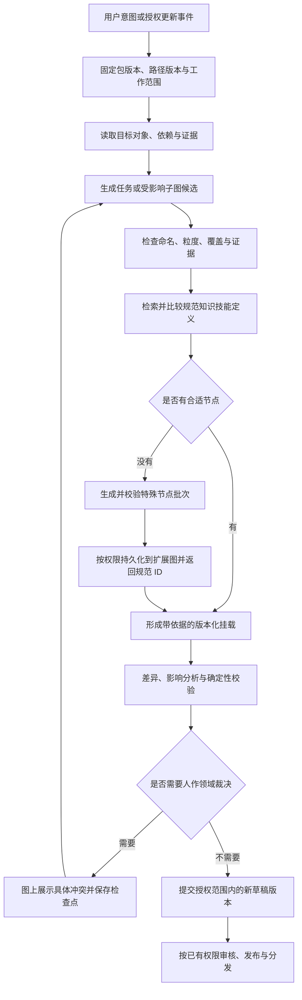

# 学习路径契约落地与岗位图谱工作流后续设计

本次实施阶段完成学习路径 v2 契约、官方简介与 v1/v2 导出。以下运行时、工具及交互是后续实施设计，未在此次改动中登记为可调用能力。契约语义见 [学习路径源图契约 v2](../product/LEARNING_PATH_CONTRACT_V2.md)。没有新增主 Agent、学习者事件或数据库迁移。

## 一个具体闭环：软件测试技术员岗位包

高职老师提供“面向软件测试技术员，服务软件技术专业学生”的目标；企业专家提供优惠券规则与脱敏缺陷记录；研究员补充岗位职责和行业资料。Agent 从工作情境、交付物和合格条件开始拆分，形成下面的关联，而不先列一张技术名词清单。

| 对象 | 可使用的名称 | 判别依据 |
|---|---|---|
| 典型任务 | 验证优惠券领取与使用规则 | 有需求输入、测试执行和可验收报告，属于一段完整工作 |
| 岗位能力 | 业务规则测试设计与执行 | 能跨不同业务任务复用的工作能力 |
| 能力单元 | 根据需求规格设计测试用例 | 有明确条件、行为与产物，承担任务中的一段职责 |
| 知识点 | 等价类划分原则 | 能解释有效／无效等价类及分类依据 |
| 知识点 | 边界值选取规则 | 能说明边界及边界附近数据的选取依据 |
| 技能点 | 使用边界值分析设计测试用例 | 依据输入范围产出测试数据和预期结果 |

能力单元并非每次都必须比技能点更大；若两者定义、证据和考核完全相同，应共享规范技能或合并冗余表述，而不是为了层数复制标题。任务以工作交付闭合，能力以跨情境表现区分，知识技能点以语义边界与可检验性区分。每个节点保留标准名称、学校／企业别名、定义、适用情境和证据；不用固定节点数量来凑完整度。

本次官方图只有“软件测试”粗粒度课程。Agent 可先产生 `narrower_than` 定位，同时标记原子语义缺口；不能以课程命中宣称已完成知识技能对齐。随后检索具体规范点，仍缺失则形成两个知识点和一个技能点的扩展批次，提供定义、考核条件、来源和课程 contains 关系。确定性服务接受后，绑定指向返回的规范 ID／revision；学习端之后才能基于这些节点设计讲解与练习。

老师在“边界值选取规则”节点上指出：“学校教学需要区分有效与无效边界，不要把异常接口处理混在这里。”Agent 展示定义和挂载的受影响差异；企业专家可补充实际交付标准。修改只重算这个知识点、相关技能、用例设计能力单元和直接绑定。岗位其他任务与已确认学习记录保持原版本引用。新版本发布后，引用旧包的学习会话不会静默漂移。

## 现有工作流的落点

代码现状：冷启动在 `apps/role-atlas/lib/build/graph.ts`，已有研究、来源处理、提及抽取、任务收敛、岗位内核、分层推导和编译审查；`lib/build/workflow.ts` 已有分片、任务分组和证据角色规则。迭代在 `lib/iteration/graph.ts`，已有 contract、发现、定向研究、候选重建、合并、评估与检查点；其中 `rebuild_candidate` 阶段仍调用 `createColdStartSkill`。这使局部节点改动有机会重新经历较大的生成范围。

保留已有来源、快照、GraphPatch、版本提交和审查基础，把冷启动与增量迭代改为共用“规范化／拆分／挂载／校验”能力。运行图负责确定阶段与恢复位置；阶段内部 Agent 负责搜索、比较定义和提出方案。不能把“每个节点一个 Agent”当作图编排本身。

`I → J` 是下一阶段待实现的跨产品接收流程。无语义依据时保留缺口和候选，不能为了让图连通编造先修关系。自动创建节点不要求自动把它加入某个人的学习计划。

## 工作流输入、上下文与工具边界

每次运行固定 `runId、workflowId/version、agentProfile/version、toolContractVersion、basePackageRef、pathGraphRef、scope、budget、idempotencyKey`。模型、提示词和工具版本属于运行清单，岗位知识内容属于包；不能只存一条聊天记录来解释结果。

上下文分三部分：始终可见的对象定义、命名规则与本轮目标；按需读取的选中子图、直接包含关系、前置链与冲突；通过 ID 读取的来源片段、历次裁决和工具产物。每个阶段只接收其需要的结构化投影，长文和完整历史以引用保留。检查点保存产物引用、所用版本、待决问题及已完成副作用回执；恢复时先查回执，避免重放发布或新增节点。

| 后续工具 | 输入与返回 | 副作用／失败行为 |
|---|---|---|
| `read_graph_context` | 固定图版本、选中对象、关系类型、预算 → 有界子图与证据引用 | 只读；缺对象明确报错，不换版本 |
| `resolve_learning_points` | 定义、kind、scopeNote、考核条件、路径版本 → 候选和关系依据或缺口 | 只读；标题匹配只负责召回，关系判断另行呈现 |
| `inspect_semantic_diff` | 基线、候选和选中范围 → 重复、粒度冲突、影响集、证据缺口 | 只读；LLM 可建议语义问题，程序校验 ID／类型／版本／环 |
| `propose_graph_extension` | 包证据与图基线 → 本次已实现契约格式的新增批次 | 只生成候选；不能自签官方维护权限 |
| `commit_graph_extension` | 已验证批次、服务端身份和幂等键 → 新图版本、规范 ID 与回执 | LearnFlow 源图写入；并发冲突返回待重算，不覆盖新版本 |
| `commit_role_patch` | 精确 base rootHash、GraphPatch、影响集 → 岗位草稿版本 | Role Atlas 写入；失败不自动全量重建 |

这些是目标级工具，不把数据库、任意脚本、图数据库任意写入暴露给模型。确定性提交工具的授权、幂等与版本校验不能委托给工具描述或系统提示词。重构实施时应登记工具与 capability，源图操作保持零 Kernel target；只有真正需要学习状态改变的动作才登记 EvidenceEvent。

停止条件以“交付物通过必需检查、剩余缺口已明确”为主；同时设置轮次、搜索和变更规模预算。预算耗尽时交付当前候选与未解决问题，不能宣称完整。局部已确认定义、合并或别名决策应作为带 scope 的维护决策保存，防止下一轮重新生成同一个争议。

## 人在图上如何参与，自主性如何变化

交互对象是选中的节点、边、绑定或证据。对话面板固定选择与基线版本，给出“解释依据、修改名称、拆分、合并、补证据、比较版本”等动作。Agent 每次返回可预览的 graph patch：旧值、新值、依据、影响范围、是否改变引用。用户可编辑候选或只接受其中一部分；一次接受对应一份可追溯提交。

| 场景 | 默认自动执行 | 需要交互的具体条件 |
|---|---|---|
| 从零构建岗位包 | 在已给定岗位边界内研究、任务拆分、命名校验、候选挂载和草稿生成 | 岗位实际工作边界不明，或证据支持相互冲突的职责定义 |
| 老师调整学校名称与简介 | 改选中节点表达，保留企业别名和稳定 ID，更新局部投影 | 名称调整实际改变知识范围或合并了不同技能 |
| 企业专家纠正工作流程 | 读取补充证据，生成事件／任务差异，重算直接关联能力 | 引入新的岗位职责、影响多包共享定义或与既有确认结论冲突 |
| 授权组织扩展图补点 | 去重、校验后自动新增 scoped 特殊节点，回写规范 ID | 需要提升为官方公共定义、修改别人维护的节点、删除或合并稳定 ID |
| 研究员定期更新来源 | 在约定监测范围检查变化、形成有依据的更新草稿 | 有实质变化或需要领域裁决时通知；无变化不打扰 |
| 学生在 LearnFlow 提问 | 解释节点、显示岗位相关性、建议路径或练习 | 真正改变个人目标和路线时沿用学习端确认与事件机制 |

定期监测是后续产品设计，本次不创建用户账号下的自动任务。自主性由操作权限、影响范围、变更可逆性与证据完整度共同决定；不随运行时长自动升级，不把 `autonomous` 开关解释成拥有发布或官方图修改权限。常规只读研究、组织内授权草稿与补点不逐步询问确认。

## 三个产品中对象如何存在

| 对象 | Role Atlas | Graph Hub | LearnFlow |
|---|---|---|---|
| 岗位包 | 生产、维护、研究、增量版本和发布提交的主场 | 审核状态、可见范围、版本目录与不可变对象分发 | 固定版本引用、解释和学习相关性投影 |
| 规范学习路径 | 消费其版本化契约，提出知识技能挂载或缺口 | 可索引／分发学习路径版本；搜索卡片不是完整语义权威 | 课程／知识技能源图及扩展图的语义维护权威 |
| 岗位挂载 | 形成候选和证据；随岗位版本维护 | 随包携带挂载制品与依赖版本 | 验证目标节点并消费绑定，不根据相关性直接推断掌握 |
| 生产／维护 Agent | 保存可版本化的 agent profile、工具权限与运行记录 | 可以发布可发现的描述与兼容性元数据，后续再实现此类目录 | 经 Tutor handoff 进入 Role Atlas，不新增第四类主 Agent |
| 工作流 | 保存确定性流程定义、局部执行能力、检查点与恢复逻辑 | 可分发经过验证的工作流描述；Hub 自身不执行外部代码 | 学习工作流仍由三类主 Agent 和教学规则运行 |
| 个人学习路径与证据 | 不维护 | 不公开、不分发 | 唯一权威；源图更新不覆盖个人学习历史 |

目前 Graph Hub 的 document/search 投影只有通用节点和边，不能把它当作 v2 全字段往返格式。后续搜索命中必须解析到固定原始图谱／岗位制品，校验 Hub objectHash 后再读 v2；不可从精简卡片重建来源、边界和绑定。Hub 已托管在 Role Atlas 子应用，同仓并不改变产品权威。

岗位包、Agent、工作流应该是三个可独立版本化的对象：岗位包是领域数据，Agent profile 是职责和工具配置，workflow 是执行与恢复规则。一个岗位包可被多个 Agent 使用，同一维护工作流也能维护多个岗位。包中可以引用生成它的运行清单，不能把岗位包当作一段可任意执行代码或把整个聊天上下文打包成技能。

## 后续实施顺序与验收

1. **特殊节点接收与解析服务**：在 LearnFlow 源数据面实现包解析、授权 namespace、证据校验、版本并发控制和幂等存储。验收同一批次重放返回同一回执，过期基线拒绝，零学习者状态变化。此阶段需要登记正式能力／API 与测试。
2. **岗位语义拆分和挂载阶段**：在 Role Atlas 使用 v2 定义进行多候选比较，保留 narrower/related 与 unresolved；将测试 fixture 中的“边界值用例设计”变成真实端到端制品。验收旧课程命中不会被误报成原子等价，缺口能创建并复用规范点。
3. **子图迭代与图上差异交互**：复用现有 GraphPatch 和版本仓库，替换局部迭代对完整冷启动重建的依赖。验收一次节点更名不改变无关 ID，断点恢复不重复副作用，共享节点语义变更能列出受影响包。
4. **跨产品分发与运行清单**：Hub 分发固定制品，LearnFlow 显示版本和岗位相关性；分别管理包、Agent profile 和工作流版本。验收旧会话继续解析旧节点版本，更新可预览，学习者掌握只来自正式练习证据。

## 本次实施验证

- LearnFlow `frontend/npm test`：372 项通过；最后的边界类型修正后，`npm run test:path` 36 项再次通过。
- LearnFlow `frontend/npm run build`：通过，保留既有大 chunk 提示。
- Role Atlas `npm run learning-path:sync`：通过；两份制品与权威导出逐字一致。早期沙箱中的 tsx IPC 限制已通过获准的正常命令执行解决。
- Role Atlas `npm test`：135 项通过；`npm run typecheck` 和 `npm run build` 通过，构建保留既有 chunk／路由静态分类提示。
- 后端 `venv/bin/python -m pytest -q`：408 项通过、1 项跳过，存在既有弃用警告。独立架构注册测试 19 项通过；完整回归包含最新 registry 变更。
- `git diff --check`：通过。兼容检查确认 108 个 v1 节点除简介外的字段保持一致，68 条简介更新；原有 187 条边及 ID 保留。
- 本次未执行线上部署、浏览器人工验收或 seeded demo；没有修改页面布局、教学状态机或 demo。未执行特殊节点入库与跨产品语义挂载的线上验收，这些运行能力属于上述后续阶段。

Contract impact：registry 从 `2026-09-02.5` 升至 `2026-09-06.1`，新增三个已绑定实现的数据契约；既有 v1、个人覆盖层、EvidenceEvent 和五核语义兼容，无数据库迁移。公开源图的名称和简介是编辑性学习目标，不能作为实际掌握或企业能力达标证据。
