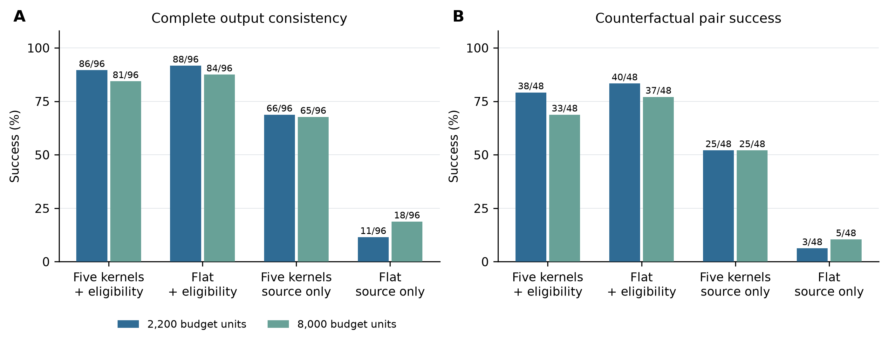
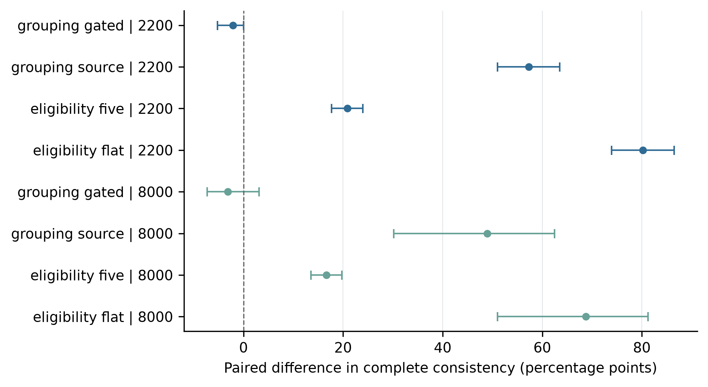

# 教育记忆的等信息反事实实验：自动执行报告

日期：2026-09-13。产品代码基线：`a9375aa37f4575384394d595ede2395b07d9c7a2`。本轮新增研究代码、数据、模型实跑与审计；不修改产品状态权威，不部署，不推送。

## 1. 结论与论文主张

**本轮结果最稳定地支持“学习证据的条件适用性与时效管理”。五核分组在仅给来源信息时改善了读取；加上资格注释后，其增量效果对接口枚举处理敏感，尚不能作出独立优势的稳健结论。** 严格计分略低，事后单别名归一后低预算持平、高预算略高；两套口径都应报告，不能挑选有利结果。

正式执行 96 条计算机学习轨迹、48 对反事实、四种输入配置和两档预算，共 **768 次真实模型调用**。全部回执齐全，742 条符合输出 schema，26 条枚举错误保留在总分母。没有新增教师标注或学生招募，也没有用离线规则回答冒充模型回答。

这是一项自动化操作一致性研究，尚不能证明学生学得更好、教师认可，或五核架构整体优于其他记忆算法。

## 2. 实际完成了什么

已实现生成器、真实形成器、等信息输入接口、受限模型读取器、独立验证器及成对分析。正式题目涉及二分查找、逆波兰表达式、拓扑排序、SQL 聚合、最短路径、LRU、位运算和 Python 浅拷贝；开发集另用 BFS 与 SQL 左连接。

正式集有 **8 道唯一计算题，每主题一道**；结合6类反事实与两侧形成96条状态轨迹，不是96道不同题目。每道题的答案由实际执行的 Python/SQL 程序产生，保存程序与输出 hash；之后使用正式概念题评分 API，形成真实 Attempt 和 EvidenceEvent。控制与自述经注册事件入口归约，不直接创建 KernelState、Mutation 或 Fact。题目属于合成封闭选择题，不能称为真实学生编程实验。

正式形成产物包含 **1,536 Events、296 Attempts、3,104 Mutations、4,776 Facts**。每对有相同的背景知识疑问、早期目标和返回点，异项目与未来评分也实际入库保留。六种反事实为辅助等级、最新结果顺序、时间预算、支持期限、目标更新、自述与正式测评；其中序列交换和通道替换不能统称单字段消融。

独立输入审计确认 192 个病例×预算组合的四组实际消息含相同规范记录，768 个输入 hash 与 token 重算一致。同一事件的多条记录不拆开截断。两档均保留全部必需来源，各为 **1,280/1,280 次来源需求**；8,000 档交付全部 7,616 次规范记录，2,200 档交付 1,744/7,616。因此预算对照主要研究背景负担，没有检验关键证据漏召回恢复。

## 3. 公平比较的具体含义

| 配置 | 原始证据 | 组织方式 | 额外资格注释 |
|---|---|---|---|
| five_kernel_gated | 相同 | 五核分组 | 当前/过期、独立/受助、自述/测评 |
| flat_gated | 相同 | 平面记录，保留 kernel 字段 | 相同 |
| five_kernel_source | 相同 | 五核分组 | 无 |
| flat_source | 相同 | 平面记录，保留 kernel 字段 | 无 |

四组都做来源、ownership、作用域与未来过滤。这里的 gated 指输入注释，**不是**用标准答案事后修正模型输出，也不是整个生产教学门控系统的消融。平面组仍具有完整的教育字段；分组因子只改变组织和跨核顺序。

Verifier 独立检查事件与正式 Attempt、题目归属、评分来源、时序和辅助一致性，独立解释公开的操作规则。它不调用产品规划器或旧实验的 expected_action。引用必须覆盖当前测评及各安排类型的最新控制；过期控制也须引用，以说明为何失效。评分规则已向模型公开，不增加隐藏扣分要求。

请求模型 alias 为 `deepseek-v4-flash`，响应 alias 为 **`deepseek-flash`**；只能报告这些实际标识，不能据此保证冻结了某个模型权重版本。温度 0，显式关闭 thinking，输出上限 400 tokens，超时 90 秒，无重试、无 fallback、并发 4。输入预算是 `cl100k_base` 的序列化消息单位，**不是** DeepSeek 的真实 tokenizer。关闭推理的参数依据 [DeepSeek 官方文档](https://api-docs.deepseek.com/guides/thinking_mode/)。

## 4. 正式结果

“完整正确”要求所有字段正确、schema 合法、来源有效且关键引用齐全；“成对成功”要求两侧均成功并满足应变与不变关系。

| 预算 | 配置 | 完整正确 | 成对成功 | 下一步正确 | 格式合法 |
|---:|---|---:|---:|---:|---:|
| 2,200 | 五核＋资格注释 | 86/96（89.58%） | 38/48 | 94/96 | 94/96 |
| 2,200 | 平面＋资格注释 | **88/96（91.67%）** | **40/48** | 96/96 | 96/96 |
| 2,200 | 五核，仅来源 | 66/96（68.75%） | 25/48 | 89/96 | 89/96 |
| 2,200 | 平面，仅来源 | 11/96（11.46%） | 3/48 | 96/96 | 96/96 |
| 8,000 | 五核＋资格注释 | 81/96（84.38%） | 33/48 | 89/96 | 89/96 |
| 8,000 | 平面＋资格注释 | **84/96（87.50%）** | **37/48** | 96/96 | 96/96 |
| 8,000 | 五核，仅来源 | 65/96（67.71%） | 25/48 | 89/96 | 89/96 |
| 8,000 | 平面，仅来源 | 18/96（18.75%） | 5/48 | 93/96 | 93/96 |

图 1. 分数直接来自冻结回执。每配置每预算 n=96 条合成轨迹、48 对，不代表独立学生样本；柱顶为真实分子/分母，不画虚构重复试验的误差棒。

加入资格注释后，五核与平面的完整正确率差为 **−2.08 和 −3.13 个百分点**。仅来源条件下，分组差为 **+57.29 和 +48.96 个百分点**。结果提示组织方式与资格信息存在交互。严格输出契约下未观察到加注释后的分组增益，但下述敏感性分析表明该细小差距受枚举格式影响；不能据此宣称分组有稳定增益或没有价值，也不能只挑“仅来源”一组宣称五核全面领先。

图 2. grouping 为五核减平面，eligibility 为加注释减仅来源。区间为 8 个作者生成主题簇的 10,000 次 bootstrap 百分位区间，只用于探索性描述，不是学生总体推断或显著性认证。加注释后的分组区间分别为 [−5.21, 0.00] 和 [−7.29, +3.13] 个百分点。

### 4.1 事后单别名敏感性分析（不替代主分数）

独立审计发现26条枚举失败都把 `latest_assistance` 写成 `guided`，其原始动作仍是正确的 `reduce_help_then_check`。在看过正式结果后，仅对这一个别名作 `guided → supported` 映射、其他字段不动，再独立计分：

| 预算 | 配置 | 严格完整正确 → 别名归一 | 严格成对成功 → 别名归一 |
|---:|---|---:|---:|
| 2,200 | 五核＋资格注释 | 86/96 → **88/96** | 38/48 → **40/48** |
| 2,200 | 平面＋资格注释 | 88/96 → **88/96** | 40/48 → **40/48** |
| 8,000 | 五核＋资格注释 | 81/96 → **88/96** | 33/48 → **40/48** |
| 8,000 | 平面＋资格注释 | 84/96 → **84/96** | 37/48 → **37/48** |

这个分析是明确的事后诊断，不是重新定义预先冻结的主终点。它表明输出格式约束会改变细小排名；需要在新冻结试验中预先约定别名规则并复现，才能评估分组的增量作用。归一后所有组的动作为96/96，也进一步说明本轮动作任务过于简单。全部8组敏感性结果见 `results-audit.json`，没有覆盖原始回答、主分数或图1。

## 5. 失败揭示了什么

742 条合法 JSON 的下一步动作全部正确，说明当前动作任务存在明显天花板，不能拿它证明更复杂的教学决策能力。但完整安排判断仍有大量错误：合法输出中，返回点错误 **191 次**、当前优先级错误 **126 次**、时长错误 **72 次**、支持是否有效错误 **12 次**。这些字段错误可重叠，不能相加当作失败病例数。其中191个合法输出误用了过期目标或返回点，共317处相关字段错误。64次回答已将有效支持请求识别为 true，却将应为20分钟的时间上限输出成 null，说明支持识别和约束执行是两项不同能力。

真实案例包括：

- `cf-lru_cache-priority_update-a:five_kernel_source:8000` 把已经过期的“LRU缓存淘汰基础定义”当成当前返回点，正确值应为 null。
- `cf-dijkstra-time_budget-b:flat_source:8000` 保留过期的“非负权最短路径术语整理”优先级，并把明确的 25 分钟判断成 20 分钟。
- `cf-bit_mask-support_expiry-b:flat_source:8000` 把已到期的支持请求仍判为有效。

格式错误 26/768 均为 `schema_enum_mismatch`，保留原始 JSON 供复核，正式计分按无效回答处理。自动指标 false_abstention 也会包含无效回答导致的缺失字段，不能把这个计数直接写成“模型主动拒答”。稳定掌握固定为否定控制，合法输出中未出现错误升级；这一结果不构成掌握校准或真实学习增益证据。

**当前值得升级的实际问题是：在所需证据已完整提供的这些合成场景中，模型仍可能把过期的用户安排当成当前画像，并错误组合时间与支持约束。** 后续产品研究应让可审计的有效期、辅助条件及确定性约束保持到最终教学决策，而不是只提高来源召回率。

## 6. 研究与工程边界

1. 296 条正式评分事件真实缺少 session 绑定，均保留 `known_scope_fidelity_limit`；没有伪造 session。不能声称本轮证明完整 session 隔离。
2. 16 条合法 `remediation_started` 事件没有规范表示，审计明确记录；它们不属于本轮输出契约的必需来源。独立控制形成差异为 0，不能因此宣称所有生产事件已覆盖。
3. 只使用一个托管模型 alias、每条件一次采样，没有跨模型或重复运行方差。主题和情境由作者设计，不能叫独立盲测或真实教育分布。
4. 题目执行只验证合成答案，辅助等级也是合成声明。下一步动作来自公开的操作规则，不是教师认可的最佳策略。
5. 这轮比较的是等字段组织和资格注释，没有重跑官方 Mem0、A-MEM、LongMemEval 等算法或基准，也没有把结果混入旧 v4 排名。
6. 共同输入仍是研究接口；生产 Tutor、讲义、Practice 的最终消费一致性尚需单独接入与验收。本轮不宣称产品已经升级部署。

## 7. 成本、失败保留与可复现性

正式实际用量：输入 **2,547,520 tokens**，输出 **62,816 tokens**，总计 **2,610,336 tokens**；其中 provider 报告缓存命中输入 1,608,573，未命中 938,947。单次延迟中位数 1,023.63 ms、P95 1,525.957 ms。没有账单证据，因此不声称某个实际金额。

开发02为 192/192 回答，188 合法、4 枚举错误，独立保存，不并入正式分数。更早开发01因默认推理模式耗尽 400 输出 tokens 而中止：163 次预约、159 条截断响应、4 次中断后结果不确定、29 条未发起；另发现配置中整数/浮点数的 hash 差异，评分审计拒绝出分。原始产物及当时源码保留，修复后另建开发02目录，没有覆盖失败、静默重试或借失败结果调优正式得分。

正式768条计分、384条成对记录、8组汇总和8个区间比较均独立复算一致。正式源码漂移 **0**、冻结输入漂移 **0**；响应、请求配置、输入和调用预约对应关系全部通过。新增评测回归在隔离基线与集成后的主仓分别 **73 项通过**；图表已从实际 aggregate 生成并检查。生产代码没有修改，未额外运行无关的全量产品回归或部署。

交付入口：[正式聚合结果](formal-01-aggregate.json)、[独立输入审计](input-audit.json)、[独立结果与敏感性审计](results-audit.json)、[完整正式冻结产物](artifacts/formal-01.tar.gz)、[失败开发记录](artifacts/dev-01-failed.tar.gz)、[产物哈希](artifact-distribution.json)。图形同时提供 PNG、SVG 和 PDF；运行方式见 [REPRODUCE.md](REPRODUCE.md)。旧 v4 正式结果保持原样。

## 8. 下一阶段仍可自动完成的工作

按本轮证据，优先扩大“当前约束是否适用”的挑战集：明确取消、同主题跨课程、长尾旧目标、条件组合、真实缺少辅助信息、互相矛盾的来源以及多周时序。新的动作任务应要求组合多个条件并完成可执行的教学安排，减少本轮 742/742 的动作天花板。

随后可在独立模型、不同提示词和重复采样下复现，并增加“规范化时间字段”“显式资格注释”“确定性最终约束”三个独立因子，区分信息表达、模型读取和输出约束各自的作用。上述尚未实施，不计入本轮成果。教师盲评和真实课堂效果仍需后续单列，不能用自动验证器替代。
