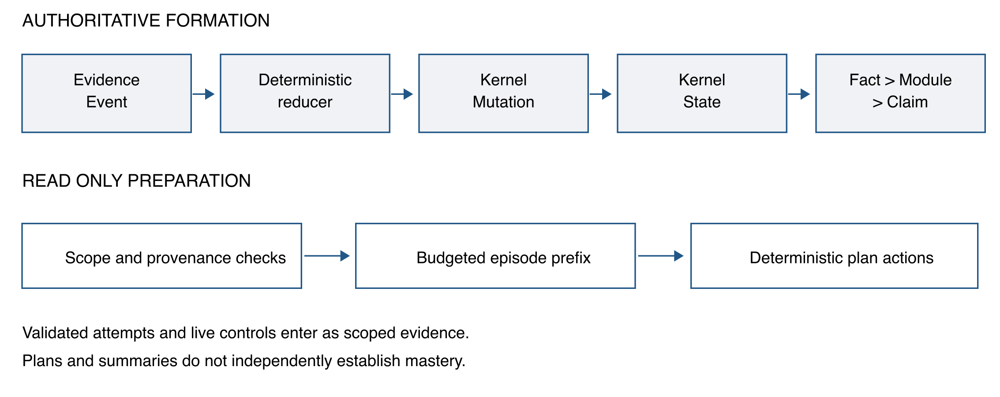
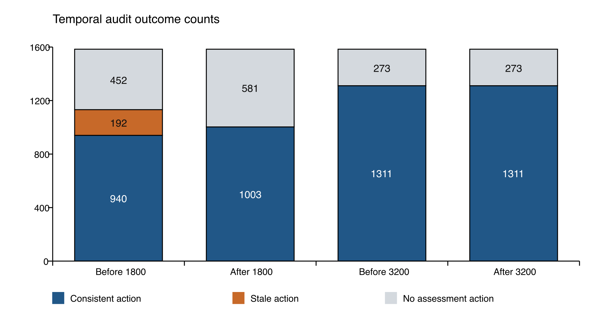
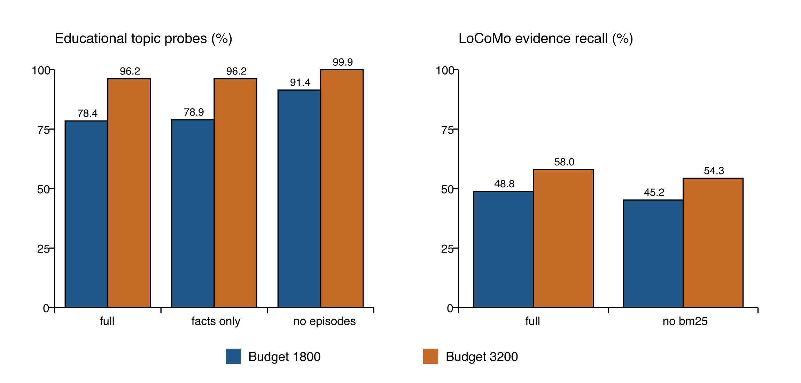

# Temporal Validity and Evidence Coverage in Budgeted Memory for Educational Agents

Research manuscript draft • 9 September 2026

## Abstract

Memory for educational agents must preserve the conditions under which learner evidence was obtained, including assistance, repetition, scope, and time. A retrievable and correctly attributed observation may nevertheless support an outdated instructional action. This paper studies that failure in LearnFlow, an educational agent system for computing disciplines. The system derives learner memory through a deterministic event-to-state pipeline and constructs bounded learning episodes whose observations travel with provenance and assessment qualifiers. We evaluate 1,584 synthetic educational trajectories across 12 configurations and two context budgets, and a separate evidence-retrieval adaptation of LoCoMo across seven configurations. The resulting 65,820 condition executions are repeated system measurements, not independent learners. A post hoc temporal audit identifies 192 stale assessment actions in the full system at the lower budget. Ordering validated episodes by event time and admitting a continuous newest-first prefix removes these observed stale actions: 63 cases become temporally consistent and 129 produce no assessment action. This correction therefore exchanges some decision coverage for temporal consistency. Removing episodes improves educational topic-probe delivery from 1,407 to 1,640 of 1,794 probes at the lower budget, while eliminating assessment-based actions. On 1,438 valid primary-category LoCoMo questions, full-system mean evidence recall is 48.81% and 58.00%; disabling BM25 reduces it by 3.60 and 3.67 percentage points. The study exposes a measurable distinction between source validity, temporal applicability, and evidence coverage. All educational cases were author-seen, teacher review is incomplete, and no student learning benefit or generated-answer accuracy is claimed.

Keywords: educational agents; learner modeling; conversational memory; temporal consistency; provenance; ablation study; context budgets

## 1 Introduction

An educational assistant needs more than a record of what a learner discussed. It needs to distinguish an independent solution from a guided retry, an unresolved misconception from an earlier success, and a temporary study constraint from a lasting preference. In computing education, these distinctions affect concrete decisions: whether to diagnose an error, remove scaffolding, ask for a variant solution, or shorten a practice session. A memory that recalls the correct exercise but loses its assistance condition can give a plausible yet poorly supported recommendation.

Learner modeling has long addressed changes in knowledge during practice. Knowledge tracing estimates the acquisition of procedural knowledge from performance observations [1], and deep knowledge tracing learns temporal representations of student interactions [2]. Agent memory brings an additional systems problem: a downstream assistant operates on a selected, serialized subset of the available history. Even if the stored learner record is valid, selection and compression can change which evidence reaches the decision procedure. The object of this study is that evidence-delivery boundary, rather than prediction of a latent mastery probability.

Memory architectures for agents use hierarchical storage, reflection, and linked notes to make long histories accessible [3–5]. LoCoMo and LongMemEval provide complementary tests of conversational memory, including reasoning across sessions and changes over time [6,7]. More recent work examines latent constraints and interactive state evolution [8,9]. These developments make it inappropriate to equate isolated fact recall with successful personalization. Educational applications sharpen this distinction because the circumstances of a performance observation directly constrain the next permissible instructional action.

We investigate an event-derived memory architecture implemented in LearnFlow. Its persistent learner model has five state dimensions: learning structure, knowledge evidence, human support requirements, goals and value, and practice history. These dimensions are not autonomous agents or a psychometric taxonomy. All authoritative changes follow one event-reduction chain. The memory reader creates scoped episodes from assessed attempts, including the source chain and explicit unknowns, and a deterministic planner consumes the resulting packet.

The central failure is simple. An earlier independent success can be shorter to serialize than a later assisted or failed attempt. Under a tight context budget, a relevance-based packer may retain the earlier episode after omitting the later one. Every cited identifier may be genuine, yet the planner uses evidence that is no longer the latest applicable assessment. We characterize this failure, implement a bounded ordering correction, and measure both its benefit and its coverage cost.

This study makes three contributions. First, it specifies an implemented separation between authoritative learner-state formation and budgeted read projections, with inspectable assistance and provenance constraints. Second, it presents an empirical diagnosis of stale assessment actions and evaluates a newest-first prefix policy using paired executions and an explicitly post hoc audit. Third, it reports a dual-track ablation protocol that separates education-specific evidence formation from general conversational retrieval and exposes negative results, inactive mechanisms, and unmeasured outcomes. The contribution is the investigated integration and failure analysis; BM25, provenance, event reduction, and chronological ordering are not individually claimed as new algorithms.

## 2 Related Work

### 2.1 Learner modeling and instructional evidence

Corbett and Anderson modeled changing procedural knowledge in a programming tutor and used the resulting estimates to individualize practice [1]. Deep knowledge tracing subsequently used recurrent representations of interaction sequences [2]. Both establish that learner state should depend on a sequence of observations. LearnFlow addresses a different layer: preserving the provenance and qualifications of observations when preparing a constrained context for an assistant. We do not train a knowledge-tracing model, compare predictive AUC, or claim that five state dimensions replace validated models of learning.

The distinction is consequential in computing tasks. Passing the same exercise after seeing steps is evidence of supported performance, while independent execution of a variant can support a different inference. The implemented rules preserve this difference without asserting that their instructional choices have been validated by teachers or students. Evaluation of rule compliance and evaluation of educational appropriateness remain separate tasks.

### 2.2 Agent memory and retrieval

MemGPT manages multiple memory tiers to work within a limited context window [3]. Generative Agents store observations, synthesize reflections, and retrieve experiences for planning [4]. A-MEM organizes interconnected notes and updates memory representations as new experiences arrive [5]. These systems motivate richer memory than a recency buffer, but their reported evaluations do not constitute head-to-head evidence for the implementation examined here. LearnFlow restricts authoritative state changes to deterministic event reduction; model-generated explanations or summaries cannot independently establish mastery.

Retrieval-augmented generation combines a generator with external retrievable information [10]. Our evaluation stops before free-form answer generation, allowing delivery and decision rules to be inspected without a model judge. The lexical component uses BM25 [11] inside a bounded candidate pool. We therefore describe its intervention as lexical reranking, not dense semantic retrieval. Dense retrieval, long-context generation, MemGPT, and A-MEM were not executed as performance baselines in this study.

### 2.3 Memory benchmarks and provenance

LoCoMo evaluates long conversational histories through tasks including question answering [6]. LongMemEval explicitly covers information extraction, multi-session reasoning, temporal reasoning, knowledge updates, and abstention [7]. LoCoMo-Plus studies the application of latent constraints when retrieval cues are indirect [8], while AMemGym introduces interactive evaluation with structured state evolution [9]. These benchmarks support a broader view of memory capability than exact matching. Our LoCoMo adaptation measures the delivery of annotated source evidence only; its scores must not be compared numerically with official generated-answer scores or with the other benchmarks, which were not run.

The W3C PROV family supplies a general vocabulary for entities, activities, attribution, and derivation [12]. LearnFlow's identifier chain has a related audit purpose, but we do not claim PROV serialization compliance. More importantly, an intact derivation chain establishes where an observation came from, not whether it remains appropriate for a present action. This study measures that distinction directly.

## 3 System and Method

### 3.1 Authoritative formation of learner memory

The application exposes three main responsibility interfaces: a tutor for intent and coordination, a learning-design interface for routes and educational artifacts, and a practice interface for submissions, assessment, and feedback. They share one learner-state authority. User, interface, tool, and agent actions enter as EvidenceEvent records. A deterministic reducer proposes KernelMutation records, which update KernelState. Persistent MemoryFact records and their Module and Claim projections derive from this chain. Agents do not write an independent long-term profile alongside it.

The five state dimensions have operational meanings. Structure records learning position, dependencies, and return anchors. Knowledge records understanding-related observations, gaps, and errors. Human records explicit preferences, workload, pace, and support requirements. Value records goals, priorities, motivation, and relevance. Practice records attempts, assistance, artifacts, feedback, and readiness-related evidence. These categories organize evidence; an ordinary mistake does not justify an inferred personality, medical condition, emotional diagnosis, or fixed learning style.

An educational observation is accepted for an assessed episode only after the reader verifies its learner ownership, project/checkpoint/session applicability, time, and linked assessment receipt. The chain connects a Fact to an applied Mutation, its Event, and the corresponding Attempt. Missing information stays unknown. In particular, an absent assistance value cannot be converted into independent success. A retry on the original task is not automatically a transfer assessment, and a single correct answer does not establish stable mastery.



Figure 1. The authoritative write chain is distinct from the read-only episode and planning path. Educational control records and retrieved episodes supply evidence to the planner; a generated plan cannot directly upgrade learner state.

### 3.2 Scoped controls and episode representation

The control parser extracts supported directives from local clauses while excluding recognized quotations, code, third-party statements, hypotheses, and negations. Original source spans are retained. Temporary session controls expire after eight hours; turn controls can expire on subsequent input. Explicit timezone-bearing deadlines can extend narrowly supported controls across sessions for up to 168 hours when learner, project, and checkpoint match. Persistent preferences use a different lifetime. These are bounded deterministic parsing rules, not a general natural-language temporal parser.

Source scope and application scope are stored separately so that carrying a still-valid instruction forward does not rewrite where it originated. Unsupported versions are rejected, and supported older records retain their lifetime semantics. The experiment's authored deadline metadata is not directly injected into the product; the product must recognize the deadline from the input text. Consequently, parser limitations remain observable rather than being silently repaired by the evaluator.

A learning episode contains a task reference, assessment outcome, assistance and independence fields, occurrence time, scope, linked Attempt/Fact/Mutation/Event identifiers, bounded observations, and limitations. Text observations carry source hashes and character ranges. The reader excludes answer-bearing fields and raw human-state payloads; an episode is a read projection, not a new persistent authority. Selection is bounded to 24 anchor candidates, with up to 48 events and 96 facts scanned during episode construction. The evaluated policy admits at most three episodes with at most six facts per episode.

These bounds make costs inspectable but limit what the system can know. A latest assessment outside the candidate pool may remain undiscovered. A stored relation to a genuinely different task is not invented when no canonical relation is available. The graph reader also uses bounded expansion with scope checks; the current study does not isolate an advantage from graph expansion beyond its candidate window.

### 3.3 Budgeted context construction

Candidate retrieval combines bounded lexical matching, BM25 reranking, an auditable alias map, fuzzy normalization, temporal candidate allocation, and optional summary relevance boosts. The context includes state heads, selected memory items, relation paths, personal concept attachments, adaptation directives, teaching guidance, learning episodes, diagnostics, and eight component-policy fields. All of these fields enter the charged payload. An independent verifier reconstructs that payload rather than calling the product's budget estimator to judge its own output.

Let P denote this charged JSON payload. Its cost is the greater of one and the ceiling of the number of serialized characters divided by 3.2. Serialization uses Python JSON with ensure_ascii=False, sort_keys=True, default=str, and default separators. The admission constraint is that this estimated cost must not exceed B. We call B a character-estimate budget throughout. It is not an actual model-token count, a complete HTTP envelope size, or a measured monetary cost. Portable pace and presentation preferences are shared outside this charge across memory-enabled education configurations; no_memory retains current-input controls only.

Episode observations and qualifiers are admitted as a unit. This prevents a packer from keeping a success label while cutting its assistance condition, but also makes episodes more expensive than isolated topic-bearing facts. Disabling a component can therefore free budget for another representation. Such comparisons estimate the total effect of the implemented intervention under the stated budget, not an intrinsic, budget-independent value of the representation.

### 3.4 Preserving temporal order during admission

The earlier episode packer could skip a large recent episode and accept an older, shorter one. The revised implementation sorts validated candidates by descending occurrence time, using Event ID as the deterministic tie-breaker. It admits a continuous prefix of this order. If the next episode does not fit, admission stops instead of trying shorter historical alternatives. Subsequent budget reduction removes older episodes from the tail. The planner uses the same event ordering; native current guidance wins only an exact event-order tie.

Algorithm 1 describes the episode admission step. Fixed context is prepared first; other packet construction and final budget checks remain in the implementation.

```text
Input: validated episode candidates C, fixed context P, budget B
Sort C by (event occurrence time, event identifier), descending
Selected = empty list
For episode e in C:
    If Selected has reached the episode count limit: stop
    If charging P with Selected and e exceeds B:
        Record remaining candidates as budget omitted; stop
    Append e to Selected
During final budget reduction, remove older tail episodes first
Return Selected and omission diagnostics
```

Within this ordered candidate list, admitting an older episode implies that every preceding newer candidate was also admitted and has not been removed while retaining that older episode. This follows directly from stopping at the first infeasible candidate and removing from the tail. It is a local prefix property, not proof of globally fresh learner state, optimal retrieval, or educational safety. Its operational cost is that a large recent episode can prevent any assessment episode from being delivered.

### 3.5 Deterministic preparation of instructional actions

The planner applies inspectable rules to the latest delivered applicable assessment. A failed attempt requests diagnosis of the first error. Assisted success or an original-task retry requests reduced support followed by an independent probe. Unknown assistance requests clarification. Independent success requests a variant or reasoning check. A valid time constraint changes estimated session duration. The returned decision records include the policy, action, source events, and uncertainties; none of these actions upgrades mastery.

When there is no delivered assessment evidence, the planner can still respond to current controls, but there is no assessment-based action to score for freshness. We label this outcome not applicable (NA), not a correct abstention. Similarly, enforcing a ten-minute estimate shows rule compliance, not that a student actually completed useful learning within ten minutes.

## 4 Experimental Design

### 4.1 Research questions and units of analysis

The analysis asks four questions. RQ1: Does budgeted delivery preserve the latest applicable assessment, beyond preserving source validity? RQ2: How do structured episodes trade topic-probe coverage against assessment-based action coverage? RQ3: Which retrieval components contribute on general conversational evidence when the educational formation chain is absent? RQ4: Which gaps remain between system conformance and educational effectiveness?

The frozen protocol, dated 8 September 2026, specifies the configurations, budgets, formation procedures, and primary checks. Temporal freshness was added after inspecting failures and is explicitly post hoc. The revised packer was then evaluated in a separate complete run. A further measurement at the product default budget of 2,900 is a descriptive supplement, not a third budget retrospectively added to the formal ablation matrix. These distinctions prevent an engineering iteration from being presented as a fully preregistered confirmatory study.

Table 1. Data and execution units. Condition counts include repeated configurations and budgets and must not be interpreted as independent people.

| Property | Educational track | Conversational track |
| --- | --- | --- |
| Source | Authored computing learner trajectories | Fixed official LoCoMo snapshot |
| Independent grouping used | 72 task families | 10 conversations |
| Cases or questions | 1,584 synthetic cases | 1,986 questions |
| Structure | 22 patterns per family; 9 domains | 272 sessions; 5,882 turns |
| Formal configurations | 12 | 7 |
| Formal budgets | 1,800 and 3,200 | 1,800 and 3,200 |
| Condition executions | 38,016 | 27,804 |
| Main scoring population | Metric-specific denominators | 1,438 valid category 1/2/4 questions |
| Teacher or learner outcome data | None | Not an educational outcome dataset |

### 4.2 Educational trajectories and native formation

The educational dataset comprises 72 task families, 22 trajectory patterns, 216 task probes, and 11,520 authored observations. The domains are programming, algorithms, systems, databases, networks, web backend, frontend, testing, and data/AI. They support scenarios such as returning to a topic after a long history, retaining a misconception after an earlier success, retrying the same item, and carrying a temporary study constraint into another session. The probe inventory contains 207 oracle-backed and nine draft probes. Neither designation means that independent teachers have validated the tasks or labels.

Each case is formed once through the real text entry, a closed-candidate assessment API, reducer, memory worker, and offline planner. Configurations read isolated copies of the fixed formed snapshot. Formation produces 1,794 Attempts, 12,441 Events, 13,910 Mutations, 30,789 Facts, 1,932 Modules, and 1,932 Claims. This exercises actual service contracts but does not execute arbitrary student programs or grade unrestricted SQL and code responses. The assessment adapter uses two-choice recognition derived from authored responses. Unsupported operations remain recorded adapter gaps.

The historical split names comprise 990 development, 198 validation, and 396 holdout cases. All were seen by the authors before this study; the holdout label is an identifier, not an unseen-test guarantee. Cross-scope and future distractors are filtered by the adapter, so their absence cannot serve as an empirical measurement of product resistance to those distractors. Across 1,311 cases with a latest native assessment, 69 assistance-fidelity checks fail because the native phase-three original-item retry is forced to guided status. This is a disclosed mismatch with the authored request, not an independence promotion. The other 273 cases have no applicable native assessment.

### 4.3 Conversational evidence retrieval

The second track uses the official LoCoMo repository snapshot at commit 3eb6f2c585f5e1699204e3c3bdf7adc5c28cb376, with the source file hash recorded in the supplement. Only conversation text, speaker, and time enter the retrieval fixture. Questions guide queries; reference answers, evidence labels, supplied summaries, and event summaries do not enter the searchable memory. Scoring labels are used only after retrieval.

Valid primary categories 1, 2, and 4 contain 278, 320, and 840 questions, respectively. The main denominator is therefore 1,438. A further 89 valid category-three questions are outside this primary analysis; 13 questions have invalid annotations, and 446 adversarial questions receive no answer score. These groups remain in the execution inventory and are not counted as successful refusals. The fixture does not contain native assessed Attempts, Events, Mutations, or Facts needed for educational episodes, nor Module/Claim/edge structures. We do not fabricate those objects to activate unavailable mechanisms.

### 4.4 Interventions and implementation controls

Table 2 records intervention semantics. Every educational configuration preserves the same current input. Except where a configuration deliberately removes historical memory, the underlying formation snapshot is fixed. Thus these are reading interventions and cannot isolate the contribution of the shared parser upgrade.

| Configuration | Intervention | Track |
| --- | --- | --- |
| full | All evaluated default reading components | Both |
| facts_only | Remove Modules, Claims, and their edges; keep Facts, guidance, episodes | Education |
| recent_facts | Restricted facts_only with latest 24 Facts per learner | Both |
| no_relations | Return zero relation paths; independent concept attachments remain | Education |
| no_guidance | Crop historical guidance after retrieval; no budget refill | Education |
| no_episodes | Disable episode construction; freed budget can be reused | Education |
| no_bm25 | Disable lexical BM25 reranking | Both |
| no_aliases | Disable terminology alias expansion | Both |
| no_fuzzy | Disable fuzzy query normalization | Both |
| no_temporal | Disable temporal candidate allocation | Both |
| no_summary_boost | Disable query-driven summary relevance bonus | Education |
| no_memory | Remove historical reads; retain current controls in education | Both |

Table 2. Reading interventions. The name facts_only does not mean that all structured read projections are absent. LoCoMo uses a projected retrieval fixture rather than the native educational Fact chain.

The two formal budgets are 1,800 and 3,200 character-estimate units. Enabling an option, matching candidates, selecting an item, and satisfying a probe are logged separately. A component that never activates has not received a meaningful efficacy test. The no_guidance intervention is applied after selection; its diagnostics can describe the pre-crop packet. The no_episodes intervention permits budget reallocation. Their effects consequently answer different operational questions. These one-component removals also do not identify all interactions among components.

### 4.5 Metrics and statistical interpretation

The educational topic probe checks delivery of the assessed topic and its attributed source Fact. It is a weak identifier/text-delivery diagnostic with 1,794 reference probes per configuration and budget. A separate, stricter raw-statement probe asks whether the referenced original statement was delivered verbatim, with 1,152 targets. We do not combine these measures into a semantic quality score. Episode count measures delivered episode instances, while action count measures actual emitted decisions; multiple evidence instances can support one action.

Source checks verify linked identities, scope, original ranges, and permitted provenance. The corrected temporal audit independently identifies the latest applicable assessment using event occurrence time and Event ID, then compares it with the source cited by an actual assessment action. Pass, stale failure, invalid reference, and no-action NA are reported separately. A 100% source-check rate among emitted decisions is not a 100% action-coverage rate. Both the initial and corrected audits are retained because the initial audit had packet-binding and transient-scope errors; before and after results in this paper use the same corrected audit.

For LoCoMo, evidence recall is the fraction of annotated source units whose complete original text is delivered, averaged over valid primary questions. Complete evidence is the number of questions for which all annotated units are delivered. Neither measure evaluates answer generation. Pairing uses the same question, budget, and configuration identity. The reported descriptive intervals resample the ten conversations with replacement 2,000 times using fixed, recorded seeds. They concern equal-weight conversation means of paired differences, whereas the main recall table weights questions equally. We report both estimands explicitly and do not interpret the intervals as student-population inference or multiplicity-adjusted hypothesis tests.

## 5 Results

### 5.1 Source validity and temporal applicability diverge

At budget 1,800, the earlier full configuration produces 940 temporally consistent assessment actions, 192 stale actions, and 452 NA outcomes across 1,584 cases. Its valid source references therefore conceal a material temporal error. Each of three trajectory patterns contributes 64 stale cases: original-task repetition, an unresolved gap, and source retraction. These are fixture pattern names; the adapter does not thereby gain complete support for every source-retraction operation.

After the prefix correction, 1,003 cases have temporally consistent actions, zero have observed stale actions, and 581 are NA. Paired transitions show that 63 of the 192 stale cases become consistent actions and 129 become NA; the 940 existing passes and 452 existing NA outcomes remain. Consequently, describing all 192 cases as improved instructional decisions would be false. At budget 3,200, both versions already have 1,311 temporally consistent cases and 273 NA cases. The correction changes ordering behavior without improving that decision-class outcome at the larger budget.



Figure 2. Counts for the full educational configuration. Each bar contains the same 1,584 cases. NA denotes no actual assessment action, including 273 cases without an applicable native assessment. The 2,900-budget supplement is reported separately in Section 5.4.

The final corrected audit across all 38,016 educational conditions reports 23,066 passes, no stale or invalid references, and 14,950 NA outcomes. These pooled counts are an execution inventory, not independent samples or a general safety rate. The remaining freshness claim is bounded by the retrieved candidate pool and the tested trajectories.

### 5.2 Episodes compete with fact coverage

Table 3 gives educational topic/source-Fact probe delivery. The full configuration reaches 1,407 of 1,794 probes at 1,800 and 1,725 at 3,200. Removing episodes increases these counts to 1,640 and 1,793, gains of 233 and 68 probes. At the lower budget, facts_only also slightly exceeds full. These findings do not support an unconditional claim that adding memory layers improves every query.

| Configuration | Topic probes at 1,800 | Topic probes at 3,200 |
| --- | --- | --- |
| full | 1,407 / 1,794 | 1,725 / 1,794 |
| facts_only | 1,416 / 1,794 | 1,725 / 1,794 |
| recent_facts | 1,346 / 1,794 | 1,656 / 1,794 |
| no_relations | 1,408 / 1,794 | 1,725 / 1,794 |
| no_guidance | 1,407 / 1,794 | 1,725 / 1,794 |
| no_episodes | 1,640 / 1,794 | 1,793 / 1,794 |
| no_bm25 | 1,270 / 1,794 | 1,725 / 1,794 |
| no_aliases | 1,406 / 1,794 | 1,725 / 1,794 |
| no_fuzzy | 1,413 / 1,794 | 1,725 / 1,794 |
| no_temporal | 1,409 / 1,794 | 1,725 / 1,794 |
| no_summary_boost | 1,405 / 1,794 | 1,725 / 1,794 |
| no_memory | 0 / 1,794 | 0 / 1,794 |

Table 3. Complete educational ablation results for the weak topic/source-Fact probe. Raw-statement delivery is 0/1,152 in every row at both budgets and is not included in this table's numerator.

The full system delivers 1,003 and 1,725 episode instances at the two budgets, omitting 791 and 69 eligible instances for budget reasons. The eligible episode-instance total happens also to be 1,794 but is a different unit from the topic-probe denominator. At 1,800, no failed-outcome episode is admitted. All 138 cases whose latest assessment failed lack an episode and assessment action; another 170 cases with a latest passed assessment also lack such an action. These 308 assessed cases explain the additional NA outcomes beyond the 273 cases without an applicable assessment. This reveals an outcome-dependent coverage gap that the overall zero-stale count would hide.

Episode removal eliminates assessment-based preparation in this configuration, leaving only time-control actions. The extra topic matches therefore come with loss of process-qualified decision evidence. Conversely, the raw-statement probe fails for every configuration because its 1,152 referenced Events did not form corresponding MemoryFacts. This is an upstream formation-to-delivery gap; adjusting ranking alone cannot recover a target that was never represented in the retrievable Fact layer. It also demonstrates why a favorable weak probe must not substitute for a stronger missing-evidence check.

### 5.3 General retrieval benefits are concentrated in BM25

On the 1,438 valid primary LoCoMo questions, the full system obtains mean evidence recall of 48.81% at 1,800 and 58.00% at 3,200. Complete evidence is available for 650 and 765 questions. The no_bm25 condition achieves 45.21% and 54.33% mean recall, a question-weighted difference of 3.60 and 3.67 percentage points. The corresponding equal-conversation-weight differences are 3.50 points with a 95% descriptive bootstrap interval of [2.43, 4.59], and 3.71 points with an interval of [2.59, 5.07]. These results support lexical reranking in this bounded fixture, not superiority over untested dense or agentic memory systems.

| Configuration | Recall at 1,800 | Complete at 1,800 | Recall at 3,200 | Complete at 3,200 |
| --- | --- | --- | --- | --- |
| full | 48.81% | 650 / 1,438 | 58.00% | 765 / 1,438 |
| no_bm25 | 45.21% | 605 / 1,438 | 54.33% | 721 / 1,438 |
| no_aliases | 48.81% | 650 / 1,438 | 58.00% | 765 / 1,438 |
| no_fuzzy | 48.64% | 650 / 1,438 | 57.69% | 763 / 1,438 |
| no_temporal | 48.81% | 650 / 1,438 | 58.02% | 765 / 1,438 |
| recent_facts | 2.09% | 28 / 1,438 | 2.35% | 31 / 1,438 |
| no_memory | 0.00% | 0 / 1,438 | 0.00% | 0 / 1,438 |

Table 4. Conversational evidence retrieval. Recall averages per-question evidence fractions; complete reports integer question counts. The table excludes external-knowledge, adversarial, and invalid-annotation groups from its primary denominator.

Aliases never activate on this conversational set, making the equal score an uninformative efficacy result for that mechanism. Fuzzy normalization has a small mixed effect with paired intervals spanning zero. At 3,200, disabling temporal allocation increases recall slightly, while complete evidence remains unchanged. Temporal allocation activates for only six primary questions. These sparse triggers do not justify broad claims about temporal reasoning or typo robustness.

Difficult cases remain substantial. Full retrieval has zero evidence recall on 670 of 1,438 primary questions at the smaller budget and 519 at the larger one. Only 12 and 23 of the 278 valid multi-hop questions receive all evidence. At the larger budget, no_fuzzy completes one more multi-hop question than full. Recent-fact retention performs poorly on this fixture, but it changes both historical access and available memory structure and is intentionally restrictive. It is not a substitute for a competitive long-context baseline.



Figure 3. Left: educational topic-probe delivery for full, facts_only, and no_episodes. Right: primary LoCoMo mean evidence recall for full and no_bm25. The panels measure different constructs and are not combined into a score.

### 5.4 Controls and the production default budget

All configurations apply the current ten-minute instruction in 72 of 72 relevant cases at each formal budget. Valid historical ten-minute constraints are applied in 72 of 72 cases by configurations retaining guidance, and in zero of 72 by no_guidance and no_memory. These checks inspect actual plan estimates and show an effect of accessible historical controls. They do not isolate the shared parser change or measure actual study duration.

The separate full-only run at budget 2,900 covers the same 1,584 educational cases. It reports 1,311 temporally consistent assessment actions, 273 NA cases, no stale or invalid references, and 1,725 of 1,794 topic probes delivered. All 138 latest-failure cases receive a diagnosis action citing the newer source. There are 1,035 independent-variant actions, 138 support-fading actions, 138 diagnosis actions, and 144 time-limit actions; the latter may coexist with an assessment action. All 1,584 independent budget checks pass, with no recorded execution errors, network attempts, or source drift.

This supplement establishes that the severe failure-evidence omission observed at 1,800 was not observed at the current default on these cases. It does not establish a universal minimum budget, a cost optimum, or general performance beyond the fixed data. No dense budget sweep or second conversational run at 2,900 was performed.

## 6 Discussion

### 6.1 Provenance needs an applicability test

The results separate three questions that a single memory score can conceal: whether the source exists, whether the selected evidence covers the requested content, and whether its conditions still permit the proposed action. The observed stale actions pass source attribution because an older success is genuinely recorded. A temporal audit detects the error only by examining the latest applicable native assessment and the actual action source. This suggests that learner-memory evaluation should inspect decision prerequisites, rather than infer safety from citation presence.

The prefix policy offers a deliberately conservative local remedy. It prevents replacement of a rejected new episode with a shorter old one, but can suppress a useful assessment action when the latest episode is too expensive. The paired 63-to-pass and 129-to-NA transitions expose that compromise. Evaluating only stale-action frequency would reward silence; evaluating only action frequency would reward unsupported activity. Reporting both is necessary to understand the system's behavior.

### 6.2 Memory granularity should follow the task

Topic recall and process-informed preparation favor different representations. Atomic facts provide compact lexical anchors, while episodes preserve the conditions needed to interpret an attempt. Their relative performance under a common packet budget is therefore task-dependent. The no_episodes gains do not show that episodes are universally harmful; the loss of all assessment-based actions shows what that representation supplies in the current implementation. Similarly, module removal's slight benefit on a local topic probe does not establish that modules are useless for longitudinal summaries, which were not semantically evaluated here.

A next implementation could reserve a compact latest-assessment record before admitting richer observations, or choose episode detail conditional on the instructional query. Such a record would still need source identifiers, outcome, assistance, time, and explicit limitations, and would remain a read projection of the same authority. These are proposals, not results. Their evaluation should jointly measure current-evidence coverage, inappropriate-action incidence, stronger semantic sufficiency, and actual serialized cost.

### 6.3 Why the two evaluation tracks remain separate

The educational track exercises native formation and deterministic planning, but its synthetic closed-candidate tasks constrain realism. The conversational track supplies external long histories and heterogeneous evidence references, but lacks educational assessment authority and evaluates no instructional action. Their combination is useful because the strengths and blind spots differ. Pooling them would hide those differences and permit an improvement on one construct to compensate numerically for a failure on another.

The present general-memory result is mainly evidence for BM25 in the implemented candidate pool. The absence of an alias effect reflects absence of activation; limited multi-hop completion exposes a stronger unresolved retrieval problem. A meaningful next comparison should hold indexed evidence, access restrictions, context accounting, and reader model constant across lexical, dense, hybrid, long-context, and representative memory baselines. It should report both end-to-end answers and evidence support. No such comparison is retroactively asserted here.

## 7 Threats to Validity and Reproducibility

The strongest threat is construct validity. Topic strings, provenance checks, and plan durations are measurable software outcomes, but do not establish misconception diagnosis, explanation quality, learning gains, or retained transfer. No teachers have scored the generated plans. A prepared review set contains 198 stratified cases across 24 conditions, yielding 4,752 plans with empty ratings. Case and plan identifiers are randomized for reviewer packaging and coordinator mappings are separated, although visible behavior can still reveal configuration. Preparation of this package is not evidence of completed review, inter-rater reliability, or label validity.

External validity is also limited. The educational corpus is authored, patterned, and entirely author-seen. Its 65,820 combined condition executions do not overcome the small numbers of task families and conversations. The native adapter omits unsupported behaviors and uses recognition assessment; errors in those mappings can constrain or bias findings. The LoCoMo source labels contain invalid references and category-specific scoring limitations. We separate their denominators and retain invalid cases instead of imputing successful retrieval.

Internal validity is strongest for paired reading interventions sharing a formed snapshot, and weaker for comparisons across earlier product versions because new metadata itself consumes budget. The temporal correction and audits are exploratory engineering responses to observed failures. The frozen analyzer also originally grouped on annotation_status while the records use scoring_status; a retained supplemental audit corrects primary-category grouping. This paper uses that corrected primary audit and the corrected temporal audit, not the misleading mixed denominators or initial temporal classifications. Since both packer versions are assessed with the same corrected temporal code, the reported transition table does not conflate a product fix with a scorer change.

No LLM or network call is part of the formal evaluation. This improves inspectability of the deterministic service behavior but leaves open the behavior of a generative reader presented with the same packet. Runs use different shard concurrency settings, so their latencies are not interpreted as a controlled speed comparison. Character-estimate budgets do not support API-cost claims. The latest deployment records support product integration and isolated regression checks, not an authenticated end-to-end student study or service-level reliability claim.

Reproduction is anchored to product commit 0da6615eeb2a5dded4101535e8534cd5494b43a9, shared core version 0.2.5, and registry version 2026-09-08.9. The formal run began from an earlier commit with uncommitted working changes; its 186 source-file hashes, rather than that baseline commit label alone, identify the measured implementation. The final-source check verifies these hashes against the released code. Earlier failing runs, corrected audits, compressed per-condition exports, and a reconstruction patch are retained. The accompanying supplement maps manuscript tables and figures to these artifacts and provides a script that re-derives the numerical displays without executing new experiments.

The public repository contains derived evaluation exports and reproduction instructions [13]. LoCoMo is subject to its source license, CC BY-NC 4.0; original dialogue text is not copied into the paper bundle. Local full packets and reviewer/coordinator materials are not presented as unrestricted public data. Repository visibility alone does not establish an open-source license for all included code. An archival release, complete license review, and independent reproduction remain work for the authors before submission.

## 8 Conclusion

In the evaluated educational memory system, source-correct recall can still lead to a stale instructional action when budget admission favors an older, shorter episode. A newest-first prefix rule removes all 192 observed low-budget stale actions, but 129 become no-action cases. Structured episodes also compete with compact topic evidence: removing them increases topic-probe coverage while eliminating assessment-based preparation. The separate conversational track shows a consistent BM25 contribution and substantial unresolved evidence and multi-hop gaps. These results motivate evaluating provenance, temporal applicability, and coverage jointly. They support a systems-level finding about evidence handling; teacher judgments, stronger external baselines, unseen trajectories, and prospective learner studies are still needed to establish educational value.

## Declarations

This draft reports synthetic educational executions and secondary analysis of an existing conversational dataset. It reports no newly recruited student participants, completed teacher ratings, ethics approval, or exemption determination. Institutional requirements and dataset-use obligations must be verified by the responsible authors before submission. Author identities, affiliations, contributions, funding, and competing-interest declarations have not been supplied and are therefore not asserted in this draft.

AI assistance disclosure: OpenAI Codex assisted with source-code inspection, analysis of existing artifacts, literature lookup, manuscript drafting, and document preparation. The responsible human authors must verify the scientific claims, references, and declarations and approve the final text. AI assistance is not authorship, and no claim of completed human approval is made here.

## References

[1] A. T. Corbett and J. R. Anderson, “Knowledge tracing: Modeling the acquisition of procedural knowledge,” User Modeling and User-Adapted Interaction, vol. 4, pp. 253–278, 1994. https://doi.org/10.1007/BF01099821

[2] C. Piech, J. Bassen, J. Huang, S. Ganguli, M. Sahami, L. Guibas, and J. Sohl-Dickstein, “Deep Knowledge Tracing,” Advances in Neural Information Processing Systems, vol. 28, 2015. https://proceedings.neurips.cc/paper_files/paper/2015/hash/bac9162b47c56fc8a4d2a519803d51b3-Abstract.html

[3] C. Packer, S. Wooders, K. Lin, V. Fang, S. G. Patil, I. Stoica, and J. E. Gonzalez, “MemGPT: Towards LLMs as Operating Systems,” arXiv:2310.08560, 2023. https://arxiv.org/abs/2310.08560

[4] J. S. Park, J. C. O'Brien, C. J. Cai, M. R. Morris, P. Liang, and M. S. Bernstein, “Generative Agents: Interactive Simulacra of Human Behavior,” arXiv:2304.03442, 2023. https://arxiv.org/abs/2304.03442

[5] W. Xu, Z. Liang, K. Mei, H. Gao, J. Tan, and Y. Zhang, “A-MEM: Agentic Memory for LLM Agents,” arXiv:2502.12110, 2025. https://arxiv.org/abs/2502.12110

[6] A. Maharana, D.-H. Lee, S. Tulyakov, M. Bansal, F. Barbieri, and Y. Fang, “Evaluating Very Long-Term Conversational Memory of LLM Agents,” Proceedings of ACL, 2024, pp. 13851–13870. https://doi.org/10.18653/v1/2024.acl-long.747

[7] D. Wu, H. Wang, W. Yu, Y. Zhang, K.-W. Chang, and D. Yu, “LongMemEval: Benchmarking Chat Assistants on Long-Term Interactive Memory,” International Conference on Learning Representations, 2025. https://proceedings.iclr.cc/paper_files/paper/2025/file/d813d324dbf0598bbdc9c8e79740ed01-Paper-Conference.pdf

[8] Y. Li, W. Guo, L. Zhang, R. Xu, M. Huang, H. Liu, L. Xu, Y. Xu, and J. Liu, “Locomo-Plus: Beyond-Factual Cognitive Memory Evaluation Framework for LLM Agents,” Proceedings of ACL, 2026, pp. 25085–25100. https://doi.org/10.18653/v1/2026.acl-long.1150

[9] Cheng Jiayang, D. Ru, L. Qiu, Y. Li, X. Cao, Y. Song, and X. Cai, “AMemGym: Interactive Memory Benchmarking for Assistants in Long-Horizon Conversations,” arXiv:2603.01966, 2026. https://arxiv.org/abs/2603.01966

[10] P. Lewis et al., “Retrieval-Augmented Generation for Knowledge-Intensive NLP Tasks,” Advances in Neural Information Processing Systems, vol. 33, 2020. https://proceedings.nips.cc/paper/2020/hash/6b493230205f780e1bc26945df7481e5-Abstract.html

[11] S. Robertson and H. Zaragoza, “The Probabilistic Relevance Framework: BM25 and Beyond,” Foundations and Trends in Information Retrieval, vol. 3, no. 4, pp. 333–389, 2009. https://doi.org/10.1561/1500000019

[12] P. Groth and L. Moreau, eds., “PROV-Overview: An Overview of the PROV Family of Documents,” W3C Working Group Note, 30 April 2013. https://www.w3.org/TR/2013/NOTE-prov-overview-20130430/

[13] LearnFlow project repository, product snapshot 0da6615eeb2a5dded4101535e8534cd5494b43a9, 2026. https://github.com/runzhong123-max/LearnFlow/tree/0da6615eeb2a5dded4101535e8534cd5494b43a9/evals/education_memory_v2
