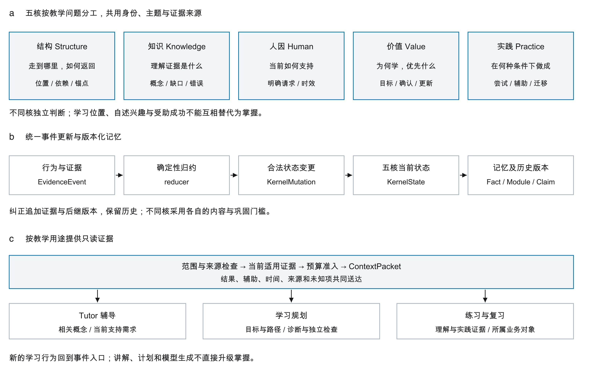
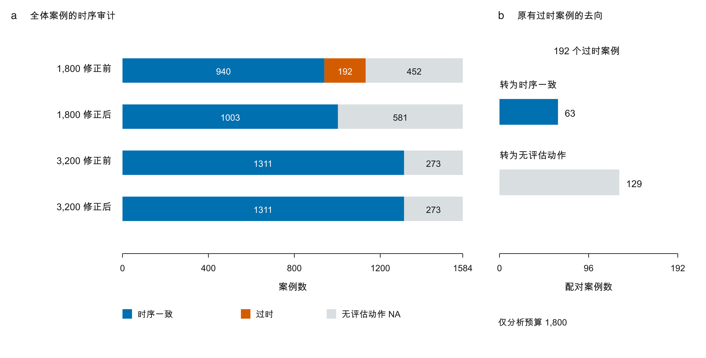
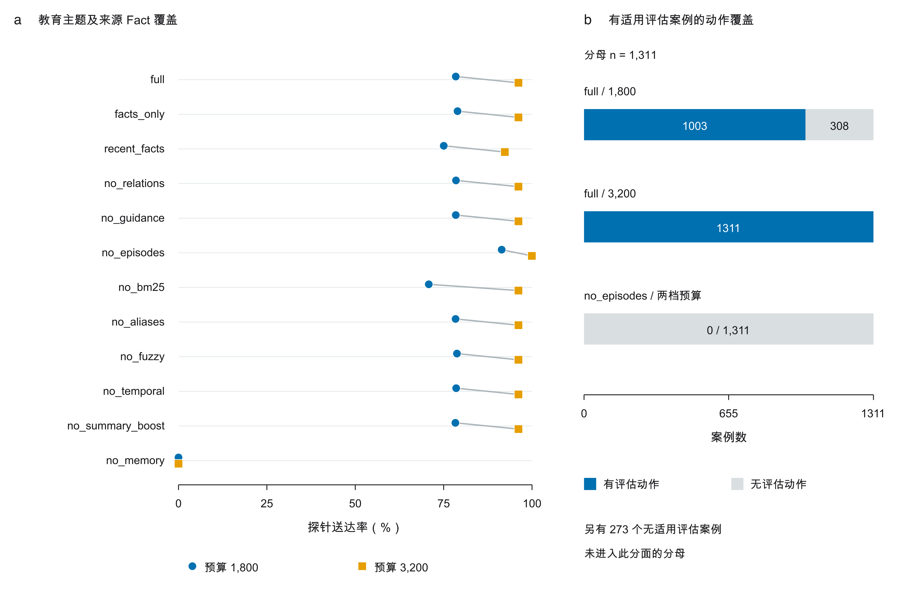
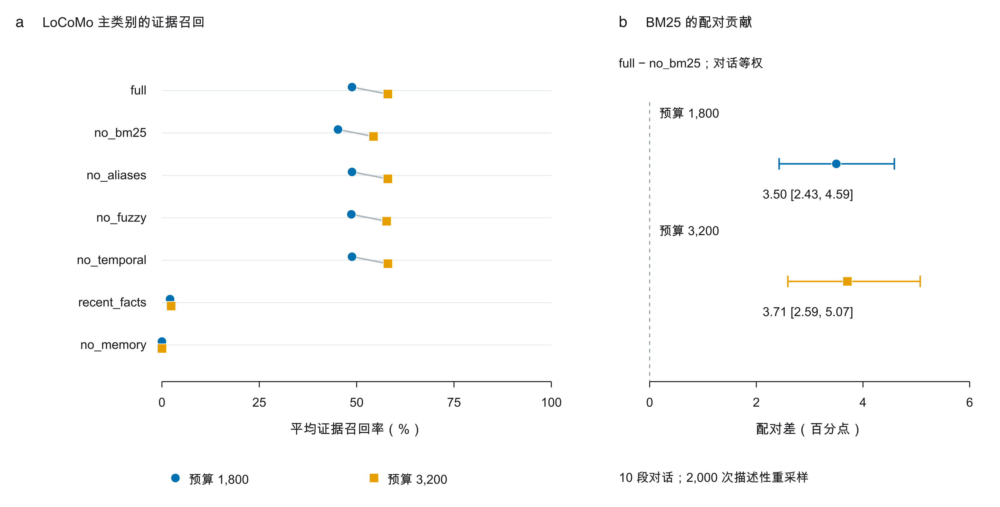

# 预算约束下教育智能体学习者记忆的时序有效性与证据覆盖

## 摘要

教育智能体的学习者画像需要保留表现证据的发生时间、辅助条件与适用范围。然而，来源正确的历史记录在进入有限上下文后，仍可能支持已经过时的教学决策。针对这一问题，本文以服务计算机专业群的 LearnFlow 系统为对象，研究确定性事件归约、带来源学习片段与预算受限读取之间的关系。实验采用两条互补路径：在 1,584 条合成教育轨迹上执行 12 种配置和 2 档预算，在 LoCoMo 对话证据检索适配集上执行 7 种配置和 2 档预算，共形成 65,820 次条件执行。事后时序审计发现，低预算完整系统中有 192 个案例引用了较旧的评估证据。采用按事件时间排序的连续前缀准入后，63 个案例转为时序一致的评估动作，129 个转为无评估动作，揭示了时序一致性与动作覆盖之间的权衡。移除学习片段使低预算主题证据命中由 1,407/1,794 提高至 1,640/1,794，但同时消除了基于评估证据的动作。对 1,438 个有效 LoCoMo 主类别问题，完整系统两档预算的平均证据召回率分别为 48.81% 和 58.00%，移除 BM25 后分别下降 3.60 和 3.67 个百分点。结果表明，来源有效性、时序适用性和证据覆盖应分别评估。教育案例均已被作者查看，独立教师评审尚未完成，本文不据此推断真实学习收益或生成答案准确率。

关键词：教育智能体；学习者画像；长期记忆；时序有效性；证据溯源；消融实验；上下文预算

## 1 引言

面向教学的智能体需要记住的，不只是学习者谈过哪些知识点，更包括其在何种条件下完成了任务。例如，“看过提示后重做原题并通过”与“独立完成变式任务”都可能出现“通过”这一结果，但二者对下一步教学的含义不同。前者通常需要撤除辅助并再次验证，后者才可能支持进一步的迁移检查。若学习者曾独立答对，随后又在相关任务上失败，系统也不能仅凭较早的成功记录继续安排进阶练习。因此，面向计算机专业教学的记忆系统必须同时保存学习内容、过程条件与历史变化。

知识追踪研究长期关注学习者知识状态随练习过程的变化。经典知识追踪利用表现序列估计程序性知识的获得[1]，深度知识追踪进一步学习交互序列的时间表示[2]。本文关注另一层问题：当完整学习历史被压缩为智能体可读取的有限上下文时，哪些证据及其限定条件真正到达决策端。持久化画像有效，并不意味着读取投影同样充分；一次压缩或预算裁剪就可能改变后续决策所依据的事实。

现有智能体记忆采用分层存储、反思与关联笔记等方式组织长期历史[3–5]。LoCoMo、LongMemEval 等基准扩展了跨会话记忆评估[6,7]，近期研究进一步关注隐含约束与交互状态演化[8,9]。这些工作说明，孤立事实的召回并不能完整代表个性化能力。教育场景尤其如此：一条表现记录是否仍适用于当前教学动作，取决于时间、任务范围、辅助程度和后续修正。

LearnFlow 将学习者画像组织为结构、知识、人因、价值和实践五个状态维度，并通过统一的确定性证据链维护。本文发现的失效发生在读取端：较早的独立成功片段可能比之后的受助或失败片段更短；在预算紧张时，系统跳过较长的新片段而保留较短的旧片段。旧片段的来源标识均为真实记录，但由此生成的教学动作已经不符合最新适用评估。

围绕这一失效，本文给出三项工作。首先，明确学习者状态形成与预算受限读取的实现边界，说明来源、辅助等级和时序条件如何随证据传递。其次，通过配对执行与独立的事后审计，量化连续前缀准入对过时动作及动作覆盖的影响。最后，将教育原生证据形成与通用对话检索分轨评估，完整报告消融结果、未激活机制和未验证能力。本文的贡献在于系统集成、可审计失效分析及其经验结果，不将事件归约、BM25 或时间排序本身宣称为新算法。

## 2 文献综述与研究定位

本节采用问题导向的叙述性综述，围绕学习者画像的形成、记忆的组织与更新，以及教学效果的验证梳理代表性研究。文献核验截至 2026 年 9 月 9 日，以原始论文和正式出版记录为依据；这不是穷尽检索的系统综述，也不据此声称某项能力在整个领域中尚不存在。比较的重点是各工作的研究对象、更新机制与实际测量边界，而不是将不同数据集上的分数拼接为排名。

### 2.1 学习者建模与开放学习者模型

学习者画像首先是对学习过程的解释，而不仅是对话偏好的集合。Corbett 和 Anderson 的知识追踪根据练习表现估计程序性知识状态[1]；深度知识追踪进一步利用神经网络表示学习交互序列[2]。二者关注随观察变化的知识状态，为自适应练习提供依据。对本文而言，这条研究路线提示应保留时间序列和表现条件，但知识状态预测与证据送达仍是不同任务：预测下一题能否答对，并不直接回答有限上下文中保留了哪条评估记录。

开放学习者模型进一步将画像作为学习者可以理解和参与的对象。Bull 和 Kay 的 SMILI 框架为开放学习者模型及学习数据界面的描述、比较和设计提供了组织方式[14]。Bull 等的可协商模型允许学习者查看学习信息并提出修改，研究其对可视化、证据查看和模型修订功能的初始反应[18]。这一方向把画像透明性与学习者反思联系起来，也说明“系统能够展示画像”和“学习者能够理解、质疑并有效修正画像”应分别验证。

因此，教育记忆至少涉及两种不同的正确性：系统内部能否追溯画像判断，学习者能否理解并纠正这一判断。LearnFlow 本文评测集中于前者及其读取结果，没有开展画像界面的可用性实验，也没有验证学习者参与修订是否改善元认知。五个工程状态维度不替代经验证的学习理论或心理测量模型，本文也未进行知识追踪 AUC 对比。

### 2.2 教学辅助条件与表现证据

Koedinger 和 Aleven 将何时提供信息、何时让学习者自行生成步骤作为教学中的辅助困境，讨论认知导师中的反馈、提示、自我解释和问题选择[15]。其研究意味着支持程度本身就是教学干预的一部分，不能从最终答案正确与否推断整个学习过程。支持可能促进当前任务完成，而独立执行、保持和迁移需要各自的测量。

在计算机教学中，这一区别可以具体表现为查看代码示例后修正程序、按照提示完成 SQL 查询，以及独立处理新的边界条件。这些是本文研究问题的情境化说明，不是新增实验观察。若记忆将上述过程都压缩成“任务通过”，后续规划便可能失去撤除辅助或安排变式检查的依据。因此，我们把辅助条件与评估结果共同送达作为工程要求；这一要求的执行效果可以由日志验证，但具体教学策略是否有效仍需学习实验，而不能由规则的一致性代替。

### 2.3 智能体长期记忆的组织与更新

智能体记忆研究提供了处理长历史的多种表示。MemGPT 通过分层记忆管理扩展有限上下文的使用范围[3]；Generative Agents 将观察、反思与检索结合用于行为规划[4]；A-MEM 通过结构化笔记及其关联组织记忆，使新增信息能够影响已有记忆的组织[5]。这些方法分别突出上下文调度、高层经验归纳和关联组织，为教育画像的跨会话延续提供了可借鉴的机制。

不同表示同时引入不同的核验问题。摘要是否保留了例外条件，关联笔记是否保留了原始观察，候选检索是否让新近失败被更相关的旧成功替代，都需要在具体读取链路上检查。这是本文从教育证据需求提出的分析框架，不是对上述系统已经发生错误的断言。若只比较最终回答总分，形成、检索与预算裁剪造成的损失可能难以区分。

RAG 将检索到的外部信息接入生成过程[10]，但教材知识与学习者证据承担不同职责：前者支持内容正确性，后者约束对这个学习者的判断。本文的检索实现包含有界候选池内的 BM25 词法重排[11]，没有稠密语义候选通道。实验检查送达内容及确定性规划，不将其分数等同于生成质量，也未实际对比 MemGPT、A-MEM 或稠密检索等外部强基线。

### 2.4 DeepTutor 的共享画像与个性化教学

Zhao 等的 DeepTutor 将知识库与动态记忆结合，服务解题和出题[16]。其 Trace Forest 保留会话、规划与执行层记录；记忆代理维护会话历史、弱点诊断和教学自我反思，并向不同角色注入相关画像。论文还描述了跨会话更新弱点状态的规则。因此，它与本文一样关注多功能共享且持续更新的学习者状态，不能被概括为静态 RAG 问答工具。

DeepTutor 的 TutorBench 包含 90 个画像和 270 个任务，采用模拟学生对话及独立模型评分。原文表 1 中，完整系统总体质量为 3.91/5，移除记忆后为 3.80/5[16]。这些是外部论文报告的评分，不是真实学生成绩，也未由本文复现。其消融关注整体教学输出；本文则进一步拆查来源、辅助条件和预算读取后的时序适用性。二者测量对象不同，目前不能判断谁的教育效果更好。

可直接借鉴的实验设计是将学习者背景、已有知识与误解明确写入任务，并让同一画像经历连续交互。对 LearnFlow，后续可以把这样的互动评价接在证据审计之后，检验时序一致的记忆是否实际改善解释和练习选择；但模拟器表现、教师判断与真实学生学习结果仍应分开报告。本文没有运行 TutorBench 或 DeepTutor 基线。

### 2.5 从记忆检索到教育效果的评测层次

LoCoMo 评估长对话历史上的记忆任务[6]；LongMemEval 将知识更新和时间推理纳入长期记忆测量[7]；LoCoMo-Plus 关注隐含约束应用[8]，AMemGym 则引入具有状态演化的交互评估[9]。这些工作推动评测超越孤立事实匹配，但它们的任务定义、访问方式和评分单位不同。本文只运行了 LoCoMo 的来源证据检索适配，没有运行其官方答案评分或后三个基准，不能直接横比官方成绩。

来源溯源是另一条互补路径。W3C PROV 对实体、活动及派生关系给出通用描述[12]，为检查信息从何而来提供基础。本文的标识链具有相近目的，但没有实现 PROV 序列化兼容。由来源关系推断当前教学适用性还需要额外前提，例如观察的先后、任务范围及后续修正。因此，我们将来源检查与时序审计分别设置，并同时报告无评估动作的案例。

教育效果需要进一步的研究设计。Tutor CoPilot 为真人导师提供实时建议，并通过预注册随机对照研究检查真实辅导中的学习结果[17]。这展示了与日志验证和模拟对话不同的证据层次；其人机协同条件及学校数学场景也不能直接外推到计算机专业的自主学习。对 LearnFlow，应先完成独立教师评价，再根据拟主张的教育收益选择前后测、保持或迁移任务。软件执行正确、生成反馈适切和学习效果改善，不能互相替代。

### 2.6 比较与本文的研究位置

表 1 按研究路径比较代表工作。表中的边界描述所引研究的主要测量范围，不把未报告项目当成缺失功能，也不将本文尚未验证的设计列为性能优势。

表 1 代表研究的对象、机制与证据边界

| 研究路径 | 主要研究对象 | 表示或更新机制 | 与本文比较的边界 |
| --- | --- | --- | --- |
| 知识追踪[1,2] | 练习序列中的知识状态 | 概率状态或序列表示随表现更新 | 状态预测不能直接验证上下文证据是否完整送达 |
| 开放学习者模型[14,18] | 画像的可理解性与学习者参与 | 公开学习信息，支持查看与提出修订 | 本文未测量界面理解、修订效果及元认知收益 |
| MemGPT[3] | 有限上下文下的长历史访问 | 分层存储与上下文管理 | 本文未在统一访问与预算下复现对照 |
| Generative Agents 与 A-MEM[4,5] | 可检索经验及记忆关联 | 观察反思或关联笔记 | 需额外测量教育辅助条件及最新评估的送达 |
| DeepTutor[16] | 共享画像驱动的个性化教学 | 多层轨迹与画像更新 | 模拟交互评分；本文未运行其系统或 TutorBench |
| Tutor CoPilot[17] | 真人导师获得 AI 支持后的教学 | 根据当前辅导上下文提供建议 | 真实随机对照证据，干预对象与本文不同 |
| LearnFlow 本文 | 学习证据的来源与时序适用性 | 确定性归约、片段和预算准入 | 合成轨迹与检索适配；未证明真实学习收益 |

综合上述工作，本文不把持久化画像、图结构或多智能体组合本身作为创新结论，而研究一个更具体的问题：在来源真实且状态可更新的系统中，预算读取是否仍保留了当前教学动作成立所需的条件。由此形成三个可检验的关注点：过程限定能否随证据一起送达，较旧观察是否取代最新适用评估，以及避免过时动作后是否损失动作覆盖。第 4 节将这些问题落实为配对干预与分轨指标；真实教学效果留作独立验证。

## 3 系统与方法

### 3.1 学习者画像的权威形成链

系统包含三个主责任接口：Tutor 负责意图与协调，Learning Design 负责路线与教学产物，Practice 负责提交、评估和反馈。三者共享同一学习者状态权威。用户、界面、工具及智能体行为首先记录为 EvidenceEvent，由确定性归约器生成 KernelMutation，再更新 KernelState；MemoryFact 及其 Module、Claim 投影从该链形成。任何智能体均不得另建与其并行的长期画像权威。

五个状态维度具有明确的工程含义。结构维度记录学习位置、依赖与返回锚点；知识维度记录理解相关观察、缺口与错误；人因维度记录明确偏好、负荷、节奏和支持需求；价值维度记录目标、优先级、动机及相关性；实践维度记录尝试、辅助程度、产物与反馈。它们是证据组织维度，不是五个智能体，也不是固定人格类型。一次普通错误不能支持情绪、人格、医学状态或固定学习风格的推断。

如图 1 所示，状态写入与上下文读取相互区分。学习片段接纳一条评估观察前，需要检查学习者归属、项目/关卡/会话适用范围、时间及其评估回执。来源链连接 Fact、已应用的 Mutation、Event 与对应 Attempt。缺失信息保持未知：缺少辅助字段不能转换为独立成功，原题重做不能自动视为迁移验证，单次答对也不能直接升级为稳定掌握。



图 1 学习者状态形成与上下文准备。a，唯一权威写入链及五个状态维度。b，只读证据验证、片段准入和确定性动作准备。实线箭头表示数据处理方向；读取投影与生成计划不构成新的状态写入通道。

### 3.2 带作用域的教学控制与学习片段

控制解析器从局部分句提取支持的学习指令，并排除可识别的引用、代码、第三方陈述、假设与否定，保留原始文本区间。会话控制默认在 8 小时后失效，轮次控制可随后续输入失效。在学习者、项目与关卡一致时，少量受支持的带时区显式截止时间可将控制跨会话延长至最多 168 小时。长期明确偏好具有另一套生命周期。上述机制是有界的确定性解析规则，不是通用自然语言时间理解器。

控制记录分别保存来源作用域与应用作用域，使仍有效的指令可以延续使用，而不改写其发生位置。系统拒绝不支持的版本，并保留受支持旧记录的生命周期语义。评测器不会把作者编写的截止时间元数据直接注入产品，产品仍需从输入文本识别期限，因此解析能力的限制保留在结果中。

学习片段包含任务引用、评估结果、辅助与独立性字段、发生时间、作用域、Attempt/Fact/Mutation/Event 标识、有限观察及局限。文本观察携带来源哈希与字符区间；答案字段及原始人因敏感载荷不进入该投影。构造过程最多读取 24 个锚点候选、48 个事件和 96 条事实；当前策略最多接纳 3 个片段，每个片段最多含 6 条事实。

这些上限使读取成本可检查，也限定了时序保证：候选池之外的最新评估可能无法被发现。系统不会在缺少规范关系时虚构不同任务之间的迁移关联。有界图扩展同样逐跳检查作用域，但本研究没有单独证明超过候选窗口的图扩展收益。

### 3.3 上下文预算与证据整体准入

检索结合有界词法匹配、BM25 重排、可审计术语别名、模糊归一、时间候选配额和可选摘要相关性提升。计费载荷包括状态头、记忆条目、关系路径、个人概念挂载、适配指令、教学指导、学习片段、诊断信息以及 8 个组件策略字段。独立验证器重新构造该载荷，不调用产品估算器为产品自身评分。

设计费 JSON 载荷为 P，预算为 B。成本按序列化字符数除以 3.2 后向上取整，并取至少 1，即 C(P) = max(1, ceil(|JSON(P)| / 3.2))，约束为 C(P) ≤ B。序列化采用 Python JSON，参数为 ensure_ascii=False、sort_keys=True、default=str，并使用默认分隔符。B 全文均指字符估算预算，不是真实模型 token 数、完整 HTTP 封装长度或费用。教育记忆配置共享预算外的可携带节奏与呈现偏好，no_memory 仅保留当前输入控制。

片段中的结果、来源和辅助限定整体准入，避免只保留“成功”而裁掉“有提示”等条件。其代价是片段通常比孤立主题事实占用更多预算。移除一个组件后，其释放空间可能被其他表示复用。因此，本文消融衡量的是既定预算下具体干预的总效应，而不是与预算无关的某种表示的固有价值。

### 3.4 保持最新前缀的片段准入

旧准入策略可能跳过较长的新片段，继续接纳较短的历史片段。修正后，系统依据事件发生时间降序排列已验证候选，同一时间以 Event ID 确定顺序，并只接纳该序列的连续前缀。下一个片段超出预算时立即停止；最终缩减上下文时优先从尾部移除较旧片段。规划端采用相同事件顺序；原生当前指导只在事件顺序完全相同时优先。

算法 1 最新前缀准入过程

```text
输入  已验证片段 C，固定上下文 P，预算 B
排序  按事件发生时间与事件标识降序排列 C
初始化  已选片段 S 为空
依次遍历 C 中的片段 e
    若 S 已达到片段数量上限，则停止
    若 P 与 S 及 e 的联合成本超过 B
        记录其余候选为预算遗漏并停止
    将 e 加入 S
最终缩减时从 S 的较旧尾部移除片段
返回  已选片段及遗漏诊断
```

在这一候选序列内部，保留某个较旧片段，意味着其前面的较新候选均已被接纳，且未在保留该旧片段时被移除。这是“首次超限即停止”与“从尾部缩减”的直接结果。该性质只适用于局部候选序列，不能证明全局画像最新、检索最优或教学安全。如果最新片段本身过大，系统可能不返回任何评估片段。

### 3.5 确定性教学动作

规划器依据最新送达且适用的评估应用明确规则：失败触发首个错误诊断；受助成功或原题重做触发辅助递减和独立检查；辅助程度未知时请求澄清；独立成功触发变式或推理检查。有效时间限制调整计划时长。决策记录附带策略、动作、来源事件和不确定项，动作生成本身不升级掌握状态。

若没有送达评估证据，系统仍可响应本轮时间等控制，但不存在可评分的评估动作。本文将其记为“不适用”（NA），不把它计为正确拒答。同理，计划符合十分钟约束只证明规则执行，不能证明学习者确实在十分钟内获得了学习收益。

## 4 实验设计

### 4.1 研究问题与分析单位

实验回答四个问题：RQ1，来源有效的预算受限记忆是否保留最新适用评估；RQ2，结构化片段如何影响主题证据与评估动作的覆盖；RQ3，在没有教育原生形成链时，哪些通用检索组件产生可测贡献；RQ4，弱指标和总体均值会掩盖哪些仍未解决的证据缺口。

教育轨与通用对话轨使用不同的形成方式、统计单位与目标。表 2 给出执行规模。合计 65,820 次执行来自相同案例/问题在不同条件下的重复读取，不等于 65,820 名独立学习者，也不增加独立任务族或对话的数量。正式评测不调用 LLM 或网络。

表 2 两条评测路径的组成

| 项目 | 教育轨 | 通用对话轨 |
| --- | --- | --- |
| 基础群组 | 72 个任务族 | 10 段 LoCoMo 对话 |
| 案例或问题 | 1,584 条合成轨迹 | 1,986 个问题 |
| 内部结构 | 每族 22 种模式，9 个领域 | 272 个会话，5,882 个话轮 |
| 正式配置数 | 12 | 7 |
| 正式预算 | 1,800 与 3,200 | 1,800 与 3,200 |
| 条件执行数 | 38,016 | 27,804 |
| 主评分范围 | 依指标分别定义分母 | 1,438 个有效主类别问题 |
| 真实教学效果 | 未测量 | 不属于教学效果数据集 |

### 4.2 教育轨迹与原生证据形成

教育测试集包含 72 个任务族、22 种轨迹模式、216 个任务探针和 11,520 条作者编写的观察，覆盖编程、算法、系统、数据库、网络、Web 后端、前端、测试及数据/人工智能 9 个领域。轨迹考察长历史后的主题返回、早期成功后的持续缺口、同题重做以及临时学习约束的跨会话延续等情况。探针中 207 个具有确定性参考判定，9 个为草案；这些标记不意味着已由独立教师验证。

每条轨迹通过真实文本入口、封闭候选评估 API、归约器、记忆工作器和离线规划器形成一次状态，然后将固定快照隔离复制给各配置读取。形成结果包括 1,794 次 Attempt、12,441 个 Event、13,910 个 Mutation、30,789 条 Fact，以及各 1,932 条 Module 和 Claim。该过程覆盖真实服务契约，但未执行任意学生程序，也未对开放式 SQL 或代码进行评分；评估适配器使用依据编写答案构造的二选一识别任务。不支持的操作保留为适配缺口。

历史划分为开发集 990 条、验证集 198 条及保留集 396 条。上述案例均已被作者查看，保留集名称不构成未见测试保证。跨作用域与未来干扰项由适配器预先过滤，因此其未进入结果不能用来量化产品的防护能力。在具有最新原生评估的 1,311 个案例中，69 个辅助保真检查失败，原因是原生第三阶段的原题重做被强制记为有指导状态。这是与作者输入的语义差异，不是把受助表现升级为独立表现。另有 273 个案例没有适用的原生评估。

### 4.3 LoCoMo 对话证据检索

通用轨采用 LoCoMo 官方仓库快照 3eb6f2c585f5e1699204e3c3bdf7adc5c28cb376，源文件哈希保存在补充材料中。可搜索记忆只索引对话正文、发言者与时间；问题用于查询，参考答案、证据标签、提供的摘要和事件摘要均不进入索引。证据标签仅用于检索结束后的评分。

有效主类别 1、2 和 4 分别含 278、320 和 840 个问题，主分母为 1,438。另有 89 个有效类别 3 问题不纳入主分析，13 个问题标注无效，446 个对抗问题不进行答案评分。它们仍保留在执行清单中，未被计为成功拒答。该适配集没有教育原生 Attempt/Event/Mutation/Fact 链，也没有 Module、Claim 或关系边结构；本文不虚构这些对象来激活不适用机制。

### 4.4 消融干预及实现控制

各教育配置保留相同当前输入，读取相同的形成快照。表 3 给出实际干预语义。这些消融发生在读取端，不能隔离所有配置共享的控制解析器升级。组件“被启用”“命中候选”“被选入上下文”和“满足探针”分别记录；一个从未激活的机制不能据此获得有效性结论。

表 3 配置及其具体干预

| 配置 | 干预定义 | 评测路径 |
| --- | --- | --- |
| full | 开启本次评测的默认读取组件 | 两轨 |
| facts_only | 移除 Module、Claim 及其边，保留 Fact、指导和片段 | 教育 |
| recent_facts | 进一步将每个学习者的 Fact 限于最新 24 条 | 两轨 |
| no_relations | 不返回关系路径，独立概念挂载仍保留 | 教育 |
| no_guidance | 检索后裁去历史指导，不重新填充预算 | 教育 |
| no_episodes | 停止片段构造，释放预算可重新分配 | 教育 |
| no_bm25 | 关闭 BM25 词法重排 | 两轨 |
| no_aliases | 关闭术语别名扩展 | 两轨 |
| no_fuzzy | 关闭查询模糊归一 | 两轨 |
| no_temporal | 关闭时间候选配额 | 两轨 |
| no_summary_boost | 关闭查询驱动的摘要相关性加分 | 教育 |
| no_memory | 移除历史读取；教育轨仍保留当前控制 | 两轨 |

facts_only 并非完全没有结构化读取投影；LoCoMo 的 recent_facts 作用于其检索适配表示，而非教育原生事实链。no_guidance 的诊断可能对应裁剪前上下文，no_episodes 则允许释放空间再分配，两者回答的操作问题不同。单组件移除也不能识别全部组件交互效应。

### 4.5 指标与统计解释

教育主题/来源 Fact 探针检查评估主题及其对应来源事实是否送达，每个配置和预算有 1,794 个参考探针。它是较弱的标识/文本送达诊断。更严格的原始陈述探针要求逐字送达指定原文，共 1,152 个目标。两者不合成为语义质量分数。片段实例数与实际动作数也分别统计，因为多个片段可能支持同一动作。

来源检查验证标识关联、作用域、原文范围和许可来源。修正后的时序审计独立依据事件时间与 Event ID 查找最新适用评估，再比较实际评估动作引用的来源，分别记录一致、过时、无效引用和无动作 NA。动作引用全部通过来源检查，不意味着所有案例都得到动作。初版审计存在上下文绑定和临时作用域错误，本文前后对比统一采用修正后的审计，避免把评分器变化混入产品收益。

LoCoMo 证据召回率定义为完整原文送达的标注来源单元比例，再对有效主类别问题取均值；完整证据数是全部标注单元均已送达的问题数。二者都不评估答案生成。配对比较使用同一问题、预算及配置标识。描述性区间按 10 段对话有放回抽样 2,000 次，使用留存种子，估计等权对话的配对差；主表则按问题等权。两种估计对象明确区分，不作学习者总体推断或多重比较校正后的显著性声明。

## 5 实验结果

### 5.1 来源正确仍可能产生过时教学动作

在预算 1,800 下，修正前 full 在 1,584 个案例中产生 940 个时序一致动作、192 个过时动作和 452 个 NA。原题重复、未解决缺口、来源撤回三类轨迹模式各贡献 64 个过时案例；这些是测试模式名称，不意味着适配器完整支持所有撤回操作。来源标识真实，仍掩盖了最新适用证据未送达的问题。

连续前缀准入后，时序一致案例增至 1,003，观察到的过时案例降为 0，NA 增至 581。配对迁移中，原有 192 个过时案例有 63 个转为一致动作、129 个转为 NA；原有 940 个一致和 452 个 NA 均保持不变。因此，不能把 192 个过时案例全部描述为教学决策改善。图 2 同时展示分布与配对迁移，避免把无动作隐藏在单一“零过时”指标中。



图 2 时序审计及配对迁移。a，每条横条均包含同一组 1,584 个案例，分别给出修正前后两档预算的计数。b，仅追踪低预算下原有 192 个过时案例，其中 63 个产生时序一致动作，129 个没有评估动作。NA 不等于正确拒答。固定轨迹的枚举计数未添加抽样误差棒。

预算 3,200 下，修正前后均为 1,311 个一致案例及 273 个 NA，该动作分类结果没有变化。最终 38,016 个教育条件共得到 23,066 次一致、0 次过时、0 次无效引用与 14,950 次 NA。这些总量是条件执行清单，不是独立样本或一般安全率；时序结论仅覆盖已检索候选与已测试轨迹。

### 5.2 学习片段与主题事实竞争预算

表 4 报告全部教育消融的主题/来源 Fact 探针结果。full 在两档预算下分别命中 1,407 和 1,725 个探针；移除片段后升至 1,640 和 1,793，分别增加 233 和 68 个。低预算 facts_only 也略高于 full。因此，本实验不支持“增加记忆层级能改善所有查询”的无条件判断。

表 4 教育主题及来源事实的送达结果

| 配置 | 预算 1,800 | 预算 3,200 |
| --- | --- | --- |
| full | 1,407 / 1,794 | 1,725 / 1,794 |
| facts_only | 1,416 / 1,794 | 1,725 / 1,794 |
| recent_facts | 1,346 / 1,794 | 1,656 / 1,794 |
| no_relations | 1,408 / 1,794 | 1,725 / 1,794 |
| no_guidance | 1,407 / 1,794 | 1,725 / 1,794 |
| no_episodes | 1,640 / 1,794 | 1,793 / 1,794 |
| no_bm25 | 1,270 / 1,794 | 1,725 / 1,794 |
| no_aliases | 1,406 / 1,794 | 1,725 / 1,794 |
| no_fuzzy | 1,413 / 1,794 | 1,725 / 1,794 |
| no_temporal | 1,409 / 1,794 | 1,725 / 1,794 |
| no_summary_boost | 1,405 / 1,794 | 1,725 / 1,794 |
| no_memory | 0 / 1,794 | 0 / 1,794 |

各配置在两档预算下的原始陈述送达均为 0/1,152，未计入表 4 的分子。其目标事件没有形成对应 MemoryFact，属于从上游形成到下游送达的断点。调整重排不能恢复从未进入可检索事实层的目标。这也说明弱主题探针的较高命中不能替代原文覆盖检查。

full 两档预算分别送达 1,003 和 1,725 个片段实例，因预算遗漏 791 和 69 个。符合条件的片段实例总量也恰为 1,794，但它与主题探针分母不是同一单位。在预算 1,800 下，没有失败结果片段被接纳：最新评估失败的 138 个案例均缺少评估动作，另有 170 个最新评估通过案例缺少动作。它们与 273 个无适用评估案例共同组成 581 个 NA，暴露出与评估结果相关的覆盖缺口。



图 3 教育记忆的预算权衡。a，全部配置在两档预算下的主题/来源 Fact 送达率，圆点与方块分别表示两档预算，连线仅连接同一配置的实测端点。b，full 在 1,311 个具有适用评估的案例中，低预算有 308 个缺少评估动作，高预算没有该缺口；移除片段后两档预算均无评估动作。两分面的分母和测量对象不同，不能合并为总分。

移除片段后，只剩时间控制类动作，基于评估证据的动作全部消失。主题匹配的增加因而伴随过程限定证据的丧失。原子事实提供紧凑检索锚点，结构化片段提供解释表现所需的条件，二者在当前预算和规划实现下具有不同作用。

### 5.3 通用检索收益主要来自 BM25

对 1,438 个有效主类别问题，full 的平均证据召回率为 48.81% 和 58.00%，完整证据数为 650 和 765。关闭 BM25 后，召回率为 45.21% 和 54.33%，按问题等权的差异为 3.60 和 3.67 个百分点。按对话等权的配对差分别为 3.50 个百分点，95% 描述性自助区间 [2.43, 4.59]，以及 3.71 个百分点，区间 [2.59, 5.07]。该结果支持当前候选池中的词法重排贡献，不能证明优于未测试的稠密或智能体记忆基线。

表 5 LoCoMo 主类别的证据检索结果

| 配置 | 召回率 1,800 | 完整证据 1,800 | 召回率 3,200 | 完整证据 3,200 |
| --- | --- | --- | --- | --- |
| full | 48.81% | 650 / 1,438 | 58.00% | 765 / 1,438 |
| no_bm25 | 45.21% | 605 / 1,438 | 54.33% | 721 / 1,438 |
| no_aliases | 48.81% | 650 / 1,438 | 58.00% | 765 / 1,438 |
| no_fuzzy | 48.64% | 650 / 1,438 | 57.69% | 763 / 1,438 |
| no_temporal | 48.81% | 650 / 1,438 | 58.02% | 765 / 1,438 |
| recent_facts | 2.09% | 28 / 1,438 | 2.35% | 31 / 1,438 |
| no_memory | 0.00% | 0 / 1,438 | 0.00% | 0 / 1,438 |

召回率为问题级证据比例的均值，完整证据列为整数问题数。外部知识类别、对抗问题及无效标注问题未进入主分母。本对话集中术语别名从未激活，因此相同分数不能证明别名有效或无效。模糊归一的作用较小且混合，配对区间跨越零。时间候选配额仅在 6 个主类别问题上激活；高预算下移除它反而略增召回率，完整证据数保持不变。这不足以支持广泛的时间推理或错拼鲁棒性结论。



图 4 通用对话证据检索。a，各配置在 1,438 个主类别问题上的平均证据召回率，连接同一配置的两档实测预算。b，full 相对 no_bm25 的等权对话配对差及 95% 描述性区间，单位为百分点，按 10 段对话重采样 2,000 次。该分面估计对象与主表的问题等权均值不同，区间不代表真实学生总体的不确定性。

full 在两档预算下分别有 670 和 519 个主类别问题的证据召回为零。对 278 个有效多跳问题，完整证据数仅为 12 和 23；高预算 no_fuzzy 比 full 多完成 1 个多跳问题。recent_facts 在本适配集表现较差，但其同时限制历史访问和可用记忆结构，是有意受限的配置，不能替代强长上下文基线。

### 5.4 教学控制与默认预算补充结果

所有配置在每档预算下都对 72/72 个相关案例应用当前十分钟指令。保留历史指导的配置对 72/72 个相关案例应用有效的历史十分钟约束，no_guidance 与 no_memory 则为 0/72。检查读取的是实际计划时长，说明历史控制可访问性影响规则执行，但不能隔离共享解析器的改动，也没有测量真实学习时间。

独立的预算 2,900 补充运行仅包含 full，覆盖相同 1,584 个案例。其结果为 1,311 个时序一致评估动作、273 个 NA、0 个过时或无效引用，主题证据为 1,725/1,794。全部 138 个最新失败案例得到引用新来源的诊断动作。动作类型包括 1,035 个独立变式、138 个辅助递减、138 个诊断及 144 个时间限制，时间限制可与评估动作同时出现。1,584 个独立预算检查均通过，未记录执行错误、联网尝试或来源漂移。

这一补充说明，在当前默认预算和固定案例中没有再次观察到低预算的失败证据遗漏，不能据此认定 2,900 是通用最小预算或成本最优点。本文没有密集预算扫描，也没有在该预算上重跑通用对话轨。

## 6 讨论

### 6.1 来源溯源必须与适用性检查结合

本文结果区分了容易被单一记忆得分混淆的三个问题：来源是否存在，送达内容是否覆盖需求，以及证据条件是否仍允许当前动作。旧成功是真实历史，所以过时动作可以通过来源归属检查；只有将动作来源与最新适用原生评估比较，才能发现时序失配。学习者记忆评测因此应检查决策前提，而不能从“具有引用”直接推断教学可靠性。

连续前缀策略提供了一种保守的局部修正，防止较短旧片段替换被预算拒绝的新片段。与此同时，它可能在新片段过大时抑制评估动作。63 个转为一致动作、129 个转为 NA 的配对结果量化了这一代价。只看过时率会奖励沉默，只看动作数量又可能奖励证据不足的行为，二者必须联合报告。

### 6.2 记忆粒度需要服务具体教学任务

主题检索与基于过程的教学准备需要不同的表示。原子事实更适合保留紧凑的词法锚点；片段更适合保留一次尝试的结果、辅助条件和时间。在固定上下文预算下，它们的相对表现取决于任务。no_episodes 的主题收益不证明片段普遍有害，评估动作全部消失也显示了片段在当前规划器中的具体职责。

同样，移除模块在局部主题探针上的小幅收益不能证明模块对纵向总结无用，因为本文没有对纵向总结进行语义评价。较合理的后续方案是先预留紧凑的最新评估记录，再按查询需要补充完整片段。紧凑记录仍须包含来源标识、结果、辅助条件、时间与明确局限，并保持为同一权威链的读取投影。该方案尚未实现和评测。

原始陈述探针的全零结果还提示，检索优化前应先检查证据形成断点。若目标原文没有形成可检索表示，增加语义重排或图扩展不能解决上游缺失。后续实验应分别衡量原文进入系统、形成事实、获得候选、被预算接纳和支持动作各阶段，定位真正的损失位置。

### 6.3 两轨评估的互补性及边界

教育轨覆盖原生形成和确定性规划，但合成轨迹与二选一识别限制了真实性。对话轨提供外部长历史及异质证据引用，却没有教育评估权威，也不测量教学动作。并列分析的价值在于揭示不同盲点；若把它们合并成总分，一类指标改善就可能掩盖另一类失效。

有价值的下一轮比较应固定索引证据、访问限制、上下文成本和读取模型，对比词法、稠密、混合、长上下文及代表性智能体记忆基线，并同时报告答案质量和证据支持。别名、错拼、跨时间和多跳场景需要足够的真实激活案例。实验设计还应冻结未见任务族、引入独立教师标注，再研究真实学习者的保持与迁移。以上属于后续研究，未计入本文结果。

## 7 有效性威胁与可复现性

最主要的威胁是构念有效性。主题字符串、来源标识和计划时长是可测软件行为，但不能证明误解诊断准确、讲解有效、学习成绩提升或延迟迁移保持。教师尚未评分生成计划；已准备的评审材料包含 198 个分层案例、24 个条件和 4,752 份计划，评分字段为空。材料对案例与计划标识做了随机化，并分离协调者映射，但可见行为仍可能暴露配置。评审包准备完成不等于评审、评分一致性或标签验证已经完成。

外部有效性受到合成且作者已见数据的限制。条件执行规模不能克服任务族及对话群组数量较少的问题。原生适配器对不支持操作的省略及识别式评估可能引入偏差；LoCoMo 的无效来源标注和类别差异也限制解释。因此，本文分别报告分母，不以推定成功补齐无效案例。

内部有效性对共享形成快照的配对读取较强，对跨版本比较较弱，因为新增元数据本身也占用预算。时序策略与审计均是针对观察到的失效开展的探索性工程修正。冻结分析器曾使用 annotation_status 分组，而记录实际采用 scoring_status；本文采用留存的主类别修正审计。同时，前后版本用相同修正时序审计评分，避免将评分器修正误计为产品效果。

正式运行没有 LLM 或网络调用，有助于检查确定性服务，但不能代表生成式模型在相同上下文下的行为。不同运行使用不同分片并发，延迟不构成受控速度比较；字符估算预算不支持 API 成本结论。部署记录证明版本集成与隔离回归，不构成真实学生端到端研究或服务可靠性测量。

复现锚定产品提交 0da6615eeb2a5dded4101535e8534cd5494b43a9、共享核心 0.2.5 及注册表 2026-09-08.9。正式运行起于更早提交和未提交改动，因此被测实现以 186 个冻结源文件的哈希识别，不能只引用起始提交标签。最终来源检查将这些哈希与发布代码核对。早期失败结果、修正审计、压缩逐条件导出和重建补丁均保留，图表由既有测量重新计算，不增加实验或改写标签。

公开仓库提供派生评测导出和复现说明[13]。LoCoMo 来源许可为 CC BY-NC 4.0，本文制品未复制原始对话正文。本地完整上下文及评审协调材料不被声称为无限制公开数据，仓库公开也不等同于全部代码已具有开源许可。正式归档、许可核查和独立复现仍需在投稿前完成。

## 8 结论

在本文评测的教育记忆系统中，来源正确的旧观察可能因预算准入而取代较新的适用评估，进而支持过时教学动作。最新优先的连续前缀策略消除了低预算下观察到的 192 个过时案例，但其中 129 个转为无评估动作。结构化片段同时与紧凑主题事实竞争预算，移除片段提高主题覆盖却消除评估动作。独立的通用对话轨显示 BM25 的稳定贡献，也暴露出大量零召回与多跳证据缺口。学习者记忆因此需要联合评估来源、时序适用性和覆盖，而非仅追求事实召回总分。本文支持关于教育证据处理的系统性发现，真实教学价值仍需独立教师评审、强基线、未见轨迹和前瞻性学习者研究验证。

## 声明

本研究报告合成教育案例的系统执行和既有对话数据的二次分析，未报告新招募学生的实验、已完成的教师评分、伦理批准或豁免认定。数据使用义务及所属机构的伦理要求应由责任作者在投稿前核实。作者身份、单位、贡献、基金与利益冲突信息尚未提供，本文不作推定声明。

人工智能辅助披露：OpenAI Codex 协助完成源码查阅、既有实验制品分析、文献检索、英文初稿及中文稿写作和图表文档制作。责任作者须核验科学主张、引用和声明并批准最终文本。人工智能辅助不构成作者身份，也不表示人工审批已经完成。

## 参考文献

[1] A. T. Corbett and J. R. Anderson, “Knowledge tracing: Modeling the acquisition of procedural knowledge,” User Modeling and User-Adapted Interaction, vol. 4, pp. 253–278, 1994. https://doi.org/10.1007/BF01099821

[2] C. Piech, J. Bassen, J. Huang, S. Ganguli, M. Sahami, L. Guibas, and J. Sohl-Dickstein, “Deep Knowledge Tracing,” Advances in Neural Information Processing Systems, vol. 28, 2015. https://proceedings.neurips.cc/paper_files/paper/2015/hash/bac9162b47c56fc8a4d2a519803d51b3-Abstract.html

[3] C. Packer, S. Wooders, K. Lin, V. Fang, S. G. Patil, I. Stoica, and J. E. Gonzalez, “MemGPT: Towards LLMs as Operating Systems,” arXiv:2310.08560, 2023. https://arxiv.org/abs/2310.08560

[4] J. S. Park, J. C. O'Brien, C. J. Cai, M. R. Morris, P. Liang, and M. S. Bernstein, “Generative Agents: Interactive Simulacra of Human Behavior,” arXiv:2304.03442, 2023. https://arxiv.org/abs/2304.03442

[5] W. Xu, Z. Liang, K. Mei, H. Gao, J. Tan, and Y. Zhang, “A-MEM: Agentic Memory for LLM Agents,” arXiv:2502.12110, 2025. https://arxiv.org/abs/2502.12110

[6] A. Maharana, D.-H. Lee, S. Tulyakov, M. Bansal, F. Barbieri, and Y. Fang, “Evaluating Very Long-Term Conversational Memory of LLM Agents,” Proceedings of ACL, 2024, pp. 13851–13870. https://doi.org/10.18653/v1/2024.acl-long.747

[7] D. Wu, H. Wang, W. Yu, Y. Zhang, K.-W. Chang, and D. Yu, “LongMemEval: Benchmarking Chat Assistants on Long-Term Interactive Memory,” International Conference on Learning Representations, 2025. https://proceedings.iclr.cc/paper_files/paper/2025/file/d813d324dbf0598bbdc9c8e79740ed01-Paper-Conference.pdf

[8] Y. Li, W. Guo, L. Zhang, R. Xu, M. Huang, H. Liu, L. Xu, Y. Xu, and J. Liu, “Locomo-Plus: Beyond-Factual Cognitive Memory Evaluation Framework for LLM Agents,” Proceedings of ACL, 2026, pp. 25085–25100. https://doi.org/10.18653/v1/2026.acl-long.1150

[9] Cheng Jiayang, D. Ru, L. Qiu, Y. Li, X. Cao, Y. Song, and X. Cai, “AMemGym: Interactive Memory Benchmarking for Assistants in Long-Horizon Conversations,” arXiv:2603.01966, 2026. https://arxiv.org/abs/2603.01966

[10] P. Lewis et al., “Retrieval-Augmented Generation for Knowledge-Intensive NLP Tasks,” Advances in Neural Information Processing Systems, vol. 33, 2020. https://proceedings.nips.cc/paper/2020/hash/6b493230205f780e1bc26945df7481e5-Abstract.html

[11] S. Robertson and H. Zaragoza, “The Probabilistic Relevance Framework: BM25 and Beyond,” Foundations and Trends in Information Retrieval, vol. 3, no. 4, pp. 333–389, 2009. https://doi.org/10.1561/1500000019

[12] P. Groth and L. Moreau, eds., “PROV-Overview: An Overview of the PROV Family of Documents,” W3C Working Group Note, 30 April 2013. https://www.w3.org/TR/2013/NOTE-prov-overview-20130430/

[13] LearnFlow project repository, product snapshot 0da6615eeb2a5dded4101535e8534cd5494b43a9, 2026. https://github.com/runzhong123-max/LearnFlow/tree/0da6615eeb2a5dded4101535e8534cd5494b43a9/evals/education_memory_v2

[14] S. Bull and J. Kay, “SMILI: a Framework for Interfaces to Learning Data in Open Learner Models, Learning Analytics and Related Fields,” International Journal of Artificial Intelligence in Education, vol. 26, pp. 293–331, 2016. https://doi.org/10.1007/s40593-015-0090-8

[15] K. R. Koedinger and V. Aleven, “Exploring the Assistance Dilemma in Experiments with Cognitive Tutors,” Educational Psychology Review, vol. 19, pp. 239–264, 2007. https://doi.org/10.1007/s10648-007-9049-0

[16] B. Zhao, J. Zhang, X. Ren, Z. Guo, T. Chu, Y. Ma, and C. Huang, “DeepTutor: Towards Agentic Personalized Tutoring,” arXiv:2604.26962v1, 2026. https://arxiv.org/abs/2604.26962v1

[17] R. E. Wang, A. T. Ribeiro, C. D. Robinson, S. Loeb, and D. Demszky, “Tutor CoPilot: A Human-AI Approach for Scaling Real-Time Expertise,” arXiv:2410.03017v2, 2025. https://arxiv.org/abs/2410.03017v2

[18] S. Bull, B. Ginon, C. Boscolo, and M. Johnson, “Introduction of learning visualisations and metacognitive support in a persuadable open learner model,” Proceedings of the Sixth International Conference on Learning Analytics & Knowledge, pp. 30–39, 2016. https://doi.org/10.1145/2883851.2883853
