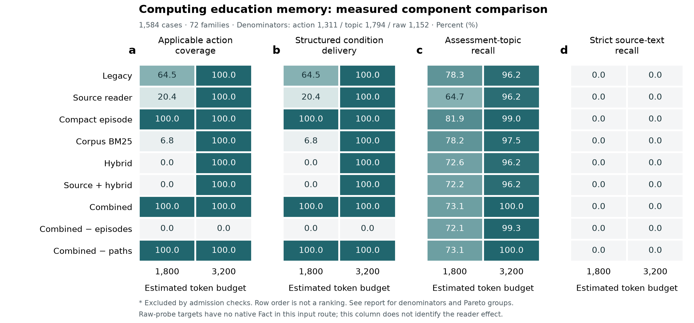
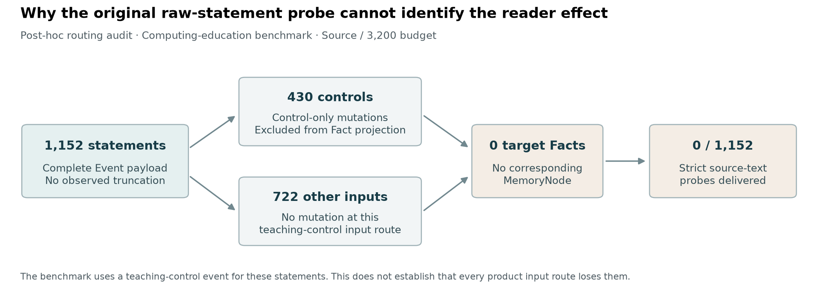

# 教育记忆升级、消融实验与适用性排名

本轮完成了有来源的原文读取、紧凑学习经历、语料级 BM25 与混合候选四项共享实现，并比较九种配置。正式矩阵全部完成：教育 28,512 条件、通用记忆 35,748 条件，共 64,260 条件。以下成绩来自完整运行的独立核验结果；退步、零分和无法识别的机制都保留。

## 教育适用性排名

在当前固定样本上，1,800 预算优先采用紧凑学习经历；3,200 预算下组合升级与关闭关系路径的组合并列。这里的预算是按序列化正文字符长度估算的上下文 token：`max(1, ceil(len(JSON)/3.2))`，不是实际 tokenizer 计数或账单用量。排名只覆盖本轮九种本地配置，不是对外部记忆产品的排名。

| 配置 | 1,800 排名 | 动作／完整条件覆盖 | 主题探针 | 3,200 排名 | 动作／完整条件覆盖 | 主题探针 |
| --- | --- | --- | --- | --- | --- | --- |
| 紧凑学习经历 (`compact`) | 1 | 100.00% | 81.88% | 2 | 100.00% | 99.00% |
| 组合升级 (`education_full`) | 2 | 100.00% | 73.08% | 1 | 100.00% | 100.00% |
| 组合升级－关系路径 (`education_full_no_paths`) | 2 | 100.00% | 73.08% | 1 | 100.00% | 100.00% |
| 原有完整配置 (`legacy`) | 3 | 64.53% | 78.32% | 4 | 100.00% | 96.15% |
| 原文读取 (`source`) | 4 | 20.44% | 64.72% | 4 | 100.00% | 96.15% |
| 语料级 BM25 (`bm25`) | 5 | 6.79% | 78.21% | 3 | 100.00% | 97.55% |
| 混合候选 (`hybrid`) | 6 | 0.00% | 72.63% | 4 | 100.00% | 96.15% |
| 原文＋混合候选 (`source_hybrid`) | 7 | 0.00% | 72.19% | 4 | 100.00% | 96.15% |
| 组合升级－学习经历 (`education_full_no_episodes`) | 8 | 0.00% | 72.13% | 5 | 0.00% | 99.33% |

18 个配置／预算组的准入失败计数合计为 0。动作与结构条件的分母均为每组 1,311 个有最新适用评估的案例；主题探针分母为 1,794 个探针。另有 273 个案例不适用该动作指标，仍保留在完整矩阵。严格原文探针各组都是 0/1,152，原因见下节。

排序先检查预算、scope、来源、当前控制及无依据／过时动作等结构门槛，再比较动作与完整条件的 Pareto 层；仅在一级向量完全相同时比较主题和原文探针。表中并列保留，不用时延或额外权重打破并列。本次各一级层内恰好只有一种一级向量，因此能用连续名次展示；名次不是显著性冠军声明。

图：同一冻结数据和预算下的实测比例，固定 0–100 色阶。行序不构成排名；结构条件交付只覆盖当前 episode schema 的独立核验，并不等价于自然语言信息的全部语义覆盖。

## 改善发生在哪里，仍有哪些问题

**紧凑学习经历解决了一个实际的装包问题。** 1,800 预算下，原有配置动作覆盖 846/1,311，紧凑配置达到 1,311/1,311。它只保留一条观察，同时保留任务、结果、辅助、独立性、时间、来源与限制；这个改变比单纯增加候选更适合本组低预算任务。

**新增检索通道可能挤掉教学证据。** 在按规则选出的案例 `clp-00bd7726be4240adaad9` 中，hybrid 找到了与 legacy 相同的最新评估，但诊断头多出 346 字符，经历另增加 12 字符锚点 ID，装入经历时估算 1,902，超预算 102，因而整段省略。经历在普通 Fact 之前装包，不能说是 Fact 正文先挤占空间。这只是一个定位到的机制实例，详见 [预算案例审计](budget-case-audit.json)。

**原有原文探针存在输入路由与测量目标不匹配。** 1,152 条目标原话均完整存在于事件 payload，430 条形成教学控制 mutation，722 条未产生 mutation；对应目标 Fact/Node 全部为零。测试驱动统一使用教学控制事件入口，不能用该 0 分判断新旧原文 reader 的能力，也不能外推产品所有输入路径都会丢失原话。原分数保持不变，不能事后从总表删去。

完整逐事件追溯见 [原文探针诊断](raw-probe-diagnosis.md) 与 [1,152 条分类记录](raw-probe-population-diagnostic.json)。

**另做的原生 Fact 探针支持读取机制有效，但属于事后验证。** 8 个计算机主题 × 3 种位置模式，共 24 案例、96 条件。两档预算下，头部模式新旧两组均为 8/8；尾部和分散限定语模式，旧读取各为 0/8、新读取各为 8/8。48 对候选集合均相同，但文本仍参与排序，诊断与预算也改变，24 对最终 item ID 或顺序不同，不能称为纯显示文本的因果效应。该补充不并入主排名，也不抵消主实验负结果。见 [独立审计与更正](SOURCE_PROBE_NOTES.md)。

**关闭组件的结果受当前接口和任务覆盖限制。** no_episodes 的动作覆盖为零，说明本组任务和当前规划消费接口依赖原生学习经历；没有语义等价的平面证据消费对照，不能推导所有系统都应使用相同表示。no_paths 只关闭关系路径，独立概念附件仍在；它与组合同分，不能证明图结构无用，更不能证明五核逐核的独立贡献。

## 配对不确定性

以下按任务族等权，使用 2,000 次固定种子聚类 bootstrap。主表探针是按探针数汇总的 pooled 比例，区间是逐案例差值经任务族等权后的估计；不能把这些区间贴在 pooled 比例差上作为误差条。

| 预算 | 配对比较 | 指标 | 任务族等权差（百分点） | 95% 描述性区间 | 案例／任务族 |
| --- | --- | --- | --- | --- | --- |
| 1800 | education_full-minus-legacy | 动作覆盖 | +35.469 | [+31.274, +39.971] | 1311/69 |
| 1800 | education_full-minus-compact | 主题探针 | -0.127 | [-7.463, +7.948] | 1311/69 |
| 3200 | education_full-minus-compact | 主题探针 | +0.483 | [+0.178, +0.890] | 1311/69 |

教育数据有 1,584 案例、72 任务族，但这些动作／主题配对实际只有 1,311 案例、69 任务族。特别是 1,800 下组合与紧凑方案的主题差区间跨零，不能把固定样本名次解释成确定的总体优劣。两次完整教育分片的 28,512 条件除运行计时外完全一致，这是确定性复现证据，不是增加了独立学习者样本。

## 通用记忆辅助轨

LoCoMo 保留全部 1,986 问题；下表只使用有效标注的 1/2/4 类主类。类别 3、5 和无效标注另存于聚合制品。这是证据原文召回和完整证据比例，没有模型作答或 LLM judge，不是官方 QA 准确率，也不参与教育排名。

| 配置 | 1,800 原文召回 | 完整证据 | 3,200 原文召回 | 完整证据 | 主类问题数／每组 |
| --- | --- | --- | --- | --- | --- |
| 紧凑学习经历 | 48.74% | 45.13% | 57.93% | 53.13% | 1438 |
| 组合升级 | 43.68% | 40.06% | 57.93% | 52.71% | 1438 |
| 组合升级－关系路径 | 43.68% | 40.06% | 57.93% | 52.71% | 1438 |
| 原有完整配置 | 48.74% | 45.13% | 57.93% | 53.13% | 1438 |
| 原文读取 | 47.21% | 43.88% | 57.07% | 52.43% | 1438 |
| 语料级 BM25 | 47.36% | 44.02% | 56.26% | 52.02% | 1438 |
| 混合候选 | 46.19% | 42.14% | 59.41% | 54.24% | 1438 |
| 原文＋混合候选 | 43.68% | 40.06% | 57.93% | 52.71% | 1438 |
| 组合升级－学习经历 | 44.03% | 40.33% | 58.33% | 53.06% | 1438 |

在该固定主类样本上，1,800 下原有配置与紧凑配置的原文召回最高（48.74%），混合候选降到 46.19%；3,200 下单独混合候选为 59.41%，原有配置为 57.93%，完整证据为 54.24% 对 53.13%。但组合升级只有 57.93% 原文召回、52.71% 完整证据，不能说所有升级都改善了通用记忆。这些是样本上的描述性差值，未据此宣称总体显著领先。

LoCoMo 检索夹具以节点表示对话轮次，不测真实学习状态形成过程；它没有原生评估、Module/Claim 或关系边，未激活组件不能从同分推断贡献。开关元数据仍计入预算，细小差值也不能自动归给未激活机制。source 还可能改变候选扫描及元数据预算，不能视为纯未激活负控制。实际语义模型身份与执行条件数保存在 aggregate.json 的 semantic_execution_audit；配置名不替代运行证据。

## 工程建议与交付边界

下一步优先把模型审计和教学正文分成真实的不同消费通道，并核对实际 Tutor prompt，避免把诊断挪到未计费字段后仍发送给模型。随后重建符合实际产品事件路由的形成实验，分别报告形成覆盖与条件化检索覆盖；用新冻结数据复验，不追改本轮分数。中文语义模型、查询类型路由、等价平面证据和图依赖任务也应独立控制变量评估。

当前共享实现已升级为 core 0.2.6 / relevance-budget.v4，保留默认 legacy，新增能力由 Python 调用显式启用。五核是学习者状态维度，权威写入链保持 EvidenceEvent → reducer → KernelMutation → KernelState → Fact/Module/Claim；没有新增直接画像写入、掌握判定或数据库迁移。[实现与启用说明](IMPLEMENTATION.md)列出具体边界。

干净 Python 3.12 兼容环境中，Web 后端 1,138 通过、1 项既有跳过，Desktop 后端 1,158 通过；共享契约、两端构建和包构建通过。两端完整前端测试各保留一个在基础 main 上同样复现的旧视觉指导测试失败，未删断言或改分。全部通过、失败、未执行及环境差异见 [validation.json](validation.json)。

所有教育案例均为作者已见的合成数据；没有教师盲评、真实学生学习增益、未见任务族验证或外部方法官方端到端复现。本排名是固定数据与预算下的工程选择依据。当前结果不够支持“教学效果显著提高”或“五核全面优于现有方法”的论文结论。

## 复现身份

基础提交：`0d0802f34e1099dfc468a1ca77316c583870440f`，实际运行包含当时尚未提交的升级源码，须同时使用 suite.json 的逐文件 SHA；该基础提交不能单独复现本轮。聚合结果 SHA-256：`7e55812c2f90643033a1743ffa3aaa8653eec987402294b973b8e2705ffb99ea`。

正式矩阵使用既有 Python 3.14.6 运行库；兼容性回归另用干净 Python 3.12 环境，二者不混称同一运行环境。并发分片与回归共享机器，时延只作执行记录，不用于性能排名。原始 packet/formation/trial 在本地保留；公开目录提供核验后的统计、协议、hash 和诊断，原始 LoCoMo 正文不自动发布。

运行命令、模型文件清单、数据身份与重算方式见 [REPRODUCE.md](REPRODUCE.md)。原先未完成的运行与失败尝试单独保留，不计入这套正式结果。
