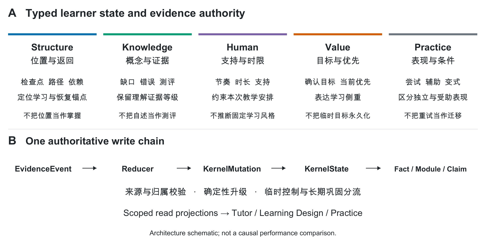
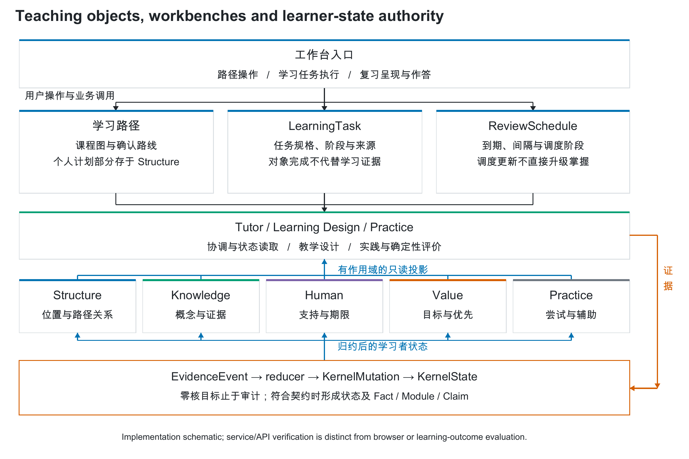
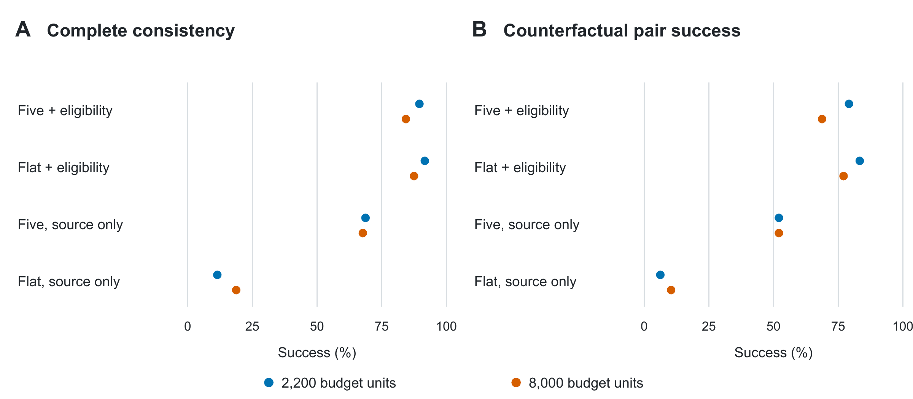
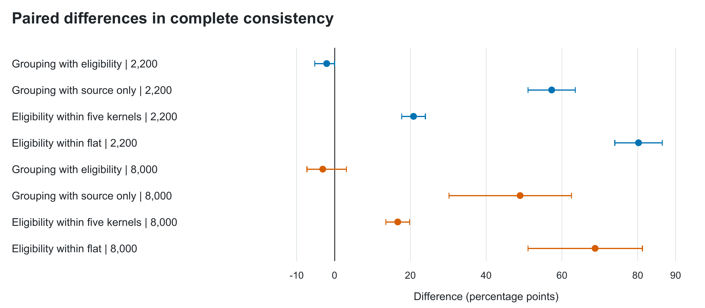
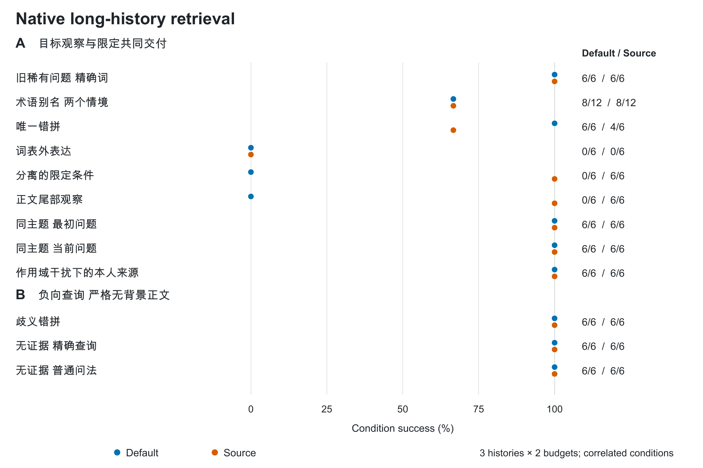

# 面向计算机专业教育的五核学习者记忆建模与证据治理

## 摘要

教育智能体需要区分学习者状态、教学安排与界面操作：确认学习路径不等于掌握知识，复习到期不等于知识遗忘，完成任务也不能替代正式能力证据。本文提出并实现一种面向计算机专业教育的五核学习者记忆架构，以Structure、Knowledge、Human、Value和Practice分别表示学习位置、概念证据、支持条件、目标优先级及实践表现，通过统一事件与确定性归约维护状态，并连接学习路径、LearningTask和复习工作台。研究结合原生能力、对象交互、长尾来源读取及等信息模型实验评价各环节。新增十四个对象交互情境中十三个通过，唯一状态失效挑战表明，复习再次答错后工作台已降级，但长期stable标记仍保留。十二个教育情境的十三个查询形成228次实际读取；在4、64、256条后续干扰下，默认配置的目标与限定同条交付分别为7/10、6/10、6/10，启用来源正文读取分别为9/10、8/10、7/10，两档预算结果相同。扩大候选范围也导致一个错拼情境退化，词表外表达仍未解决。既有768条等信息模型响应进一步表明，显式资格注释有较稳定作用，而五核分组的独立增量对信息条件和输出契约敏感。结果支持将教育记忆视为连接教学对象的证据与状态层，同时揭示状态失效和长尾检索的具体工程边界；本文不据作者合成情境宣称真实学习增益或五核全面优于现有记忆方法。

**关键词**：教育智能体；学习者建模；五核记忆；证据治理；长尾检索；教学对象；计算机教育

## 1 引言

在计算机专业教学中，同一句“这道题做对了”可能对应完全不同的学习状态。学生可能独立完成二分查找，也可能在逐步提示后得到答案；可能重做刚讲解过的原题，也可能将方法迁移到陌生边界条件。若智能体仅将成功文本写入长期记忆，后续教学就可能跳过必要验证。类似地，“今天只学二十分钟”是一项有时效的安排，“希望转向后端开发”是一项需要确认和修订的目标，它们都不宜被压缩成永久画像标签。

通用记忆研究已经从对话窗口扩展到检索增强、事件摘要、反思、层级存储及图结构更新[1–6]。教育研究也长期通过知识追踪和开放学习者模型估计或呈现学习状态[7–10]。因此，教育记忆的研究问题不能简化为“是否拥有向量数据库”，也不能以“存在用户画像”作为充分创新。真正需要检验的是：系统保存的证据能否保留教学条件，更新是否具有明确权限，以及最终消费端是否依据当前有效证据行动。

本文研究的 LearnFlow 面向计算机专业群的学习过程，覆盖概念学习、路线安排、练习反馈和纠错。我们以五个问题划分学习者状态：学到哪里，哪些知识存在何种证据，现在如何支持，当前为何及优先学什么，以及在何种辅助下实际完成了什么。五核是状态维度，并非五个自治智能体，也不对应经心理测量验证的五因素模型。其设计目的是让不同性质的证据具有不同更新规则，并在需要时组合为教学上下文。

这种状态表示必须与教学对象区分。学习路径描述准备学习的课程与依赖，LearningTask 描述一次可执行任务，ReviewSchedule 描述复习调度，工作台提供操作入口；它们各自拥有业务状态。五核回答的是特定学习者与这些对象之间已经形成了何种关系、有哪些证据、当前可使用哪些条件。路径已确认不意味着知识已掌握，复习已到期不意味着知识已遗忘，工作台已展示也不意味着学生已完成。将这些状态混为一谈，会使界面操作越过证据边界。

这一差别在长历史和少见组合任务中更明显。例如，学生在数周后进入操作系统项目，需要重新使用过去在提示下学过的递归概念，但其目标已修订、当时的临时支持要求已过期。系统需要同时定位旧证据、判断其条件、连接当前教学对象并执行有效约束。五个字段齐全并不能保证该任务成功；稀有来源若未被召回，后续状态解释仍无从发生。本文因此分别评价对象交互、历史证据读取与等信息条件下的解释，避免将一个环节的通过率推广到整个教学过程。

本文围绕四个研究问题展开。RQ1：五核分别提供哪些能力，如何与学习路径、学习任务和复习工作台分工交互？RQ2：在原始教育信息相同的条件下，五核组织和显式证据资格注释分别如何影响模型读取？RQ3：面对旧证据、表述变化、限定条件与时效冲突，系统的长尾处理能力止于哪一环节？RQ4：哪些失败来自记忆形成、检索、输出契约或最终约束执行，而不能通过增加记忆层数解决？

本文的工作包括三个部分。首先，给出五核的责任边界、事件归约及来源闭包，说明其与路径、学习任务和复习工作台的实际联系。其次，构建不新增人工标注的能力核验、对象交互、长尾来源读取和等信息反事实协议，将实现存在性、证据交付与模型效果分开评价。最后，公开完整分母、错误响应、事后敏感性分析及代码版本限制，用实际结果限定贡献范围。本文不报告真实学生学习增益，不将本地检索适配器命名为外部算法的官方复现，也不把五核的分类数量本身视为性能来源。

## 2 相关研究与比较边界

### 2.1 通用智能体记忆

检索增强生成通过外部非参数存储为生成提供证据[1]。它解决的是相关信息如何进入模型上下文；具体学习状态的类型、更新权和掌握判据仍需应用层定义。全量历史则保留较多原始交互，但上下文预算和信息位置会影响使用效果[11]。两者均可叠加结构化元数据、时间过滤和验证规则，不能将基础实现缺省的能力描述为方法本身不可能具备的能力。

Generative Agents 将观察、反思与规划联结起来[2]；MemGPT 显式管理不同存储层及有限上下文[3]；MemoryBank 面向长期交互维护用户相关记忆并引入遗忘机制[4]。较新的 Mem0 与 A-MEM 进一步研究记忆更新、关系组织或动态链接[5,6]。这些工作说明，“长期记忆等于向量检索”的比较对象已经过于狭窄。五核可与这些存储和检索机制组合，其区别主要在教育状态语义与证据权限，而非替代它们的所有基础设施。

LongMemEval 将长期交互中的信息提取、跨会话推理、时间推理、知识更新和拒答区分开来[12]；LoCoMo 提供长对话中的记忆任务[13]。这些基准适合暴露通用长期记忆问题，但它们的原始任务并不直接衡量有提示成功与独立成功、教学支持期限或课程返回锚点。本文借鉴分类型评价和时间更新任务，同时保留教育证据条件。本文的实验数值不与这些论文的官方问答分数直接并列排名。

### 2.2 知识追踪与开放学习者模型

贝叶斯知识追踪通过隐状态和观测响应更新知识掌握概率[7]；深度知识追踪使用序列模型表达学习历史[8]；注意力知识追踪进一步建模练习与响应间的关系[9]。这些方法通常有明确的预测终点，如下一题作答结果，因而可以进行概率校准、预测误差与泛化比较。LearnFlow 的 Knowledge 核目前是带证据等级的状态表示，不具备可与上述模型等同的概率估计器，也未在相同学生响应数据上证明预测优势。

开放学习者模型强调使学习状态可检查、可理解并可参与修订[10,14,15]。由此，向学生展示画像或允许纠正并不是本文首先提出的思想。本文将这类目标落实到事件来源、版本化记忆和可纠正状态链，在本系统内同时表示路径、支持、目标和实践条件。未来若引入知识追踪预测，应将预测作为有模型版本的派生估计，不能让其绕过既有证据入口成为另一套学习者状态权威。

### 2.3 教育智能体与 DeepTutor

DeepTutor 直接关联本文的应用场景。其论文描述了图与向量检索、排序融合、分层交互轨迹，以及多个画像维度和按角色注入的学习者信息[16]。它还对薄弱点的解决设置后续会话证据要求。因此，不能把 DeepTutor 描述为没有长期画像、没有分层记忆或完全依赖一次作答判断能力。其消融表中移除记忆后的整体质量变化属于该系统、任务和评价协议内的证据，不能转化为本文架构的得分预期。

本文选择更窄的差异作为研究对象：五种状态是否有不同的证据升级和时效语义；所有权威状态变化是否可追溯到统一事件归约；在信息数量保持相同时，组织方式和资格注释能否分别解释读取差异。这种比较承认已有系统的综合能力，同时使本文贡献能够被代码检查和受控实验反驳。Zep 已通过时间知识图谱区分系统时间与事实有效时间，并处理关系失效[17]；因此，本文也不把时效管理本身视为首创，而检验它在具体教育控制中的实现和使用。

表1概括方法定位。表中的教育契约是本文为应用额外声明的要求，不以相关论文未报告某项细节来判定其实现缺失。该表是机制比较，不是统一实现下的性能排行榜。

表1 方法定位与比较边界

| 方法类别 | 主要能力 | 与五核的关系 | 本文可支持的比较 |
|---|---|---|---|
| 对话窗口与全量历史 | 保存和直接读取交互文本 | 可作为原始证据层 | 预算与信息使用问题；未实跑全历史基线 |
| RAG 与向量检索 | 按查询寻找相关来源 | 可作为五核候选召回通道 | 检索与状态权限属于不同层次 |
| 摘要 分层与图记忆 | 压缩、关联、更新和跨会话访问 | 可承载五核事实与模块 | 不将现代图记忆简化为静态向量库 |
| BKT DKT AKT | 从响应序列估计或预测知识状态 | 可增强 Knowledge 的派生估计 | 本文没有等数据预测比较 |
| 开放学习者模型 | 状态解释、检查和协商修订 | 与可追溯画像互补 | 可检查性不是本文独有概念 |
| DeepTutor | 教育交互、多层记忆及角色化画像使用 | 同类教育系统参照 | 比较契约，不移用其实验排名 |
| 本文五核实现 | 区分位置、知识、支持、目标与实践条件 | 教育状态与证据治理层 | 原生能力核验及等信息读取实验 |

## 3 五核学习者记忆方法

### 3.1 设计对象与统一写入链

对给定学习者和作用域，系统维护由 Structure、Knowledge、Human、Value、Practice 组成的状态集合。这里的“核”表示类型化责任边界，不要求五个独立数据库或五个生成模型。学习者、项目、检查点和会话是作用域坐标，事件时间、来源标识和幂等键是审计坐标。共享概念或检查点标识可以连接多个核，但一个核的结论不会仅因存在链接而自动复制到另一个核。

系统的权威写入顺序为 EvidenceEvent → five_kernel_reducer → KernelMutation → KernelState → MemoryFact → MemoryModule → MemoryClaim。事件描述已发生的行为或已确认的输入；确定性归约器根据注册契约生成状态变更；Fact 保存可引用的证据；Module 汇总相容事实并维护版本；Claim 表达带证据闭包的派生主张。箭头表示权限与来源关系，并不意味着每个事件必定生成每一层对象。例如，临时教学控制可形成状态变更和只读指令，而不应被长期巩固为事实画像。

这条链将“记录了什么”与“可以据此断言什么”分开。用户声明、生成讲解、题目打开和独立测评具有不同证据地位。系统可以保存声明，却不能将它们无条件升级为掌握。LLM 可以生成候选内容或摘要表达，评分、通过条件及学习证据升级仍由代码控制。重复输入需要通过幂等检查，写入前需要验证归属；这些是系统正确性要求，不是由模型的文本承诺保证。

图1 五核的分工与共同证据链。图中五列表示语义责任，并非五个自治 Agent。临时控制可以止于状态与指令投影；长期记忆还需满足相应巩固条件。图示为实现结构，不表示全部路径已完成教学效果验证。

### 3.2 Structure 核 学习位置与返回关系

Structure 回答“学到哪里、正在沿何种路径前进、被打断后回到哪里”。它保存学习位置、检查点、路径及依赖关系，处理已确认路线和临时返回锚点。与一般检索图的相似度边不同，这些关系承担课程坐标和状态恢复语义；一条相关概念边本身不等于已满足先修要求。

在计算机学习中，学生可能从哈希表练习暂时跳到冲突处理讲解。Structure 应保留可恢复的检查点，同时区分临时返回请求与长期路线。当前规划消费者可以使用有效锚点修改未完成学习任务的准备说明，也能消费已确认的路线信息；这不等价于已经实现全课程最优路径搜索。锚点过期后仍可作为历史被审计，但不应继续决定当前返回位置。

### 3.3 Knowledge 核 概念理解与证据等级

Knowledge 回答“对于某个概念，现有证据支持何种理解状态”。它组织概念疑问、缺口、错误、误解及测评相关证据。自述“我懂了”可以解除或更新自报疑问，但不能代替正式能力证据；一次错误能说明某次表现或暴露候选缺口，不能直接给出稳定能力或人格结论。

以 SQL 聚合为例，用户报告不理解 HAVING，随后阅读讲解并表示理解，系统可以记录解释暴露和自述变化。只有与正式题目、作答和评分来源关联的后续表现，才可支持更高证据等级。Knowledge 与 Practice 共享题目及概念坐标：前者说明概念证据，后者保存尝试条件。二者的连接用于解释判断，而不是将“做过”自动翻译为“掌握”。

当前实现并未在所有路径上使用同一套稳定掌握语义。普通概念测评归约不升级长期掌握；复习门控要求最近失败后至少两次合格独立成功、跨度至少72小时且含验证变式；显式迁移归约可依据一次通过、无辅助且置信字段不低于0.9的迁移事件写入 stable 状态；部分长期 Claim 则检查至少两个 verified 事件，并以文字另行限定迁移资格。这里的置信字段是输入条件，不是本文校准过的概率。本文把这些命名与门槛差异列为一致性缺口，不将同名标签视为统一验证的能力结论；本轮也没有复现由该差异导致的错误掌握案例。

### 3.4 Human 核 当前支持条件

Human 回答“当前怎样安排更符合用户明确表达的支持需求”。它保存明确的节奏、格式、时长、负荷和支持请求，并区分稳定偏好候选与短期有效控制。当前支持投影包含时效限制，部分小步支持规则会约束教学时长；规则的作用是执行用户安排，不是诊断心理状态。

例如，学生提出“今天只有八分钟”和“分小步讲解”，系统应同时保留时间预算与表达需求。在默认小步支持上限为二十分钟的相应规则下，八分钟应仍为更严格约束；如果显式时间为二十五分钟，则小步支持可将本次安排限制为二十分钟。必须由真实消费者核验这些组合，不能因为记忆中出现过两个字段就宣称已经正确执行。错误、停顿和跳过也不能被自动解释为焦虑、能力固定或某种学习风格。

### 3.5 Value 核 目标与当前优先级

Value 回答“为什么学以及现在优先投入什么”。它区分长期目标、明确兴趣、已确认路线与临时优先级。候选职业方向与已确认目标具有不同状态；旧目标被替换后应保留可解释历史，但不能继续以旧值覆盖当前决策。

以准备后端开发面试为例，用户可以暂时优先补 SQL，同时保留更长期的服务端工程目标。当前规划器可以把有效优先项写入计划摘要；显式目标或路线修改则通过相应确认事件更新持久状态。本文实验中的 priority_update 仅涉及本轮优先项更新，不能被扩大为对职业动机推断、长期目标优化或多目标效用最大化的验证。

### 3.6 Practice 核 尝试条件与可执行表现

Practice 回答“在什么任务和辅助条件下，实际完成了什么”。它关联作答、Attempt、产物、测试、反馈及辅助等级；正式作答、复习等不同入口保留各自的结果类型，消费者根据可用字段区分未完成、不会、错误、跳过或成功，并保留原题重试与变式迁移的差别。这不表示每个提交接口都提供完全相同的结果枚举。在这个层面，答案内容、执行结果及帮助程度必须一起解释。

学生在提示后完成逆波兰表达式求值，可以获得本次尝试成功的记录，但下一步可能仍需要降低辅助后检查。独立完成一次也不等于稳定迁移。当前形式化 API 对原题重试采用保守辅助语义；本文据此核验“不因重试成功误升级”，不把该机制描述为已经测量真实提示依赖或长期迁移能力。实践证据最终要与 Knowledge 的概念定位、Human 的当前预算及 Structure 的学习位置共同使用。

表2总结每核的对象、可用输出和禁止跨越的推断边界。这些边界比字段名称更重要；若只把同一份摘要分成五个标题，不能获得本文所述证据语义。

表2 五核各自的能力与推断边界

| 核 | 主要对象 | 典型教学用途 | 不允许直接推出 |
|---|---|---|---|
| Structure | 检查点 路径 依赖 返回锚点 | 恢复学习位置及安排准备任务 | 路径完成等于概念掌握 |
| Knowledge | 缺口 错误 自述 测评证据 | 解释薄弱点及验证需求 | 自述理解等于稳定掌握 |
| Human | 时间 节奏 格式 临时支持 | 调整本次时长和支持方式 | 一次错误对应人格或固定风格 |
| Value | 确认目标 兴趣 当前优先项 | 说明学习相关性及安排侧重 | 兴趣等于能力或永久目标 |
| Practice | 尝试 辅助 产物 反馈 变式 | 区分受助成功与独立检查 | 原题成功等于变式迁移 |

### 3.7 跨核组合与有条件的记忆读取

一次可执行的教学安排至少需要区分来源可用性、当前适用性和输出约束三个步骤。来源可用性检查学习者与项目归属、时间和引用链；适用性判断该证据是自述还是测评、是否受助、指令是否过期；输出约束决定下一步是否允许宣称独立成功、使用某个时间预算或恢复某个锚点。这三个步骤不应被一个“相关度分数”替代。

系统读取可以先根据查询和预算获取 Fact 或 Module，再通过有作用域的五核上下文组合信息。局部问题需要原文条件，汇总问题可以利用模块压缩；当前研究并不支持固定偏向完整模块或纯事实。Module 和 Claim 的价值是压缩与可追溯表达，代价是可能损失局部条件，因此需要版本、来源闭包和纠正机制。图扩展也需要逐跳作用域过滤和预算，不应因图节点更多就默认更好。

一个跨核实例是：学生处于二分查找边界练习，最近在提示下做对，本次明确只有八分钟，并优先准备循环不变量。合理输出应保留当前检查点，识别受助表现，选择降低辅助后的短检查，遵守八分钟上限，并将任务说明关联到当前优先项。这个实例说明五类输入如何互补；只有实际执行并核验相应消费者，才能声称系统具备该组合能力，示意本身不是实验样本。

### 3.8 五核与教学对象及工作台的交互

五核、教学对象与工作台是三种职责，而不是三套互相独立的用户画像。五核维护学习者状态的语义与证据权限；教学对象保存课程结构、任务规格和执行进度；工作台将对象及状态投影组织为可操作的界面。三类主 Agent 在这些层之间承担协调、教学设计和实践评价责任，工作台自身不获得直接写入 KernelState 的权限。

学习路径需要区分规范路径图和个人确认安排。规范图提供课程节点与依赖，学习者确认的路线、目标和进度形成个人状态；当前实现将个人路径计划保存在 Structure 的 learning_path_plans 中，并通过 Value 的 confirmed_goals 关联目标。因此，本文的分层是语义和责任分层，不能误画成所有路径数据都位于五核以外。路径确认、修订和归档通过正式事件改变相应状态，原始事件保留。路径接口当前采用学习者全局范围，不具备本文其他检查点任务完全相同的作用域粒度。

LearningTask 保存目标、阶段、来源和执行状态。规划器读取有作用域的学习者上下文，将有效预算、当前优先项、返回锚点及受助表现用于待执行阶段；开始或完成任务则属于业务生命周期。当前任务创建、接受、重规划、开始、暂停、恢复、阶段完成、产物生成、完成和取消事件均声明零核目标，即保留操作审计但不改变五核状态。生成一份任务规格或把阶段标为完成，不能直接替代 Practice 所需的正式尝试，也不能替代 Knowledge 的掌握判据。实际学习行为和正式测评需另行形成有相应核目标的证据事件。路径确认入口本身也不创建 LearningTask，后续任务启动是独立业务操作。

复习工作台的关键对象是 ReviewSchedule。它保存到期时间、间隔等级、调度阶段和最近 Attempt/Event 标识，是可重建的调度投影。正式作答可以同时产生评分证据与调度更新：证据经 reducer 进入 Knowledge、Practice 等目标核，调度器根据结果及辅助条件计算下次安排。复习跳过、延期、暂停和恢复事件同样声明零核目标；review_attempt_evaluated 才具有 Knowledge、Practice 目标。仅打开、到期或延期不产生新的独立成功证据。复习提交则必须重新检查对象归属、呈现版本、作答类型及幂等信息；“提示后原题成功”“独立原题成功”和“独立验证变式成功”不能在下次安排和掌握更新中被无条件等同。

这里“独立原题复习”表示本次复习未使用辅助，不表示题目新颖或完成迁移，仍需与变式资格分开；普通概念提交中的即时原题重试采用另一条保守辅助规则。当前 ReviewSchedule 与 LearningAttempt 没有会话字段，复习评分事件绑定学习者、项目与检查点，不能将这条链描述为与四维上下文完全相同的会话隔离。调度的可重建性依据既有Attempt与纠错记录的回填算法，也不等同于对任意历史事件序列的完全重放保证。

图2 五核与教学对象、工作台的职责和交互。实线表示职责联系和状态读取，不表示每次操作串行调用全部 Agent。橙色路径表示统一事件入口，只有契约允许的事件才产生核变更；零核目标操作止于审计。ReviewSchedule 的调度更新不直接写 KernelState；个人确认路径的部分业务数据当前存于 Structure，并经 Value 关联目标。后文自动核验覆盖所列服务/API 函数，不代表浏览器和所有宿主已经完成端到端验收。

### 3.9 长尾任务中的作用与能力边界

本文将“长尾”操作化为作者构造的低重复证据和少见条件组合挑战，不声称已测得真实学生任务的频率分布。挑战包括：在较多后续记录中寻找旧问题；用同义或错拼表述访问既有证据；保留长原文中的适用条件；区分同主题最初问题与当前状态；在目标变化和控制过期后恢复教学；拒绝借用其他项目、学习者或不存在的证据。历史长度是同一情境的压力条件，不能被计为新的独立学生或新的教育任务。

五核对这些任务的作用具有分工。Structure 连接当前任务与历史位置；Knowledge 提供具体概念问题及其解决证据；Practice 说明当时是否受助、是否只是原题重试；Human 排除已过期的支持条件；Value 连接当前已确认目标。一次跨课程恢复需要组合这些信息，却不能仅因为图中概念相邻就推断学生能够迁移。传统 RAG 或图记忆可以承担候选召回和关联，五核为召回内容补充教育状态语义；两者可以共同失效，也可以相互补充。

当前检索实现具有显式术语归一、有限别名与错拼处理、时间候选配额、原文片段和有界图扩展；它们均有词表、候选窗口及预算边界。可配置的来源正文读取还会改变候选扫描范围，因此不能将启用该配置的全部改善归因为“分段更好”。本研究分别检查来源是否进入候选、是否交付到最终包、目标与限定是否共同保留，以及缺少直接来源时是否暴露证据缺口。再将对象交互测试用于检查证据资格如何影响实际调度和学习安排。只有两类验证连接到同一真实任务并检验最终操作，才可进一步声称完整长尾教学能力。

## 4 实现与评价设计

### 4.1 实现边界与可复现版本

共享五核声明、事件归约和记忆图核心位于 learnflow_core，Web 与桌面后端通过兼容服务路径消费共享实现。部分记忆工作器、概念图及学习任务消费者仍位于各宿主。系统只有 Tutor、Learning Design 和 Practice 三类主责任接口；五核通过有作用域的只读投影供其使用。本文新增的是评测与论文产物，没有修改生产状态 schema、注册事件、评分策略或用户数据库。

本文显式区分代码版本。等信息模型读取实验冻结产品基线 a9375aa；十五项原生能力核验从917b8a0建立隔离工作树；补充对象交互与长尾读取验证冻结于62fd197，读取策略为 relevance-budget.v4，并保存实际源码 hash。v4中的来源正文读取、紧凑episode和全池候选能力是可配置项，默认仍为 source_text=False、compact_episodes=False 和 legacy 候选。旧实验结果不会因当前仓库出现后续变更而被描述为当前生产版本的完整验收。共享核心、研究输入转换器及各宿主最终提示词也不是同一个消费接口，本文分别讨论其证据。

### 4.2 三层评价及其推断对象

评价分为三个层次。第一层通过真实事件和产品消费者检查每核能力与跨对象交互，并增加时间组合及稳定后失败的挑战。第二层使用既有压力测试及新增原生长历史读取，分析来源形成、候选召回、限定交付与表示适配。第三层保持原始规范记录相同，以组织方式和资格注释两个因素检验真实模型读取。三层不能合并成一个总分，因为它们分别测量程序契约、检索行为和生成输出一致性。

表3 三层评价的推断对象

| 证据层 | 数据与执行单位 | 回答的问题 | 不能推出 |
|---|---|---|---|
| 原生能力核验 | 隔离库中的正式事件及消费者调用 | 各核状态和负向契约是否实现 | 用户总体通过率或学习增益 |
| 对象交互补充 | 路径与复习 API 的实际执行轨迹 | 操作状态、调度与学习证据是否一致 | 浏览器或真实多周学习效果 |
| 既有压力测试 | 64,260个本地条件评估 | 检索 预算和表示适配的失败 | 官方外部算法统一排名 |
| 长尾读取补充 | 作者情境×历史长度×预算×读取开关 | 旧来源与限定能否交付，缺口是否可见 | 自然长尾频率或五核逐一因果贡献 |
| 等信息读取实验 | 96轨迹×4配置×2预算 | 分组及资格注释的读取作用 | 五个核各自的因果贡献 |

### 4.3 原生能力契约核验

本轮预先声明每核三个案例，合计十五个能力契约案例，调用真实的事件入口、概念评分或路径接口，使用一次性隔离数据库。Structure 核检查当前与过期返回锚点及确认路径；Knowledge 核检查缺口、自述解决和正式错误不升级；Human 核检查短预算、时间与小步支持组合及过期；Value 核检查优先项更新、过期与确认目标修订；Practice 核检查有辅助、独立与原题重试。

预期结果以简单字段和权限不变量预先冻结，验证器不以调用同一个产品函数所得结果作为标准答案。执行保存事件、Attempt、Mutation、Fact、作用域上下文及消费者输出，另设破坏性负例确认检查器能发现错误。该设计使“有该字段”“该字段经过权威链形成”和“消费者确实使用该字段”成为不同检查。某个控制事件没有形成 Fact 可能是临时指令分流的预期行为，不能机械记为记忆形成失败。各案例的实测状态及证据索引见补充材料S1。

### 4.4 等信息反事实轨迹

正式集包含二分查找、逆波兰表达式、拓扑排序、SQL 聚合、非负权最短路径、LRU、位运算和 Python 浅拷贝八道唯一计算题。Python 或 SQL 程序实际执行产生题目答案并保存 hash，之后调用正式概念题评分 API 形成 Attempt 和事件。每道题结合六种对照和两侧轨迹，共九十六条轨迹、四十八对。题目和交互由作者构造，辅助等级也是合成声明；这些不是九十六名学生或九十六道不同题目。

六类对照分别改变辅助等级、最新结果顺序、时间预算、支持期限、目标更新，以及自述与正式测评通道。序列交换和通道替换不属于单字段消融。每个反事实对的两侧有相同背景历史，包括知识疑问、早期优先项和返回点，不同主题使用相应内容；异项目与未来评分真实入库，以核验输入过滤。正式形成产物为1,536个 Events、296个 Attempts、3,104个 Mutations和4,776个 Facts。全部使用合法入口，未直接插入期待状态。

四个条件为五核分组加资格注释、平面加资格注释、五核分组仅来源、平面仅来源。平面条件仍保留 kernel 字段和全部教育信息，因此组织因素只改变分组呈现与跨核顺序。所有条件都检查来源、归属、作用域和未来时间。资格注释补充当前或过期、独立或受助、自述或测评等确定性解释，不是事后用答案修正输出，也不是对整个生产教学门控系统的移除。

输入预算为2,200和8,000个 cl100k_base 序列化消息单位，作为可复现预算代理，不当作模型供应商的真实 tokenizer。选择以完整事件包为单位，相同病例和预算的四个条件含相同规范记录。审计验证192个病例与预算组合的信息等价、768个实际输入 hash及 token 重算；两档均交付全部1,280次必需来源需求。高预算交付7,616次全部规范记录，低预算交付其中1,744次。因此预算因素主要改变背景负担，而没有检验关键证据遗漏后的恢复。

### 4.5 读取器 指标与统计分析

请求模型标识为 deepseek-v4-flash，实际响应标识为 deepseek-flash；托管 alias 不能保证固定模型权重。参数为温度0、显式关闭推理模式、输出上限400 tokens、超时90秒、并发4，无重试和替代模型。正式获得768条实际响应。推理参数依据供应商文档设置[18]，失败开发运行另行保留。

输出契约包含十个语义字段及引用。完整操作一致性要求字段全部正确、格式有效、来源合法且必需引用齐全；成对成功要求同一反事实的两侧都正确并满足应变与不变关系。下一步动作正确率仅是子指标。验证器独立读取事件与 Attempt、归属、评分来源和时间顺序，根据已向模型公开的操作规则评分，不调用产品规划器或旧实验标准动作生成器。无效输出保留在分母中。

以同一轨迹下的条件差计算配对效应，并对八个主题簇进行10,000次 bootstrap，报告探索性百分位区间。八个作者设计主题不是从学生总体抽取的独立样本，区间不构成总体显著性认证。主终点在正式运行前冻结；观察到枚举错误后进行的单别名敏感性分析单独标记，不能替代主结果。

### 4.6 教学对象交互的补充验证

补充研究在隔离内存数据库中构造十四个情境：路径确认、幂等、修订与归档；初次评分生成复习计划；仅到期查看；延期；受助原题、独立原题和独立变式复习；多周原题成功；间隔成功且包含变式；缺失、跳过与不会的区分；重复提交；两种跨周目标与支持条件组合；以及达到规则稳定后再次答错。协议区分已有合同、作者组合挑战和作者安全挑战，最后一类要求当前工作台与未限定的长期stable标记保持一致，不能将失败事后解释为已验证通过。

路径通过正式确认、修订和归档API执行。复习从 submit_concept 建立正式Attempt和ReviewSchedule开始，经 get_review_item 获取公开题面与呈现版本，再用 submit_review_item 提交。评价保留每步业务返回、五核投影、Attempt、Event、Mutation和Fact引用；检查只查看或延期时是否新增学习证据，复习是否使用真实呈现版本，以及重复请求是否重复计分。每例加入异项目控制干扰，并检查其他学习者不能读取目标复习项。路径、复习和会话的作用域差异单列，不能由对象ID合法推断整个会话链已被隔离。

基础题为 len(range(3))，作者预先验证的变式为 len(range(6))。作答程序根据公开题面计算并选择公开选项，不读取私有答案决定响应；标记为验证变式仅说明本实验题型合同和答案可计算，不代表独立专家确认其迁移难度。同一预置变式可重复呈现，题目新颖性不是本组终点。程序注入相隔十四天的时钟以验证间隔门，不模拟真实人类记忆随时间变化。验证器从保存的原生事件独立计算成功次数、时间跨度及辅助资格，不调用生产稳定判定函数充当答案。全部案例和源码在执行前冻结，失败保留，不以修改产品或标准提高通过率。

### 4.7 长历史下的来源交付与局部机制对照

新增读取验证包括十二个作者编写的计算机教育情境和十三个查询，覆盖旧稀有事实、别名、唯一与歧义错拼、词表外表达、分离限定、正文尾部、同主题最初与当前、作用域污染和无证据问题。每个情境分别加入4、64、256条后续干扰记录，采用1,800和3,200的产品预算估算单位。干扰来自32种明确披露的计算机学习片段，部分重复并改变练习坐标；同主题历史情境使用同主题干扰。它是有限压力语料，不是从真实学生日志估计出的长尾分布。

学习者、项目、检查点等基础对象可以直接创建，但事件及记忆必须经过正式 user_message 事件入口形成，不直接插入Fact。因此，本组主要检验Knowledge自述来源的读取；其他核虽保留默认读取策略，却没有凭空补造相关掌握、支持或目标证据。学习者自述的准确性也不是其来源链有效性所能证明的。对每份形成记录保存所有相关来源；长期事件退出有界短期引用列表，不自动判为历史证据丢失，仍需核验实际Event、Mutation及Fact引用。

共同对照为当前默认读取与启用来源正文读取；后者同时扩大候选扫描并增加来源元数据，解释为组合读取配置。别名、错拼、时间任务另在两种配置内关闭对应开关，形成局部机制对照。所有条件从相同数据库读取，保留默认五核读取面、条目和路径上限，仅改变声明因素及预算。结果分别报告目标来源候选可用、最终事实交付、目标与限定共同交付、范围泄漏、预算和无证据时的背景误召回；不将无目标标注命中直接称为正确拒答。模型回答、真实教学动作与学习增益不在本组终点中，局部开关结果也不是五核逐核移除消融。

## 5 结果

### 5.1 原生能力与既有检索证据

本轮十五个原生能力案例全部通过，每核为3/3。实际形成38个 Events、5个 Attempts、55个 Mutations、78个 Facts及对应图节点；冻结后源码未变，重开原始记录后的复算一致。Structure 的返回与路径、Knowledge 的自述与正式错误边界、Human 的时间与支持组合、Value 的更新与归档，以及 Practice 的辅助与重试处理均在各自声明的输入上满足契约。五条正式概念评分仍缺少 session绑定，原值与限制同时保留；学习路径接口是学习者全局作用域，不能描述为检查点级隔离。逐例结果及来源见补充材料S1。

这些结果证明部分状态转换和消费者规则，而不是估计五核预测准确率。十五个案例全部通过只说明所列输入边界满足预期，不能将其扩展为多周演化或正向稳定掌握验证。后文新增对象交互测试专门检查这些规则的部分时间边界；真实课堂结果仍未测量。

既有 v4 压力测试包含28,512个教育条件和35,748个 LoCoMo 派生检索条件，共64,260个本地评估。该轮预算按序列化字符数除以3.2估算，与本文模型实验的tokenizer代理不同，不横向合并。教育集来自1,584个合成病例、72个作者可见主题族与22类模式。在该本地排序口径中，1,800预算下紧凑表示居首，3,200预算下完整与去路径变体并列领先；不同预算并未产生一个固定的全面最优层次。LoCoMo 派生任务中，旧实现与混合检索的证据召回率在1,800预算为48.74%和46.19%，在3,200预算为57.93%和59.41%。这些是本地证据召回分数，不是原始 LoCoMo 官方问答质量，也没有实跑同预算的官方 Mem0 或 A-MEM 实现。

早期纯事实形成审计的目标 Fact 可用率为0/1,152，揭示了形成接口错配：430条目标控制只有状态变更，722条没有目标变更，目标 Fact 为0；这不是最终问答正确率。该失败不能解释为原子事实天然无法支持教育，也不能用于宣称五核因果优势。去除某类事件后消费者字段缺失导致动作指标下降，同样首先是接口依赖证据。正是这些问题促使本文增加等信息实验，将缺失输入与组织差异分开。

### 5.2 等信息条件下的完整操作一致性

表4给出全部正式条件。每行分母为96条轨迹或48对，不跨预算合并选择最优值。742条响应符合 schema，26条枚举错误全部保留在正式分母中。

表4 全部正式条件的严格计分结果

| 预算 | 配置 | 完整正确 | 成对成功 | 动作正确 | 格式合法 |
|---:|---|---:|---:|---:|---:|
| 2,200 | 五核＋资格 | 86/96 | 38/48 | 94/96 | 94/96 |
| 2,200 | 平面＋资格 | 88/96 | 40/48 | 96/96 | 96/96 |
| 2,200 | 五核仅来源 | 66/96 | 25/48 | 89/96 | 89/96 |
| 2,200 | 平面仅来源 | 11/96 | 3/48 | 96/96 | 96/96 |
| 8,000 | 五核＋资格 | 81/96 | 33/48 | 89/96 | 89/96 |
| 8,000 | 平面＋资格 | 84/96 | 37/48 | 96/96 | 96/96 |
| 8,000 | 五核仅来源 | 65/96 | 25/48 | 89/96 | 89/96 |
| 8,000 | 平面仅来源 | 18/96 | 5/48 | 93/96 | 93/96 |

图3 完整操作一致性与反事实成对成功。点值直接由冻结聚合文件生成，分子和分母见表4；两预算分别使用96条相同轨迹和48对。未绘制不存在的独立重复运行误差棒。图示仅描述该合成样本与单个托管模型 alias。

仅来源条件下，五核相对平面的完整正确率差为+57.29和+48.96个百分点。加入相同资格注释后，差异缩小并在严格计分下变为−2.08和−3.13个百分点，其主题簇区间分别为[−5.21,0.00]和[−7.29,+3.13]。在五核内增加资格注释的差异为+20.83和+16.67个百分点，在平面内为+80.21和+68.75个百分点。组织与资格信息存在明显交互，不能仅选取仅来源条件的巨大差距作为五核全面优势。

图4 完整操作一致性的配对差异。Grouping表示五核减平面，Eligibility表示加资格注释减仅来源。区间按八个作者生成主题簇计算，仅作探索性描述。横轴单位为百分点，分组的细小差异还受到下述输出契约影响。

### 5.3 输出契约敏感性

26条无效响应均将 latest_assistance 写成 guided，契约要求 supported；其原始下一步动作仍为正确的 reduce_help_then_check。事后分析只进行这一别名映射，其余字段和原始响应保持不变，再由独立验证器评分。表5并列展示严格主结果与诊断结果。

表5 输出枚举别名归一的事后敏感性分析

| 预算 | 配置 | 严格完整正确 | 别名归一完整正确 | 严格成对成功 | 别名归一成对成功 |
|---:|---|---:|---:|---:|---:|
| 2,200 | 五核＋资格 | 86/96 | 88/96 | 38/48 | 40/48 |
| 2,200 | 平面＋资格 | 88/96 | 88/96 | 40/48 | 40/48 |
| 8,000 | 五核＋资格 | 81/96 | 88/96 | 33/48 | 40/48 |
| 8,000 | 平面＋资格 | 84/96 | 84/96 | 37/48 | 37/48 |

归一后，加资格条件下的分组效应为0和+4.17个百分点；所有组的动作均为96/96。该诊断说明接口枚举会改变细小排名，同时揭示动作任务过于简单。它不能证明归一后的排名将泛化到其他模型、问题或预先声明的新实验。本文保留严格终点作为主结果，将别名归一明确列为事后敏感性分析。

### 5.4 失败类型与系统解释

在742条合法输出中，下一步动作全部正确，而返回点、当前优先级、时间预算和支持有效性分别出现191、126、72和12次字段错误。这些错误可重叠，不能相加为失败病例数。191个合法输出使用了过期的目标或返回点，共涉及317处相应字段错误，说明召回到信息不等于理解其当前适用性。

另有64次输出正确识别支持有效，却把规则要求的二十分钟上限写为 null。这说明模型读出未遵守预先声明的组合约束，并非支持来源没有召回。该实验未经过生产规划器的确定性约束执行，不能据此认定生产约束器失效；当前规划实现已经包含相应时长限制。本轮两个预算已经提供全部必需来源，因而不能把这些失败归因于检索遗漏。稳定掌握字段设置为否定控制，未出现错误升级不能证明系统已经拥有掌握校准能力；同理，自动 false_abstention 计数包含格式失效，不应解释为模型主动拒答。

### 5.5 执行成本与审计

正式调用的供应商回执记录输入2,547,520 tokens、输出62,816 tokens，总计2,610,336 tokens；输入缓存命中1,608,573，未命中938,947。单次延迟中位数为1,023.63毫秒，P95为1,525.957毫秒。这些数值描述一次具体服务环境，不是部署后的稳定服务指标；没有账单证据，本文不换算实际费用。

独立审计复算768条评分、384条成对记录、8组汇总和8项区间比较，冻结源码及输入漂移为0。更早的失败开发运行包含159条截断响应、4次中断后不确定结果及未执行调用，原始产物另行保留。修复推理配置与配置 hash问题后创建新的开发运行，没有覆盖失败或混入正式分数。反事实研究代码已有73项回归通过。

本轮原生核验首次执行虽然十五个能力断言通过，但因路径上下文 JSON 字符串键顺序不同，重开记录的审计未通过并以退出码2结束。两种字符串解析后的对象相同；仅修复规范序列化并补充校验后，重新冻结并完整执行第二次运行，复算一致。第一次产物保留，未更改能力案例、阈值或生产代码，也不把首次运行称为完整审计通过。

### 5.6 教学对象交互与状态失效

补充交互验证的十四个情境均完成全部业务步骤，无基础设施错误。正式第二轮中13/14个情境通过，80项具体断言中79项通过，全部来源门通过；分类结果见表6。真实形成60条Events、27条Attempts、13条ReviewSchedules、121条Mutations与247条Facts及对应节点。27条正式评估事件均未绑定session，原值保留；这项覆盖限制没有由评测补写字段掩盖。

表6 对象交互补充验证的分类结果

| 情境类别 | 完整通过 | 实际检查 | 未通过项 |
|---|---:|---|---|
| 既有业务合同 | 11/11 | 路径修订归档、调度形成、延期、作答类型、间隔门与幂等 | 无 |
| 作者组合边界 | 2/2 | 跨周目标修订、旧控制过期、当期支持与异项目干扰 | 无 |
| 作者状态失效挑战 | 0/1 | 达到规则稳定后再次答错，当前与长期状态一致性 | 长期stable标记仍存在 |

这些结果具体说明了五核与工作台之间的交互：路径确认、修订和归档更新Structure与Value；评分形成Practice表现与Knowledge证据，同时创建可操作的复习安排；仅查看到期题、延期或跳过不增加成功证据；受助原题、独立原题、验证变式影响不同证据字段和后续安排。两个跨周组合情境中，真实规划消费者使用当前控制而非过期控制，并排除异项目优先项。它们验证了所列组合规则，没有检验稀有自然语言意图识别或跨课程最优教学决策。

唯一完整失败揭示了各层状态的实际差异。作者脚本在9月8日完成独立变式复习，22日完成独立原题复习，满足当前间隔门并写入长期stable；9月29日再次答错后，工作台当前证据已变为none，Knowledge短期保持状态为needs_review，但长期mastery仍保留stable及先前成功证据ID。当前工作台确实降级，不能据此说整个系统仍显示掌握；同样，工作台降级也不能证明所有长期消费者已失效该标记。这是未限定长期状态与当前资格之间的一处不一致，不是观察到真实学生误判或在线模型误导。

首次交互运行完整保留。其验证器误要求所有复习Attempt的最终role均为review，未考虑正式纠错会将失败或不会的来源Attempt改为original并通过RemediationCase关联。独立审计确认该合法后继转换后，只增加严格的纠错来源闭包校验和负例测试，十四个案例及80项主断言保持不变，重新冻结并运行。第一轮12/14不作为正式通过率；长期stable未失效在两轮原始记录中均存在，修订没有消除该失败。完整原始返回与失败源码随补充材料提供。

### 5.7 长尾来源交付与非单调的读取增益

正式第三轮完成228/228次实际读取和36份形成快照，源码漂移、网络与模型调用均为0。保存的形成记录、上下文包及评分重开后复算一致，来源、作用域和预算检查全部通过。这表示该次测量完整有效，不表示全部检索问题正确。共同配置的分层结果见表7，每格有10个目标查询和3个负向查询；同主题最初与当前共享历史，不是独立学生。

表7 长历史下的同条事实交付与负向查询

| 后续干扰 | 预算 | 默认目标与限定 | 原文配置目标与限定 | 默认负向严格空 | 原文配置负向严格空 |
|---:|---:|---:|---:|---:|---:|
| 4 | 1,800 | 7/10 | 9/10 | 3/3 | 3/3 |
| 4 | 3,200 | 7/10 | 9/10 | 3/3 | 3/3 |
| 64 | 1,800 | 6/10 | 8/10 | 3/3 | 3/3 |
| 64 | 3,200 | 6/10 | 8/10 | 3/3 | 3/3 |
| 256 | 1,800 | 6/10 | 7/10 | 3/3 | 3/3 |
| 256 | 3,200 | 6/10 | 7/10 | 3/3 | 3/3 |

主终点要求目标观察与限定位于同一个、可由原始来源逐字重建的Fact item中；目标仅出现在关系路径或head引用不计入该分子，另保留诊断，不能据item缺失断言整包完全没有目标。两种预算在这些主终点上相同，未观察到提高预算的独立改善。每个共同配置的两个时间问题均为首条item正确，但这仅验证预声明输入下的排序，不能推广为任意时间推理。负向严格空覆盖歧义错拼与两种无证据查询，不是模型拒答或广泛安全评测。

图5 默认与来源正文配置的分类型结果。A为同条Fact中的目标观察与限定共同交付；B为负向查询未携带有效背景正文。每个单情境含三档历史长度与两档预算，共6个相关条件；别名合并两个情境为12个条件。右侧明确给出默认/原文配置分子分母，未构造独立重复或总体置信区间。局部开关消融结果另列补充材料，不混入共同配置分母。

干扰达到256条时，默认配置只有8/10个目标进入候选，启用来源正文后为10/10；但最终共同交付仅由6/10改善为7/10。词表外的time to live未能访问仅以“存活时间”表述的目标，两种配置均为0/6。广度优先搜索别名在64与256条干扰下虽已取得目标候选，仍受到带“搜索树”“优先级”等词的背景排挤。来源可追溯不等于来源能被正确检索，目标进入候选也不等于进入最终包。

一个反向案例说明增大候选池的局部代价。在256条干扰下，来源正文配置形成514份候选文档，超过错拼处理的512份扫描上限，schedulr未获得有效纠正；默认配置在该情境反而成功。该边界不能靠“完整系统始终优于精简配置”解释。原文读取对正文尾部与分离限定有作用，但词表、候选、纠错和预算必须共同评价；这些是读取组件的效果，不是五个核各自的因果收益。

局部开关对照进一步定位组件作用。在全部适用历史与预算条件中，关闭别名后，两种共同配置的别名目标与限定交付均从8/12降至0/12；关闭错拼后，唯一错拼情境的默认配置从6/6降至0/6，来源正文配置从4/6降至0/6；关闭时间组件后，两种配置的最初/当前目标交付与首项正确均从12/12降至6/12，损失均发生于最初问题。歧义错拼负控在开关条件下仍保持严格空。这些分母是相关条件数，因果解释限于同一固定产品和输入下关闭该组件的总体作用，不是跨模型或真实人群效应。次要诊断显示，180个有目标读取条件中没有仅靠关系路径补齐主指标的情况；非Human head没有证据正文，引用不能补算正文交付。

两次先前运行及冻结源码完整保留。第一轮在建库阶段错误创建重复Roadmap，228个条件均未进入检索；同时在尚无检索成绩时纠正了将合法跨会话持久Fact视为污染的错误假设。第二轮完成228次读取，但验证器误拒合法SAME_SUBJECT关系，并在部分条件中混淆数量相同的head与候选元数据调用。后继只修正原生边与端点闭包核验和调用点追踪，未改变情境、查询、目标文字、预算或读取策略，重新冻结后全量执行。前两轮不进入正式性能分母，修订前结果不能被描述为系统检索失败。

## 6 讨论

### 6.1 五核相对传统能力增加了什么

五核的主要增量是把可用于教学的记忆组织为具有不同更新与消费语义的状态，而非简单增加五个检索桶。Structure 提供学习位置和返回关系，Knowledge 保留概念证据等级，Human 表达当前支持约束，Value 区分长期目标与临时优先项，Practice 记录表现发生的辅助与任务条件。统一写入链使这些维度可以相互引用而不互相冒充证据。

与基础 RAG 相比，这是一层关于“如何使用和更新所召回证据”的应用契约；面对现代分层或图记忆，本文明确给出本系统教育字段、规则及来源关系，但没有证明更好的通用存储或链接算法；与知识追踪相比，它同时表示知识以外的条件，却没有替代概率预测与校准；与开放学习者模型和 DeepTutor 相比，其可检查画像思想有明确前序，本文贡献落在具体权限链及拆解变量的评测上。因此，本文不作“五核优于传统全部能力”的笼统判断。

### 6.2 为什么不能把五核分别移除就当作充分消融

若去掉 Human 时同时移除时间和支持字段，而平面基线从未获得这些信息，则完整系统优势可能只是输入更多。若规划器强制读取 Practice 字段，删除该核产生的失败也可能是接口无法运行。这样的实验可以验证功能依赖，不能单独证明五核语义分解优于等信息的其他组织。

本文的模型实验保留所有核标签和教育字段，因而更适合回答组织与注释问题；代价是它不是五核逐一移除的因果实验。原生核验则检查各核边界，回答“实现是否真的做了这些事”。两者共同构成证据，但不能相互替代。后续逐核研究应预先定义该核特有且可执行的教学终点，并设置等信息重编码基线，区分状态信息本身、语义组织和消费者耦合。

### 6.3 工程升级应优先解决条件执行

对象交互挑战要求将“曾经达到稳定门”与“当前仍满足稳定资格”显式分开。后续修正应保留旧成功Event和Fact作为历史，同时由新的失败证据使当前稳定资格失效，记录原因及来源；工作台、长期状态和模型上下文应消费同一资格结果。直接删除旧成功证据会破坏学习历史，继续让未限定的stable字段供不同消费者各自解释也不足以解决一致性问题。这一升级需要新的状态转换回归和兼容性说明，不能由论文措辞代替实现。

本轮模型读取失败集中在过期控制和条件组合。优先升级方向是将有效期、辅助等级和来源资格形成统一、版本化的读取契约，并将已有规划约束接入尚未统一的消费者和研究读取器，单独验证最终动作。Tutor、规划、讲义与 Practice 应保留一致解释，确定性约束器检查明确的时间和证据上限，不应以生成模型的解释替代评分或直接写状态。已有约束存在与全部消费路径已接入，是两个不同验收命题。

其次，应统一不同消费路径对稳定掌握和迁移的语义，补足正式概念评分的 session绑定及来源字段，并为未表示的合法事件定义明确处理策略。再次，召回应保留带来源的局部原文、例外条件和同主题历史，区分当前状态与最初问题；混合候选和有界图扩展需逐场景比较误召回与预算。上述属于由结果导出的升级建议，本轮论文与实验工作没有把它们宣称为已部署功能。

### 6.4 不增加人工工作的研究价值与边界

可执行题目答案、正式事件形成、独立操作验证和完整日志，能够在不新增教师标注的情况下发现大量工程错误。这种证据对于状态权限、时效解释、条件组合和可复现性具有实际价值。自动评测还应主动保留困难、失败和格式不合法的样本，以防止只展示成功轨迹。

但自动验证器只能验证其定义的操作规则。它不能证明所选下一步最有教学价值，不能替代教师对讲解质量的判断，也不能证明学习者更愿意持续学习。本文因此将“教学操作一致性”与“教育效果”严格区分。本次已经补充定向长尾来源读取与部分跨周组合，但它们还不是同一真实学生任务中的完整检索、规划与学习闭环。下一步应冻结新的组合任务，把稀有证据的实际召回与最终业务动作连接，在多个模型和提示条件下复现；真实学习增益仍需要独立的课堂或用户研究。

## 7 局限性与有效性威胁

第一，正式题目只有八道，每道产生多个相关轨迹，样本规模不能按768次调用解释为768个独立教育任务。数据由作者设计，缺少独立题库和学生分布的外部验证。合成辅助声明不等于测量到的真实提示使用，封闭选择题也不等于自由编程产物。

第二，研究只使用一个托管模型 alias，每条件一次采样，没有跨模型、重复运行或提示敏感性的正式复现。输入预算采用代理 tokenizer，缓存和延迟受服务端影响。事后别名归一已经表明接口表达能改变细小差异，后续复现必须预先声明归一规则。

第三，296条正式评分事件真实缺少 session绑定，审计保留 known_scope_fidelity_limit，不能据此声称验证了完整会话隔离。另有16条合法 remediation_started 事件没有规范表示；它们不是本轮输出的必需来源，但说明研究接口未覆盖全部产品事件。不同代码基线之间也存在版本跨度。

第四，既有模型实验的完整操作一致性较严格，而动作指标有天花板；稳定掌握是固定否定控制，两档输入均保留必需证据。新增原生交互虽检查了规则稳定正例与后继失败，仍使用固定小题及注入时钟；新增无证据读取检查的是空包行为，没有测量模型拒答。来源核验和程序答案减少部分主观性，但不能建立最优教学策略的外部效度。

第五，本文没有在相同数据、模型、预算和调参条件下运行外部记忆算法官方实现，也没有对知识追踪进行预测比较。相关工作表只能支撑机制定位。五核数量与划分的最优性尚未验证，跨宿主消费者也未全部使用同一研究接口。

第六，十二个长尾情境由作者定向编写，干扰语料循环重复，只有有限的历史与词表压力；原生user_message正文还受500字符上限约束。该组实际激活的是Knowledge自述文本，不能作为五个核的均衡长尾评价；图中的原生SAME_SUBJECT关系也不等于深层先修依赖推理。十四个交互情境调用服务/API函数，没有覆盖HTTP中间件、浏览器交互或两个宿主的完整路径。验证器修订与全部失败运行公开，但尚未获得独立团队复现。

## 8 结论

本文研究学习证据的条件化使用，给出五核学习者状态的具体分工、统一权威写入链和真实消费者边界。五核分别提供学习位置、概念证据、支持条件、目标优先级及实践条件；学习路径、LearningTask和ReviewSchedule承载相应教学安排与操作状态，工作台组织执行。确认路线、完成任务、复习到期与实际掌握具有不同语义，系统通过零核目标操作与正式证据事件区分它们。

补充验证证明了所列对象交互和部分跨周控制规则，同时暴露再次失败后长期stable标记仍保留的问题。长尾读取中，来源正文配置改善了目标与限定交付，但候选窗口、别名排序和错拼扫描仍造成失败，扩大候选池也可能退化。因此，五核在长尾任务中的价值是为历史证据提供教育语义和约束接口，实际任务能力仍取决于召回、状态失效与最终消费共同成立。结合等信息模型实验，当前证据支持可追溯教育记忆基础与可反驳的工程验证方法，尚不支持五核全面优于已有记忆或改善真实学习效果的主张。

## 数据与代码可用性

本论文随仓库提供 Markdown、可编辑 Word、PDF、图形生成脚本及矢量图。既有反事实实验保存冻结源码、输入、原始响应、独立审计和聚合结果；原生能力、教学对象交互与长尾读取核验均提供协议、案例、真实中间产物、失败轮次与复现方式。补充材料S1–S3给出各项主张与代码、案例及结果文件的对应关系。正式产物 hash用于检测变化，不代表已完成第三方复现。外部基准遵循原始来源的使用条件，本文不额外发布其完整对话正文。

## 研究伦理与披露

本研究使用作者构造的学习轨迹、程序生成答案和既有公开基准的本地派生评价，没有招募学生或教师，也没有新增人工标注。本文不报告虚构受试者、伦理批准、经费或机构信息。开发失败、无效响应和事后分析均明确标记。文献整理、代码与文稿制作使用了生成式智能体辅助，实验结果以保存的实际产物为依据；投稿时仍须依据目标期刊要求披露工具使用并确认作者责任。

## 参考文献

[1] Patrick Lewis; Ethan Perez; Aleksandra Piktus; et al. [Retrieval-Augmented Generation for Knowledge-Intensive NLP Tasks](https://papers.nips.cc/paper/2020/hash/6b493230205f780e1bc26945df7481e5-Abstract.html). Advances in Neural Information Processing Systems, 2020.

[2] Joon Sung Park; Joseph C. O'Brien; Carrie J. Cai; et al. [Generative Agents: Interactive Simulacra of Human Behavior](https://arxiv.org/abs/2304.03442v2). Proceedings of the 36th Annual ACM Symposium on User Interface Software and Technology, 2023.

[3] Charles Packer; Sarah Wooders; Kevin Lin; et al. [MemGPT: Towards LLMs as Operating Systems](https://arxiv.org/abs/2310.08560v2). arXiv preprint, 2310.08560v2, 2023.

[4] Wanjun Zhong; Lianghong Guo; Qiqi Gao; et al. [MemoryBank: Enhancing Large Language Models with Long-Term Memory](https://ojs.aaai.org/index.php/AAAI/article/view/29946). Proceedings of the AAAI Conference on Artificial Intelligence, 2024.

[5] Prateek Chhikara; Dev Khant; Saket Aryan; et al. [Mem0: Building Production-Ready AI Agents with Scalable Long-Term Memory](https://arxiv.org/abs/2504.19413v1). arXiv preprint, 2504.19413v1, 2025.

[6] Wujiang Xu; Zujie Liang; Kai Mei; et al. [A-Mem: Agentic Memory for LLM Agents](https://proceedings.neurips.cc/paper_files/paper/2025/hash/19909c36f51abc4856b4560aff3d36d6-Abstract-Conference.html). Advances in Neural Information Processing Systems, 2025.

[7] Albert T. Corbett; John R. Anderson. [Knowledge tracing: Modeling the acquisition of procedural knowledge](https://link.springer.com/article/10.1007/BF01099821). User Modeling and User-Adapted Interaction, 1994.

[8] Chris Piech; Jonathan Bassen; Jonathan Huang; et al. [Deep Knowledge Tracing](https://papers.nips.cc/paper_files/paper/2015/hash/bac9162b47c56fc8a4d2a519803d51b3-Abstract.html). Advances in Neural Information Processing Systems, 2015.

[9] Aritra Ghosh; Neil Heffernan; Andrew S. Lan. [Context-Aware Attentive Knowledge Tracing](https://arxiv.org/abs/2007.12324). Proceedings of the 26th ACM SIGKDD International Conference on Knowledge Discovery & Data Mining, 2020.

[10] Susan Bull; Judy Kay. [Open Learner Models](https://link.springer.com/chapter/10.1007/978-3-642-14363-2_15). Advances in Intelligent Tutoring Systems, 2010.

[11] Nelson F. Liu; Kevin Lin; John Hewitt; et al. [Lost in the Middle: How Language Models Use Long Contexts](https://aclanthology.org/2024.tacl-1.9/). Transactions of the Association for Computational Linguistics, 2024.

[12] Di Wu; Hongwei Wang; Wenhao Yu; et al. [LongMemEval: Benchmarking Chat Assistants on Long-Term Interactive Memory](https://arxiv.org/abs/2410.10813v2). International Conference on Learning Representations, 2025.

[13] Adyasha Maharana; Dong-Ho Lee; Sergey Tulyakov; et al. [Evaluating Very Long-Term Conversational Memory of LLM Agents](https://aclanthology.org/2024.acl-long.747/). Proceedings of the 62nd Annual Meeting of the Association for Computational Linguistics (Volume 1: Long Papers), 2024.

[14] Susan Bull; Judy Kay. [SMILI☺: a Framework for Interfaces to Learning Data in Open Learner Models, Learning Analytics and Related Fields](https://link.springer.com/article/10.1007/s40593-015-0090-8). International Journal of Artificial Intelligence in Education, 2016.

[15] Susan Bull. [Negotiated learner modelling to maintain today’s learner models](https://link.springer.com/article/10.1186/s41039-016-0035-3). Research and Practice in Technology Enhanced Learning, 2016.

[16] Bingxi Zhao; Jiahao Zhang; Xubin Ren; et al. [DeepTutor: Towards Agentic Personalized Tutoring](https://arxiv.org/abs/2604.26962v1). arXiv preprint, 2604.26962v1, 2026.

[17] Preston Rasmussen; Pavlo Paliychuk; Travis Beauvais; et al. [Zep: A Temporal Knowledge Graph Architecture for Agent Memory](https://arxiv.org/abs/2501.13956v1). arXiv preprint, 2501.13956v1, 2025.

[18] DeepSeek. [Thinking Mode](https://api-docs.deepseek.com/guides/thinking_mode/). DeepSeek API Docs, 无标注年份，访问日期2026-09-13.
